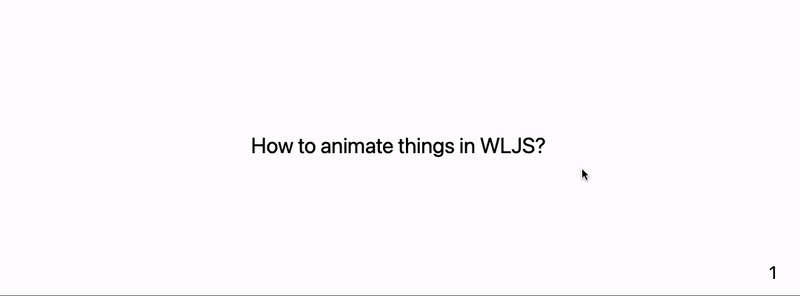

> This was not supposed to be a separate category in this section, but for the sake providing more diverse examples we created it. 

Here I (@JerryI) would like to show a simple example on how to make a slide about hot to ~~make slides~~ animate things in WLJS, if it was a tutorial or a lecture.

### Code blocks
Since this is about programming, we need a "widget" for code and syntax highlighting, we directly steal it from [here](frontend/Advanced/Components%20library/Code%20insets.md)

```jsx title="cell 1"
.wlx

CodeBlock[str_String] := With[{Fe = EditorView[str]},
  <div class="text-left text-sm"><Fe/></div>
]
```

and for my case I needed a layout fix, that forces text in code block to be align to the left side

```jsx title="cell 2"
.wlx
<style>
  .slide-frontend-object .cm-editor {
    text-align: left;
  }
</style>
```

Now if anything on a slide is wrapped using this tag

```jsx
.slide

# Title

<CodeBlock>
(*SqB[*)Sqrt[-1](*]SqB*) + I 
</CodeBlock>
```

will be rendered as in a normal code-editor


### Animation widget
In my virtual lecture there must be something, what I can do lively and show to people. Let it be some simple animated graphics with sliders

```jsx title="cell 3"
.wlx

AnimationWidget := LeakyModule[{
  SliderItem = InputRange[0.1, 1, 0.05, 0.1],
  symbol = 0.1
},

  EventHandler[SliderItem, Function[value, symbol = value]];

  With[{
    Widget = Graphics[{
      Green, Disk[{0,0}, symbol // Offload], Pink,
      Rotate[Rectangle[{-1,-1}, {1,1}], 3.14 symbol // Offload]
    }, Controls->False]
  }, 
  <div class="divide-y divide-gray-200 overflow-hidden rounded-lg bg-white shadow">
    <div class="px-2 py-3 sm:p-6">
      <Widget/>
    </div>
    <div class="px-2 py-2 sm:px-6">
      <SliderItem/>
    </div>
  </div>
  ]
]
```

here [WLX](frontend/Cell%20types/WLX.md) is used only to have more control over the layout (add shadows to elements, dividers and so on). In principle one could do almost the same by using using [Row](frontend/Reference/Formatting/Row.md) or [TableForm](frontend/Reference/Formatting/TableForm.md). In general HTML is much easier to use when it comes to the design.

You can test it in a separate cell

```jsx
.wlx

<AnimationWidget/>
```


### Layout of the presentation
I should probably make at least two slides. One is for the title and the second one is for my tricks...

```jsx title="cell 4"
.slide

# How to animate things in WLJS?

---

# Use Offload


<div class="columns-2">
  <div class="text-left mt-2">

Define own values of some symbol and assign it to graphics primitives you want


<CodeBlock>
symbol = 0.1;
Graphics[{
      (*VB[*)(RGBColor[0, 1, 0])(*,*)(*"1:eJxTTMoPSmNkYGAoZgESHvk5KRCeGJAIcndyzs/JLwouTyxJzghJzS3ISSxJTWMGyXMgyRcxQAGU8cEeLgIAAP0TXQ=="*)(*]VB*), Disk[{0,0}, symbol // Offload], (*VB[*)(RGBColor[1, 0.5, 0.5])(*,*)(*"1:eJxTTMoPSmNkYGAoZgESHvk5KRCeGJAIcndyzs/JLwouTyxJzghJzS3ISSxJTWMGyXMgyRcxgMEHeyjjAYIBABm5FZs="*)(*]VB*),
      Rotate[Rectangle[{-1,-1}, {1,1}], 3.14 symbol // Offload]
}]
</CodeBlock>

then create a slider and assign handler to it

<CodeBlock>
EventHandler[InputRange[0.1, 1, 0.05], (symbol = #)&]
</CodeBlock>
  
  </div>

  <AnimationWidget/>

</div>
```

Since I am lazy to make my own classes, I relied on Tailwind's `columns-2` to make it easier. In the end we have following

