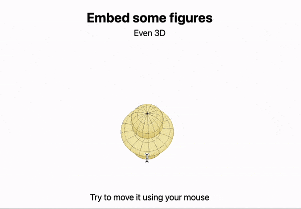

# Slides

:::info
You can use pure __Markdown__, __HTML__, __CSS__, or [WLX](frontend/Cell%20types/WLX.md) languages when creating slides.
:::

This is powered by [wljs-revealjs](https://github.com/JerryI/wljs-revealjs), which integrates the amazing [RevealJS](https://revealjs.com) framework and the [WLX](frontend/Cell%20types/WLX.md) language. It enables a component-based approach to creating presentations, adding interactivity, and leveraging all the features of frontend cells.

The goal of this approach is to simplify slide creation, separate content from appearance, and embrace data-driven presentations.

If you know the basics of Markdown, you're already capable of doing a lot:

```md
.slide

# Title

Content
```

Slides can be separated in two ways:
- Using `---` __within the same cell__:

```md
.slide

# Slide 1

---

# Slide 2
```

This method is simple but can become unreadable with larger slides.

- Using __separate cells__:

```md
.slide

# Slide 1
```

```md
.slide

# Slide 2
```

You can then merge them using the `.slides` extension:

```md
.slides

This could be the final slide. All previous slides will be added before.
```

:::info
The position of the `.slides` cell in the notebook does not affect the presentation order.
:::

:::tip
To enter fullscreen mode, press the `f` key after focusing on the slide content.
:::

:::tip
Use the projector feature:


to show slides in a separate window.
:::


## Layout
This method is not opinionated about how you organize content on a slide. By default, titles marked with `#`, `##`, etc., are centered and rendered with standard HTML `h1`, `h2`, etc. tags. Paragraphs are wrapped in `p` tags behind the scenes.

If you need two columns, use HTML and any method you prefer (e.g., `flex`):

```jsx
.slide

# Title

<div style="display: flex">
  <div style="width: 50%">

## Subtitle 1

Some content

  </div>
  <div style="width: 50%">

## Subtitle 2

Some content

  </div>
</div>
```

:::tip
To use Markdown within HTML, please add line breaks before and after.
:::

The result will look like this:


:::warning
To mix Markdown with HTML or [WLX](frontend/Cell%20types/WLX.md) correctly, remove leading white space from Markdown headers:

```html
.slide

<div>
	# It won't work
</div>
```

Instead, use:

```html
.slide

<div>

# It will work

</div>
```
:::

### Using WLX
You can create helper functions for layout:

```jsx
.wlx
Columns[Col1_, Col2_] := With[{},
	<div style="display: flex">
		<div style="width: 50%"><Col1/></div>
		<div style="width: 50%"><Col2/></div>
	</div> 					 
]
```

And use them like this:

```jsx
.slide

# Title

<Columns>
  <div>

## Subtitle 1

Some content

  </div>
  <div>

## Subtitle 2

Some content

  </div>
</Columns>
```

The result will be the same. The extra `div` tags help WLX distinguish between the first and second arguments of `Columns`, similar to how `li` and `ul` tags are used to make lists.

:::note
See the advanced guide on components: [Building components](frontend/Advanced/Slides/Building%20components.md)
:::

### Full height, text align left
The standard Power Point's slide content alignment can be achieved using

```markdown
.slide

<!-- .slide: style="height:100vh; text-align:left" -->

# Heading

Content
```

## Images
RevealJS uses standard Markdown image syntax:

```md
.slide

# Title


```


You can drag and drop images from anywhere:


Local files are also supported:

```md
.slide


```

:::info
A web server will look for `example.png` in the directory where the notebook is located. If not found, it will attempt to use it as a global path starting from the system root.
:::

You can also use the regular HTML `img` tag to control size:

```md
.slide


```

## Equations
Equations are powered by the KaTeX library. Use LaTeX syntax:

```md
.slide

$m \\mathbf{a} = \\mathbf{F}$
```

:::warning
Single slashes are reserved by WL Kernel, so always use double slashes `\\`.
:::

Multiline equations:

```md
.slide

$$
\\begin{bmatrix} 
 m \\mathbf{a} = \\mathbf{F}
\\end{bmatrix}
$$
```

To highlight WL code, JS, or HTML, see [Code insets](frontend/Advanced/Components%20library/Code%20insets.md).

### Escaping sequences
Since LaTeX is embedded into Markdown, you should escape the following sequences

#### Backslashes
To have full compatibility with Markdown syntax you have to escape all backslashes. For example, write `\\alpha` instead of `\alpha`.

#### Trailing underscores
To avoid misinterpretation for `__` markdown command, you need to escape such cases. For example, instead of __this__

```md
$$
\hat{\alpha}_{x} - \hat{\beta}_{}
$$
```

as a minimal patch one can escape the very last one ⤵️

```md
$$
\hat{\alpha}_{x} - \hat{\beta}\_{}
$$
```

And the best solution would be 👍🏼

```md
$$
\\hat{\alpha}\_{x} - \\hat{\\beta}\_{}
$$
```

__See [here](https://katex.org/docs/supported.html) for all supported LaTeX functions.__

### How to convert WL expression to LaTeX?
Using [TeXForm](frontend/Reference/Formatting/TeXForm.md) one can do it almost in a single action. For example

```mathematica
RotationMatrix[120Degree, {0,0,1}]//MatrixForm //TeXForm
```

```mathematica title="output"
"\\left(\n\\begin{array}{ccc}\n -\\frac{1}{2} & -\\frac{\\sqrt{3}}{2} & 0 \\\\\n \\frac{\\sqrt{3}}{2} & -\\frac{1}{2} & 0 \\\\\n 0 & 0 & 1 \\\\\n\\end{array}\n\\right)\n"
```

Then **remove line breaks `\n`**  and place it on a slide

```markdown
.slide

# My Equation

$$
\\left(\\begin{array}{ccc} -\\frac{1}{2} & -\\frac{\\sqrt{3}}{2} & 0 \\\\ \\frac{\\sqrt{3}}{2} & -\\frac{1}{2} & 0 \\\\ 0 & 0 & 1 \\\\\\end{array}\\right)
$$
```


## Excalidraw
Type  `!![]` to spawn a live Excalidraw editor

```md
.slide

# Title

!![]
```


## Embedding PDFs or Websites
With full HTML support, you can embed a local PDF:

```md
.slide

<embed width="800" height="500" src="antisymmetry.pdf"/>
```


Or an entire website:

```md
.slide

<iframe width="800" height="500" src="https://chat.openai.com"/>
```


For nicer corners:

```md
.slide

<iframe style="border: none; border-radius: 4px" width="800" height="500" src="https://chat.openai.com"/>
```

## JavaScript Code
Any `script` tag will execute after slides are mounted:

```md
.slide

<div id="dtext">Hello World</div>

<script>
  document.getElementById('dtext').style.background = "yellow"
</script>
```

## Transitions and Fragments
To reveal content in stages, use HTML comments like:

```html
<!-- .element: class="fragment ACTION" data-fragment-index="INDEX" -->
```

For example:

```md
.slide

# Slide

Fragment disappears <!-- .element: class="fragment fade-out" data-fragment-index="1" -->

Fragment appears <!-- .element: class="fragment" data-fragment-index="2" -->

Fragment changes color <!-- .element: class="fragment highlight-red" data-fragment-index="3" -->
```


See more transitions at [RevealJS](https://revealjs.com/fragments/).

:::note
Custom transitions are not supported unless created using [Graphics](frontend/Reference/Graphics/Graphics.md) and the [animations](frontend/Advanced/Slides/animations.md) method.
:::

### Events
To capture events such as slide or fragment reveals, use [SlideEventListener](frontend/Reference/Slides/SlideEventListener.md):

```jsx
.slide

# 1st Slide
Nothing

---

# 2nd Slide
A message pops up

Another message <!-- .element: class="fragment" data-fragment-index="1" -->

<SlideEventListener Id={"myEvent"}/>
```

Before evaluating, attach an event handler:

```mathematica
EventHandler["myEvent", {
	"Slide" -> (Print["Hey there!"]&),
	"fragment-1" -> (Print["Hey there from fragment!"]&)
}]
```

The identifier acts as an event object with these patterns:

- `"Slide"` — fired when a slide is revealed
- `"fragment-INDEX"` — fired when a fragment is revealed

:::info
For more on animations and interactivity, see the [animations](frontend/Advanced/Slides/animations.md) section.
:::

## WL Expressions and Data-Driven Slides
You can run and embed any WL expressions directly on a slide:

```mathematica
GetTime := TextString[Now];
```

```md
.slide

# Using WLX
You can do some cool stuff

Your local time is __<GetTime/>__
```


Embed graphics objects too:

```mathematica
Figure = SphericalPlot3D[SphericalHarmonicY[2,0, t,p], {t, 0, Pi}, {p, 0, 2Pi}];
```

```jsx
.slide

# Embed some figures
Even 3D

<div style="text-align: center; display: inline-flex;">
  <Figure/>
</div>

Try moving it with your mouse
```



You can also plot data from a local `CSV` file. For example, plotting the shortest path through random points:

```mathematica
pts = RandomReal[10, {100, 2}];
Figure = ListLinePlot[pts[[Last@FindShortestTour[pts]]], Epilog->{Point[pts]}]
```

```md
.slide

Compute and plot the shortest tour through 100 random points:

<Figure/>
```


For more advanced examples, see [animations](frontend/Advanced/Slides/animations.md).

## Pointer
Pointer support is provided by a [RevealJS plugin](https://github.com/burnpiro/reveal-pointer). To toggle it, press `q` while focused on a slide:


