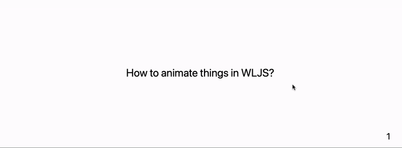

> This was not supposed to be a separate category in this section, but for the sake of providing more diverse examples, we created it.

Here, I (@JerryI) would like to show a simple example of how to make a slide about how to ~~make slides~~ animate things in WLJS, as if it were part of a tutorial or lecture.

### Code blocks
Since this is about programming, we need a "widget" for code and syntax highlighting. We directly borrow it from [here](frontend/Advanced/Components%20library/Code%20insets.md).

```jsx title="cell 1"
.wlx

CodeBlock[str_String] := With[{Fe = EditorView[str]},
  <div class="text-left text-sm"><Fe/></div>
]
```

In my case, I needed a layout fix that forces text in the code block to be aligned to the left side.

```jsx title="cell 2"
.wlx
<style>
  .slide-frontend-object .cm-editor {
    text-align: left;
  }
</style>
```

Now, if anything on a slide is wrapped using this tag:

```jsx
.slide

# Title

<CodeBlock>
(*SqB[*)Sqrt[-1](*]SqB*) + I 
</CodeBlock>
```

It will be rendered as in a normal code editor.


### Animation widget
In my virtual lecture, there must be something I can do live and show to people. Let it be some simple animated graphics with sliders.

```jsx title="cell 3"
.wlx

AnimationWidget := LeakyModule[{
  SliderItem = InputRange[0.1, 1, 0.05, 0.1],
  symbol = 0.1
},

  EventHandler[SliderItem, Function[value, symbol = value]];

  With[{
    Widget = Graphics[{
      Green, Disk[{0,0}, symbol // Offload], Pink,
      Rotate[Rectangle[{-1,-1}, {1,1}], 3.14 symbol // Offload]
    }, Controls->False]
  }, 
  <div class="divide-y divide-gray-200 overflow-hidden rounded-lg bg-white shadow">
    <div class="px-2 py-3 sm:p-6">
      <Widget/>
    </div>
    <div class="px-2 py-2 sm:px-6">
      <SliderItem/>
    </div>
  </div>
  ]
]
```

Here, [WLX](frontend/Cell%20types/WLX.md) is used only to have more control over the layout (adding shadows to elements, dividers, and so on). In principle, one could do almost the same using [Row](frontend/Reference/Formatting/Row.md) or [TableForm](frontend/Reference/Formatting/TableForm.md). In general, HTML is much easier to use when it comes to design.

You can test it in a separate cell:

```jsx
.wlx

<AnimationWidget/>
```


### Layout of the presentation
I should probably make at least two slides—one for the title and the second one for my tricks.

```jsx title="cell 4"
.slide

# How to animate things in WLJS?

---

# Use Offload

<div class="columns-2">
  <div class="text-left mt-2">

Define your own values for a symbol and assign them to the graphics primitives you want.

<CodeBlock>
symbol = 0.1;
Graphics[{
      (*VB[*)(RGBColor[0, 1, 0])(*,*)(*"1:eJxTTMoPSmNkYGAoZgESHvk5KRCeGJAIcndyzs/JLwouTyxJzghJzS3ISSxJTWMGyXMgyRcxQAGU8cEeLgIAAP0TXQ=="*)(*]VB*), Disk[{0,0}, symbol // Offload], (*VB[*)(RGBColor[1, 0.5, 0.5])(*,*)(*"1:eJxTTMoPSmNkYGAoZgESHvk5KRCeGJAIcndyzs/JLwouTyxJzghJzS3ISSxJTWMGyXMgyRcxgMEHeyjjAYIBABm5FZs="*)(*]VB*),
      Rotate[Rectangle[{-1,-1}, {1,1}], 3.14 symbol // Offload]
}]
</CodeBlock>

Then create a slider and assign a handler to it:

<CodeBlock>
EventHandler[InputRange[0.1, 1, 0.05], (symbol = #)&]
</CodeBlock>

  </div>

  <AnimationWidget/>

</div>
```

Since I was too lazy to create my own classes, I relied on Tailwind's `columns-2` to make it easier. In the end, we get the following:

