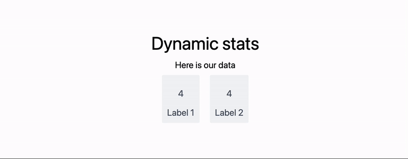

# Animated Graphics

## Interactive plots
__By the default__, everything you plot using [Plot](frontend/Reference/Plotting%20Functions/Plot.md) or [Graphics](frontend/Reference/Graphics/Graphics.md) or [Graphics3D](frontend/Reference/Graphics3D/Graphics3D.md) can be dragged or panned or rotated. This behavior is controlled by the options and can be switched off if necessary. For example

```mathematica
Figure = Plot[{x, Sin[x], Sin[x]^2}, {x,0,2Pi}];
```

```jsx
.slide

# Simple plot

<Figure/>

Try to drag it using you mouse
```

The result will look like following


## Animation
In general all visuals can be done in the same way as in regular cells, since it uses the same components.

When a slide becomes visible or a fragment got revealed (see [Transitions and fragments](frontend/Advanced/Slides/Slides.md#Transitions%20and%20fragments)) it fires an event, where all information is encoded. To enable this - use [SlideEventListener](frontend/Reference/Slides/SlideEventListener.md)

:::info
Put [SlideEventListener](frontend/Reference/Slides/SlideEventListener.md) anywhere on the slide to hook up WL Kernel to all events associated with it
:::

:::tip
Keep the dynamic variables scoped using [`LeakyModule`](frontend/Reference/Misc/Language.md#`LeakyModule`) and use explicit event routing like in [routing](frontend/Advanced/Events%20system/routing.md). Later it will allow you to reuse your components for other slides much easier.
:::

### Example 1 🗒️ Dynamic plot, local event routing
Here is an example of a widget, which plots 2D dataset and updates the content on the next click using [Fragments](frontend/Advanced/Slides/Fragments.md) 

```jsx
.wlx

PlotWidget[OptionsPattern[]] := Module[{
  data = OptionValue["DataA"]
},

  With[{
    Canvas = Graphics[{
      ColorData[97][1], Line[data // Offload]
    }, Axes->True, ImageSize->500, TransitionDuration->1000],

    uid = CreateUUID[],

    dataA = OptionValue["DataA"],
    dataB = OptionValue["DataB"]
  },

    EventHandler[uid, {
      "fragment-1" -> Function[Null,
        data = dataB
      ],

      ("Left" | "Destroy" | "Slide") -> Function[Null,
        data = dataA
      ]
    }];

    <div class="flex flex-col gap-y-2">
      <Canvas/>
      <div class="fragment">Dummy text</div>
      <SlideEventListener Id={uid}/>
    </div>
  ]
]

Options[PlotWidget] = {"DataA"->{}, "DataB"->{}};
```

Now generate dummy dataset

```mathematica
{dataA, dataB} = {
  Table[{x, Sin[x]}, {x,0,5Pi,0.1}],
  Table[{x, Tan[x]}, {x,0,5Pi,0.1}]
};
```

And place it anywhere on a slide

```jsx
.slide

# Title

<PlotWidget DataA={dataA} DataB={dataB}/>

---

Go back?
```

The result


### Example 2 🧬 Fitting animation
Complex animations are better to prototype firstly inside a normal cell or [WLX](frontend/Cell%20types/WLX.md). Let us make one like that

```mathematica @
LeakyModule[{
  buffer = {},
  \[Omega] = 7.,
  text = "",
  recalc,
  target,
  trigger = 0,
  ev = CreateUUID[],
  blocked = True,
  p = 0.01
},

  blocked = False;

  recalc[p_] := (
    text = StringJoin["(*SbB[*)Subscript[ω(*|*),(*|*)0](*]SbB*)  = ", Round[p \[Omega], 0.01] // ToString, "(*SpB[*)Power[s(*|*),(*|*)-1](*]SpB*)"];
    buffer = {#, Sin[p \[Omega] (*SqB[*)Sqrt[#](*]SqB*)]} &/@ Range[0., 25., 0.1];
  );

  target = {#, Sin[\[Omega] (*SqB[*)Sqrt[#](*]SqB*)]} &/@ Range[0., 25., 0.1];

  recalc[0.01];
  
  EventHandler[ev, Function[Null,
    If[blocked, Return[]];
    trigger += 1;
    If[Mod[trigger, 2] == 0,
      recalc[p];
      p = p + 0.05 (1.0033 - p);
      If[Abs[p - 1.0] < (*SpB[*)Power[10(*|*),(*|*)-3](*]SpB*), blocked = True; Print["Stopped"]];
    ];
  ]];

  {
    {
      EditorView["y(t) =  sin((*SbB[*)Subscript[ω(*|*),(*|*)0](*]SbB*)(*SqB[*)Sqrt[t](*]SqB*))  "],

      HTMLView["   "],
      
      EditorView[text // Offload]
      
    } // Column,
    
    Graphics[{
      Blue, Line[target], Red, Line[buffer // Offload],
      AnimationFrameListener[trigger // Offload, "Event"->ev]
    }, Axes->True, Frame->True]
  } // Row
]
```

And now we have the following


The next step will be to assign triggers:

- enter the slide : start animation
- left the slide : stop and reset
- close presentation : stop and reset

and then turning it into widget using [EditorView](frontend/Reference/GUI/EditorView.md) (since output forms of [Row](frontend/Reference/Formatting/Row.md) and [Column](frontend/Reference/Formatting/Column.md) are not defined in slides environment)

```mathematica @
Widget[Rule["Event", id_]] := LeakyModule[{
  buffer = {},
  \[Omega] = 7.,
  text = "",
  recalc,
  target,
  trigger = 0,
  ev = CreateUUID[],
  blocked = True,
  p = 0.01
},

  EventHandler[id, {
    ("Left" | "Destroy") -> Function[Null,
        blocked = True;
    ],

    "Slide" -> Function[Null,
        SetTimeout[
          blocked = False;
          EventFire[ev, True];
        , 500];
    ]
  }];
  

  recalc[p_] := (
    text = StringJoin["(*SbB[*)Subscript[ω(*|*),(*|*)0](*]SbB*)  = ", Round[p \[Omega], 0.01] // ToString, "(*SpB[*)Power[s(*|*),(*|*)-1](*]SpB*)"];
    buffer = {#, Sin[p \[Omega] (*SqB[*)Sqrt[#](*]SqB*)]} &/@ Range[0., 25., 0.1];
  );

  target = {#, Sin[\[Omega] (*SqB[*)Sqrt[#](*]SqB*)]} &/@ Range[0., 25., 0.1];

  recalc[0.01];
  
  EventHandler[ev, Function[Null,
    If[blocked, Return[]];
    trigger += 1;
    If[Mod[trigger, 2] == 0,
      recalc[p];
      p = p + 0.05 (1.0033 - p);
      If[Abs[p - 1.0] < (*SpB[*)Power[10(*|*),(*|*)-3](*]SpB*), blocked = True; Print["Stopped"]];
    ];
  ]];

  ToString[{
    {
      EditorView["y(t) =  sin((*SbB[*)Subscript[ω(*|*),(*|*)0](*]SbB*)(*SqB[*)Sqrt[t](*]SqB*))  "],

      HTMLView["   "],
      
      EditorView[text // Offload]
      
    } // Column,
    
    Graphics[{
      Blue, Line[target], Red, Line[buffer // Offload],
      AnimationFrameListener[trigger // Offload, "Event"->ev]
    }, Axes->True, Frame->True, PlotRange->{{0,25}, {-1,1}}]
  } // Row, StandardForm] // EditorView 
]
```

Now place it on a slide and hook up it to [SlideEventListener](frontend/Reference/Slides/SlideEventListener.md) 

```md
.slide

# Title

<Widget Event={"slide-ev-name"}/>

<SlideEventListener Id={"slide-ev-name"}/>
```

#### Alternative version
using pure WLX one can stylize more things and use local event routing

```jsx
.wlx

WLXWidget := LeakyModule[{
  buffer = {},
  Omega = 7.,
  text = "",
  recalc,
  target,
  trigger = 0,
  ev = CreateUUID[],
  id = CreateUUID[],
  blocked = True,
  p = 0.01,
  EditorPart,
  CanvasPart
},

  EventHandler[id, {
    ("Left" | "Destroy") -> Function[Null,
        blocked = True;
    ],

    "Slide" -> Function[Null,
        SetTimeout[
          blocked = False;
          EventFire[ev, True];
        , 500];
    ]
  }];
  

  recalc[p_] := (
    text = StringJoin["(*SbB[*)Subscript[ω(*|*),(*|*)0](*]SbB*)  = ", Round[p Omega, 0.01] // ToString, "(*SpB[*)Power[s(*|*),(*|*)-1](*]SpB*)"];
    buffer = {#, Sin[p Omega (*SqB[*)Sqrt[#](*]SqB*)]} &/@ Range[0., 25., 0.1];
  );

  target = {#, Sin[Omega (*SqB[*)Sqrt[#](*]SqB*)]} &/@ Range[0., 25., 0.1];

  recalc[0.01];
  
  EventHandler[ev, Function[Null,
    If[blocked, Return[]];
    trigger += 1;
    If[Mod[trigger, 2] == 0,
      recalc[p];
      p = p + 0.05 (1.0033 - p);
      If[Abs[p - 1.0] < (*SpB[*)Power[10(*|*),(*|*)-3](*]SpB*), blocked = True; Print["Stopped"]];
    ];
  ]];

  CanvasPart = Graphics[{
      Blue, Line[target], Red, Line[buffer // Offload],
      AnimationFrameListener[trigger // Offload, "Event"->ev]
    }, Axes->True, Frame->True, PlotRange->{{0,25}, {-1,1}}];

  EditorPart[Rule["P", 1]] = EditorView["y(t) =  sin((*SbB[*)Subscript[ω(*|*),(*|*)0](*]SbB*)(*SqB[*)Sqrt[t](*]SqB*))  "] ;

  EditorPart[Rule["P", 2]] = EditorView[text // Offload] ;    
  
        
  <div class="flex flex-row" >
    <div class="flex flex-col text-left" style="padding: 2rem 0">
      <EditorPart P={1}/>
      <EditorPart P={2}/>
    </div>
    <CanvasPart/>
    <div class="fragment"></div>
    <SlideEventListener Id={id}/>
  </div>
]
```

```md
.slide

# Title

<WLXWidget/>

```

### Example 3 🔎 Zoom
Zoom in to the graph

```mathematica title="cell 1"
Plt[OptionsPattern[]] := With[{ev = OptionValue["Zoom"], scene = FrontInstanceReference[]},
  EventHandler[ev, {
    "Slide" -> Function[Null,
      FrontSubmit[ZoomAt[1], scene]
    ],

    "fragment-1" -> Function[Null,
      FrontSubmit[ZoomAt[2], scene]
    ]
  }];
  
  Plot[Sinc[x], {x,-10,10}, Epilog->{scene}]
]

Options[Plt] = {"Zoom"->""}
```

```jsx title="cell 2"
.slide

# Zoom in

---

<Plt Zoom={"vslide"}/>

Zoom <!-- .element: class="fragment fade-in" data-fragment-index="1" --> 

<SlideEventListener Id={"vslide"}/>
```


### Example 4 🔄 Simple stat counter
What if you need to add some dynamic stats to your presentation? One can make an independent component for that

```jsx
.wlx

Stat[Text_, OptionsPattern[]] := LeakyModule[{
  cnt = 0, 
  task
}, With[{
  ev = CreateUUID[],
  HTMLCounter = HTMLView[cnt // Offload],
  max = OptionValue["Count"]
},
  EventHandler[ev, {
    "Destroy" -> Function[Null,
      EventRemove[ev]; 
      If[task["TaskStatus"] === "Running", TaskRemove[task]];
      ClearAll[task];
    ],

    "Left" -> Function[Null,
      cnt = 0;
    ],

    "Slide" -> Function[Null,
      If[task["TaskStatus"] === "Running", TaskRemove[task]];
      task = SetInterval[
        If[cnt < max, cnt = cnt + 1,
          TaskRemove[task];
        ];
      , 15];
    ]
  }];

  <div class="text-center text-gray-600 m-4 p-4 rounded bg-gray-100 flex flex-col">
    <HTMLCounter/>
    <span class="text-md"><Text/></span>
    <SlideEventListener Id={ev}/>
  </div>
] ]

Options[Stat] = {"Count"->1};
```

You can put them on any slide (as many as you want)

```jsx
.slide

# Dynamic stats
Here is our data

<div class="justify-center flex flex-row ml-auto mr-auto">

<Stat Count={128}>Label 1</Stat>
<Stat Count={256}>Label 2</Stat>

</div>

```

Here is the result




## Append graphics to a slide
Use [FrontInstanceReference](frontend/Reference/Frontend%20IO/FrontInstanceReference.md)

## Buttons, sliders etc
See examples [InputRange](frontend/Reference/GUI/InputRange.md)


