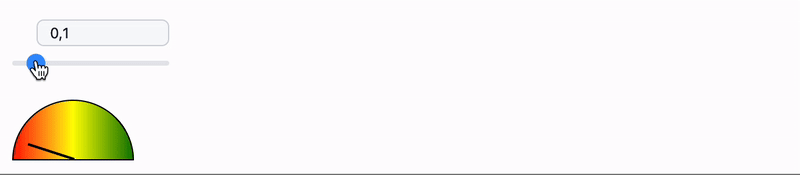
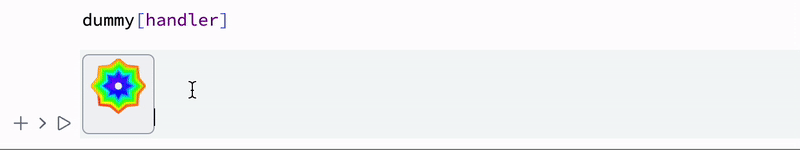

Giving a rich visual representation to a symbol while programming elevates the whole user experience to another level. There is couple of ways on how to do it in WLJS Notebook.

:::info
Read about syntax sugar also in [Symbolic programming](frontend/Symbolic%20programming.md)
:::

## Temporal
One can replace a symbol with an icon by applying [Interpretation](frontend/Reference/Formatting/Interpretation.md). After first evaluation the representation is lost and the true expression will be revealed

```mathematica
Interpretation[Graphics[Circle[], ImageSize->{20,20}, ImagePadding->None], 1]
```

The result is a circle symbol, which can be copied multiple times in any cell


:::note
Decoration itself does not modify the original expression. You can check it by pasting the result into any text-editor

```mathematica
(*VB[*)(1)(*,*)(*"1:eJxTTM..."*)(*]VB*)  - 1 
```

:::

### Examples in action
A navigation gizmo [snippet](frontend/Command%20palette.md) is made using this technique combined with dynamically generated symbols wrapped in [Offload](frontend/Reference/Interpreter/Offload.md)

<details>

.gif)

</details>

### Using Javascript
One can use a full power of Web to decorate your symbols. For example, create a [Javascript](frontend/Cell%20types/Javascript.md) cell with a following content

```js
.js

core.SmileyDecorator = async (args, env) => {
  const canvas = document.createElement('canvas');
  canvas.width = 50;
  canvas.height = 50;
  const ctx = canvas.getContext('2d');

  // Draw a cool smiley face adjusted to fit the smaller canvas
  ctx.beginPath();
  ctx.arc(25, 25, 20, 0, Math.PI * 2, true); // Outer circle
  ctx.moveTo(35, 25);
  ctx.arc(25, 25, 8, 0, Math.PI, false);  // Mouth (clockwise)
  ctx.moveTo(22, 20);
  ctx.arc(20, 20, 2, 0, Math.PI * 2, true);  // Left eye
  ctx.moveTo(32, 20);
  ctx.arc(30, 20, 2, 0, Math.PI * 2, true);  // Right eye
  ctx.stroke();

  env.element.appendChild(canvas);
}
```

The given function will append a canvas with an image to provided element in the context of its execution. To force Wolfram Kernel to execute this symbol on [the frontend](frontend/Advanced/Frontend%20interpretation/WLJS%20Functions.md) one can use [ViewBox](frontend/Reference/Formatting/Low-level/ViewBox.md)

```mathematica title="test"
SmileyDecorator /: MakeBoxes[s_SmileyDecorator, StandardForm] := With[{},
	ViewBox[s, s]
]

SmileyDecorator[]
```


Great! Now we can apply similar trick we used earlier

```mathematica
Interpretation[SmileyDecorator[], 1]
```


### Magic joystick
We can cover from a user all event bindings and etc providing a symbol, which can be used in dynamics

```mathematica
createDynamic2DSymbol[] := Module[{symbol = {0,0}}, With[{
	eventObject = InputJoystick[],
	helper = InputJoystick`IntegrationHelper[][Function[xy, symbol = xy]]
},
	EventHandler[eventObject, helper];
	Interpretation[eventObject, Offload[symbol]]
]]
```

Then you can create an instance by evaluating this in a new cell
```mathematica
createDynamic2DSymbol[]
```

An output is a joystick


Then we need to __cut it and paste into the cell below__

```mathematica
Plot[Sin[x], {x, -5Pi, 5Pi}, Epilog->{
  Disk[ (* paste it here *), 0.5]
}]
```

Once evaluated you will get a controllable [Disk](frontend/Reference/Graphics/Disk.md) by a joystick inside an input cell


*a but more optimized version*

<details>

here we will not spawn additional wrapper widget, the result is the same, but less overhead to an editor

```mathematica
createDynamic2DSymbol[] := Module[{symbol = {0,0}}, With[{
	eventObject = InputJoystick[],
	helper = InputJoystick`IntegrationHelper[][Function[xy, symbol = xy]]
},
	EventHandler[eventObject, helper];
	With[{display = eventObject[[1]]["View"] // CreateFrontEndObject},
		Interpretation[display, Offload[symbol]]
	]
]]
```

Why? See reference on [Interpretation](frontend/Reference/Formatting/Interpretation.md)

</details>

## Permanent
In this way [RGBColor](frontend/Reference/Graphics/RGBColor.md), most mathematical equations, [Graphics](frontend/Reference/Graphics/Graphics.md) and other visual sugar was implemented. For example

```mathematica
Now
Red
```


### InterpretationBox
This is a low-level symbol used in [Interpretation](frontend/Reference/Formatting/Interpretation.md), however from temporal decoration we can make a permanent one by defining [MakeBoxes](frontend/Reference/Formatting/MakeBoxes.md) for [StandardForm](frontend/Reference/Formatting/StandardForm.md) 

Advantages ✅
- high-level, accepts anything as a display expression
- **compatible with Mathematica**

Drawbacks ❌
- spawns another instance of an editor, can lead to an overhead

Neutral 💭
- immutable
- preserves original expression in the cell

#### Morse code
Let us make a syntax sugar for a Morse code! Our __special symbol__ for representing a code will be

```mathematica
morse[code_String]
```

We need conversion rules

```mathematica
morseTable = {"a" -> ".- ", "b" -> "-... ", "c" -> "-.-. ", 
   "d" -> "-.. ", "e" -> ". ", "f" -> "..-. ", "g" -> "--. ", 
   "h" -> ".... ", "i" -> ".. ", "j" -> ".--- ", "k" -> "-.- ", 
   "l" -> ".-.. ", "m" -> "-- ", "n" -> "-. ", "o" -> "--- ", 
   "p" -> ".--. ", "q" -> "--.- ", "r" -> ".-. ", "s" -> "... ", 
   "t" -> "- ", "u" -> "..- ", "v" -> "...- ", "w" -> ".-- ", 
   "x" -> "-..- ", "y" -> "-.-- ", "z" -> "--.. ", " " -> "/ "};

ToMorseCode[text_String] := StringReplace[
  ToLowerCase[text], morseTable]

morse /: TextString[morse[s_String]] := s
```

Now let us make boxes for it

```mathematica
morse /: MakeBoxes[m: morse[s_], f:StandardForm] := With[{
	code = ToMorseCode[s]
},
	InterpretationBox[MakeBoxes[Style[code, 18, Italic], f], m]
]
```

Let's see the result

```mathematica
morse["SOS"]
```


We can perform back transformation, since underneath we still have an original expression


As the last thing - we can make it audible

```mathematica
silence = Table[0, {t,0,40Pi,0.1}];
dot = Table[Sin[5 t], {t,0,40Pi,0.1}];
dash = Join[dot, dot];


morse /: Play[morse[t_String]] := With[{
  code = ToMorseCode[t]
},
   Join @@ (Switch[#, 
    ".",
      Join[dot, silence],
    "-",
      Join[dash, silence],
    _,
      Join[silence, silence]
  ] &/@ StringSplit[code, ""]) // ListPlay
]
```

```mathematica
morse["SOS"] // Play 
```


#### MD5 representation
Another example, that shows how to produce graphical output. 

Here we will visually encrypt any Wolfram Language expression using our custom wrapper symbol for it

```mathematica title="this is our symbol"
secret[any_]
```

Now let's define a representation for it

```mathematica
secret /: MakeBoxes[s: secret[expr_], StandardForm] := With[{hash = Hash[expr, "MD5", "ByteArray"] // Normal},
  With[{im = Image[Partition[Partition[hash, 3],2], ImageSize->50]},
    InterpretationBox[MakeBoxes[im, StandardForm], s]
  ]
]
```

And we also need a function to reveal the secret

```mathematica
reveal[secret[expr_]] := expr
```

Here is a demonstration

```mathematica
secret[Plot[x, {x,0,1}]]
```


*then simply copy and paste this symbol to a new cell and apply revel function*


### ArrangeSummaryBox
There is another built-in function for helping representing objects

Advantages ✅
- high-level, easy to use
- **compatible with Mathematica**

Drawbacks ❌
- display mostly text fields and a single icon

Neutral 💭
- practically immutable 
- preserves original expression in the cell


:::tip
If you want to hear more about OOP-like objects in Wolfram Language - check this guide [Creating new type](frontend/Advanced/Objects/Creating%20new%20type.md)
:::

For example, we have some symbol with information inside its arguments

```mathematica
specialSymbol[<|"Date"->Now, "Color"->Red, "State"->True|>]
```

Let us decorate it

```mathematica
specialSymbol /: MakeBoxes[obj : specialSymbol[asc_Association], StandardForm] := 
    Module[{above, below},
        above = { 
          {BoxForm`SummaryItem[{"Date: ", asc["Date"]}]},
          {BoxForm`SummaryItem[{"Color: ", asc["Color"]}]}, 
          {BoxForm`SummaryItem[{"State: ", asc["State"]}]}
        };

        BoxForm`ArrangeSummaryBox[
           specialSymbol, (* head *)
           obj,      (* interpretation *)
           None,     (* icon, use None if not needed *)
           (* above and below must be in a format suitable for Grid or Column *)
           above,    (* always shown content *)
           Null (* expandable content. Currently not supported!*)
        ]
    ];
```

The result will look like this

```mathematica
specialSymbol[<|"Date"->Now, "Color"->Red, "State"->True|>]
```


*This symbol is still valid for evaluation, what you see is only a syntax sugar*

One can add an icon to it, which we can make dependent on `"Color"` field

```mathematica
specialSymbol /: MakeBoxes[obj : specialSymbol[asc_Association], StandardForm] := 
    Module[{above, below, icon},
        above = { 
          {BoxForm`SummaryItem[{"Date: ", asc["Date"]}]},
          {BoxForm`SummaryItem[{"Color: ", asc["Color"]}]}, 
          {BoxForm`SummaryItem[{"State: ", asc["State"]}]}
        };

        With[{icon = Graphics[{
          Lighter[asc["Color"]], Disk[{0,0}, 1],
          asc["Color"], Disk[{0,0}, 0.8]
        }, 
          ImageSize->{50,50}, 
          ImagePadding->None, 
          Controls->False,
          PlotRange->{{-1,1},{-1,1}}
        ]},

          BoxForm`ArrangeSummaryBox[
             specialSymbol, (* head *)
             obj,      (* interpretation *)
             icon,     (* icon, use None if not needed *)
             (* above and below must be in a format suitable for Grid or Column *)
             above,    (* always shown content *)
             Null (* expandable content. Currently not supported!*)
          ]
        ]
    ];
```


:::info
See how to make __dynamic decorations__ in a guide [Creating new type](frontend/Advanced/Objects/Creating%20new%20type.md)
:::

### ViewBox
*a low-level building block used by `Interpretation`, `InterpretationBox`, `ArrangeSummaryBox` and others*

Advantages ✅
- fully customizable
- can emit events
- usually the fastest approach 
- save up memory - no frontend object is created by the default

Drawbacks ❌
- requires a symbol defined as [WLJS Functions](frontend/Advanced/Frontend%20interpretation/WLJS%20Functions.md) as display expression
- __not compatible with Mathematica__

Neutral 💭
- mutable (see [Mutability](frontend/Reference/Formatting/Low-level/ViewBox.md#Mutability))
- preserves original expression in the cell


It gives you full control over a decoration. One can event listen events from there and [mutate](frontend/Reference/Formatting/Low-level/ViewBox.md#From%20Wolfram%20Kernel) inner and outer content of it remotely

#### Simple example
The easiest way of using it to replace an expression with graphics, image or something similar

```mathematica
boxObject[_Real]
```

Lets decorate it

```mathematica
boxObject /: MakeBoxes[boxObject[s_], StandardForm] := With[{
  g = Graphics[{Blue, Disk[{0,0},1], Opacity[0.5], Red,Disk[{0,0},s]}, ImageSize->80, Controls->False, ImagePadding->None]
},
  ViewBox[boxObject[s], g]
]
```

:::warning
Normal expressions won't work as a display value in `ViewBox`, expect already defined one like [Graphics](frontend/Reference/Graphics/Graphics.md), [Graphics3D](frontend/Reference/Graphics3D/Graphics3D.md) or [Image](frontend/Reference/Image/Image.md). Other expressions have to be defined as [WLJS Functions](frontend/Advanced/Frontend%20interpretation/WLJS%20Functions.md).

__If you still want to pass normal wolfram expression and not to care about anything__, please, consider to use [InterpretationBox](#InterpretationBox).
:::

:::tip
If your displaying expression is large, consider to apply `CreateFrontEndObject` on `g` before passing to `ViewBox`. It will store the data separately in a shared storage leaving only the reference in the cell.
:::

The result will depend on a value inside an argument of our symbol

```mathematica
Table[boxObject[i], {i,3}]
```


__There is still a valid expression inside in InputForm__

We can make frontend beep, once widget has been destroyed

```mathematica
boxObject /: MakeBoxes[boxObject[s_], StandardForm] := With[{
  g = Graphics[{Blue, Disk[{0,0},1], Opacity[0.5], Red,Disk[{0,0},s]}, ImageSize->80, Controls->False, ImagePadding->None],
  uid = CreateUUID[]
},
  EventHandler[uid, {"Destroy"->Beep}];
  
  ViewBox[boxObject[s], g, "Event"->uid]
]
```

#### External decorators 1
One can also use Javascript to decorate a symbol. We will rewrite our `MakeBoxes` for it

```mathematica
boxObject /: MakeBoxes[boxObject[s_], StandardForm] := With[{},
  ViewBox[boxObject[s], customDecorator[s]]
]
```

:::info
Here we did not use [CreateFrontEndObject](frontend/Reference/Frontend%20Objects/CreateFrontEndObject.md), since our decorator function is quite primitive and does not require much space.
:::

Now it comes to a decorator function, which modifies provided DOM element in the current context (where it was called)

```javascript
.js

core.customDecorator = async (args, env) => {
	const state = await interpretate(args[0], env);
	const element = env.element;

	element.classList.add('flex', 'rounded-md', 'p-2');
	element.style.border = "1px solid #999";
	element.style.boxShadow = "inset 0 2px 4px 0 rgb(0 30% 0 / 0.05)";

    element.style.transitionDuration = '0.8s';
    element.style.transitionProperty = 'transform';

    setTimeout(() => {
      element.style.transform = "rotate(360deg)";
    }, 100);

	element.innerText = state;
}
```

Let's check it

```mathematica @
boxObject[33]
```


One cal also make it dynamic by defining a proper `.update` method for a `customDecorator` (see [WLJS Functions](frontend/Advanced/Frontend%20interpretation/WLJS%20Functions.md)). 

#### External decorators 2
This is an adapted example from section [Full interpretation](#Example)

Let us try the simplest demonstration possible

```mathematica
gauge[level_Real]
```

This is going to be our gauge meter. We can decorate it as in the previous example using [MakeBoxes](frontend/Reference/Formatting/MakeBoxes.md)

```mathematica
gauge /: MakeBoxes[g_gauge, StandardForm] := With[{},
  ViewBox[g, g]
]
```

:::note
If you plan to use it with [Slides](frontend/Reference/Slides/Slides.md) or [WLX](frontend/Cell%20types/WLX.md), define [WLXForm](frontend/Reference/Formatting/WLXForm.md) instead of [StandardForm](frontend/Reference/Formatting/StandardForm.md) in `MakeBoxes` or both.
:::

Now an actual implementation for our decorator

```js
.js

core.gauge = async (args, env) => {
  // Create a gauge meter element
  const gauge = document.createElement('div');
  gauge.style.width = '100px'; // half the original width
  gauge.style.height = '50px'; // half the original height
  gauge.style.border = '1px solid #000';
  gauge.style.borderRadius = '50px 50px 0 0'; // adjusted for smaller size
  gauge.style.position = 'relative';
  gauge.style.background = 'linear-gradient(to right, red 0%, yellow 50%, green 100%)';

  // Create a needle for the gauge
  const needle = document.createElement('div');
  needle.style.width = '2px';
  needle.style.height = '40px'; // made the needle longer for better visibility
  needle.style.background = '#000';
  needle.style.position = 'absolute';
  needle.style.bottom = '0';
  needle.style.left = '50%';
  needle.style.transformOrigin = 'bottom';

  // Function to set the needle position based on input value
  function setNeedlePosition(value) {
    // Ensure value is between 0 and 1
    value = Math.max(0, Math.min(1, value));
    // Convert value to angle
    const angle = value * 180 - 90; // -90 to 90 degrees
    needle.style.transform = `rotate(${angle}deg)`;
  }

  // Set initial needle position
  const pos = await interpretate(args[0], env);
  setNeedlePosition(pos); // Middle position
  

  gauge.appendChild(needle);

  env.element.appendChild(gauge);
}
```

Now if you evaluate

```mathematica
gauge[0.3]
```


If you copy it to a normal text editor, __you will see the original symbol__

```mathematica
(*VB[*)(gauge[Offload[gvalue]])(*,*)(*"1:eJxTTMoPSmNkYGAoZgESHvk5KRAeP5BwK8rPK3HNSwnLLCopTcyBSLACifTE0vRUCJcdSPinpeXkJ6YUs4GkyhJzSlMBOCoUGw=="*)(*]VB*)
```

##### Dynamic updates
We can go further and implement methods for dynamic evaluation

```js title="change 1"
.js

core.gauge = async (args, env) => {
  
  // Create a gauge meter element
  const gauge = document.createElement('div');
  gauge.style.width = '100px'; // half the original width
  gauge.style.height = '50px'; // half the original height
  gauge.style.border = '1px solid #000';
  gauge.style.borderRadius = '50px 50px 0 0'; // adjusted for smaller size
  gauge.style.position = 'relative';
  gauge.style.background = 'linear-gradient(to right, red 0%, yellow 50%, green 100%)';

  // Create a needle for the gauge
  const needle = document.createElement('div');
  needle.style.width = '2px';
  needle.style.height = '40px'; // made the needle longer for better visibility
  needle.style.background = '#000';
  needle.style.position = 'absolute';
  needle.style.bottom = '0';
  needle.style.left = '50%';
  needle.style.transformOrigin = 'bottom';

  // Function to set the needle position based on input value
  function setNeedlePosition(value) {
    // Ensure value is between 0 and 1
    value = Math.max(0, Math.min(1, value));
    // Convert value to angle
    const angle = value * 180 - 90; // -90 to 90 degrees
    needle.style.transform = `rotate(${angle}deg)`;
  }

  // Set initial needle position
  const pos = await interpretate(args[0], env);
  setNeedlePosition(pos); // Middle position
  

  gauge.appendChild(needle);

  env.element.appendChild(gauge);
  env.local.update = setNeedlePosition;
}

core.gauge.update = async (args, env) => {
  const val = await interpretate(args[0], env);
  env.local.update(val);
}

core.gauge.destroy = () => {
  console.log('Nothing to do');
}

core.gause.virtual = true
```

:::tip
See more about frontend interpretation [WLJS Functions](frontend/Advanced/Frontend%20interpretation/WLJS%20Functions.md)
:::

```mathematica title="change 2"
gauge /: MakeBoxes[g_gauge, StandardForm] := With[{},
  ViewBox[g, g]
]
```

Then to check it we use a simple slider

```mathematica
gvalue = 0.1;
EventHandler[InputRange[0, 1, 0.1, 0.1], (gvalue = #) &]

gauge[gvalue // Offload]
```




## Deferred
The major difference is that we create a decoration only, when the symbol appeared in the editor. For this we will construct a dummy [ViewBox](frontend/Reference/Formatting/Low-level/ViewBox.md) just to emit this event 

```mathematica
dummy /: MakeBoxes[dummy[handler_], StandardForm] := With[{
  uid = CreateUUID[]
},
  EventHandler[uid, {"Mounted" :> Function[ref,
    With[{},
      FrontSubmit[handler[ref], FrontInstanceReference[ref]];
    ]
   ]
  }];
  
  ViewBox[Null, Null, "Event"->uid]
]
```

where `handler` will be the function, which actually populates the instance of `ViewBox` with a content. Let us show the simples example, where it will generate random shapes

```mathematica
handler[ref_] := With[{
  g = With[{d = 2 Pi/RandomInteger[{2,16}]}, 
 Graphics[
  Table[{EdgeForm[Opacity[.6]], Hue[(-11 + q + 10 r)/72, 1, 1], 
    Polygon[{(8 - r) {Cos[d (q - 1)], 
        Sin[d (q - 1)]}, (8 - r) {Cos[d (q + 1)], 
        Sin[d (q + 1)]}, (10 - r) {Cos[d q], Sin[d q]}}]}, {r, 6}, {q,
     12}], ImageSize->{50,50}, ImagePadding->None]]
},
  g
]
```


If you try to evaluate this

```mathematica
dummy[handler]
```



Even if a widget (or symbol) got copied, It would still be a unique instance. Once a symbol has appeared in the editor a function `handler` is called. 

:::tip
Use deferred generation of decorations, if you need to differentiate between copies of the same symbol.
:::

### State preservation
Where to store the state? The trick can be done using [``ViewBox`InnerExpression``](frontend/Reference/Formatting/Low-level/ViewBox.md#``ViewBox`InnerExpression``) and keeping the data inside the cell.

Let us have an example with sliders

```mathematica
handler[state_String, ref_, window_] := Module[{
	object = InputRange[0,1, 0.1, ToExpression[state]]
},
	EventHandler[object, Function[value,
       FrontSubmit[ViewBox`InnerExpression[ToString[value]], ref];
    ]];
  

	object[[1, "View"]] // CreateFrontEndObject
]

slider /: MakeBoxes[slider[initial_:0.5], StandardForm] := With[{
  uid = CreateUUID[]
},
  EventHandler[uid, {"Mounted" :> Function[ref,
    With[{},
	  Then[FrontFetchAsync[ViewBox`InnerExpression[], FrontInstanceReference[ref]], Function[payload,
        FrontSubmit[handler[{payload}//Flatten//First, FrontInstanceReference[ref]], FrontInstanceReference[ref]];
      ]]
    ]
   ]
  }];
  
  ViewBox[initial, Null, "Event"->uid]
]
```

*Try to evaluate this*
```mathematica
slider[0.7]
```


When you drag a slider, it updates the original value hidden under the decoration in the cell. If you copy and paste it, for each copy it will create the unique slider

