What you see as an expression in the output cell

```mathematica title="input cell"
1/2
```

```mathematica @
(*FB[*)((1)(*,*)/(*,*)(2))(*]FB*)
```

is the __output form__ of expression `Times[1, Power[2,-1]]`. 

## Wolfram Language cells
By the default all expressions in Wolfram Language cells are printed using so-called [StandardForm](frontend/Reference/Formatting/StandardForm.md), which is usually an original expression decorated with some syntax sugar. This means that __most output expressions are also valid for input__ and evaluation.

[StandardForm](frontend/Reference/Formatting/StandardForm.md) automatically transforms on output all fraction-like expressions into eye-pleasing fractions like this one $\frac{1}{2}$, all graphical elements into actual visible graphics, colors to small color boxes and etc. 

To bypass all of this and reveal the actual expression behind the syntax sugar you can apply [InputForm](frontend/Reference/Formatting/InputForm.md) or `FullForm`:

```mathematica @
(*VB[*)(RGBColor[1, 0, 0])(*,*)(*"1:eJxTTMoPSmNiYGAo5gUSYZmp5S6pyflFiSX5RcEsQBHn4PCQNGaQPAeQCHJ3cs7PyS8qYgCDD/ZQBgMDnAEA4iUPRg=="*)(*]VB*) // InputForm 
```

```mathematica
RGBColor[1, 0, 0]
```

### Define your own
:::tip
To define your own representation you can follows the guide [Decorating symbols](frontend/Advanced/Syntax%20sugar/Decorating%20symbols.md), but here we will try simpler examples.
:::

Let's say we have a special symbol `specialSymbol[]`, we want to decorate. For this reason we define `UpValues` for [MakeBoxes](frontend/Reference/Formatting/MakeBoxes.md) expression applied on any output:

```mathematica
specialSymbol /: MakeBoxes[s_specialSymbol, StandardForm] := "49"
```

If you try to evaluate now `specialSymbol` you might be surprised:

```mathematica
specialSymbol[]
```

```mathematica
49
```

However this approach breaks the holy rule of Wolfram Language:
- __output result has be valid input expression__

Here `49` is valid, but __no longer connected__ to `specialSymbol`, i.e.

```mathematica @
49 // InputForm
```

```mathematica
49
```

To fix that we can use [InterpretationBox](frontend/Reference/Formatting/Low-level/InterpretationBox.md):

```mathematica
specialSymbol /: MakeBoxes[s_specialSymbol, StandardForm] := InterpretationBox["49", s]
```

Now if we evaluate:

```mathematica
specialSymbol[]
```

```mathematica @
(*VB[*)(specialSymbol[])(*,*)(*"1:eJxTTMoPSmNiYGAo5gISrimZJflFYZmp5cEgMRNLiBQLkAgqzUkN5gAxUhNT/PNyKsGiIUWlqQDl+w71"*)(*]VB*)
```

And `InputForm` reveals the actual symbol decorated by 49:

```mathematica @
(*VB[*)(specialSymbol[])(*,*)(*"1:eJxTTMoPSmNiYGAo5gISrimZJflFYZmp5cEgMRNLiBQLkAgqzUkN5gAxUhNT/PNyKsGiIUWlqQDl+w71"*)(*]VB*) // InputForm 
```

```mathematica
specialSymbol[]
```

:::tip
Check it by yourself by coping it from the cell to a normal text-editor app.
:::

We can go further and replace it with a little icon image:

```mathematica

round[i_, r_] :=
 Module[{w, h},
  {w, h} = ImageDimensions@i;
  With[{
    f = Reverse,
    p = PadRight[DiskMatrix[r][[;; r, ;; r]], {h, w}, 1]},
   i~ImageAdd~ColorNegate@Image[p f /@ p f@p f[f /@ p]]]]


specialSymbol /: MakeBoxes[s_specialSymbol, StandardForm] := With[{
	icon = round[Colorize[Blur[RandomImage[LaplaceDistribution[0.1, .1], {100, 100}],20]], 30]}, 
	
	With[{
		img = MakeBoxes[icon, StandardForm]
	},
		InterpretationBox[img, s]
	]
]
```

Now if we try:

```mathematica
specialSymbol[]
```

We will get a randomly generated icon


### What if the output form is not defined?
It will fallback to an [InputForm](frontend/Reference/Formatting/InputForm.md). 

### Overall diagram
These lead us to the following diagram:

```mermaid
flowchart LR
  %% Pipeline 1
  subgraph P1["_ [_, _]"]
    A1["_ [_, _]"] --> B1["MakeBoxes for arguments"] --> C1["MakeBoxes for head"] --> D1["Recursively"]
  end

  %% Pipeline 2
  subgraph P2["_RGBColor"]
    A2["_RGBColor"] --> B2["MakeBoxes"] --> C2["ViewBox: InputForm + ViewDecorator (Color)"]
  end

  %% Pipeline 3
  subgraph P3["_DateObject"]
    A3["_DateObject"] --> B3["MakeBoxes"] --> C3["ViewBox: InputForm + ViewDecorator (Date)"]
  end

  %% Pipeline 4
  subgraph P4["_Sqrt"]
    A4["_Sqrt"] --> B4["MakeBoxes"] --> C4["Native Decorator: InputForm + √ sign"]
  end

  %% Pipeline 5
  subgraph P5["_Graphics"]
    A5["_Graphics"] --> B5["MakeBoxes"] --> C5["CreateFrontEndObject"] --> D5["MakeBoxes"] --> E5["ViewBox: InputForm + Meta"]
  end

  %% Pipeline 6
  subgraph P6["_Image"]
    A6["_Image"] --> B6["MakeBoxes"] --> C6["CreateFrontEndObject"] --> D6["MakeBoxes"] --> E6["ViewBox: InputForm + Meta"]
  end

  %% Pipeline 7
  subgraph P7["Other _"]
    A7["_"] --> B7["MakeBoxes"] --> C7["InputForm"]
  end

  %% Common terminal
  S["String"]

  %% Converge all pipelines to the common String node
  D1 --> S
  C2 --> S
  C3 --> S
  C4 --> S
  E5 --> S
  E6 --> S
  C7 --> S

```



If you may noticed there are some differences for:
- `_Sqrt`
- `_Graphics` | `_Image`

Fractions, square roots are using different technique optimized for the case if you have them many in the final expression, while `DateObject` and `RGBColor`, `Hue` and man others rely directly on [ViewBox](frontend/Reference/Formatting/Low-level/ViewBox.md).

`Graphics`, `Graphics3D`, `Image`, `Image3D`, `Sound` are usually quite "heavy" object and keeping them inside our editor would be a huge mess. Therefore they are converted to a more compact form - [Frontend Objects](frontend/Advanced/Frontend%20interpretation/Frontend%20Objects.md) to save up space keeping only the reference in the actual output expression.

__In the end we should always get a string__.

## WLX, Slide, Markdown cells
It follows similar principles as [Wolfram Language cells](#Wolfram%20Language%20cells). The default output form is [WLXForm](frontend/Reference/Formatting/WLXForm.md) and the end result again __has to be a string__.

Since [Slides](frontend/Cell%20types/Slides.md), [Markdown](frontend/Cell%20types/Markdown.md), [WLX](frontend/Cell%20types/WLX.md) outputs are not meant to be edited we should not worry about the expressions behind and focus only on the displayed ones. 

Let's try this example:

```mathematica
SpecialSymbol /: MakeBoxes[SpecialSymbol, WLXForm] := "49"
```

*Note: we capitalized the name that it can be correctly parsed by WLX*

```mathematica
.slide

## Have a look at

<SpecialSymbol/>
```


We can do the same for graphical symbols:

```mathematica
round[i_, r_] :=
 Module[{w, h},
  {w, h} = ImageDimensions@i;
  With[{
    f = Reverse,
    p = PadRight[DiskMatrix[r][[;; r, ;; r]], {h, w}, 1]},
   i~ImageAdd~ColorNegate@Image[p f /@ p f@p f[f /@ p]]]]


SpecialSymbol /: MakeBoxes[SpecialSymbol, WLXForm] := With[{
	icon = round[Colorize[Blur[RandomImage[LaplaceDistribution[0.1, .1], {100, 100}],20]], 30]}, 
	
	With[{
		img = MakeBoxes[icon, WLXForm]
	},
		img
	]
]
```


We do not have as many [WLXForm](frontend/Reference/Formatting/WLXForm.md) definitions as for [StandardForm](frontend/Reference/Formatting/StandardForm.md) for the obvious reasons. In thee case of `WLXForm` is not explicitly defined `ToString` will be applied directly.


