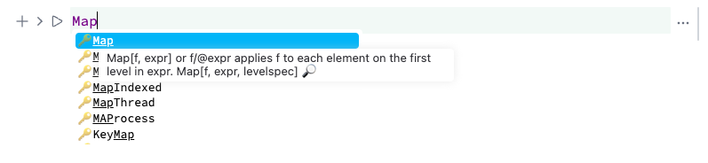

> One Ring to rule them all...

An input cell is a multi tool. __By the default it assumes Wolfram Language as an input__, however, it can be altered by the directive in the first line. See [Markdown](frontend/Cell%20types/Markdown.md), [Javascript](frontend/Cell%20types/Javascript.md), [WLX](frontend/Cell%20types/WLX.md), [HTML](frontend/Cell%20types/HTML.md), [Slides](frontend/Cell%20types/Slides.md), and so on.

For example

```mathematica @
1+1
```

```mathematica @
.md
# Heading
```

```mathematica @
.js
return 1+1;
```

*Think about it if it was an anonymous file*
Then whatever you typed, you should press `Shift-Enter` to make magic happen.

When you __start typing__, the following happens
1. each character is send to a server and updates the cell (autosaving every 300 ms)
2. editor tries to figure out the language or a cell type 
3. considering (2) it changes the syntax highlighting, autocomplete / other plugins


## Cell properties
By clicking on `...` (more icon) located on the right side of a cell group, you can change the properties of an input cell


It affects the whole cell group, i.e. input cell & all children output cells. The following transformations are possible

- _Project to a window_ - evaluates a cell and shows the first output result in a separate window
- *Make initialization cell* - marks an input cell as initialization cell, which will be evaluated once a notebook has been opened (appears as a <span style={{color:'green'}}>green</span> dot in the top-right corner)
- *Hide / Show* - hides an input cell keeping only its output cells. There is a shortcut `Cmd+2 / Alt+2` or an arrow symbol on the left side of the group.
- *Shrink / Expand* - fades out the large text keeping only the preview of it. A cursor can still be navigated into it.
- *Lock / Unlock* - makes an input read-only and limits the controls of the given input cell
- *Vanish* - makes a cell group completely invisible and uneditable. If an output cell has JS or HTML code, it will anyway be executed, however not visible explicitly. Invisible cells can only be viewed using `Expert Mode` (located in the settings menu). It comes useful for making templates.


## Wolfram Language
### Syntax highlighting symbols tracking
Wolfram Language autocomplete and highlighting can be extended using external packages.

Once you have defined something in Wolfram Kernel session in ``Global` `` context, the corresponding symbol appears in the autocomplete window and is shared between all opened notebooks.

On the startup Wolfram Kernel reads all packages imported and fetches `::usage` directives for defined symbols.

### Syntax sugar
All equations typed in the editor are compatible with any WL kernels,  i.e. can be used in `wolframscript`, since the syntax sugar and the structure is localized inside comments

For example

$$\sqrt{2\pi}$$
becomes 

```mathematica
(*SqB[*)Sqrt[2\[Pi]](*]SqB*)
```

which is safe for copying to anywhere outside the WLJS ecosystem.

**You do not need a mouse to construct and edit complex equations.**

:::info
Unlike Wolfram Mathematica our `StandardForm` output is always compatible with `InputForm`.
:::

The following shortcuts are often used for equations typing

- `Ctrl-2` - place a square root on the selected text
- `Ctrl-/` - make a fraction
- `Ctrl--` - make a subscript
- `Ctrl-6` - make a superscript (power)
- `ESC+..` - to enter greek characters

- `Alt+/` `Cmd+/` - to comment a line
- Hold `Alt` to create multiple carets
- `Cmd/Ctrl+F` - search in the current cell


As well as the standard layout

- ArrowLeft: `cursorCharLeft` (`selectCharLeft` with Shift)
- ArrowRight: `cursorCharRight` (`selectCharRight` with Shift)
- Ctrl-ArrowLeft (Alt-ArrowLeft on macOS): `cursorGroupLeft` (`selectGroupLeft` with Shift)
- Ctrl-ArrowRight (Alt-ArrowRight on macOS): `cursorGroupRight` (`selectGroupRight` with Shift)
- Cmd-ArrowLeft (on macOS): `cursorLineStart` (`selectLineStart` with Shift)
- Cmd-ArrowRight (on macOS): `cursorLineEnd` (`selectLineEnd` with Shift)
- ArrowUp: `cursorLineUp` (`selectLineUp` with Shift)
- ArrowDown: `cursorLineDown` (`selectLineDown` with Shift)
- Cmd-ArrowUp (on macOS): `cursorDocStart` (`selectDocStart` with Shift)
- Cmd-ArrowDown (on macOS): `cursorDocEnd` (`selectDocEnd` with Shift)
- Ctrl-ArrowUp (on macOS): `cursorPageUp` (`selectPageUp` with Shift)
- Ctrl-ArrowDown (on macOS): `cursorPageDown` (`selectPageDown` with Shift)
- PageUp: `cursorPageUp` (`selectPageUp` with Shift)
- PageDown: `cursorPageDown` (`selectPageDown` with Shift)
- Home: `cursorLineBoundaryBackward` (`selectLineBoundaryBackward` with Shift)
- End: `cursorLineBoundaryForward` (`selectLineBoundaryForward` with Shift)
- Ctrl-Home (Cmd-Home on macOS): `cursorDocStart` (`selectDocStart` with Shift)
- Ctrl-End (Cmd-End on macOS): `cursorDocEnd` (`selectDocEnd` with Shift)
- Enter: `insertNewlineAndIndent`
- Ctrl-a (Cmd-a on macOS): `selectAll`
- Backspace: `deleteCharBackward`
- Delete: `deleteCharForward`
- Ctrl-Backspace (Alt-Backspace on macOS): `deleteGroupBackward`
- Ctrl-Delete (Alt-Delete on macOS): `deleteGroupForward`
- Cmd-Backspace (macOS): `deleteToLineStart`
- Cmd-Delete (macOS): `deleteToLineEnd`

- Alt-ArrowLeft (Ctrl-ArrowLeft on macOS): `cursorSyntaxLeft` (`selectSyntaxLeft` with Shift)
- Alt-ArrowRight (Ctrl-ArrowRight on macOS): `cursorSyntaxRight` (`selectSyntaxRight` with Shift)
- Alt-ArrowUp: `moveLineUp`
- Alt-ArrowDown: `moveLineDown`
- Shift-Alt-ArrowUp: `copyLineUp`
- Shift-Alt-ArrowDown: `copyLineDown`
- Escape: `simplifySelection`
- Ctrl-Enter (Cmd-Enter on macOS): `insertBlankLine`
- Alt-l (Ctrl-l on macOS): `selectLine`
- Ctrl-i (Cmd-i on macOS): `selectParentSyntax`
- Ctrl-\[ (Cmd-\[ on macOS): `indentLess`
- Ctrl-\] (Cmd-\] on macOS): `indentMore`
- Ctrl-Alt-\\\\ (Cmd-Alt-\\ on macOS): `indentSelection`
- Shift-Ctrl-k (Shift-Cmd-k on macOS): `deleteLine`
- Shift-Ctrl-\\\\ (Shift-Cmd-\\ on macOS): `cursorMatchingBracket`
- Shift-Alt-a: `toggleBlockComment`

The following EMACsy style key-bindings are also available on MacOS

- `Ctrl-b`: `cursorCharLeft`
- `Ctrl-f`: `cursorCharRight`
- `Ctrl-p`: `cursorLineUp`
- `Ctrl-n`: `cursorLineDown`
- `Ctrl-a`: `cursorLineStart`
- `Ctrl-e`: `cursorLineEnd`
- `Ctrl-d`: `deleteCharForward`
- `Ctrl-h`: `deleteCharBackward`
- `Ctrl-k`: `deleteToLineEnd`
- `Ctrl-Alt-h`: `deleteGroupBackward`
- `Ctrl-o`: `splitLine`
- `Ctrl-t`: `transposeChars`
- `Ctrl-v`: `cursorPageDown`


For integrals, derivatives and series use [Command palette](frontend/Command%20palette.md) tool for entering special characters.

:::note
`DateObject`, `Graphics` and many things you probably got used in Mathematica are implemented. Please see the overview in [Symbolic programming](frontend/Symbolic%20programming.md)
:::

:::info
If an output is too big, it will be truncated or converted into a temporal symbol (if possible) to reduce the load on the editor
:::

You can also make your own custom representation of your symbol like in Mathematica using `MakeBoxes`. Please see [InterpretationBox](frontend/Reference/Decorations/InterpretationBox.md), [Interpretation](frontend/Reference/Decorations/Interpretation.md) and [MakeBoxes](frontend/Reference/Decorations/MakeBoxes.md) and [ArrangeSummaryBox](frontend/Reference/Decorations/ArrangeSummaryBox.md), [ViewBox](frontend/Reference/Decorations/ViewBox.md), [BoxBox](frontend/Reference/Decorations/BoxBox.md) and an ultimate guide on them in [Decorating symbols](frontend/Advanced/Syntax%20sugar/Decorating%20symbols.md)

### Access to documentation
Click on 🔎 icon in autocomplete window to open docs on that symbol in a new window



### Morph output cell into input
If you change something in the output Wolfram Language cell, it will be automatically converted into a new input cell.

### Auto-upload files
Drag and drop a file to the editor and paste a media from a clipboard. *By the way you can always have an access to clipboard using [ReadClipboard](frontend/Reference/Interpreter/ReadClipboard.md)*


## Other languages
Most of other languages used as input do support
- auto-upload files or importing media from a clipboard
- autocomplete
- highlighting and code parsing (more than just tokenizing)

