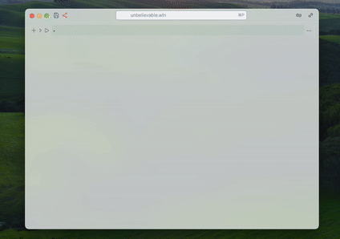

> Type `.md` in the first line of an input cell


## Markdown Syntax

### Headings
Use `#` for headings, increasing the number of `#` for smaller headings:

```markdown
.md
# Heading 1
## Heading 2
### Heading 3
```

### Emphasis
Use `*` or `_` for italics, and `**` or `__` for bold:

```markdown
.md
*italic* or _italic_
**bold** or __bold__
```

### Lists
Create unordered lists with `*`, `+`, or `-`, and ordered lists with numbers followed by a period:

```markdown
.md
- Item 1
- Item 2
  - Subitem 1

1. First item
2. Second item
   3. Subitem 1
```

### Links
Create links using `[text](URL)`:

```markdown
.md
[Tree](https://en.wikipedia.org/wiki/Tree)
```

### Images
Embed images using ``:

```markdown
.md

```

:::note
Files can be remote or local (in the notebook folder). __Try dragging and dropping any image into a markdown cell.__
:::

### Drawings
We use the amazing [Excalidraw](https://excalidraw.com/) editor for complex drawings, right inside a markdown input cell. Try typing:

```markdown
.md

!![]
```

A corresponding SVG image will be generated in the output cell.

*See the GIF animation below:*



### Blockquotes
Create blockquotes using `>`:

```markdown
.md
> This is a blockquote.
```

### Code
Use backticks for inline code and triple backticks for code blocks:

```markdown
.md

`inline code`

```
code block
```
.md
```

### Horizontal Rule
Create a horizontal rule with three or more dashes, asterisks, or underscores:

```markdown
---
***
___
```

### Tables
Create tables using pipes `|` and dashes `-`:

```markdown
.md
| Header 1 | Header 2 |
|----------|----------|
| Cell 1   | Cell 2   |
| Cell 3   | Cell 4   |
```

### Highlighter
Use `==` to highlight text:

```mathematica
.md
==Hello World==
```

### Admonitions
Use the following syntax:

```markdown
.md
:::tip
Use admonitions!
:::
```

The following types have special highlighting: `tip`, `info`, `warning`, `danger`, and `todo`. Unknown types will be treated as `info`.

You can also define your own custom type:

```html
.html
<style>
.admonition.yourtype {
  background-color: pink;
}
</style>
```

#### TODO Lists
The `todo` tag adds a live button-counter at the top of the page, serving as a reminder.


### Bookmarks
You can place a bookmark on the page using:

```markdown
.md
@bookmark
```

It will appear as an icon at the top. Clicking it will scroll to the bookmarked content.

## Pure HTML
You can use plain HTML tags to stylize markdown or embed media objects.

## LaTeX
We use KaTeX as the render engine. To write an equation, wrap it inside `$` for inline or `$$` for a block:

```markdown
.md
$$
E = \\hbar \\omega
$$
```


:::tip
If you don't want to escape Markdown commands in your LaTeX code, please, consider to use [LaTeX](frontend/Cell%20types/Many%20more.md#LaTeX) cell type
:::

### Backslashes
To have full compatibility with Markdown syntax you have to escape all backslashes. For example, write `\\alpha` instead of `\alpha`.

### Trailing underscores
To avoid misinterpretation for `__` markdown command, you need to escape such cases. For example, instead of __this__

```md
$$
\hat{\alpha}_{x} - \hat{\beta}_{}
$$
```

as a minimal patch one can escape the very last one ⤵️

```md
$$
\hat{\alpha}_{x} - \hat{\beta}\_{}
$$
```

And the best solution would be 👍🏼

```md
$$
\\hat{\alpha}\_{x} - \\hat{\\beta}\_{}
$$
```


__See [here](https://katex.org/docs/supported.html) for all supported LaTeX functions.__

## WLX
Markdown cells support many features of [WLX](frontend/Cell%20types/WLX.md), similar to how it is done in [FrontSlidesSelected](frontend/Reference/Slides/FrontSlidesSelected.md).

### Embed Figures
For example, if you create a 3D plot:

```mathematica title="cell 1"
Figure = Plot3D[Sin[x] Cos[y], {x, -5, 5}, {y, -5, 5}];
```

:::tip
Make sure the first letter in a symbol name is capitalized. This is required by WLX syntax.
:::

Then you can embed it into a markdown cell using a custom tag:

```markdown
.md
Hello there! Here is my plot

<br/>

<Figure/>
```

## Autoupload
### Drop a File

### Paste a Media File

__[GitHub repo](https://github.com/JerryI/wljs-markdown-support)__
To switch to Markdown language, use the `.md` prefix on the first line.


