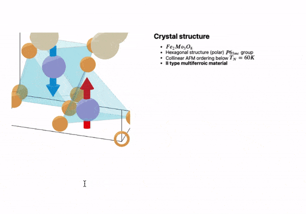

# Slides

> Type `.slide` in the first line of an input cell

You can also create presentations using the WLJS Notebook. This is enabled by [wljs-revealjs](https://github.com/JerryI/wljs-revealjs), which integrates [RevealJS](https://revealjs.com) and the [WLX](frontend/Cell%20types/WLX.md) language. It allows a component-based approach to building presentations and adds interactivity and all the features of frontend cells, like the one shown below:



## See the [slides tutorial](frontend/Advanced/Slides/Slides.md)

:::tip
To __enter fullscreen__ mode, press the `f` key after focusing on the content of a slide.
:::

```jsx
.slide

# Title

Paragraph
```

## Merge Slides from Different Cells

To merge all slides into a single comprehensive presentation, use:

```md
.slides
```

This will combine and render slides from all cells in the notebook into one.

:::tip
Use the projector feature:


to display slides in a separate window.
:::

## Plain HTML Support

By default, slide cells support plain HTML mixed with Markdown syntax and WLX. For example, you can embed a website on a slide:

```markdown
.slide

<iframe
  style="margin-left:auto; margin-right:auto; border-radius: 10px"
  width="600"
  height="500"
  src="https://jerryi.github.io/wljs-docs/">
</iframe>
```

## LaTeX Support

We use KaTeX as the rendering engine. To write an equation, wrap it inside `$` for inline or `$$` for a block equation:

```markdown
.slide

$$
E = \\hbar \\omega
$$
```


:::tip
If you don't want to escape Markdown commands in your LaTeX code, please, consider to use [LaTeX](frontend/Cell%20types/Many%20more.md#LaTeX) cell type
:::

### Backslashes
To have full compatibility with Markdown syntax you have to escape all backslashes. For example, write `\\alpha` instead of `\alpha`.

### Trailing underscores
To avoid misinterpretation for `__` markdown command, you need to escape such cases. For example, instead of __this__

```md
$$
\hat{\alpha}_{x} - \hat{\beta}_{}
$$
```

as a minimal patch one can escape the very last one ⤵️

```md
$$
\hat{\alpha}_{x} - \hat{\beta}\_{}
$$
```

And the best solution would be 👍🏼

```md
$$
\\hat{\alpha}\_{x} - \\hat{\\beta}\_{}
$$
```


__See [here](https://katex.org/docs/supported.html) for all supported LaTeX functions.__

## WLX Integration

Slides integrate some features of the [WLX](frontend/Cell%20types/WLX.md) cell type, similar to [Markdown](frontend/Cell%20types/Markdown.md) cells. Refer to the [Slides](frontend/Advanced/Slides/Slides.md) tutorial for more information on how to use its capabilities.

## Drawings

We use the excellent [Excalidraw](https://excalidraw.com/) editor for creating complex drawings directly within slides and Markdown input cells. Try typing:

```markdown
.slide

!![]
```

The corresponding SVG image will be generated in the output cell.

## Export Options

Slides can be exported using the [Static HTML](frontend/Exporting/Static%20HTML.md) exporter or through static export with the [Slides exporter](frontend/Reference/Slides/FrontSlidesSelected.md), for example, for printing.

## Auto-upload Images
### Drop a file
### Paste a media file

## Plugins

This package also supports some external plugins:
- [pointer](https://github.com/burnpiro/reveal-pointer) (press `Q` to toggle)

