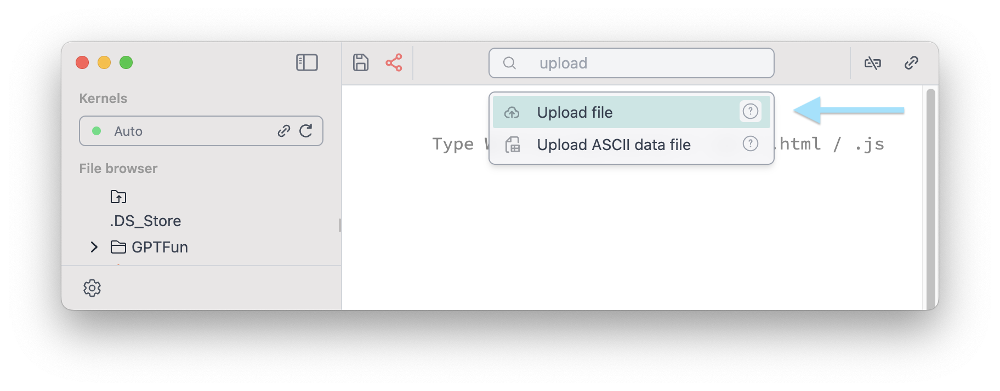
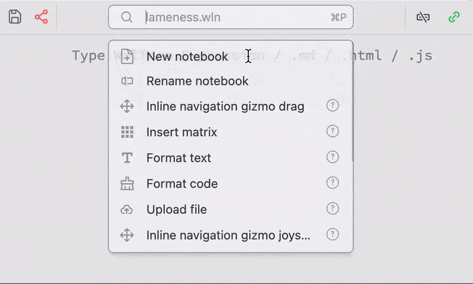

The big power of customization comes with a powerful command palette system. This is provided by a [plugin](https://github.com/JerryI/wljs-snippets) shipped with a core package.

Command palette item are mostly special cells of Wolfram / [WLX](frontend/Cell%20types/WLX.md) / [Javascript](frontend/Cell%20types/Javascript.md) which serve a single utility function saved in a normal notebook. __They are available from the command palette__ and have an access to your notebook and computational Kernel. You can see their source notebook as well as short documentation by clicking on a question mark symbol


:::tip
Use a shortcut for command palette `Cmd + P` or `Ctrl + P`
:::


## Context menu
If you need to apply `Simplify` or highlight selected expressions in the code 


Highlighting text is not destructive and will not alter an initial expression you had.

## Notebook Templates
The is a relatively new feature, that allows to create a new notebook based on a given template


## Uploading data
There are a few snippets used for uploading ASCII data or any arbitrary files to the folder of your notebook


This snippet was built using regular Wolfram Language.

## Special characters
A toolbar with templates for symbolic integration, series and etc is also available from the command palette



However, it is recommended to use keyboard shortcuts for

- fractions `Ctrl+/`
- subscripts `Ctrl+-`
- power `Ctrl+6`
- square roots `Ctrl+2`
- greek symbols `ESC+al`, `ESC+be`, `ESC+ga`, `ESC+o` ...


## Matrix helper
To make it easier for typing matrixes, one can use the following snippet

.gif)

This snippet inserts the given matrix into the cell __where your last cursor was__. A snippet was made using [WLX](frontend/Cell%20types/WLX.md) cells for better customized look.

## Show available options
This snippet analyses the content of your cell __from the left of your cursor position__ and prints `Options` for a given symbol

.gif)

:::tip
Drop a cursor in the middle of a symbol of interest. You can select and edit option values inside the picker
:::

:::warning
Not all options are supported for a standard library symbol of Wolfram Mathematica
:::


## Navigation gizmo
This feature is aimed to slightly blur the line between code  and traditional GUI interface approaches for 2D/3D graphics design

.gif)

See __shorts__ on that
- YTS 📽️ [You don't need to program your figures manually](https://youtube.com/shorts/Z76dMHK8POM?feature=share)

It utilizes the dynamic reevaluation features of WLJS Notebook as well as powerful syntax sugar of an input editor.

1. Select 2D or 3D list of coordinates `{}`
2. Type `gizmo...` in the command palette 
3. Evaluate the cell
4. Drag gizmo to the desired position and click on a check mark

It can also work in principle for most primitives

.gif)

:::tip
Add an offset to a manipulated list, that a gizmo will not overlap with other graphics primitives. For example

```mathematica @
Text["Hello World", ({0.5,0.5} + (*BB[*)({0.5,0.5})(*,*)(*"1:eJxTTMoPSmNkYGAoZgESHvk5KRAeB5AILqnMSXXKr0hjgskHleakFnMBGU6JydnpRfmleSlpzDDlQe5Ozvk5+UVFDGDwwR6dwcAAAAHdFiw="*)(*]BB*)) // Hold]
```

`Offload` or (`Hold` will also work) is necessary here to prevent Wolfram Kernel from distributing `Plus` over each position of the list.

:::

Or for 3D primitives as well

.gif)

## Format Wolfram Language code
This is also a code formatter available

.gif)

__It acts on a selected text or on the entire cell__ if nothing is selected

## Text formatting
This snippet provides some basic tool for styling Wolfram expression, as well as text on slides, HTML and Markdown (it tries to guess the cell type and use a suitable method for each cell type)


:::warning
This feature is quite primitive and still in development
:::


## Take a picture
It uses your active web camera pipes a picture to Wolfram Kernel as [Image](frontend/Reference/Image/Image.md) object


## Install Wolfram Packages from Github
If you past a url to a Github repository into command palette, which contains `PacletInfo.wl` file in the root directory  


it will automatically install it locally in the folder of the current notebook.

## Terminal
A direct access to the master or any evaluation kernel


The output is formatted and colored. The default form is `InputForm`


## Debugger
There is a build-in debugger, which allows to watch symbols, pause and inspect execution of the cells


See [Debugger](frontend/Advanced/Command%20palette/Debugger.md) more.

## AI Assistant
If nothing is selected, __the given text in the command palette is sent to ChatGPT__ that has __an access to your notebook__


__See more [detailed guide](frontend/Advanced/Command%20palette/AI%20Assistant.md)__ on our assistant.

:::note
It will ask you for a OpenAI API Key. You need to issue it first on the official openAI website
:::

We use the concept of a library or [Knowledge on demand](frontend/Advanced/Command%20palette/AI%20Assistant.md#Knowledge%20on%20demand), which means that all additional information about notebook cell types and etc is accessible on demand, and __it won’t use up your tokens if your request doesn’t match the topic__.

In general AI can do the following
- __create, remove, evaluate, edit cells__ in any language
- __read notebook structure__ 
- __see and edit your focused cell__ you dropped a cursor on
- __see and edit your selection__ in any editor area
- __check and read the knowledge library__ 
- ~~google~~ __use WolframAlpha__ to fetch data from the internet

Shorts
- YTS 📽️ [We made AI Copilot in your Notebook 🤖](https://youtube.com/shorts/6s9m5ZGPkdE?feature=share)
- YTS 📽️ [AI Copilot in your Notebook. Part 2 🤖](https://youtube.com/shorts/B_ZVjN9cvQM?feature=share)
