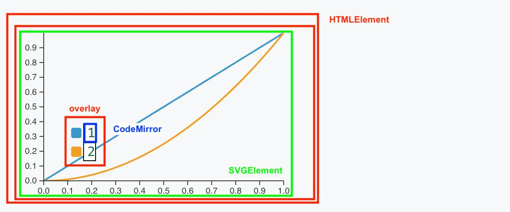
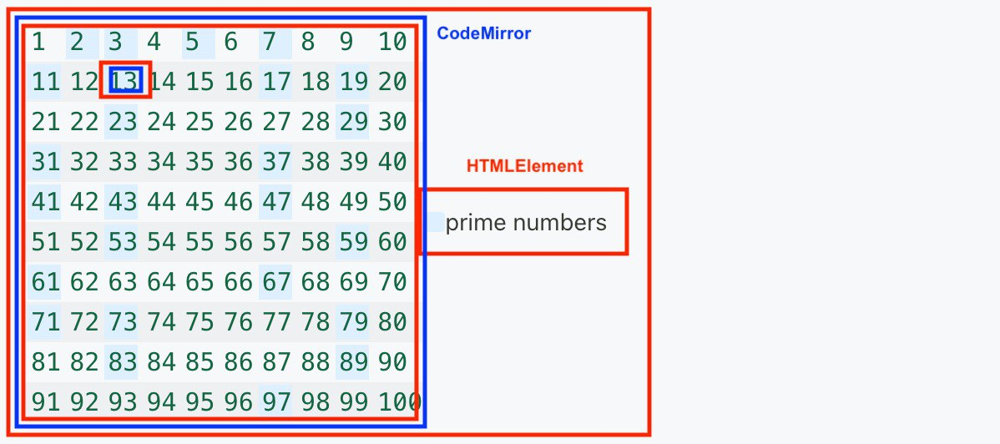
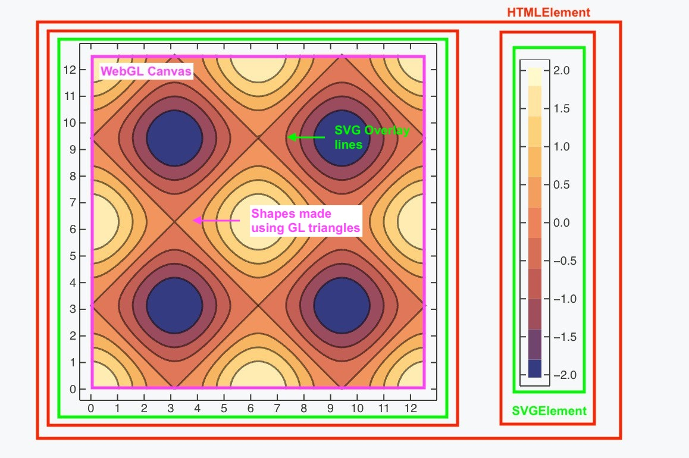

# Rendering Composition

The WLJS Notebook integrates a wide range of Web APIs to maximize performance and render complex, decorated Wolfram expressions—including nested elements such as:

* SVG graphics
* Canvas
* WebGL shaders
* Basic HTML elements

Here are a few examples showing how we compose these elements to render Wolfram expressions:

```mathematica
Plot[{x, x^2}, {x, 0, 1}, PlotLegends -> Automatic]
```



In this example, we have a typical scenario where SVG graphics are overlaid with an HTML element inset—specifically, a [SwatchLegend](frontend/Reference/Formatting/SwatchLegend.md). The `CodeMirror` elements represent truncated versions of the code editor found in every [Input Cell](frontend/Cell%20types/Input%20cell.md). While this might seem excessive, we use this setup only when the expression is not plain text and it is unclear how to render it. This universal approach allows us to embed full expressions, including nested plots, within other plots and more.

```mathematica
Legended[
 Grid[Partition[
   Table[If[PrimeQ[n], Item[n, Background -> LightBlue], n], {n, 100}],
    10], Frame -> All], SwatchLegend[{LightBlue}, {"prime numbers"}]]
```



In this example, we render a grid of 100 editors, where all *prime* number cells have a different background color.

Most importantly, this matrix remains a fully **editable expression**. You can copy and paste it into other cells without issues, even in `wolframscript`. WLJS Notebook treats [StandardForm](frontend/Reference/Formatting/StandardForm.md) as a decorated version of [InputForm](frontend/Reference/Formatting/InputForm.md), making it compatible with other editors outside the Wolfram ecosystem.

```mathematica
ContourPlot[Cos[x] + Sin[y], {x,0,4Pi}, {y, 0, 4Pi}, PlotLegends->Automatic]
```



This is one of our favorite examples. SVG graphics are not ideal for rendering shaded triangles generated by [Polygon](frontend/Reference/Graphics/Polygon.md) elements within a [GraphicsComplex](frontend/Reference/Graphics/GraphicsComplex.md). To address performance issues, we developed a custom WebGL renderer. It renders all *heavy* graphics using low-level GPU calls into a static image, which is then embedded inside an SVG element and overlaid with elements that are tricky to render correctly—such as lines.

> Line rendering in WebGL is particularly problematic. On some platforms, you can't change line thickness—unless you render them using triangles, but that's another story.
