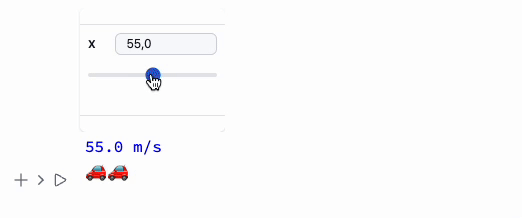

The way dynamics work here is quite different from Wolfram Mathematica. Key changes were made for the sake of performance, flexibility—and perhaps a bit of @JerryI’s imagination (one of the maintainers).

## Architecture

All dynamics—similar to what you’d expect in Mathematica—are handled entirely on the frontend, i.e., in your browser.

The core engine is powered by the [WLX Library](https://jerryi.github.io/wlx-docs/docs/WLX/dynamics#dynamic-symbols) (via the WLJSTransport package).

Some expressions are designed to run directly on the frontend, without needing Kernel-side definitions. In other cases, you can use the `Offload` expression to explicitly tell the Kernel to pass unevaluated expressions to the frontend. This allows flexible structuring of your code to balance performance and control.

:::tip
Learn more [here](https://jerryi.github.io/wlx-docs/docs/WLX/dynamics#dynamic-symbols)
:::

:::tip
Always keep track of which parts of your code execute on the Wolfram Kernel (server) vs. the frontend (browser). This is crucial for writing predictable and performant code.
:::

## If You're Looking for Just `Manipulate`

If you want to see how curves change with parameters, check out [ManipulatePlot](frontend/Reference/Plotting%20Functions/ManipulatePlot.md) or [ManipulateParametricPlot](frontend/Reference/Plotting%20Functions/ManipulateParametricPlot.md) or general [Manipulate](frontend/Reference/GUI/Manipulate.md)

```mathematica
ManipulatePlot[Sin[w z + p], {z,0,10}, {w, 0, 15.1, 1}, {p, 0, Pi, 0.1}]
```


A general-purpose [Manipulate](frontend/Reference/GUI/Manipulate.md) is available, but *not recommended* for plotting

```mathematica
Manipulate[Column[{
  Style[StringTemplate["`` m/s"][x], Blue],
  Table["🚗", {i, Floor[x/25]}]//Row 
}], {x,10,100}, ContinuousAction->True] // Quiet
```



For small expressions that need to update on a timer or trigger, use [Refresh](frontend/Reference/GUI/Refresh.md):

```mathematica
Refresh[Now // TextString, 1]
```

This will update the time in the output cell every second.

### ... or `Animate`

If you’re looking to create standalone animations that can be embedded or exported, use [AnimatePlot](frontend/Reference/Plotting%20Functions/ManipulatePlot.md):

```mathematica
AnimatePlot[{Sin[x c], Sinc[x c]}, {x, -10, 10}, {c, 1, 10, 0.1}]
```


Using Wolfram Language and WLJS you can animate *anything* - see [Animation](frontend/Advanced/Dynamics/Animation.md)

```mathematica
Animate[Row[{Sin[x], "==", Series[Sin[x], {x,0,n}], Invisible[1/2]}], {n, 1, 10, 1}, AnimationRate->3]
```


### Fallback to Mathematica's Rendering
Using [MMAView](frontend/Reference/GUI/MMAView.md) wrapper allows to rasterize interactive output using Wolfram Engine in real-time keeping the original looks of Mathematica's plots

```mathematica
Manipulate[Plot3D[Sin[n x] Cos[n y], {x,-1,1}, {y,-1,1}], {n, 1, 5, 1}] // MMAView
```


The same works for [Animate](frontend/Reference/GUI/Animate.md)

```mathematica
Animate[Plot[Sin[x y], {x,0,1}], {y,0,5}] // MMAView
```


:::note
Please do not overuse [MMAView](frontend/Reference/GUI/MMAView.md) since it uses raw raster images streamed in real-time, which is a heavy load to the system. Try to use mostly WLJS's dynamics if possible
:::


## Automatic Tracking of Held Symbols
This doesn’t mean `Set` will automatically reevaluate on nested symbol changes, but many graphics primitives work out of the box. Use [Offload](frontend/Reference/Interpreter/Offload.md) to send symbols to the frontend:

```mathematica
length = 1;

Graphics[{Cyan,
  Rectangle[{-1, -1}, {length // Offload, 1}]
}]
```

:::info
`Offload` wraps the value in a symbol unknown to the frontend, forcing it to fetch and create a dynamic link.
:::

Now try to evaluate in a new cell

```mathematica
length = 0.5;
```

Note: The binding here is between `Rectangle` and `length`, not the whole `Graphics` expression. Learn more in the advanced section of the documentation.

:::danger
Not all functions support dynamic updates. Check the __Reference__ to confirm whether a function supports updates.
:::

## Event-Based Approach

You can use GUI elements as event generators:

```mathematica
slider = InputRange[-1, 1, 0.1, "Label" -> "Length"]
EventHandler[slider, Function[l, length = l]];
```

Once an event is fired, the handler function is executed.


The `slider` symbol is a special object with both a representation and an event ID.

### 🍪 Example 0 – Simple Rotation

```mathematica
EventHandler[InputRange[0, 2.0 Pi, 0.1], Function[a,
  angle = a
]]
% // EventFire;

Graphics[Rotate[Rectangle[{-1, -1}, {1, 1}], angle // Offload]]
```


### 🍪 Example 1 – Wave Packet

```mathematica title="cell 1"
packet[x_, t_] := Sum[Sin[-w t + w x], {w, 0, 3, 0.05}] / 10;
line = Table[{x, packet[x, 0]}, {x, 0, 10, 0.1}];

Graphics[Line[line // Offload], Frame -> True, FrameLabel -> {{"amplitude"}, {"distance"}}]
```

```mathematica title="cell 2"
EventHandler[InputRange[0, 5, 0.5, 0], Function[t,
  line = Table[{x, packet[x, t]}, {x, 0, 10, 0.1}];
]]
```


### 🍪 Example 2 – Hello World Spray

```mathematica
Module[{
  text = "Hello World"
},
  Column[{
    EventHandler[InputText[text], (text = #)&],
    Graphics[Table[{
      RandomColor[],
      Rotate[
        Text[text // Offload, RandomReal[{-1, 1}, 2]],
        RandomReal[{0, 3.14}]
      ]
    }, {40}]]
  }]
]
```


### Event Handlers for Graphics Primitives

```mathematica
p = {0, 0};
Graphics[{
  White,
  EventHandler[
    Rectangle[{-2, -2}, {2, 2}],
    {"mousemove" -> Function[xy, p = xy]}
  ],
  PointSize[0.05], Cyan,
  Point[p // Offload]
}]
```

Available events:
- `drag`
- `zoom`
- `click`
- `mousemove`
- `mouseover`

For 3D:
- `transform`

:::note
Graphics primitive handlers are part of the [wljs-graphics-d3](https://github.com/JerryI/wljs-graphics-d3) library.
:::

More info in [Mouse and Keyboard](frontend/Advanced/Events%20system/Mouse%20and%20keyboard.md).

### Combination of manual and automated dynamics
Our built-in [ManipulatePlot](frontend/Reference/Plotting%20Functions/ManipulatePlot.md) function allows to make basic interactive plots in a single line of code, however, you can add your own dynamic features manually if needed. 

For example

```mathematica
Module[{label, pos},
  ManipulatePlot[x w, {x,0,1}, {w,0,2},
    Epilog->Text[Style[label // Offload, FontSize->14], pos // Offload],
    "UpdateFunction" -> Function[input,
      label = StringTemplate["w = ``"][SetPrecision[input,2]];
      pos = {0.5, input 0.5 + 0.2};
      True
    ]
  ]
]
```


### Auto-Generating Dynamic Symbols

Use [OffloadFromEventObject](frontend/Reference/Interpreter/OffloadFromEventObject.md) to turn event objects into dynamic symbols:


### 🍪 Example 3 – FABRIK Solver

```mathematica title="cell 1"
chain = {Cos[#[[1]]], Sin[#[[2]]]} & /@ RandomReal[{-1, 1}, {65, 2}] // Sort;
lengths = Norm /@ (Reverse[chain] // Differences) // Reverse;
```

```mathematica title="cell 2"
fabrik[lengths_, target_, origin_] := Module[{buffer, prev},
  buffer = Table[With[{p = chain[[-i]]},
    If[i === 1,
      prev = target;
      target
    ,
    
      prev = prev - Normalize[(prev - p)] lengths[[1-i]];
      prev 
    ]
  ], {i, chain // Length}] // Reverse;

  Table[With[{p = buffer[[i]]},
    If[i === 1,
      prev = origin;
      origin
    ,
    
      prev = prev - Normalize[(prev - p)] lengths[[i-1]];
      prev 
    ]
  ], {i, chain // Length}]
]
```

```mathematica title="cell 3"
Graphics[{
  Line[chain // Offload],
  Red, PointSize[0.06],
  EventHandler[Point[{-1, -1}], {"drag" -> Function[xy, chain = fabrik[lengths, xy, First[chain]]]}],
  Blue, Point[origin // Offload]
}, PlotRange -> {{-2, 2}, {-2, 2}}, ImageSize -> 500, "TransitionType" -> "Linear", "TransitionDuration" -> 30]
```


### 🍪 Example 4 – Opacity Animation

```mathematica
opacity = 0.5;
Graphics[{
  Opacity[Offload[opacity]], Red, Disk[{0, 0}, Offload[1 - opacity]],
  Blue, Opacity[Offload[1.0 - opacity]], Disk[{0, 0}, Offload[opacity]]
}, ImagePadding -> None]

EventHandler[InputRange[0, 1, 0.1], Function[value,
  opacity = value;
]]
```


:::info
All examples are shipped with the app. Locate them here:

<div style={{width:"120px"}}>


</div>

Or access them from the top-bar menu.
:::

### 🍪 Example 5 – 3D Morph Mesh

```mathematica
sample[t_] := With[{
   complex = ParametricPlot3D[
     (1 - t) * {
       (2 + Cos[v]) * Cos[u],
       (2 + Cos[v]) * Sin[u],
       Sin[v]
     } + t * {
       1.16^v * Cos[v] * (1 + Cos[u]),
       -1.16^v * Sin[v] * (1 + Cos[u]),
       -2 * 1.16^v * (1 + Sin[u]) + 1.0
     },
     {u, 0, 2\[Pi]},
     {v, -\[Pi], \[Pi]},
     MaxRecursion -> 2,
     Mesh -> None
   ][[1, 1]]
   },
  {
   complex[[1]],
   Cases[complex[[2]], _Polygon, 6] // First // First,
   complex[[3, 2]]
  }
]
```

```mathematica
Module[{
    vertices, normals, indices
  },
    {
      EventHandler[InputRange[0,1,0.1,0], Function[value,
        With[{res  = sample[value]},
          normals = res[[3]];
          indices = res[[2]];
          vertices = res[[1]];
        ];
      ]],

      {vertices, indices, normals} = sample[0];
      
      Graphics3D[{ 
        SpotLight[Red, 5 {1,1,1}], SpotLight[Blue, 5 {-1,-1,1}], 
        SpotLight[Green, 5 {1,-1,1}], PointLight[Magenta, {10,10,10}],
        GraphicsComplex[vertices // Offload, {
          Polygon[indices // Offload]
        }, VertexNormals->Offload[normals, "Static"->True]]
      }, Lighting->None]
    } // Column // Panel 
]
```


## How to Embed on a Web Page?

No Kernel connection needed. Use [AnimatePlot](frontend/Reference/Plotting%20Functions/AnimatePlot.md) or [Dynamic HTML](frontend/Exporting/Dynamic%20HTML.md).

:::tip
Explore our __Blog__ 📻 for more examples and dev notes.
:::

## How to Turn It Into an App?

See [Mini Apps](frontend/Exporting/Mini%20Apps.md)

