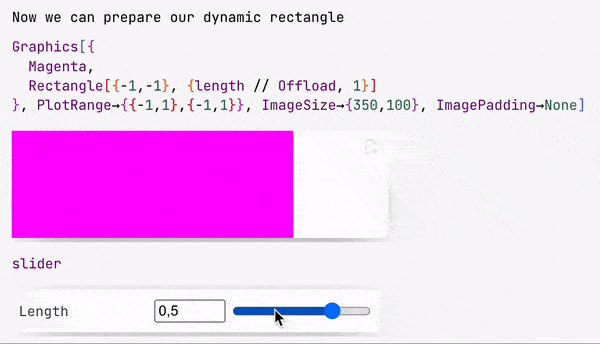

The way how dynamics work is quite different compared to Wolfram Mathematica. The key changes were made for the sake of performance and control (or imagination of  @JerryI - maintainer)


## Architecture
All dynamics in terms of what you expect from Mathematica's experience happens on the frontend's side, i.e. in your browser.

The core engine for that is used from [WLX Library](https://jerryi.github.io/wlx-docs/docs/WLX/dynamics#dynamic-symbols) (WLJSTransport package).

Some expressions are meant for to be executed on frontend, i.e. not defined on the Kernel, then a user do not need to specify explicitly what and when should happen. In other cases, a user can use `Offload` attribute or `CreateFrontEndObject` to tell explicitly Wolfram Kernel pass an expression without evaluation to the frontend. Therefore one can play around with a way of splitting your code-base to archive the maximum flexibility and performance. 

:::tip 
More about it [here](https://jerryi.github.io/wlx-docs/docs/WLX/dynamics#dynamic-symbols)
:::

:::tip
Always keep in mind, which part of code executes on Wolfram Kernel (server) and what is delegated to the frontend (browser). This is the only way to write predictable and good performing code 
:::

## If you are looking for just Manipulate
There is a short cut, if you need to see how your curves changes with different parameters - see [ManipulatePlot](frontend/Reference/Plotting%20Functions/ManipulatePlot.md), [ManipulateParametricPlot](frontend/Reference/Plotting%20Functions/ManipulateParametricPlot.md) 


General [Manipulate](frontend/Reference/Interpreter/Manipulate.md) is available, however *we do not recommend to use it for plotting purposes*.

For small expression needed to be reevaluated by a trigger or a timer (not often), one can also use [Refresh](frontend/Reference/Interpreter/Refresh.md) wrapper

```mathematica
Refresh[Now // TextString, 1]
```

It will update the current time in the output cell every second.

### ... or `Animate`
There is a similar version of [ManipulatePlot](frontend/Reference/Plotting%20Functions/ManipulatePlot.md) meant for standalone animations, which unlike other dynamic features can also be safely exported or embedded to a web-page (see more in [Static HTML](frontend/Exporting/Static%20HTML.md))

```mathematica
AnimatePlot[{Sin[x c], Sinc[x c]}, {x,-10,10}, {c,1,10,0.1}]
```


## Automatic tracking of held symbols
It does not mean, that your `Set` statements will be reevaluated on change of a nested symbol, however, for most graphics primitives it works out of the box. Use [Offload](frontend/Reference/Interpreter/Offload.md) wrapper to hold symbols for the frontend

```mathematica
length = 1;

Graphics[{Cyan, 
  Rectangle[{-1,-1}, {length // Offload, 1}]
}] 
```

:::info
`Offload` just does a simple trick - provides to a frontend an unknown symbol, which forces frontend to fetch it from the Kernel. Once it has been fetched, a dynamic link is created. 
:::

The binding itself happens between `Rectangle` and `length`, but not `Graphics`, therefore only partial reevaluation occurs. To know more about details see [WLJS](../../../interpreter/Advanced/symbols.md).

:::danger
Not all functions support dynamic binding or updates. Please check __Reference__ section, if the argument or a function supports updates. 
:::

## Event-based approach
Working with GUI elements standing for input is done in more controllable way, where each button or slider is an event-generator

```mathematica
slider = InputRange[-1,1,0.1, "Label"->"Length"]
EventHandler[slider, Function[l, length = l]];
```


Once event was fired, the assigned handler function will be called.

 


`slider` symbol is actually a special object, that stores the representation of a slider and an ID for the event, that will be fired when a user drags a knob. 

#### 🍪 Example 0
A simple rotation with a slider

```mathematica
EventHandler[InputRange[0, 2.0 Pi, 0.1], Function[a,
  angle = a
]]
% // EventFire;

Graphics[Rotate[Rectangle[{-1,-1}, {1,1}], angle // Offload]]
```


#### 🍪 Example 1
Let us demonstrate how a wave packet travels though space and time

```mathematica title="cell 1"
packet[x_, t_] := Sum[Sin[- w t + w x], {w, 0,3,0.05}] / 10;
line = Table[{x, packet[x, 0]}, {x, 0, 10, 0.1}];

Graphics[Line[line // Offload], Frame->True, FrameLabel->{{"amplitude"}, {"distance"}}]
```

here `line` symbol is dynamic. Now we need a slider to control time

```mathematica title="cell 2"
EventHandler[InputRange[0,5,0.5, 0], Function[t, 
  line = Table[{x, packet[x, t]}, {x, 0, 10, 0.1}];
]]
```

The desired result looks line this


#### 🍪 Example 2
Here is a little widget, which takes user's input and prints it multiple times with different font colors on random positions on the canvas

```mathematica
Module[{
	text = "Hello World"
},
	Column[{
		EventHandler[InputText[text], (text = #)&],
		Graphics[Table[{
			RandomColor[], 
			Rotate[
				Text[text // Offload, RandomReal[{-1,1}, 2]],
				RandomReal[{0, 3.14}]
			]
		}, {40}]]
	}]
]
```

The result


### Event handlers for graphics primitives
It looks similar to Mathematica's implementation, where one can add an event handler to a random graphics primitive

```mathematica
p = {0,0};
Graphics[{
	White,
	EventHandler[
		Rectangle[{-2,-2}, {2,2}],
		{"mousemove"->Function[xy, p = xy]}
	],
	PointSize[0.05], Cyan,
	Point[p // Offload]
}]
```

The following event are available
- `drag` - provides a list of two coordinates
- `zoom` - provides one relative scaling number
- `click` - provides coordinates, where the cursor clicked
- `mousemove` - provides coordinates of a mouse
- `mouseover` - provides coordinates once, when a mouse appears at a div

for 3D graphics the following events are provided
- `transform` - sends an association with a new position of a dragged object

:::note
Event handlers wrapped around graphics primitives are parts of [wljs-graphics-d3](https://github.com/JerryI/wljs-graphics-d3) library.
:::

See more in [Mouse and keyboard](frontend/Advanced/Events%20system/Mouse%20and%20keyboard.md)

### Autogeneration of dynamic symbols
There is also an extension [OffloadFromEventObject](frontend/Reference/Interpreter/OffloadFromEventObject.md) that allows to turn event objects into dynamic symbols


#### 🍪 Example 3
Let us show a fun example - implementation of FABRIK solver.

Define a random chain of segments with a random fixed lengths
```mathematica title="cell 1"
chain = {Cos[#[[1]]], Sin[#[[2]]]}&/@ RandomReal[{-1,1}, {65, 2}] // Sort;
lengths = Norm /@ (chain // Reverse // Differences) // Reverse;
```

The most stupid and simple implementation of FABRIK
```mathematica title="cell 2"
fabrik[lengths_, target_, origin_] := Module[{buffer, prev},
  buffer = Table[With[{p = chain[[-i]]},
    If[i === 1,
      prev = target;
      target
    ,
    
      prev = prev - Normalize[(prev - p)] lengths[[1-i]];
      prev 
    ]
  ], {i, chain // Length}] // Reverse;

  Table[With[{p = buffer[[i]]},
    If[i === 1,
      prev = origin;
      origin
    ,
    
      prev = prev - Normalize[(prev - p)] lengths[[i-1]];
      prev 
    ]
  ], {i, chain // Length}]
]
```

To show the result will will use a simple [Line](frontend/Reference/Graphics/Line.md) primitive coupled to a `chain` symbol and an inline event-handler coupled to a target point of a chain

```mathematica title="cell 3"
Graphics[{

  Line[chain // Offload], 
  Red, PointSize[0.06], 
  EventHandler[Point[{-1,-1}], {"drag"->Function[xy, chain = fabrik[lengths, xy, chain // First]]}], 
  Blue, Point[origin // Offload]
  
}, PlotRange->{{-2,2}, {-2,2}}, ImageSize->500, "TransitionType"->"Linear", "TransitionDuration"->30]
```

By dragging the red point you update all positions joints


*use wheel to zoom and a left click to pan*


#### 🍪 Example 4
Let us show you something more simple

```mathematica
opacity = 0.5;
Graphics[{Opacity[Offload[opacity]], Red, Disk[{0,0}, Offload[1-opacity]], Blue, Opacity[Offload[1.0 - opacity]], Disk[{0,0}, Offload[opacity]]}, ImagePadding->None]

EventHandler[InputRange[0,1,0.1], Function[value,
	opacity = value;
]]
```

Here we provide dynamic symbol `opacity` to both [Opacity](frontend/Reference/Graphics3D/Opacity.md) and [Disk](frontend/Reference/Graphics/Disk.md) radius. The effect of two will be following


:::info
All examples shown here are shipped together with an app . Locate
<div style={{width:"120px"}}>


</div>

or from the top-bar menu

:::

#### 🍪 Example 5
*This requires a deep knowledge of how 3D graphics work*

Use a standard [ParametricPlot](frontend/Reference/Plotting%20Functions/ParametricPlot.md) 3D function to generate 3D mesh for our shapes. We use `Cases` to extract polygon, vertices and normals data

```mathematica
sample[t_] := With[{
   complex = ParametricPlot3D[
     (1 - t) * {
       (2 + Cos[v]) * Cos[u],
       (2 + Cos[v]) * Sin[u],
       Sin[v]
     } + t * {
       1.16^v * Cos[v] * (1 + Cos[u]),
       -1.16^v * Sin[v] * (1 + Cos[u]),
       -2 * 1.16^v * (1 + Sin[u]) + 1.0
     },
     {u, 0, 2\[Pi]},
     {v, -\[Pi], \[Pi]},
     MaxRecursion -> 2,
     Mesh -> None
   ][[1, 1]]
   },
  {
   complex[[1]],
   Cases[complex[[2]], _Polygon, 6] // First // First,
   complex[[3, 2]]
  }
]
```

Now one can assemble a dynamic scene

```mathematica
LeakyModule[{
    vertices, normals, indices
  },
    {
      EventHandler[InputRange[0,1,0.1,0], Function[value,
        With[{res  = sample[value]},
          normals = res[[3]];
          indices = res[[2]];
          vertices = res[[1]];
        ];
      ]],

      {vertices, indices, normals} = sample[0];
      
      Graphics3D[{
        MeshMaterial[MeshToonMaterial[]], Gray, 
        SpotLight[Red, 5 {1,1,1}], SpotLight[Blue, 5 {-1,-1,1}], 
        SpotLight[Green, 5 {1,-1,1}], PointLight[Magenta, {10,10,10}],
        GraphicsComplex[vertices // Offload, {
          Polygon[indices // Offload]
        }, VertexNormals->Offload[normals, "Static"->True]]
      }, Lighting->None]
    } // Column // Panel 
]
```


## How to embed to it a web-page?
There is no need in having Wolfram Kernel connected. [AnimatePlot](frontend/Reference/Plotting%20Functions/AnimatePlot.md) can store animations within the notebook and works completely offline. More complicated dynamics can also be exported using [Dynamic HTML](frontend/Exporting/Dynamic%20HTML.md)

:::tip
Check out our __Blog__ section 📻 for more examples and dev notes.
:::


## How to make an app from it?
Check out our export function [Standalone Widgets](frontend/Exporting/Standalone%20Widgets.md)


