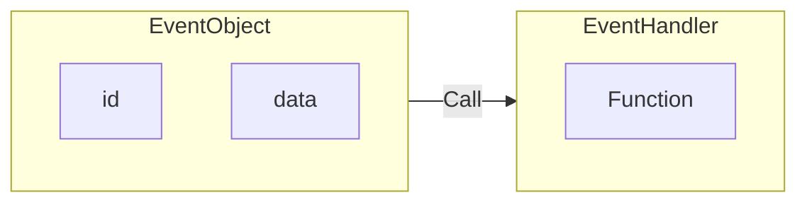
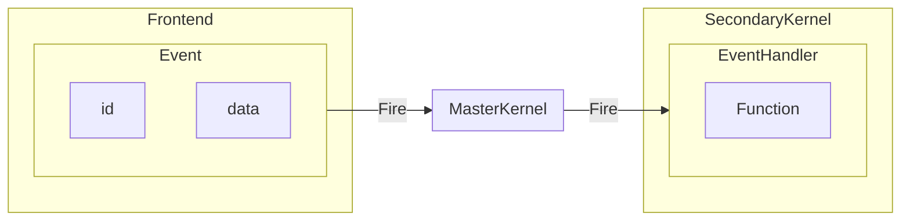
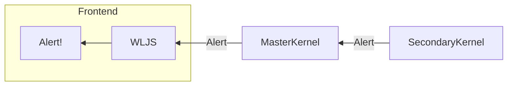

To support dynamics and two-ways data binding it relies on the event-based evaluation. For each asynchronous evaluation on the secondary kernel via Kernel API

- an event has to be fired by the frontend (browser)
- a direct request must be send by the frontend

### Event system
It uses a very simplified event system, where an event object has an id and the data inside. Each event object can be assigned only to the one handler



in the code anywhere one can use
```mathematica
event = EventObject[<|"id"->"uid"|>]
EventBind[event, Function[data,
	Print["Fired!"];
	Print[data]
]]
```
to fire an event one need to evaluate
```mathematica
EmittedEvent["uid", "Hello world"]
```

The trick is that one can substitute anything in-between 



on JS side (frontend) it looks like
```js
server.emitt('uid', data)
```

A slider, a button, an animation on the frontend __are a just event-generators__ with a fancy view boxes (see [Boxes](../Customizing%20IO/Boxes.md)).

#### A direct request by the frontend to the secondary kernel
On JS side it is possible to evaluate any arbitrary function on the secondary kernel by calling
```js
server.talkKernel('Print["Hi!"]')
```

#### How to reply back?
To make fire the chain backwards we rely on the direct communication between frontend and the secondary kernel. Secondary kernel is always aware, to which notebook it is connected. Then to execute any frontend function (see [[Frontend functions]]) one can call

```mathematica
FrontSubmit[ Alert["Hello World"] ];
```

ie.



One can transfer any arbitrary symbolic or non-symbolic data to it and even perform [[../Heterogenesis computation/Basics]] there. With some syntax sugar it provides a nice interface to interact with [[Frontend objects]].

### Promises
The given examples above are focused on the async evaluation and etc. But what if we need get some data from the master or secondary kernel and then, perform some calculations using that?

it uses `NotebookPromise` api together with JS's `promise` in a way like
```js
server.ask('1+1').then((result)=>{
	alert(result)
})

//or for thesecondary kernel
server.askKernel('1+1').then((result)=>{
	alert(result)
})
```

it allows you to write efficient async code with synchronous communication.