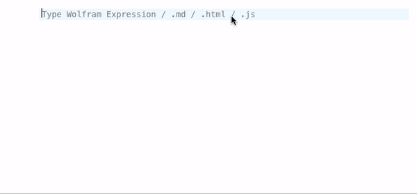
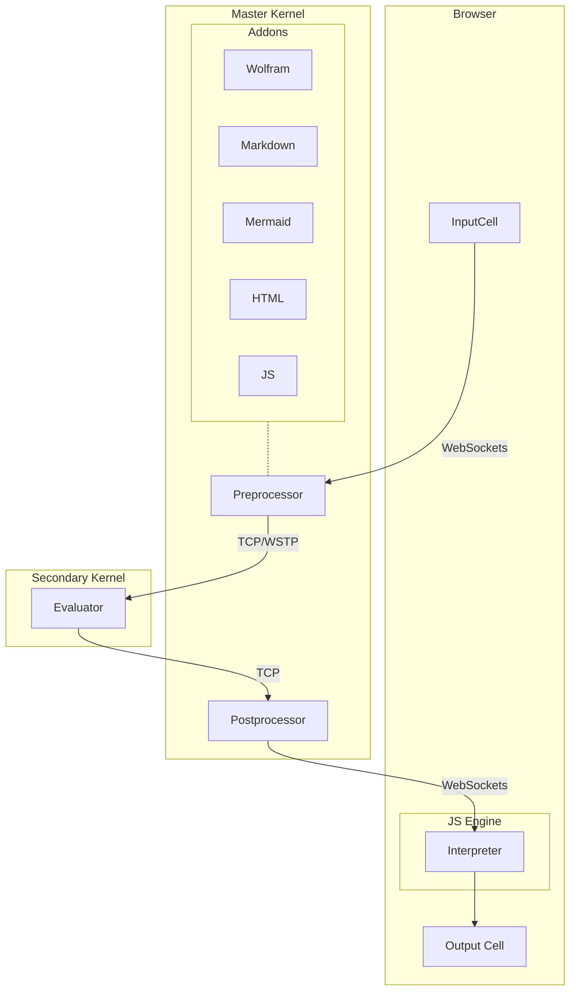
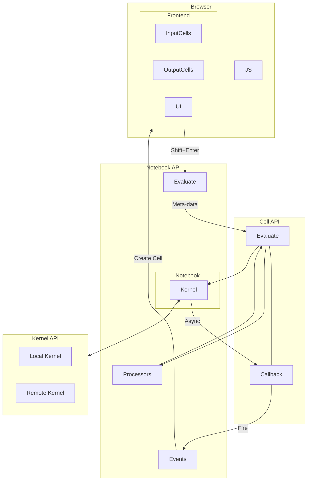
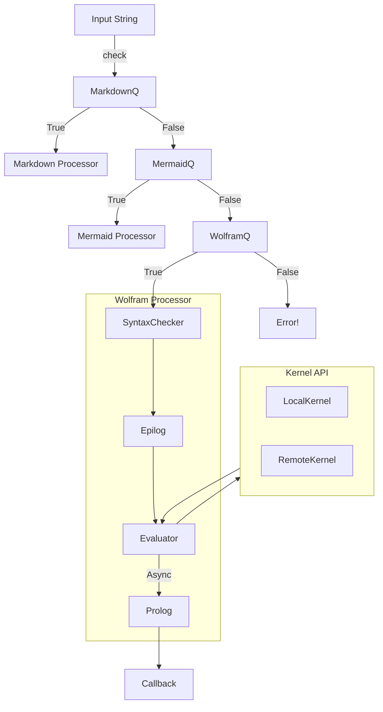
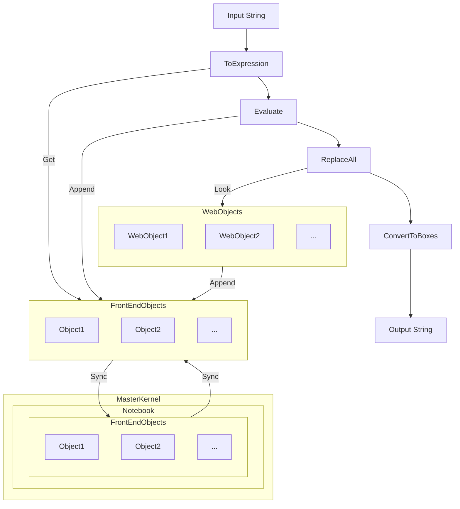

#### Editor in the browser
When you open an editor and __start typing__, the following happens
1. each character is send to a server and updates the cell (autosaving)
2. editor tries to figure out the language or a cell type 
3. considering (2) it changes the highlighting and autocomplete / other plugins

In this sense your input cell is __an ultimate tool__.



To specify the type it uses a prefix in the first line of the cell

```markdown
.md
# Hello
```

it can be anything `**.**` the behavior is defined by so-called [Processors](../Development/Making%20new%20cell%20types/Processors.md) (comes with a downloadable package).

Then whatever you typed, you should press `Shift-Enter` to make magic happens

### 1. WL Processing
JS sends the data via websockets to the server and sets the status of the cell to  `working`



#### Processing on Master Kernel
Firstly the preprocessing happens on the first master-kernel. 

All cells operations are performed via `Kernel/Cells` module under `Kernel/Notebook` wrapper



It applies all available processors to the input expression listed in `jsfn'Processors` . This is an example with Markdown language

```mathematica
{
	MarkdownQ -> <|"SyntaxChecker"->(True&), "Epilog"->(#&), "Prolog"->(#&), "Evaluator"->MarkdownProcessor |>,
}
```

The pipeline for `Processors` is following



Here evaluator function (`WolframProcessor`) can decide if it returns the result immediately or send to the evaluation to the secondary kernel with a callback included. Also it determines the final output cell subtype (wolfram, html, mermaid) see [Cell types](../Cell%20types/) to be interpreted by the frontend running in the browser.

#### Evaluation on the secondary kernel | Kernel API
The expression arrives in a form of string and then converts to the Wolfram Expression with a held head. See `Kernel/Evaluator`

To support fully [[Frontend Object]] it replace them with an actual wolfram expressions. If it is not available on the kernel it makes a query to the master kernel and download them.

All non-native boxes, decorations (see [Decorations](../Decorations.md) are replaced with the corresponding Wolfram Expressions.

The result evaluates normally. However if it encounters the creation function for [[Frontend Object]] or registered Frontend Objects (see [[Writting WebObject]]) like `Graphics`, `Plotly` it replaces them with `FrontEndExecutable` and stores the compressed to JSON data for them into the local storage to be shared lately with the master kernel and a notebook.

On the very last stage it converts the result to sort of `Boxes` (see [Decorations](../Decorations.md)).

If the resulting string is too long, then instead of a string it returns a pointer to the corresponding data to prevent frontend overloading



The result, created frontend objects, the cell type are shared via provided callback function with a master kernel. As well as syncs updated or created [[Frontend Object]] s.

### 2. JS Processing
Once the message is decoded by the frontend in your browser, it creates a cell and fetches the corresponding handler to display the result in a cell. 

For example, here the handler function for `markdown` ([Markdown](../Cell%20types/Markdown.md))

```js
class MarkdownCell {
	dispose() {}
	constructor(parent, data) {
		//parse markdown code and draw it to DOM element
		parent.element.innerHTML = marked.parse(data);
		return this;
	}
}
```

After that the user can see the content. It also takes care about syntax highlighting and anything else. This process is boosted by the server side rendering, i.e. the server also provides DOM template for the cell wrapper, controls, buttons (as much as possible) to release an extra load from the client.

:::info
Any action with a cell must be approved by the server via Notebook API functions. If you remove the cell or add a new one the client waits the server's reply for it. Therefore it makes sure that the data is synced perfectly.
:::