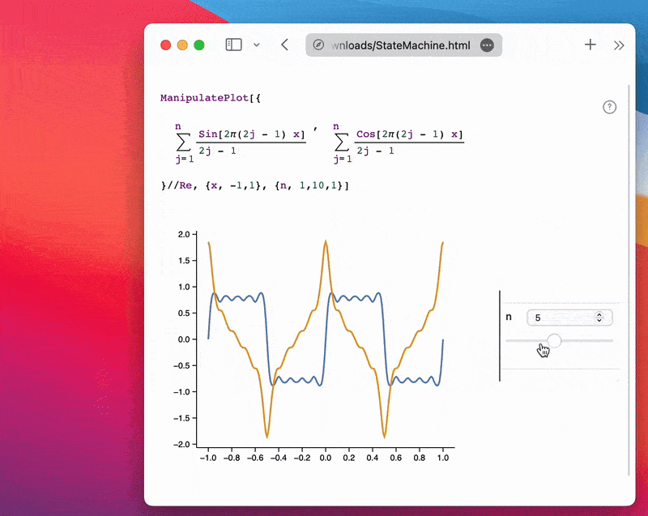

__A user doesn't need any app installed to interact with sliders in your notebook__

:::tip
Please read the manual carefully.
:::

This is a dynamic version of the [Static HTML](frontend/Exporting/Static%20HTML.md) exporter, designed to recreate the full interactivity of normal notebooks.


## Use Cases
- All use cases from [Static HTML](frontend/Exporting/Static%20HTML.md)
- Demonstration projects
- Live animations of physical processes
- Interactive presentations / lecture notes

## Demonstration 🚀
See what can be exported
- __[HTML Live](https://jerryi.github.io/wljs-demo/LiveHTML.html)__

## How It Works
To make the system more general and support features like [ManipulatePlot](frontend/Reference/Plotting%20Functions/ManipulatePlot.md), [Manipulate](frontend/Reference/GUI/Manipulate.md), combinations of [InputRange](frontend/Reference/GUI/InputRange.md), [InputButton](frontend/Reference/GUI/InputButton.md), [Offload](frontend/Reference/Interpreter/Offload.md), [FrontSubmit](frontend/Reference/Frontend%20IO/FrontSubmit.md), [EmitSound](frontend/Reference/Sound/EmitSound.md), and many more are abstracted from their controlling elements. The system purely analyzes events and symbol mutations.

> Your dynamic system must follow a *call and response* architecture. That means it must generate events (via user interaction or code) and produce a response (e.g., symbol mutation or [FrontSubmit](frontend/Reference/Frontend%20IO/FrontSubmit.md)).

:::note
**TL;DR:** We record calculated data for all possible combinations of input elements and store them in a large table. The missing values are interpolated using IDW method. See the [How to Use](#how-to-use) section.
:::

<details>

### Analysis

To analyze the bindings between input elements, symbols, and commands executed by the Wolfram Kernel, __we inject a spy into the evaluation kernel__ by modifying `DownValues` of WLJS I/O symbols. This captures symbol mutations triggered by external events and submitted commands like [FrontSubmit](frontend/Reference/Frontend%20IO/FrontSubmit.md) or [EmitSound](frontend/Reference/Sound/EmitSound.md). For instance, [PlotlyAnimate](frontend/Reference/Plotly/PlotlyAnimate.md) also uses [FrontSubmit](frontend/Reference/Frontend%20IO/FrontSubmit.md) and can be tracked.

After capturing all data, it's forwarded to samplers or virtual state machines.

### Processing
We use different processing techniques based on the use case, selected automatically. These are known as *Black Boxes* or virtual machines.

> Similar to airplane black boxes that record all data for post-crash analysis.

There are three types of virtual machines (automatically chosen) with fun names:

#### State Machine
This tracks system state based on input element combinations. It samples all possible states and dispatches the corresponding symbol mutations.

In the runtime it attempts to interpolate the missing values using:
1. **Inverse Distance Weighting (IDW)** in continuous feature space.
2. **Categorical conditioning:**
    It filters/selects neighbors based on matching **categorical values**, so interpolation is performed within semantically similar groups.
3. If the output is not a number of numeric tensor, it attempts to interpolate strings if they contain some number-like features and composes them back after.


#### Pavlov Machine
Like [Pavlov's Dog](https://en.wikipedia.org/wiki/Classical_conditioning), it doesn't track state but records *event → FrontSubmit* pairs.

#### Animation Machine
Detects series of symbol mutations from the same event, typically used for animations (e.g., via `AnimationFrameListener`). It tracks only abstract frame numbers.


</details>

## How to Use
Please follow the steps below:

### Prepare the Notebook
Connect to the Wolfram Kernel and evaluate your dynamics. Minimize the number of input elements and their states. For example, avoid 3 sliders ([InputRange](frontend/Reference/GUI/InputRange.md)) with 100 steps each. For [ManipulatePlot](frontend/Reference/Plotting%20Functions/ManipulatePlot.md), explicitly set `step` values. Limit the number and complexity of dynamic symbols.

:::ti[]
If you're recording an animation with [AnimationFrameListener](frontend/Reference/Graphics/AnimationFrameListener.md), start it __right before the next step__. Note: [`SetInterval`](frontend/Reference/Misc/Async.md#`SetInterval`) effects __are not captured__.
:::

Example using a single slider:

```mathematica
ManipulatePlot[{
  Sum[(Sin[2π(2j - 1) x])/(2j - 1), {j, 1, n}],
  Sum[(Cos[2π(2j - 1) x])/(2j - 1), {j, 1, n}]
} // Re, {x, -1, 1}, {n, 1, 10, 1}]
```

:::tip

Try to use a reasonable number of sliders and steps per slider. For example, `3` sliders with `100` steps each would result in `1,000,000` possible states to sample. If you skip too many steps, WLJS will attempt to interpolate between them in your HTML using the IDW (Inverse Distance Weighting) method.
:::

### Sniffing Phase
Click `Share` → `Dynamic Notebook` to begin recording. A widget will appear in the top-right corner.

:::info
If you're recording an animation, evaluate the cell and wait for your desired number of frames, then click `Continue` in the widget.
:::


Move each slider across its full range. This is necessary, as the sampling phase will only use values seen during sniffing.

:::tip
For multiple inputs (2–3 sliders), move each fully once. Cross-combinations are not needed—they will be resampled recursively automatically.
:::

### Sampling Phase (State Machine)
Now the system automatically samples all input combinations. This may take time, depending on state count and symbol complexity.


This is the final stage. Afterward, the notebook is exported with the collected data to your drive. Click `Continue`.

### Result
File sizes typically range from `7–20 MB`, or `3–15 MB` with `CDN` settings (see [Static HTML](frontend/Exporting/Static%20HTML.md)). The example above is just `165 kB` uncompressed and `50 kB` compressed.

The result is a fully interactive widget, working offline without an internet connection or the Wolfram Kernel ✨



:::note
This works with [Slides](frontend/Cell%20types/Slides.md) and [WLX](frontend/Cell%20types/WLX.md) cells too.
:::

## What Else Can Be Exported?
Here's a list of supported exports:

### State Machine
```mathematica
Manipulate[Series[Sin[x], {x, 0, n}], {n, 1, 10, 1}]
```

```mathematica
ManipulatePlot[f[w x], {x, -10, 10}, {w, 0, 10}, {f, {Sinc, Sin}}]
```

<details>
<summary>Video Tutorial</summary>

Slider and selection

import vid1 from './../../ManipualteExample2.mp4';

<video width="100%" controls>
  <source src={vid1}/>
</video>

Many sliders

import vid2 from './../../ManipualteExp1.mp4';

<video width="100%" controls>
  <source src={vid2}/>
</video>


</details>


Or custom dynamics:

```mathematica
radius = 1.0;
Graphics[{Hue[radius // Offload], Disk[{0, 0}, radius // Offload]}, ImageSize -> Small]

EventHandler[InputRange[0, 1, 0.1], (radius = #)&]
```

Or __continuous features__ on 2D canvas

```mathematica @
udata = {{-1,0}, {1,0}};

Graphics[{
  Cyan, Line[udata // Offload], Red, PointSize[0.05],
  EventHandler[Point[{0,0.5}], {
    "drag" -> ((udata = generate[#, 0.1])&)
  }]
}, PlotRange->{{-1,1}, {0,1}}, ImagePadding->None, Axes->{True, False}, ImageSize->Small]

ClearAll[generate];
generate[{x_, y_}, k_] := Table[{t, y Exp[- (*FB[*)(((*SpB[*)Power[(x - t)(*|*),(*|*)2](*]SpB*))(*,*)/(*,*)(2 k))(*]FB*)]}, {t,-1,1, 0.03}]
```

<details>
<summary>Video Tutorial</summary>

import Tutor3 from './../../Tutor3.mp4';

<video width="100%" controls>
  <source src={Tutor3}/>
</video>


</details>


Or continuous `Manipulate` 

```mathematica
Manipulate[Column[{
  Style[StringTemplate["`` m/s"][x], Blue],
  Table["🚗", {i, Floor[x/25]}]//Row 
}], {x,10,100}, ContinuousAction->True] // Quiet
```

<details>
<summary>Video Tutorial</summary>

import tutor5 from './../../tutor5.mp4';

<video width="100%" controls>
  <source src={tutor5}/>
</video>

</details>


:::note
The missing values will be interpolated using our own method:  **Categorical-Aware Inverse Distance Weighted Interpolation (IDW)** with support for **structured output decomposition and recomposition**.

That also means: more features you sample -- more accurate result will be reproduced for the continuously changing data.
:::


### Pavlov Machine
```mathematica
EventHandler[InputButton[], (Sound[SoundNote["C5"]] // EmitSound)&]
```

Even [Plotly](frontend/Reference/Plotly/Plotly.md):

```mathematica
p = Plotly[{<|
  "values" -> {19, 26, 10},
  "labels" -> {"Residential", "Non-Residential", "Utility"},
  "type" -> "pie"
|>}]

EventHandler[InputRange[0, 100, 10], PlotlyAnimate[p,   
  <|"data" -> {<|"values" -> {19, 26, #}|>},
    "traces" -> {0}
  |>, <||>]&
]
```

1. Click __Share__
2. Drag sliders / click buttons
3. Press continue

### Animation Machine
Example: balls falling down a staircase

```mathematica @
ballsteps = 
  NDSolve[{x''[t] == 0, y''[t] == -9.8, y[0] == 6, y'[0] == 0, 
    x[0] == 0, x'[0] == 1, a[0] == 5, 
    WhenEvent[Mod[x[t], 1] == 0, 
     If[a[t] > 0, a[t] -> a[t] - 1, "RemoveEvent"]], 
    WhenEvent[
     y[t] == a[t], {x'[t], y'[t]} -> .9 {x'[t], -y'[t]}]}, {x, y, 
    a}, {t, 0, 15}, DiscreteVariables -> {a}];
trajectory = {x, y} /. ballsteps[[1]];

staircase = 
 Plot[Clip[Floor[6 - x], {0, Infinity}], {x, -1, 15}, Filling -> 0, 
  Exclusions -> None];

Module[{
  frame = CreateUUID[],
  pos = {0.,0.},
  t = 0.
},
  EventHandler[frame, Function[Null,
    pos = #[t] &/@ trajectory;
    t = If[t >= 15.0, 0., t + 0.1];
  ]];

  Show[staircase, Graphics[{
    (*VB[*)(RGBColor[1, 0, 0])(*,*)(*"1:eJxTTMoPSmNkYGAoZgESHvk5KRCeGJAIcndyzs/JLwouTyxJzghJzS3ISSxJTWMGyXMgyRcxgMEHeyiDgQHOAAALpBNd"*)(*]VB*), Disk[pos // Offload, 0.12]
  }], Epilog->{
    AnimationFrameListener[pos // Offload, "Event"->frame]
  }]
]
```

<details>

<summary>Video Tutorial</summary>


import vid3 from './../../AnimateExample.mp4';

<video width="100%" controls>
  <source src={vid3}/>
</video>


</details>

An example with [Animate](frontend/Reference/GUI/Animate.md)

```mathematica
Animate[Row[{Sin[x], "==", Series[Sin[x], {x,0,n}], Invisible[1/2]}], {n, 1, 10, 1}, AnimationRate->3]
```


:::note
[AnimatePlot](frontend/Reference/Plotting%20Functions/AnimatePlot.md) does not need to be exported using dynamic HTML. It works with basic static as well.
:::

<details>

<summary>Video Tutorial</summary>


import vid4 from './../../Example with Animate.mp4';

<video width="100%" controls>
  <source src={vid4}/>
</video>


</details>


## Other Examples
Check out some interactive examples from our blog and demo projects:
- [TDS-THz in 10 lines](https://jerryi.github.io/wljs-docs/wljs-demo/mid-thz-tds/)
- [Why fitting raw data matters](https://jerryi.github.io/wljs-demo/fitting_tds_ppt.html)

