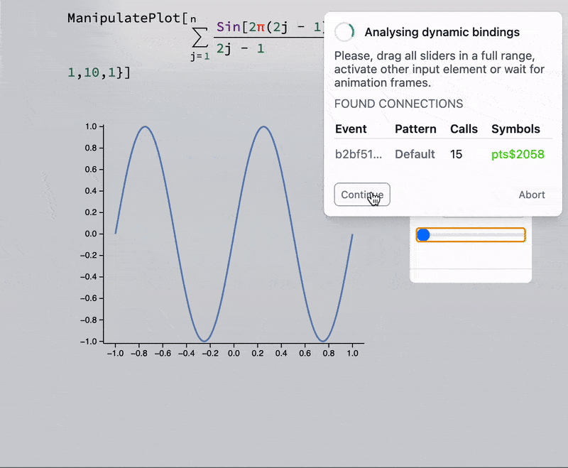

__A user does not need any app installed to drag some sliders on your notebook__

:::warning
This feature is quite experimental. Please, read the manual carefully
:::

This is a dynamic version of exporter [Static HTML](frontend/Exporting/Static%20HTML.md), which is aimed to recreate full interactivity of the normal notebooks


## Use cases
- All use cases of [Static HTML](frontend/Exporting/Static%20HTML.md)
- Demonstration project
- Live animation of some physical process

## How it works
It order to make the system more general and be able to capture the effects of [ManipulatePlot](frontend/Reference/Plotting%20Functions/ManipulatePlot.md), any combinations of [InputRange](frontend/Reference/GUI/InputRange.md), [InputButton](frontend/Reference/GUI/InputButton.md), [Offload](frontend/Reference/Interpreter/Offload.md) and many more it is abstracted by the design from the controlling elements and purely analyses the events and mutations of symbols.

> It requires the architecture of your dynamic system, which follows the principle of *call and response*, i.e. it must generate (by a user or automatically) an event from the input element or any other code on the frontend and then generate the corresponding response as a mutations of symbols used from the Wolfram Kernel.

:::note
TLDR; We record the calculated data for all possible combinations of input elements used and store it in a large table. See how to do this in [How to use](#How%20to%20use) section
:::

<details>

### Sniffer
All magic happens on the frontend in Javascript. The first stage it is to record all events fired by `server.kernel.io.fire` (see here [API](https://jerryi.github.io/wlx-docs/docs/Reference/Misc/WLJSTransport#server) reference), which is a part of ``JerryI`Misc`WLJS`Transport`` core package, that provides an easy interface between kernel [events system](frontend/Reference/Misc/Events.md) and Javascript together with symbols mutations. `.fire()` method __is used in all built-in input elements__ such as [InputRange](frontend/Reference/GUI/InputRange.md), [InputText](frontend/Reference/GUI/InputText.md), [InputJoystick](frontend/Reference/GUI/InputJoystick.md) (see an example on how to built your own in [Communication](frontend/Advanced/Javascript/Communication.md) guide) and even [AnimationFrameListener](frontend/Reference/Graphics3D/AnimationFrameListener.md). Symbols mutations are recorded only for ones wrapped in [Offload](frontend/Reference/Interpreter/Offload.md), which is a usual case scenario for any kind of [Dynamics](frontend/Dynamics.md) in WLJS Notebook


#### Analyser
Since Wolfram Engine is single threaded as well as Javascript, it is easy to spot a correlation between events and symbols mutations. For example let us have a look at the recorded time-series 

```
A 1 B 2 C 1 2
```

here `A`, `B`, `C` are some arbitrary event and `1`, `2` are symbols mutations. By analyzing this series it is easy to guess that the connections are following

- `A` mutates `1`
- `B` mutates `2`
- `C` mutates `1` and `2`

It also accounts for a possible delay and "noise" (rare events from other subsystems you don't want to include to your exported notebook) in computing, i.e.

```
A 1 B B B 2 2 2 V C 1 2 C C 1 2 1 2 A B 1 2
```

will also be processed correctly assuming you have enough sampled data. By also analyzing the payload of each call, system can make a guess

```
A 1 A 1 A 1 A 1 A 1 ... 20-60 times per second
```

if the payload of an event `A` is the same, then `1` is most likely a frame of some animation constructed using [AnimationFrameListener](frontend/Reference/Graphics/AnimationFrameListener.md). 

If we know from this data all connections and the range of values for each event, it will be enough to reproduce this behavior offline using look-up tables and state machines.

### Sampler
After all connections are known, the idea is to sample the data of symbol mutations using all combinations of events recursively. This is not the best solution, since having 1 checkbox and 2 sliders (with 10 positions for instance) already gives `200` sampling points. If an animation process is not detected, an automatic sampling will be applied starting from the current state of a system

```
*.emitt('A', 1)               //manually fire
                              //wait for 1
* mutation('1', {new data 1}) //collect
*.emitt('A', 2)               //manually fire
                              //wait for 1
* mutation('1', {new data 2}) //collect
...
*.emitt('B', 1)               //manually fire
                              //wait for 2
* mutation('2', {new data 1}) //collect
...
*.emitt('C', 1)               //manually fire
                              //wait for 1 & 2
* mutation('1', {new data 3}) //collect 
* mutation('2', {new data 3}) //collect 
...
```

After all data has been harvested, it is translated into a big hash map with each entity corresponding to single state of a system - sort of a loop-up table. The state is determined by the sum of hashes (fingerprints) of all fired events including the their payload


In this implementation it is impossible to mimic Markov chains or other systems with internal state and a history (hysteresis loops). 

Then a sampler compresses all data using `zlib` and packs it together with an exported notebook to a single HTML file including the supporting code for .

</details>
 
## How to use
Please follow the steps listed below 
### Prepare notebook
Connect to Wolfram Kernel, do normal evaluation of your dynamics. Try to minimize the number of input elements and their possible states. For example, do not put 3 slider ([InputRange](frontend/Reference/GUI/InputRange.md)) with 100 steps for each. If you use [ManipulatePlot](frontend/Reference/Plotting%20Functions/ManipulatePlot.md), specify explicitly `step` for your parameters. The same counts for number and size of used dynamic symbols.

:::note
If you record an animation constructed using [AnimationFrameListener](frontend/Reference/Graphics/AnimationFrameListener.md), start it __right before going to the next step__. Note, that the effects of [`SetInterval`](frontend/Reference/Misc/Async.md#`SetInterval`) as well as [FrontSubmit](frontend/Reference/Frontend%20IO/FrontSubmit.md) will not be recorded at all. 
:::

For example, we can try [ManipulatePlot](frontend/Reference/Plotting%20Functions/ManipulatePlot.md) for the simplicity

```mathematica @
ManipulatePlot[(*TB[*)Sum[(*|*)(*FB[*)((Sin[2\[Pi](2j - 1) x])(*,*)/(*,*)(2j - 1))(*]FB*)(*|*), {(*|*)j(*|*),(*|*)1(*|*),(*|*)n(*|*)}](*|*)(*1:eJxTTMoPSmNiYGAoZgMSwaW5TvkVmYwgPguQCCkqTQUAeAcHBQ==*)(*]TB*), {x, -1,1}, {n, 1,10,1}]
```

### Sniffing phase
Click `Share` and pick `Dynamic Notebook`, it will automatically initiate recording. A widget should appear in the top-right corner

:::info
If you record an animation. Just evaluate the corresponding cell and wait number of frames you want to be recorded, then click `Continue` on the widget
:::


Now drag a slider in all ranges. It is important to cover all positions of it, since while sampling phase it will only use values it had during [Sniffing phase](#Sniffing%20phase).

:::tip
If you have multiple input elements (2, 3 sliders). Drag each individually in full range __one time__. Cross combinations are not necessary, since they will be sampled automatically recursively on the next stage by the system.
:::


Now you see found connections between symbols and events. Their names do not manner, since it is autogenerated by [ManipulatePlot](frontend/Reference/Plotting%20Functions/ManipulatePlot.md). Make sure they become __green__, which means a good confidence in the corresponding bond. 

### Sampling phase
Now it samples all combinations automatically, it might take some time depending on how complex your calculations



This is the last stage. On the next step it will export your notebook with this data to your drive. Click `Continue`

### Result
Depending on how many sampling points you have, the average file size is about `7-20` Mb and `3-15` Mb of you set `CDN` in the settings (see [Static HTML](frontend/Exporting/Static%20HTML.md)). An example above costs only `165` kB uncompressed and `50` kB compressed data.

The result is fully interactive widget working offline without internet connection and any Wolfram Kernel ✨


## Examples
See some interactive examples from __our blog page__ and demonstration project
- [TDS-THz in 10 lines](https://jerryi.github.io/wljs-docs/wljs-demo/mid-thz-tds/)
- [Why fitting the raw data is so important](https://jerryi.github.io/wljs-demo/fitting_tds_ppt.html)

