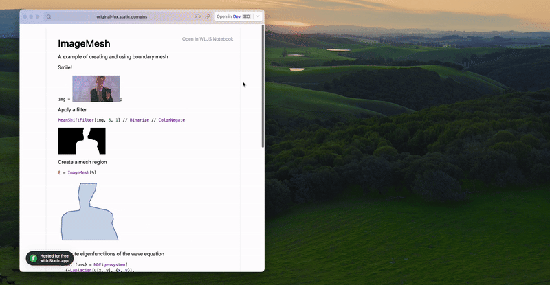

__Open in WLJS Notebook any published note in a click__

If you use WLJS Notebook in a form of a desktop application, it registers a custom *url-protocol* allowing to import notebooks exported to [Static HTML](frontend/Exporting/Static%20HTML.md) 

What it does, it downloads a web-page (even if you open it locally) to a temporal directory and then converts it back to a normal notebook.

