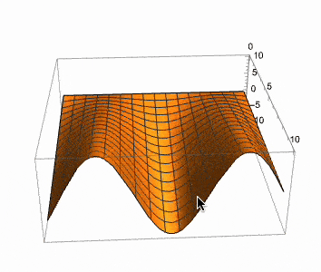
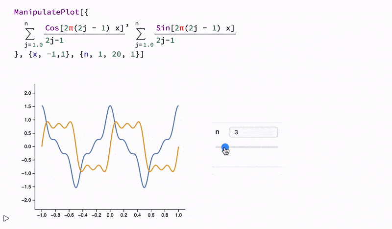
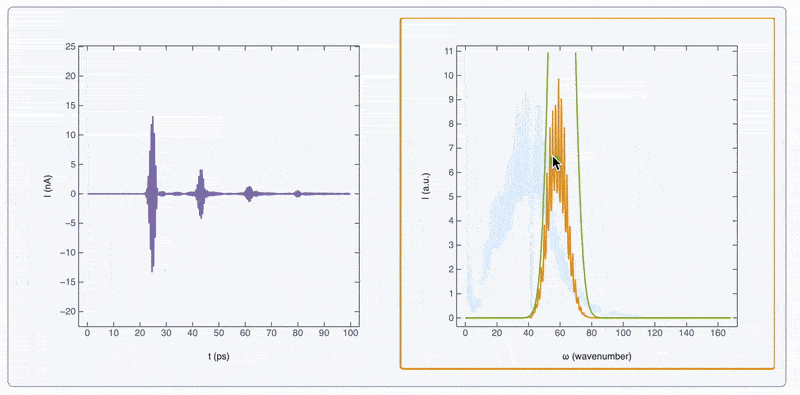
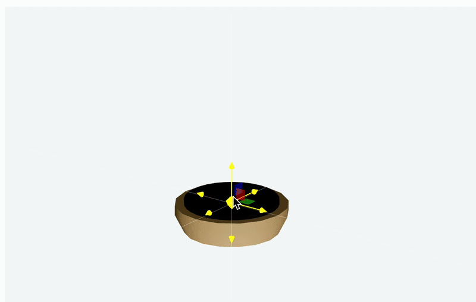

The notebook combines live code in Wolfram, Javascript  and others. We provide GUI building blocks for user input, KaTeX for equations, Markdown for narrative text and presentations. Think about it as a computations platform for research or a powerful sandbox, where you can try out your ideas, write a story about it alongside and then publish it somewhere on web. 

WLJS Notebook is **free software** based on the [Wolfram Engine](https://www.wolfram.com/engine/) and open-source technologies.

The graphical interface is built using web-technologies and is powered by [WebServer](https://github.com/KirillBelovTest/HTTPHandler) and [WLX](https://jerryi.github.io/wlx-docs/). This means you can do both: use as a normal desktop app or run it on a remote machine and operate via browser (see how in the [instruction guide](frontend/instruction.md)).

<details>
<summary>Technical details</summary>

Some computations are partially performed by your browser, and you can [control this behavior](frontend/Dynamics.md) if desired. All UI elements, cell and interactivity in the notebook are operated by WLJS Interpreter.

> **WLJS Interpreter** is a tiny (3 kB) Wolfram Language interpreter that runs in the browser, written in vanilla JavaScript. It fully integrates the JavaScript environment with the Wolfram Language backend. We'll also refer to this as the *frontend* or *browser*.

</details>


A notebook follows a mostly flat structure __similar to Jupyter Notebook__. Only input and output cell pairs are grouped together. You can freely edit, copy, and reevaluate any output expression in place. 

[__See live example__](https://jerryi.github.io/wljs-docs/wljs-demo/intro-notebook/)


## Is it like an open-source Mathematica? 🐺
If you're familiar with the Wolfram Language, you'll feel at home using WLJS Notebook. Notably:

- Output cells are editable and valid for evaluation
- Support for syntax sugar (fractions, powers, etc.)
- Support for [Graphics](frontend/Reference/Graphics/Graphics.md), [Graphics3D](frontend/Reference/Graphics3D/Graphics3D.md), [Sound](frontend/Reference/Sound/Sound.md), [Video](frontend/Reference/Video/Video.md), and more interactive content
- Most [plotting functions](https://jerryi.github.io/wljs-docs/wljs-demo/plot-1d) are supported (see [Reference](frontend/Reference/Reference.md))
- Compatible with standard Wolfram Packages and Paclets
- Support for resource functions and [neural networks](https://jerryi.github.io/wljs-docs/wljs-demo/neuralnet-1)
- [Formatting options](https://jerryi.github.io/wljs-docs/wljs-demo/intro-mathinput/) (a bit more limited compared to MMA)
- [Dynamics](frontend/Dynamics.md) and interactivity out of the box: [Manipulate](frontend/Reference/GUI/Manipulate.md), and etc.

### Can it open .nb files?
__Yes!__ There are [some limitations](frontend/Importing/Mathematica.md) regarding complex styling / formatting of the text, and dynamic modules (see below). But we gradually improve the compatibility with every update. 

### What differs or missing?

- Limited text formatting support (see Decorations in [Reference](frontend/Reference/Reference.md))
- We rely on a different low-level [dynamics](frontend/Dynamics.md) implementation, that prioritizes speed and fine-grained control over updates
- No `DynamicModule`, `Slider`, or `Button` — instead: [InputRange](frontend/Reference/GUI/InputRange.md), [InputButton](frontend/Reference/GUI/InputButton.md)
- Flat notebook structure
- Markdown is the main language for text cells ([Markdown](frontend/Cell%20types/Markdown.md))
- No evaluation history (only the last output is preserved)
- Not all graphics primitives are implemented (but we are gradually improving)

:::tip
If something does not look like as it should, try [MMAView](frontend/Reference/GUI/MMAView.md) wrapper

```mathematica
With[{p = Plot3D[f[x] y, {x,0,10}, {y,0,10}]},
  MMAView[p]
]
```



:::

## Why not Jupyter Lab?
We chose to build our own system because:
- A Jupyter kernel for Wolfram Engine already exists
- We wanted powerful syntax sugar, editable output cells, __multimedia__ cells — which require a custom code editor
- *Jupyter Frontend - Kernel* interface is quite robust, but it doesn't meet our needs for a low-latency communication with text and binary large payloads
- Adding a 3rd language or API would increase long-term maintenance

## UI Overview

### Cell Control Buttons
All cells are grouped under a parent input cell. Other than that, the notebook structure is flat. Control buttons apply to the entire group:


From left to right:
- Add new cell below
- Hide input cell
- Evaluate (also via `Shift+Enter`)
- More options

The last button expands into:


"Project to a window" is a particularly useful feature that lets you evaluate a cell in a new window. This is especially helpful when presenting [slides](frontend/Advanced/Slides/Slides.md).

### Shortcuts
*Works in both browser and desktop app versions*

#### UI Shortcuts
- `Ctrl+S`, `Cmd+S`: Save notebook
- `Alt+.`, `Cmd+.`: Abort evaluation
- `Ctrl+P`, `Cmd+P`: Open command palette
- `Shift+Enter`: Evaluate current cell
- `Ctrl/Cmd+F`: Search within the focused cell
- `Shift+Alt+Space`: Overlay window (Desktop App only)

#### Cell Editing
- `Ctrl+W`, `Cmd+2`: Hide/show input cell
- `Ctrl+/`: Create fraction from selection
- `Ctrl+6`: Superscript
- `Ctrl+2`: Square root
- `Ctrl+-`: Subscript
- `Alt/Cmd+/`: Comment a line

See __more keybindings__ in the [Input Cell](frontend/Cell%20types/Input%20cell.md) reference.

## Wolfram Language
When you start typing, the editor assumes you're using the Wolfram Language. If you are not familiar with it, please, have a look at [Wolfram Language](frontend/Wolfram%20Language.md) page. Press `Shift+Enter` (or click the play button) to evaluate.


Output cells are joined to the input. You can hide the output by clicking the arrow `→` to the left of the cell.

:::note
Once you modify the output cell, it becomes a new input cell—just like in Mathematica.
:::

Syntax sugar for fractions and 2D input is fully supported.


Useful shortcuts include:
- `Ctrl+/`: Fraction
- `Ctrl+^`: Power
- `Ctrl+-`: Subscript
- `Ctrl+2`: Square root
- `Ctrl+=`: Semantic interpretation 

Or use the special toolbar (snippet palette):


## Command Palette

:::tip
Learn more: [Command Palette](frontend/Command%20palette.md)
:::

Use `Cmd+P` / `Ctrl+P` to access useful tools like matrix builders, color pickers, and more.


Snippets are just special notebooks with built-in UI elements.

## Editor of Power
A single input cell can output:
- Wolfram Language results
- An HTML page
- A JavaScript code (DOM element)
- A slide in a presentation
- and [Many more](frontend/Cell%20types/Many%20more.md)


You can even draw inside the code editor:


## WLJS Bar
If the WLJS App is running (tray or regular), press `Shift+Alt+Space` for quick input access.


More: [WLJS Bar](frontend/Advanced/Overlay%20mode.md)

## Graphics 2D & 3D
Most Mathematica plotting functions produce low-level primitives. Most of them are supported here:

<Wl>{`ExampleData[{"Geometry3D","KleinBottle"}]`}</Wl>

:::info
Try dragging and panning with your mouse!
:::


## Powered by SVG and WebGL
We optimized every inch on a low-level to achieve the maximum performance:










## Portability
Need to share your notes? You have several options:

1. Export the entire notebook as a web page: [Static HTML](frontend/Exporting/Static%20HTML.md) or [Dynamic HTML](frontend/Exporting/Dynamic%20HTML.md)
2. Export individual figures: [Figures](frontend/Exporting/Figures.md)
3. Make a presentation: [Static Slides](frontend/Exporting/Static%20Slides.md)


**No internet dependency** — it works offline and will remain functional even after future updates. You can always re-import the exported notebook. Ideal for sharing notes or publishing on a blog.

__No external programms or plugins__ - just your browser.

<details>

<summary>Why HTML is the best?</summary>

<iframe width="315" height="560" src="https://youtube.com/embed/vTrVGam84m8" title="YouTube video player" frameborder="0" allow="accelerometer; autoplay; clipboard-write; encrypted-media; gyroscope; picture-in-picture; web-share" allowfullscreen></iframe>


</details>


## Other Languages
Need annotations? No need to switch cell types. Just type `.md` on the first line of a cell to enable Markdown.


Click the arrow on the right to hide the source — only the output will be shown. The editor is flexible enough to support custom output cells too.

You can also mix WL and JavaScript to create stunning visualizations:


### First class support:

- [JavaScript](frontend/Cell%20types/Javascript.md)
- [Markdown](frontend/Exporting/Markdown.md)
- [Slides](frontend/Cell%20types/Slides.md)
- [WLX](frontend/Cell%20types/WLX.md)
- [Files](frontend/Cell%20types/Files.md)
- [HTML](frontend/Cell%20types/HTML.md)
- [More](frontend/Cell%20types/Many%20more.md) (e.g. Mermaid)

## Debugger
Access via the command palette.


More: [Debugger](frontend/Advanced/Command%20palette/Debugger.md)

## AI Copilot
We won't force you to use it, it is fully optional and we do not have any profit from it. See more if you are interested at [AI Assistant](frontend/Advanced/Command%20palette/AI%20Assistant.md)

<details>

<summary>Quick overview</summary>

<iframe width="315" height="560" src="https://youtube.com/embed/wenBdDRpD4g?si=bB5h28zAHb7r6Nmh" title="YouTube video player" frameborder="0" allow="accelerometer; autoplay; clipboard-write; encrypted-media; gyroscope; picture-in-picture; web-share" allowfullscreen></iframe>

<iframe width="315" height="560" src="https://youtube.com/embed/pXe1mSir47Q?si=UTclXIdPiB3HydPI" title="YouTube video player" frameborder="0" allow="accelerometer; autoplay; clipboard-write; encrypted-media; gyroscope; picture-in-picture; web-share" allowfullscreen></iframe>


</details>