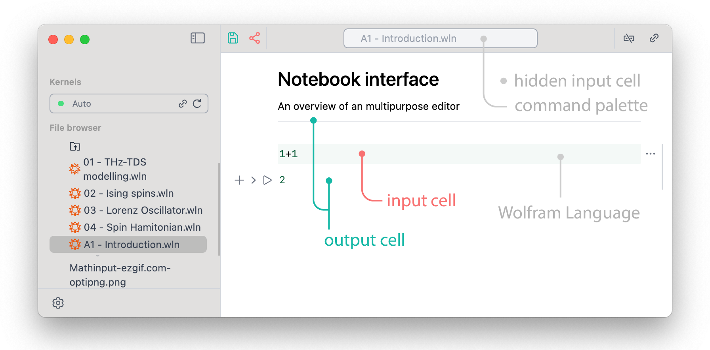
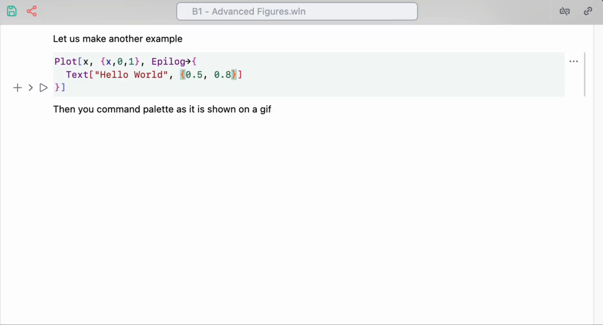
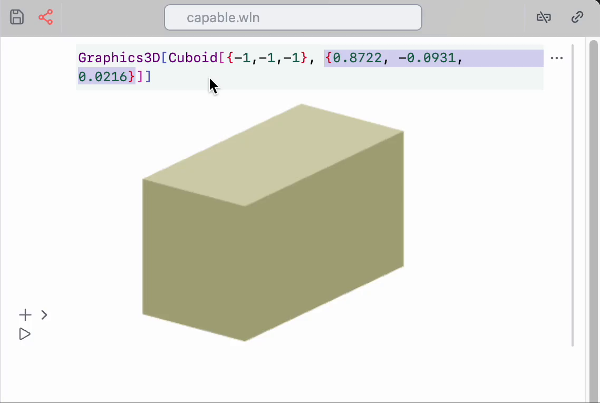
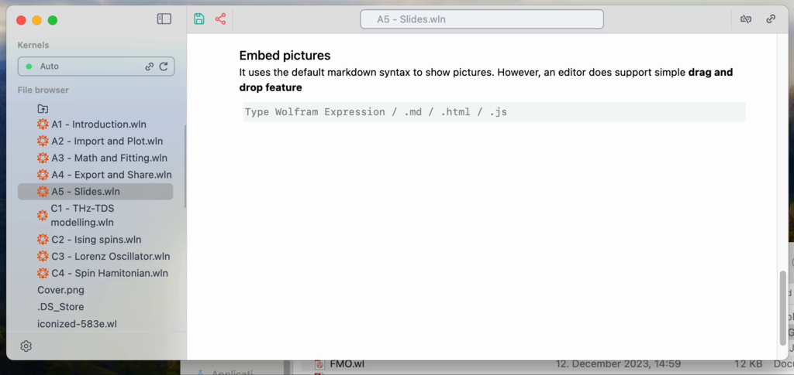
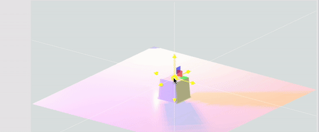
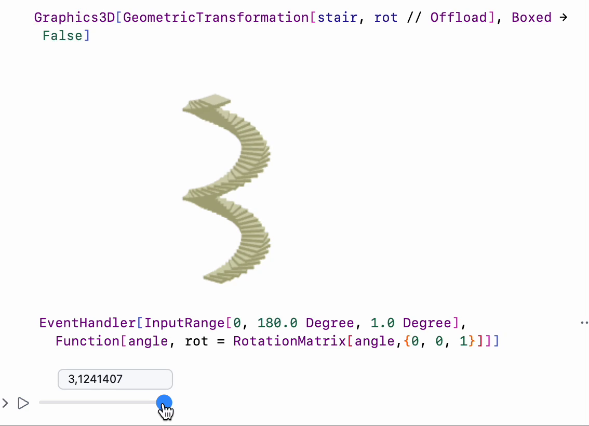
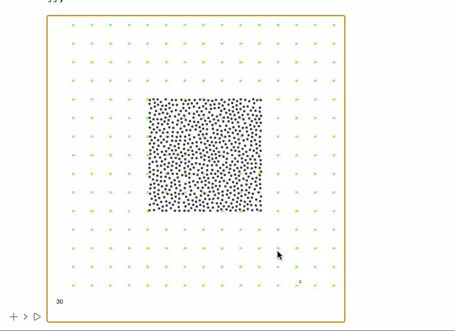
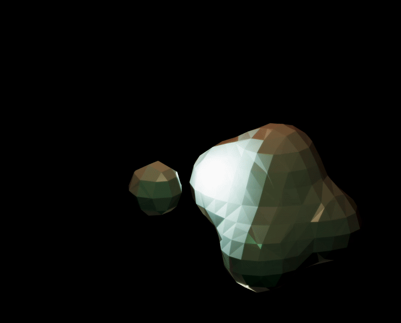
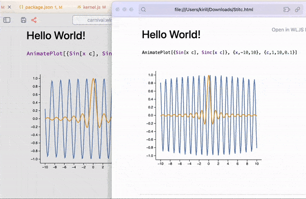
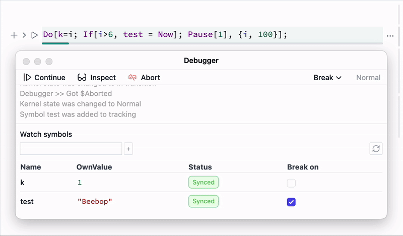

The whole notebook interface is made using plain Javascript, HTML powered by a [Wolfram WebServer](https://github.com/KirillBelovTest/HTTPHandler)  and [WLX](https://jerryi.github.io/wlx-docs/) running locally on a Wolfram Kernel. It means you can work remotely __by running a server anywhere you want__ (see how at [instruction](frontend/instruction.md)).

Some calculations are performed partially by your browser, you can have a control over it, [if you want](frontend/Dynamics.md). All UI elements, cells operations are written in Javascript and Wolfram Language and performed by WLJS Interpreter

> **WLJS Interpreter** is a tiny (3 kB) Wolfram Language Interpreter running in a browser and written in vanilla Javascript. It fully interconnects Javascript world with Wolfram Language on the server (backend). We will also reference it as *frontend*. 

:::info
Compared to Mathematica the cell design has mostly flat structure similar to Jupyter Notebook. Only `input` and `output` cells are joined into groups. 
:::

Output cells are editable. We do not separate them explicitly unlike in Mathematica or Jupyter, since the whole document is a **notebook**, notebooks do not have inputs and outputs. You can freely edit, copy, reevaluate in place any output expression. Therefore we distinguish them only formally.

[__See live example__](https://jerryi.github.io/wljs-docs/wljs-demo/intro-notebook/)

### Cell control buttons
All cells are grouped by parent input cell, apart from that the structure of the notebook is flat. The controls are applied to the whole group

From left to right
- add new cell below
- hide an input cell
- evaluate (also `Shift+Enter` combo)
- more

The last options expands into

Project to a window is the most interesting feature here, that allows to evaluate a cell in a new window. It comes handy while demonstrating [presentations](frontend/Advanced/Slides/Slides.md).

### Shortcuts
*working in both: browser and desktop application*
#### UI
- `Ctrl+S`, `Cmd+S` save notebook
- `Alt+.`, `Cmd+.` abort evaluation
- `Ctrl+P`, `Cmd+P` open command palette
- `Shift+Enter` evaluate current cell
- `Ctrl/Cmd + f` search in the focused cell
- `Shift + Alt + Space` overlay window (Desktop App only)

#### Cells
- `Ctrl+W`, `Cmd+2` hide/show input cell
- `Ctrl+/` make fraction on selected
- `Ctrl+6` make superscript on selected
- `Ctrl+2` make square root on selected
- `Ctrl+-` make subscript on selected
- `Alt/Cmd+/` comment a line

See __more keybindings__ in [Input cell](frontend/Cell%20types/Input%20cell.md)

## Wolfram Language
When you start typing the language you are using assumed to be WL. By pressing `Shift+Enter` (or play button) you can start evaluation

Output cells are joined to the input and the last one can be hidden by clicking on the $\rightarrow$ sign on the left side from the cell.

:::note
Once you change something inside the output cell, it loses its formal parent and becomes new input cell, like in Mathematica.
:::

Syntax sugar, fractions and other 2D input are supported 

The most useful commands are listed below

- `Ctrl`+`/` fraction
- `Ctrl`+`^` power
- `Ctrl`+`-` subscript
- `Ctrl`+`2` square root

Or using a special toolbar (snippet)

Now let us move to some other gems

## What differs from Mathematica
If you are familiar with Wolfram Language, it will be easier to use WLJS Notebook. Output cells are also editable (unlike in Jupyter-like interfaces), syntax sugar for math-expressions, graphics and other objects is full supported. Here is a full list 

- 2D math input (using shortcuts or command palette)
- [Graphics](frontend/Reference/Graphics/Graphics.md), [Graphics3D](frontend/Reference/Graphics3D/Graphics3D.md), [Sound](frontend/Reference/Sound/Sound.md), [Video](frontend/Reference/Video/Video.md) and etc
- Most [plotting functions](https://jerryi.github.io/wljs-docs/wljs-demo/plot-1d) (tested are presented in [Reference](frontend/Reference/Reference.md))
- Standard Wolfram Packages / Paclets
- Resource functions
- [Neural networks](https://jerryi.github.io/wljs-docs/wljs-demo/neuralnet-1)
- [Formatting options](https://jerryi.github.io/wljs-docs/wljs-demo/intro-mathinput/) (limited)

We partially support [Mathematica](frontend/Importing/Mathematica.md) notebook format. However, you should consider the differences

- Limited support for formatting (see available Decorations section in [Reference](frontend/Reference/Reference.md))
- Different [dynamics](frontend/Dynamics.md) implementation
- No `DynamicModule`, no `Slider`, no `Button`. Instead use [InputRange](frontend/Reference/GUI/InputRange.md), [InputButton](frontend/Reference/GUI/InputButton.md)
- Flat notebook structure
- Markdown is a main language for text cells (see [Markdown](frontend/Cell%20types/Markdown.md))
- No extended evaluation history (only last output)
- Not all graphics primitives are implemented, some plotting functions might not work

See *Advanced* section for more information.

## Command palette

:::tip
See more here [Command palette](frontend/Command%20palette.md)
:::

To help in writing matrixes, colors, and some other useful stuff are accessible by the shortcut `Super/Cmd`+`P`

All snippets are just special kind of notebooks including all UI elements.

## Editor of Power
A single input cell can produce Wolfram Language output, HTML page, Javascript window or a slide of a presentation

Or just draw something inside the code editor

## Overlay mode
While running WLJS App (in a tray or normally) press `Shift+Alt+Space` to get quick access to WLJS input cell

See more in [Overlay mode](frontend/Advanced/Overlay%20mode.md)

## Graphics 2D & 3D
Most Mathematica's plotting functions produces lower-level primitives. The major part of them are supported

<Wl >{`ExampleData[{"Geometry3D","KleinBottle"}]`}</Wl>

:::info
Try to drag and pan using your mouse!
:::

:::note
Graphics elements are not exported SVG. All primitives are recreated using d3.js and THREE.js from scratch
:::

## Realtime calculations

__Dynamics? We have a lot of it__

__Or may be even fluid simulation?__

### Short videos

<iframe width="315" height="560"
src="https://youtube.com/embed/ItXbjNtGlew?si=enz0K6jAu2xv5hAK"
title="YouTube video player"
frameborder="0"
allow="accelerometer; autoplay; clipboard-write; encrypted-media; gyroscope; picture-in-picture; web-share"
allowfullscreen></iframe>

### 3D Graphics using WebGL

## Portability
You will probably need to share your notes with someone. Here we have a bunch of options:

1. Export entire notebook as a web-page [Static HTML](frontend/Exporting/Static%20HTML.md), [Dynamic HTML](frontend/Exporting/Dynamic%20HTML.md) 
2. Export individual figures [Figures](frontend/Exporting/Figures.md)
3. Make a presentation [Slides](frontend/Exporting/Slides.md)

**No internet dependency, it will work permanently and will not be broken by any update in the future** You can always convert back the exported notebook if needed, which is perfect if you want to share your notes on your personal blog.

## Other languages
Of course the notebook interface is impossible to use without text annotation, here you do not need to switch to a different cell type. To use you favorite (or not) Markdown type in the first line of a cell `.md` and magic happens

By clicking on an arrow on the right, you can hide the source cell and only the output will be displayed. An editor is very flexible you can quite easily add your custom output cell support. 

Or combine WL together with Javascript to visualize your data in incredible way

The core plugins provides the following cells

- [Javascript](frontend/Cell%20types/Javascript.md)
- [Markdown](frontend/Exporting/Markdown.md)
- [Slides](frontend/Reference/Slides/Slides.md)
- [WLX](frontend/Cell%20types/WLX.md)
- [Files](frontend/Cell%20types/Files.md)
- [HTML](frontend/Cell%20types/HTML.md)
- [Many more](frontend/Cell%20types/Many%20more.md) (Mermaid)

## Debugger
It also available from the command palette

See more [Debugger](frontend/Advanced/Command%20palette/Debugger.md) here.

## AI Copilot
See it in action there [AI Assistant](frontend/Advanced/Command%20palette/AI%20Assistant.md)

<iframe width="315" height="560"
src="https://youtube.com/embed/wenBdDRpD4g?si=bB5h28zAHb7r6Nmh"
title="YouTube video player"
frameborder="0"
allow="accelerometer; autoplay; clipboard-write; encrypted-media; gyroscope; picture-in-picture; web-share"
allowfullscreen></iframe>

<iframe width="315" height="560"
src="https://youtube.com/embed/pXe1mSir47Q?si=UTclXIdPiB3HydPI"
title="YouTube video player"
frameborder="0"
allow="accelerometer; autoplay; clipboard-write; encrypted-media; gyroscope; picture-in-picture; web-share"
allowfullscreen></iframe>

