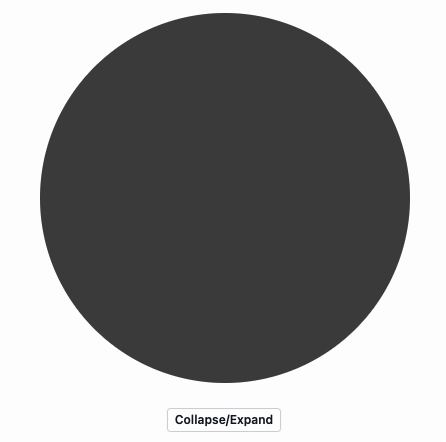

---
env:
  - Wolfram Kernel
package: wljs-editor
---
```mathematica
Labeled[expr_, lbl_, pos_:Bottom]
```

displays `expr` labeled with `lbl` at `pos`

## Options
The same as for [Style](frontend/Reference/Formatting/Style.md)

## Examples

Simple box with a label centered at the bottom
```mathematica
Labeled[Framed[{a, b, c, d}], lbl]
```

```mathematica @
(*GB[*){{(*BB[*)((*BB[*)({a,b,c,d})(*,*)(*"1:eJxTTMoPSmNkYGAoZgESHvk5KRAeB5BwK0rMTXXKr0hjgskHleakFvMAGcElRZkF/nmeeQWlJcWsILWJOcWpAG8uEdg="*)(*]BB*))(*,*)(*"1:eJxTTMoPSmNkYGAoZgESHvk5KRAeO5DwT0vLyU9MSWOCCQQk5qU65VdABEDqg0pzUos5gQzHnMz0vNzUvBKEnE9mcUkxG5DhDBROLSrmADKdEotTczLzUtFMEECSCsgvzizJzM9DUQ8Ap40nag=="*)(*]BB*)(*VB[*)(**)(*,*)(*"1:eJxTTMoPSmNkYGAoZgESHvk5KRAeO5DwLEnNdcqvSGOCSQeV5qQWCwAZLqlpiaU5JU6JxanBJZU5qcEg5T6JSak5qSkAy0sTkQ=="*)(*]VB*)}(*||*),(*||*){lbl(*VB[*)(**)(*,*)(*"1:eJxTTMoPSmNkYGAoZgESHvk5KRAeO5DwLEnNdcqvSGOCSQeV5qQWCwAZLqlpiaU5JU6JxanBJZU5qcE8QEGfxKTUnNQUMAUAMtsVdg=="*)(*]VB*)}}(*]GB*)
```

Label at the right

```mathematica
Labeled[Framed[{a, b, c, d}], lbl, Right]
```

```mathematica @
(*GB[*){{(*BB[*)((*BB[*)({a,b,c,d})(*,*)(*"1:eJxTTMoPSmNkYGAoZgESHvk5KRAeB5BwK0rMTXXKr0hjgskHleakFvMAGcElRZkF/nmeeQWlJcWsILWJOcWpAG8uEdg="*)(*]BB*))(*,*)(*"1:eJxTTMoPSmNkYGAoZgESHvk5KRAeO5DwT0vLyU9MSWOCCQQk5qU65VdABEDqg0pzUos5gQzHnMz0vNzUvBKEnE9mcUkxG5DhDBROLSrmADKdEotTczLzUtFMEECSCsgvzizJzM9DUQ8Ap40nag=="*)(*]BB*)(*VB[*)(**)(*,*)(*"1:eJxTTMoPSmNkYGAoZgESHvk5KRAeO5DwLEnNdcqvSGOCSQeV5qQWCwAZLqlpiaU5JU6JxanBJZU5qcEg5T6JSak5qSkAy0sTkQ=="*)(*]VB*)(*|*),(*|*)lbl(*VB[*)(**)(*,*)(*"1:eJxTTMoPSmNkYGAoZgESHvk5KRAeO5DwLEnNdcqvSGOCSQeV5qQWCwAZLqlpiaU5JU6JxanBJZU5qcE8QEGfxKTUnNQUMAUAMtsVdg=="*)(*]VB*)}}(*]GB*)
```

Dynamic example with [InputButton](frontend/Reference/GUI/InputButton.md)

```mathematica
Module[{radius = 10.0}, 
  Labeled[Graphics[Disk[{0,0}, radius // Offload], 
    TransitionDuration->500, ImagePadding->None
  ], EventHandler[InputButton["Collapse/Expand"], Function[state, radius = 1.0/radius]], Background->Yellow] 
]
```



## Supported output forms
- [StandardForm](frontend/Reference/Formatting/StandardForm.md)
- [WLXForm](frontend/Reference/Formatting/WLXForm.md)
