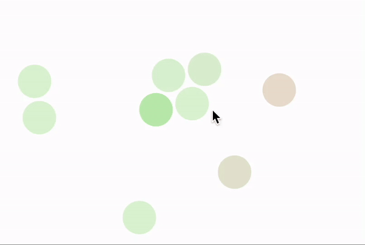
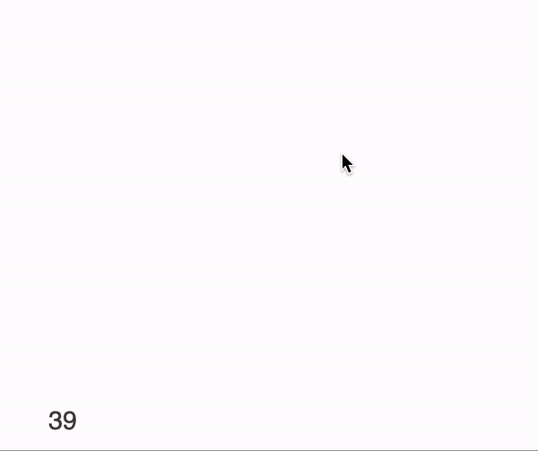

---
env:
  - Wolfram Kernel
package: wljs-editor

---

:::warning
Experimental feature. API might be changed in the future
:::

A OOP-like abstraction for managing and manipulating graphical or any dynamic [frontend instances](frontend/Advanced/Frontend%20interpretation/WLJS%20Functions.md) efficiently and process them in batch. The idea is to use proxy objects as lightweight references to groups of instances (like rectangles, circles combined with other primitives) in a larger scene. 

All properties of proxies are stored in linear auto-sizable buffers, which allows JIT-enabled processing and easy sync with a frontend (single transaction).

## Constructor
Creates a new proxy type

```mathematica
FrontProxy[{properties__}, body_] _FrontProxyFunction
```

or if you want to specify mutable properties explicitly

```mathematica
FrontProxy[{properties__}, body_, {mutable__}] _FrontProxyFunction
```

For example to make proxy for many [Disk](frontend/Reference/Graphics/Disk.md)s with controllable opacity, color and position

```mathematica
disk = FrontProxy[{pos, c}, {
	Opacity[c], RGBColor[With[{h=c}, {h, 1-h, 0.}]],
    Disk[pos, 0.1]
}];
```


## Instancing
After creating a `FrontProxyFunction` you can start to create your proxies. There are two ways on how to do that

### As an object
This is more user-friendly approach, you can directly use `FrontProxyFunction` and provide arguments as down-values

```mathematica
_FrontProxyFunction [args__] _FrontProxyObject
```

Each argument from `args` will be assigned to the defined `properties__` in the same order as they appears in the constructor.

For example

```mathematica
disks = Table[disk[RandomReal[{-1,1}, 2], 0.2], {10}]
```

this line will create 10 random disks proxies.


#### Methods
With those object you can do following things
##### `Show`
Reveals the structure of the instance behind the proxy

```mathematica
Show[__FrontProxyObject] _List
```

It is usually used to dynamically add new objects on the graphical scene using [FrontSubmit](frontend/Reference/Frontend%20IO/FrontSubmit.md) or statically place inside [Graphics](frontend/Reference/Graphics/Graphics.md) or [Graphics3D](frontend/Reference/Graphics3D/Graphics3D.md).

:::note
It wraps the whole body into [Offload](frontend/Reference/Interpreter/Offload.md) to force the execution on the frontned
:::

For example using predefined `disk` structure

```mathematica
Show @@ disks
```

```mathematica title="output"
{FrontInstanceGroup[7808824509103943983,Offload[{Opacity[c$268241[[1]]],RGBColor[{c$268241[[1]],1-c$268241[[1]],0.`}]}]],FrontInstanceGroup[5182874663715795086,Offload[{Opacity[c$268241[[2]]],RGBColor[{c$268241[[2]],1-c$268241[[2]],0.`}]}]],
...
```

One can add them to the graphics scene basically by placing them directly there

```mathematica
Graphics[{
	Show @@ disks
}, PlotRange->{{-1,1}, {-1,1}}]
```

or dynamically using [FrontSubmit](frontend/Reference/Frontend%20IO/FrontSubmit.md) and [FrontInstanceReference](frontend/Reference/Frontend%20IO/FrontInstanceReference.md)

```mathematica
scene = FrontInstanceReference[];
Graphics[{scene}, PlotRange->{{-1,1}, {-1,1}}]
```

```mathematica
FrontSubmit[Show @@ disks, scene];
```

##### `Delete`
Dynamically removes an `FrontProxyObject`

```mathematica
Delete[__FrontProxyObject]
```

For example if you placed some disks early on the scene, you can remove by directly calling at any place

```mathematica
Delete @@ disks
```

##### `FrontProxyGet`
Gets all properties as a list of the individual instance

```mathematica
FrontProxyGet[_FrontProxyObject] _List
```

The order is the same as presented in constructor.

##### `FrontProxySet`
Sets properties of the individual instance

```mathematica
FrontProxySet[_FrontProxyObject, values_List]
```


### As a batch
A handy object-like representation might be slow, when it comes to creating many instances or removing them. To construct multiple instances use

```mathematica
FrontProxyAdd[_FrontProxyFunction, args__List] _List
```

as a result it returns __a plain `List` of integers corresponding to the internal `Ids`__

#### Methods
The following methods can be applied

###### `FrontProxyObject`
Converts a pair of the internal `Id` and `FrontProxyFunction` to `FrontProxyObject` to be used in [As object](#As%20object)

```mathematica
FrontProxyObject[_FrontProxyFunction, Id_Integer] _FrontProxyObject
```


###### `FrontProxyShow`
Reveals the structure of the instance behind the proxy

```mathematica
FrontProxyShow[_FrontProxyFunction, Id_Integer] _
```

or for a list of proxies ids

```mathematica
FrontProxyShow[_FrontProxyFunction, {Id__Integer}] _
```


###### `FrontProxyRemove`
Removes the given proxy or list of proxies by provided Ids

```mathematica
FrontProxyRemove[_FrontProxyFunction, Id_Integer]
```

```mathematica
FrontProxyRemove[_FrontProxyFunction, {Id__Integer}]
```


## Common methods
There is a few general methods for `_FrontProxyFunction`

### `FrontProxyDispatch`
Dispatches the changes made to the properties of proxies

```mathematica
FrontProxyDispatch[_FrontProxyFunction]
```

It is called usually when all calculations have been finished and an update is needed to see the changes. Behind the scenes it submits all buffers storing the properties of object to the frontend.

For example, after we applied changes to our proxies properties we can dispatch them to the frontend to see changes immediately

```mathematica
Do[
	Module[{pos, c},
		{pos, c} = FrontProxyGet[i];
		FrontProxySet[i, {0.9 pos, c + 0.1}];
	]
, {i, disks}];

FrontProxyDispatch[disk];
```

:::tip
For the performance reasons, we recommend to avoid atomic operations like `FrontProxySet/Get` and rely on buffers (see below)
:::


### `FrontProxyBuffer`
Provides a read access to the slice of a given property of all proxies in a form if linear packed array

```mathematica
FrontProxyBuffer[_FrontProxyFunction, index_Integer] _List
```

where `index` goes from the first property provided in [Constructor](#Constructor) to the last. There is a special case

```mathematica
FrontProxyBuffer[_FrontProxyFunction, -1] _List
```

which __returns a boolean array standing for the validity of the property at the given position__. Since proxies are dynamic and can be created or removed any time it might temporary lead to "holes" in buffers marked as `False` in the list.

Each position in buffers does correspond to `Id` used by proxy in [As a batch](#As%20a%20batch) methods.

### `FrontProxyBufferSet`
Updates a given property buffer with a new array

```mathematica
FrontProxyBuffer[_FrontProxyFunction, index_Integer, new_List]
```

:::note
It does not have an effect of [`FrontProxyDispatch`](#`FrontProxyDispatch`). You will need to call it separately after you have finished all changes with buffers.
:::

For example one can update `disks` primitives in the following way

```mathematica
  With[{
    position = FrontProxyBuffer[disk, 1]
  },
    With[{velocity = Map[Total] @ Table[potential[a,b], {a, position}, {b, position}]},
    
    FrontProxyBufferSet[disk, 1, position - 0.001 velocity];
    FrontProxyDispatch[disk];
    ];
  ];
```

## Tips

:::tip
If you dynamically add proxies to the scene. Call [`FrontProxyDispatch`](#`FrontProxyDispatch`) before submitting it to a scene. This will make sure, that the buffer size is up-to date on the frontend as well.
:::

:::tip
For fast animations with many proxies involved turn off transition interpolation globally on [Graphics](frontend/Reference/Graphics/Graphics.md) using an option [`TransitionType`](frontend/Reference/Graphics/Graphics.md#`TransitionType`) set to `None`.
:::

:::tip
For processing many proxies use [batch](#As%20a%20batch) approach and pure functions with `Map`, `Table` or `MapThread` and etc. Multiple passes using less complicated function cost less, than a single pass with one complex.
:::

:::tip
If you animate multiple properties of the same primitive to avoid unnecessary update calls on the frontend use [Offload](frontend/Reference/Interpreter/Offload.md) with `"Static"` option, i.e.

```mathematica
FrontProxy[{pos, radius}, Disk[pos, Offload[radius, "Static"->True]]]
```

uses 1 repaint cycles, while

```mathematica
FrontProxy[{pos, radius}, Disk[pos, radius]]
```
:::

uses 2 👎

## Examples

### Spherical attracting molecules
Here we will use Lennard-Jones potential to model a bunch of sphere-like molecules on 2D canvas aka [Graphics](frontend/Reference/Graphics/Graphics.md) 

```mathematica @
disk = FrontProxy[{pos, c}, {
	Opacity[0.2], RGBColor[With[{h=c}, {h, 1-h, 0.}]],
    Disk[pos, 0.1]
}];

disks = Table[disk[RandomReal[{-1,1}, 2], 0.2], {10}];

animation = CreateUUID[];
scene = FrontInstanceReference[];

trigger = 1;

potential = Function[{a,b}, With[{r = Norm[a-b]+0.01, r0 = 0.22},
  With[{c = (*FB[*)((3.0 ((*SpB[*)Power[r0(*|*),(*|*)6](*]SpB*)))(*,*)/(*,*)((*SpB[*)Power[r(*|*),(*|*)8](*]SpB*)))(*]FB*)-(*FB[*)((3.0 ((*SpB[*)Power[r0(*|*),(*|*)12](*]SpB*)))(*,*)/(*,*)((*SpB[*)Power[r(*|*),(*|*)14](*]SpB*)))(*]FB*)},
    If[Abs[c] > 100.0, {0.,0.}, (a-b) c]
  ]
]];

EventHandler[animation, Function[Null,
  With[{
    position = FrontProxyBuffer[disk, 1],
    state    = FrontProxyBuffer[disk, 2]
  },
    With[{velocity = Map[Total] @ Table[potential[a,b], {a, position}, {b, position}]},
      With[{
        character = Map[Clip[5.0 Norm[#], {0.2, 0.8}]&, velocity]
      },
        FrontProxyBufferSet[disk, 1, position - 0.001 velocity];
        FrontProxyBufferSet[disk, 2, character];

        FrontProxyDispatch[disk];
      ];
    ];
  ];

  trigger = 1;
]];

add = With[{new = disk[#, 0.2]},
  FrontProxyDispatch[disk];
  FrontSubmit[new // Show, scene];
]&;

Graphics[{
  Show @@ disks, scene,
  AnimationFrameListener[trigger // Offload, "Event"->animation],
  EventHandler[Null, {"click" -> add}]
}, PlotRange->{{-1,1}, {-1,1}}, TransitionType->None]
```


### Fireworks
A crash test for the frontend system

```mathematica
(* Define the rectangle proxy with initial properties *)
rectangleProxy = FrontProxy[
  {position, velocity, rotationAngle, lifeSpan}, 
  Translate[
    {Opacity[lifeSpan], RGBColor[With[{l = lifeSpan}, {l, 0, 1 - l}]], Rectangle[{-1, -1}, {1, 1}]}, 
    position
  ]
];

(* Initialize variables *)
newProxies = {};
expiredProxies = {};
frameCounter = 1;
frameRate = 1;
lastUpdateTime = AbsoluteTime[];

sceneReference = FrontInstanceReference[];

(* Function to add new proxies at a given position *)
addProxyAtPosition[position_] := newProxies = {
  newProxies, 
  FrontProxyAdd[
    rectangleProxy, 
    Sequence @@ Table[
      {position, RandomReal[{0.2, 1.8}] {Cos[angle], Sin[angle]} // N, RandomReal[{0, 3.14}], 1.0},
      {angle, 0., 2 Pi, 2 Pi / 12.0}
    ]
  ]
};

(* Frame update logic *)
Module[{},
  EventHandler["frame", Function[Null,
    With[{
      positions = FrontProxyBuffer[rectangleProxy, 1],
      velocities = FrontProxyBuffer[rectangleProxy, 2],
      lifeSpans = FrontProxyBuffer[rectangleProxy, 4],
      isValid = FrontProxyBuffer[rectangleProxy, -1]
    },
      (* Identify expired proxies for disposal *)
      expiredProxies = MapThread[
        If[#1 && #2 < 0.2, #3, Nothing] &, 
        {isValid, lifeSpans, Range[Length[lifeSpans]]}
      ];
      
      (* Update positions and life spans *)
      FrontProxyBufferSet[rectangleProxy, 1, positions + velocities];
      FrontProxyBufferSet[rectangleProxy, 4, lifeSpans * 0.95];
    ];

    (* Dispatch updates to proxies *)
    FrontProxyDispatch[rectangleProxy];

    (* Remove expired proxies *)
    If[Length[expiredProxies] > 0,
      FrontProxyRemove[rectangleProxy, expiredProxies];
      expiredProxies = {};
    ];

    (* Submit new proxies *)
    If[Length[newProxies] > 0, 
      FrontSubmit[FrontProxyShow[rectangleProxy, newProxies // Flatten], sceneReference];
      newProxies = {};
    ];

    (* Update FPS counter *)
    With[{currentTime = AbsoluteTime[]},
      If[currentTime - lastUpdateTime > 1.0,
        frameRate = Round[(frameCounter + frameRate) / 2.0];
        frameCounter = 1;
        lastUpdateTime = currentTime;
      ,
        frameCounter++;
      ];
    ];
  ]]
];

(* Create the graphics and event handlers *)
Graphics[
  {
    sceneReference, 
    {Directive[FontSize -> 20], Text[frameRate // Offload, {-80, -80}]}, 
    AnimationFrameListener[frameCounter // Offload, "Event" -> "frame"], 
    EventHandler[
      Null, 
      {"mousemove" -> addProxyAtPosition}
    ]
  }, 
  PlotRange -> {{-100, 100}, {-100, 100}}, 
  TransitionType -> None
]
```

