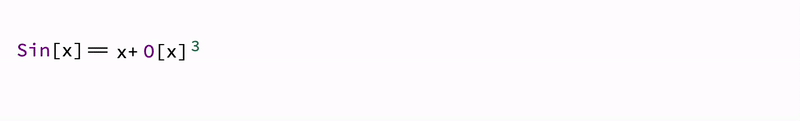
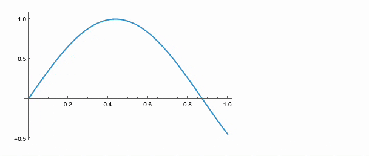

---
env:
  - Wolfram Kernel
package: wljs-manipulate
source: https://github.com/JerryI/wljs-manipulate/blob/main/Kernel.wl
---
```mathematica
Animate[expr_, {u_Symbol, min_, max_}, opts___]
```

```mathematica
Animate[expr_, {u_Symbol, min_, max_, step_}, opts___]
```

generates a version of `expr` allowing automatic repeated reevaluation for each `u` though `min`, `max` with a defined frame rate.

:::warning
Avoid animating many frames of `Plot` or `Plot3D` using such expression and consider [AnimatePlot](frontend/Reference/Plotting%20Functions/AnimatePlot.md) instead.
:::

For example
```mathematica
Animate[Row[{Sin[x], "==", Series[Sin[x], {x,0,n}], Invisible[1/2]}], {n, 1, 10, 1}, AnimationRate->3]
```




## Portability
The same as for [Manipulate](frontend/Reference/GUI/Manipulate.md), i.e. can be fully exported as [Dynamic HTML](frontend/Exporting/Dynamic%20HTML.md). 

:::warning
Please do not use infinite `AnimationRepetitions` 
:::

## MMAView
[MMAView](frontend/Reference/GUI/MMAView.md) wrapper allows to use **native Wolfram Engine rendering engine** for animating expressions, **any expression**. It uses a parallel kernel to rasterize the provided expression and stream updates to the frontend.


```mathematica
Animate[Plot[Sin[x y], {x,0,1}], {y,0,5}] // MMAView
```



## Options
### `AnimationRate`
Specifies frames per second. The default is `6`

### `AnimationRepetitions`
The default is `Infinity`

### `"TriggerEvent"`
Specifies an [`EventObject`](frontend/Reference/Misc/Events.md#`EventObject`) used to start an animation (or restart) externally (via a button for instance)

### `"UpdateFunction"`
Allows to alter the data generated on update or cause user-defined side-effects. The following values are expected

```mathematica
Function[u,
	(* side effects *)
	(* RETURN *)
	True <- accept change
	False <- prevent default
	_String <- will be written instead
]
```

One can bypass the default method completely and rely on side effects

```mathematica
Module[{pts},
  Animate[Graphics[{
    Circle[{0,0},1],
    Red, Point[pts // Offload]
  }, ImageSize->Small], {t, 0, 2Pi, 0.1}, "UpdateFunction" -> Function[t,
    pts = {Sin[t], Cos[t]};
    False
  ]]
]
```
