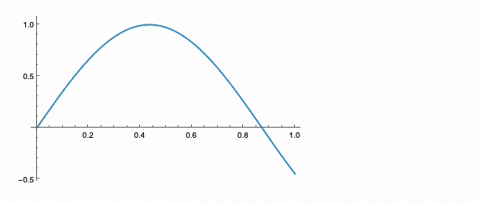

---
env:
  - Wolfram Kernel
source: https://github.com/JerryI/wljs-editor/blob/dev/src/EditorKernel.wl
package: wljs-editor
---
```mathematica
MMAView[head_[args__]]
```

```mathematica
MMAView[_Animate]
```

```mathematica
MMAView[_Manipulate]
```

```mathematica
MMAView[_Graphics3D]
```

attempts to use Mathematica's frontend (technically backend) to render given expression to a raster [Image](frontend/Reference/Image/Image.md) and return it back.

__Note: `MMAView` has `HoldFirst` attribute__

WLJS Notebook does not support all possible styling and diagram types compared to Wolfram Mathematica. Here we give a user a workaround, which might be suitable for many cases.

For example

```mathematica @
Plot3D[(*SpB[*)Power[x(*|*),(*|*)2](*]SpB*) (*SpB[*)Power[y(*|*),(*|*)2](*]SpB*), {x,0,1}, {y,0,1}] // MMAView 
```


## Graphics3D
We have a special wrapper for [Graphics3D](frontend/Reference/Graphics3D/Graphics3D.md) -like plots to make them interactive in the session

```mathematica
With[{p = Plot3D[x^2 y, {x,0,10}, {y,0,10}]},
  MMAView[p]
]
```

:::note
Note, that it is important to pass it using `With`, since `MMAView` has `HoldFirst` attribute. Otherwise the direct pass will give your a static plot
:::


### How to force static view
One can bypass `UpValue` for `Graphics3D` by

```mathematica
With[{p = Plot3D[x^2 y, {x,0,10}, {y,0,10}]},
  MMAView[p // Rasterize]
]
```

:::warning
Interactive 3D view cannot be exported to [Dynamic HTML](frontend/Exporting/Dynamic%20HTML.md) or [MDX](frontend/Exporting/MDX.md). __Use static only__
:::

## Manipulate
There is a similar wrapper for [Manipulate](frontend/Reference/GUI/Manipulate.md)

```mathematica
Manipulate[Plot[Sin[x y], {x,0,1}], {y,0,5}] // MMAView
```


:::warning
It literally streams uncompressed raster images in real-time. Please do not overuse it, and try to use WLJS dynamics in general if possible.
:::

If it detect `Graphics3D` inside `Manipulate` it also provides mouse controls over it

```mathematica
Manipulate[Plot3D[Sin[n x] Cos[n y], {x,-1,1}, {y,-1,1}], {n, 1, 5, 1}] // MMAView
```


## Animate
The same as before but for [Animate](frontend/Reference/GUI/Animate.md)

```mathematica
Animate[Plot[Sin[x y], {x,0,1}], {y,0,5}] // MMAView
```

