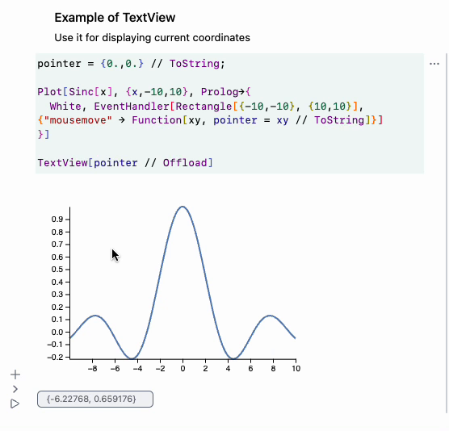

---
env:
  - WLJS
update: true
needsContainer: false
source: https://github.com/JerryI/wljs-inputs/
registered: false
package: wljs-inputs
---

```mathematica
TextView[string_String, opts___]
```

represents a text field used for displaying dynamic data

## Options
### `"Event"`
__If specified__ it acts like an [InputText](frontend/Reference/GUI/InputText.md). 

## `"Description"`
adds description label

## `"Placeholder"`
adds placeholder of the given `string` is empty

### `ImageSize`
sets the width in pixels

### `"Label"`
adds a label at the left side to the text field

## Application
### Dynamic indication
There are various of applications. For example to display the current coordinates on a graph

```mathematica
pointer = {0.,0.} // ToString;

Plot[Sinc[x], {x,-10,10}, Prolog->{
  White, EventHandler[Rectangle[{-10,-10}, {10,10}], {"mousemove" -> Function[xy, pointer = xy // ToString]}]
}]

TextView[pointer // Offload]
```





## Supported output forms
- [StandardForm](frontend/Reference/Formatting/StandardForm.md)
- [WLXForm](frontend/Reference/Formatting/WLXForm.md)