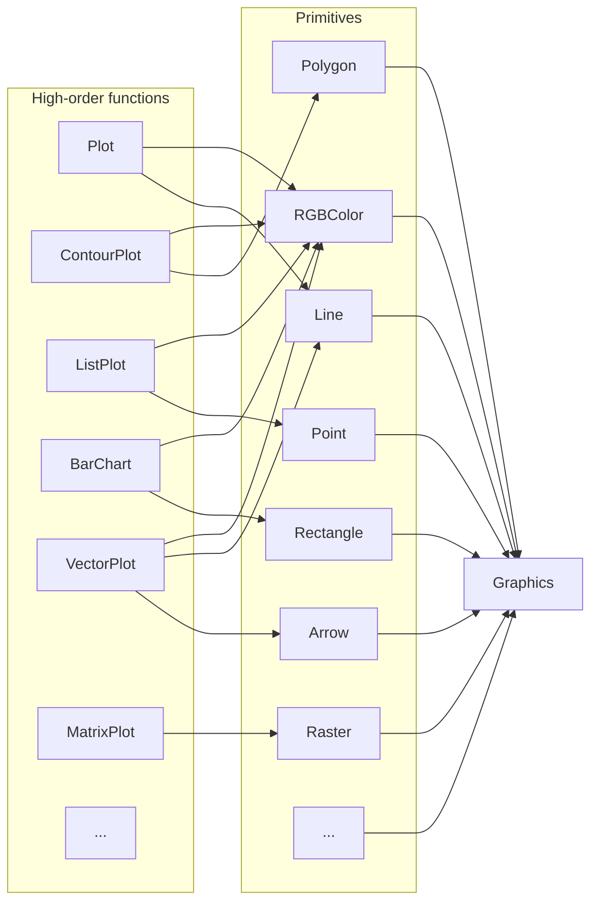
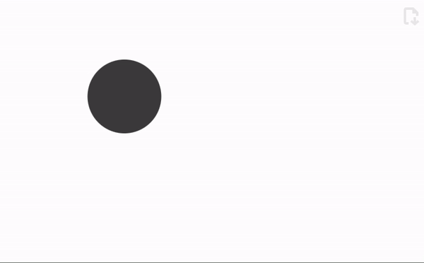

---
env:
  - WLJS
package: wljs-graphics-d3
update: false
source: https://github.com/JerryI/wljs-graphics-d3/blob/dev/src/kernel.js
---
```mathematica
Graphics[objects_, opts___]
```
represents a two-dimensional graphical image. This is a fundamental expression, which is produced by all 2D plotting functions

```mathematica
Graphics[
 Table[{Hue[t/20.0,1., 0.5], Circle[{Cos[2 Pi t/20], Sin[2 Pi t/20]}]}, {t, 20}]]
```

<Wl >{`Graphics[
 Table[{Hue[t/20.0,1., 0.5], Circle[{Cos[2 Pi t/20], Sin[2 Pi t/20]}]}, {t, 20}], ImageSize->350, ImagePadding->None]`}</Wl>

```mathematica
Graphics[{EdgeForm[Black], Green, Rectangle[{0, -1}, {2, 1}], Red, Disk[], Blue,
   Circle[{2, 0}], Yellow, Polygon[{{2, 0}, {4, 1}, {4, -1}}], Purple, Arrow[{{4, 3/2}, {0, 3/2}, {0, 0}}], Black, 
  SVGAttribute[Line[{{-1, 0}, {4, 0}}], "stroke-dasharray"->"3"]}]
```

<Wl >{`Graphics[{EdgeForm[Black], Green, Rectangle[{0, -1}, {2, 1}], Red, Disk[], Blue,
   Circle[{2, 0}], Yellow, Polygon[{{2, 0}, {4, 1}, {4, -1}}], Purple, Arrow[{{4, 3/2}, {0, 3/2}, {0, 0}}], Black, 
  SVGAttribute[Line[{{-1, 0}, {4, 0}}], "stroke-dasharray"->"3"]}, ImageSize->350, ImagePadding->None]`}</Wl>

The engine that interprets graphical data is a [separate Javascript library](https://github.com/JerryI/wljs-graphics-d3) (shipped together with WLJS Notebook).

```mathematica
Graphics[{{Red, Disk[{5, 5}, 4]}, 
  Raster[Table[{x, y, x, y}, {x, .1, 1, .1}, {y, .1, 1, .1}]]}]
```

<Wl>{`Graphics[{{Red, Disk[{5, 5}, 4]}, 
  Raster[Table[{x, y, x, y}, {x, .1, 1, .1}, {y, .1, 1, .1}]]}, ImageSize->350]`}</Wl>

## Graphics objects
Please see the corresponding section in __Reference__ section for expression to be used with `Graphics`.

Mostly all primitives are generated by a high-order functions like [Plot](frontend/Reference/Plotting%20Functions/Plot.md), [ListLinePlot](frontend/Reference/Plotting%20Functions/ListLinePlot.md), [ListVectorPlot](frontend/Reference/Plotting%20Functions/ListVectorPlot.md), [BubbleChart](frontend/Reference/Plotting%20Functions/BubbleChart.md) and etc



## Methods

### `EventHandler`
Attach an event handler to listen canvas events

```mathematica
EventHandler[Graphics[Disk[]], {"click"->Beep}]
```

The list of available events is the same as for primitives (see [Mouse and keyboard](frontend/Advanced/Events%20system/Mouse%20and%20keyboard.md))
- `"click"`
- `"mousemove"`
- etc

__it is also applicable for all plotting functions__

```mathematica
c = {0.,0.};

EventHandler[
  Plot[x, {x,0,1}, Epilog->Point[c//Offload]], 
  {"mousemove"->((c=#)&)}
]
```

:::note
This is also a valid form

```mathematica
c = {0.,0.};

Plot[x, {x,0,1}, Epilog->{
  Point[c//Offload], 
  EventHandler[Null, {"mousemove"->((c=#)&)}]
}]
```

Here it takes `Null` as a first argument, which forces it to attach handler to the nearest parent symbol, which supports it.
:::

## Context symbols
Here is a list of utility symbols used in `Graphics` context

### ``Graphics`Canvas``

:::warning
__Deprecated__. Please apply `EventHandler` directly on `Graphics`, or substitute it inside `Epilog` or `Prolog` with `Null` as a first argument.
:::

Is used to have an access to SVG container of `Graphics` function
#### Methods
##### `EventHandler`
Is used to capture various events such as
- `"mousemove"`
- `"click"`

For example

```mathematica
pt = {0,0};
Graphics[{
	EventHandler[Graphics`Canvas[], {
		"mousemove" -> Function[xy, pt = xy]
	}], Red,
	Circle[pt // Offload, 0.08]
}, PlotRange->{{-1,1}, {-1,1}}]
```


### ``Graphics`DPR``
Returns device density pixel ratio (for retina-like displays it is more than `1.0`). It comes handy when working with raster graphics - [Image](frontend/Reference/Image/Image.md) placed on graphics canvas.

```mathematica
FrontFetch[Graphics`DPR]
```

Evaluate it on the frontend using [FrontFetch](frontend/Reference/Frontend%20IO/FrontFetch.md) or [FrontFetchAsync](frontend/Reference/Frontend%20IO/FrontFetchAsync.md) like functions.


## Options
### `PlotRange`
manually specifies, where the borders of the visible area (viewport) are

```mathematica
PlotRange->{{-1,1}, {-1,1}}
```

:::note
If `PlotRange` is missing, WLJS Graphics will try to guess the dimensions in order to fit all objects to the screen
:::

### `ImageSize`
specifies the actual size in pixels of a canvas

```mathematica
ImageSize->300 or ImageSize->{300,200}
```

### `ImageSizeRaw`
specifies the size of drawing area in pixels considering pixel density ratio. It comes handy when combining [Graphics](frontend/Reference/Graphics/Graphics.md) with [Image](frontend/Reference/Image/Image.md) using [Inset](frontend/Reference/Graphics/Inset.md). [HighlightImage](frontend/Reference/Image/HighlightImage.md) uses this approach

### `ImagePadding`
removes or adds the spacing between the plotted range and the canvas border

```mathematica title="remove any padding"
ImagePadding->None
```

<Wl >{`Graphics[Circle[], ImagePadding->None, ImageSize->350]`}</Wl>

```mathematica title="add to all sides"
ImagePadding->10
```

<Wl >{`Graphics[Circle[], ImagePadding->10, ImageSize->350]`}</Wl>

### `PlotRangeClipping`
Defines if plot range has to be clipped. By the default is `True`, that hides all graphics objects outside the plotting range

### `PlotLabel`
Specifies a label for a plot

```mathematica
Plot[Sin[x], {x, 0, 10}, PlotLabel -> Sin[x]]
```

```mathematica
Plot[Sin[x], {x, 0, 10}, PlotLabel -> "Sin[x]", LabelStyle -> Directive[Orange, FontSize->14]]
```


### `Axes`
Show or hide axes 

```mathematica
Axes->True
```

#### Example
```mathematica
Graphics[{EdgeForm[Black], Green, Rectangle[{0, -1}, {2, 1}], Red, Disk[], Blue,
   Circle[{2, 0}], Yellow, Polygon[{{2, 0}, {4, 1}, {4, -1}}], Purple, Arrow[{{4, 3/2}, {0, 3/2}, {0, 0}}], Black, 
  SVGAttribute[Line[{{-1, 0}, {4, 0}}], "stroke-dasharray"->"3"]}, Axes->True ]
```

<Wl >{`Graphics[{EdgeForm[Black], Green, Rectangle[{0, -1}, {2, 1}], Red, Disk[], Blue,
   Circle[{2, 0}], Yellow, Polygon[{{2, 0}, {4, 1}, {4, -1}}], Purple, Arrow[{{4, 3/2}, {0, 3/2}, {0, 0}}], Black, 
  SVGAttribute[Line[{{-1, 0}, {4, 0}}], "stroke-dasharray"->"3"]}, ImageSize->350, Axes->True ]`}</Wl>

### `AxesLabel`
Place labels on your axes
```mathematica
AxesLabel -> {"xxx", "yyy"}
```

:::note
Activate `Axes` option first
:::

for example

<Wl >{`Graphics[Circle[], ImageSize->350, Axes->True, AxesLabel->{"xxx","yy"}]`}</Wl>

Labels __accepts only strings__ or numbers unlike Mathematica, where you can put everything. 

Since it is translated into [`Text`](frontend/Reference/Graphics/Text.md), one can use sort of TeX math input

```mathematica
Graphics[Circle[], Axes->True, AxesLabel -> {"x-axis (cm^{-1})", "y-axis \\alpha"}]
```

<Wl >{`Graphics[Circle[], ImageSize->350, Axes->True, AxesLabel -> {"x-axis (cm^{-1})", "y-axis \\alpha"}]`}</Wl>


It also supports [Offset](frontend/Reference/Graphics/Offset.md) attribute

```mathematica
Graphics[Circle[], Axes->True, AxesLabel -> {Offset["x-axis (cm^{-1})", {0,0.5}], "y-axis \\alpha"}]
```

<Wl >{`Graphics[Circle[], ImageSize->350, Axes->True, AxesLabel -> {Offset["x-axis (cm^{-1})", {0,0.5}], "y-axis \\alpha"}]`}</Wl>


### `Ticks`
Customize ticks by providing an array of numbers for both axes
```mathematica
Graphics[Circle[], Axes->True, Ticks->{{0, 0.5, 1}, {}}]
```

<Wl >{`Graphics[Circle[], ImageSize->350, Axes->True, Ticks->{{0, 0.5, 1}, {}}]`}</Wl>

Or by providing as pairs `{Number, String}` one can specify the displayed text
```mathematica
Graphics[Circle[], Axes->True, Ticks->{{{0, "Zero"}, {0.5, "Half"}, {1,"One"}}, {}}]
```

<Wl >{`Graphics[Circle[], ImageSize->350, Axes->True, Ticks->{{{0, "Zero"}, {0.5, "Half"}, {1,"One"}}, {}}]`}</Wl>


### `Controls`
The features __allows to pan and zoom your plots__, that was never possible in Mathematica

```mathematica
Controls->True
```

<Wl >{`Insert[Plot[Sin[1/x], {x, 0.001, 0.1}, MaxRecursion->1, ImageSize->350], Controls->True, {2,-1}]`}</Wl>

*Try to use your mouse here*

:::note
from the latest update, this is `True` by the default
:::

### `Frame`
Turns plot into the journals-like styled graph. In general it has much more options to customize the look

```mathematica
Graphics[Circle[], Axes->True, Frame->True]
```

<Wl >{`Graphics[Circle[], ImageSize->350, Axes->True, Frame->True]`}</Wl>

#### `FrameTicks`
The same as [`Ticks`](#`Ticks`), but for this regime.

#### `FrameLabel` 
The same as [`AxesLabel`](#`AxesLabel`)

```mathematica
FrameLabel->{{"yy", None}, {"xx", None}}
```

<Wl >{`Graphics[Circle[], ImageSize->350, Axes->True, Frame->True, FrameLabel->{{"yy", None}, {"xx", None}}]`}</Wl>

to specify __an absolute offset__ for each label, provide a list instead of a string

```mathematica
FrameLabel->{{{"yy", {xoffset, yoffset}}, None}, {"xx", None}}
```

#### `FrameStyle`
Affects the style of [`FrameLabels`](#`FrameLabels`). Use `Directive` for changing the style

```mathematica
FrameStyle->Directive[FontSize->16]
```

<Wl >{`Graphics[Circle[], ImageSize->350, Axes->True, Frame->True, FrameLabel->{{"yy", None}, {"xx", None}}, FrameStyle->Directive[FontSize->16]]`}</Wl>

#### `FrameTicksStyle`
Affects the style of [`FrameTicks`](#`FrameTicks`)

```mathematica
FrameTicksStyle->Directive[FontSize->16]
```

<Wl >{`Graphics[Circle[], ImageSize->350, Axes->True, Frame->True, FrameLabel->{{"yy", None}, {"xx", None}}, FrameTicksStyle->Directive[FontSize->16]]`}</Wl>


#### `TickLabels`
To remove unnecessary ticks, use

```mathematica
TickLabels->{{True, False}, {True, False}}
```

<Wl >{`Graphics[Circle[], ImageSize->350, Axes->True, Frame->True, TickLabels->{{True, False}, {True, False}}]`}</Wl>

### `Epilog`
Puts any graphics object on top 

```mathematica
Epilog->{Red, Line[{{-1,-1}, {1,1}}]}
```

<Wl >{`Graphics[Circle[], ImageSize->350, Epilog->{Red, Line[{{-1,-1}, {1,1}}]}]`}</Wl>

It opens up many possibilities, since it provides low-level access to the `Graphics` canvas.

#### Example
One can use it on a high-level function like `Plot` to add low-level primitives

```mathematica
Plot[Sin[x], {x,0,Pi}, Epilog->{Red, Line[{{-1,-1}, {1,1}}]}]
```

<Wl >{`Plot[Sin[x], {x,0,Pi}, Epilog->{Red, Line[{{-1,-1}, {1,1}}]}, ImageSize->350]`}</Wl>

or together with [FrontInstanceReference](frontend/Reference/Frontend%20IO/FrontInstanceReference.md)

### `Prolog`
The same as [`Epilog`](#`Epilog`), but acts before plotting the data.

### `TransitionType`
See [Dynamics](#Dynamics). The possible values

:::info
It can also be applied locally, see [TransitionType](frontend/Reference/Graphics/TransitionType.md)
:::

#### `"Linear"`

__THE DEFAULT ONE__

For example
```mathematica title="cell 1"
pt = {-1,0};
Graphics[{PointSize[0.3], Point[pt // Offload]}, ImageSize->350, PlotRange->{{-1,1}, {-1,1}}, "TransitionType"->"Linear"]
```

```mathematica title="cell 2"
pt = RandomReal[{-1,1}, 2];
```


#### `"CubicInOut"`
This one is used by the default

```mathematica title="cell 1"
pt = {-1,0};
Graphics[{PointSize[0.3], Point[pt // Offload]}, ImageSize->350, PlotRange->{{-1,1}, {-1,1}}, "TransitionType"->"CubicInOut"]
```



### `None`
No transition. Works great for fast animations

### `TransitionDuration`
Sets the duration of any transitions of graphics objects on canvas __in milliseconds__. The default value is `300`. 

:::info
It can also be applied locally, see [TransitionDuration](frontend/Reference/Graphics/TransitionDuration.md)
:::

## Combining two graphics plots
One can put `Graphics` into another `Graphics` canvas using [[frontend/Reference/Graphics/Inset]]

## Dynamics
The time-dependent symbols ([Dynamics](frontend/Dynamics.md)) are supported on the level of graphics primitives such as [Line](frontend/Reference/Graphics/Line.md), [Point](frontend/Reference/Graphics/Point.md), [Rectangle](frontend/Reference/Graphics/Rectangle.md), [Text](frontend/Reference/Graphics/Text.md) and etc... Not all primitives do support updates, please, check individually. 

The full reevaluation of `Graphics` does not happen, that allows to gain much more performance. However, since the dynamic binding is established between individual primitives and symbols, one can make nested constructions like this one

```mathematica
radius = 1.;
angle = 0.;
tpos = 0.

group = {
  LightBlue, Disk[{0,0}, radius // Offload],
  LightBlue, AbsoluteThickness[25], Line[{{-1,1}, {1,-1}}],
  Red, Directive[FontSize->24],
  Text["Hello World", {Offload[-0.23 + tpos],0}]
};

Graphics[Rotate[group, angle // Offload], TransitionType->"Linear", TransitionDuration->100]
```

Here
- an update of `angle` will not cause reevaluation of `group`
- and update of `radius` will only update the radius of `Disk`
- and update of `tpos` will reevaluate an expression `-0.23 + tpos` and change the text position

Let us animate this example

```mathematica title="evaluate in a separate cell"
Do[
  radius = 1+0.5 Sin[x];
  tpos = 0.5 Cos[4x];
  angle = x;
  Pause[0.1];
, {x, 0. , 2Pi, 0.1}];
```

The result will look like


## Supported output forms
- [StandardForm](frontend/Reference/Formatting/StandardForm.md)
- [WLXForm](frontend/Reference/Formatting/WLXForm.md)