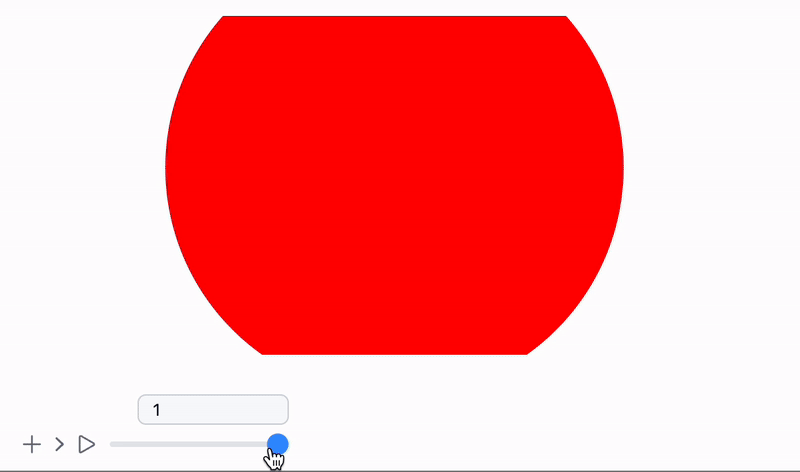

---
env:
  - WLJS
package: wljs-graphics-d3
source: https://github.com/JerryI/wljs-graphics-d3/blob/dev/src/kernel.js
update: true
---
```mathematica
Opacity[i_Real]
```

defines opacity for primitives (from 0 to 1)

```mathematica
{Opacity[0.5], Red, Disk[{-0.5,0}, 1], Blue, Disk[{0.5,0}, 1]}
```

<Wl >{`Graphics[{Opacity[0.5], Red, Disk[{-0.5,0}, 1], Blue, Disk[{0.5,0}, 1]}]`}</Wl>

## Dynamics
It also supports updates combined with some primitives

```mathematica
opacity = 0.5;
Graphics[{Opacity[Offload[opacity]], Red, Disk[{0,0}, 1], Blue, Opacity[Offload[1.0 - opacity]], Disk[{0,0}, 1]}]

EventHandler[InputRange[0,1,0.1], Function[value,
	opacity = value;
]]
```

