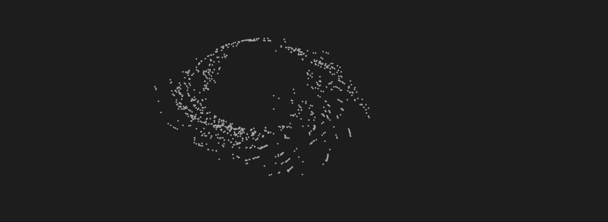

---
env:
  - WLJS
package: wljs-graphics-d3
update: true
source: https://github.com/JerryI/wljs-graphics-d3/blob/dev/src/kernel.js
numericArray: true
---
```mathematica
Point[p_List | _Offload]
```

is a graphics and geometry primitive that represents a point at `p`,

```mathematica
Point[{p1_List, p2_List, ...}]
```

represents collection of points

```mathematica
Graphics[Point[Table[{t, Sin[t]}, {t, 0, 2 \[Pi], 2 \[Pi]/10}]]]
```

<Wl >{`Graphics[Point[Table[{t, Sin[t]}, {t, 0, 2 \[Pi], 2 \[Pi]/10}]]]`}</Wl>

```mathematica
Graphics[
 Table[{Hue[RandomReal[],1,0.5], PointSize[RandomReal[{0, 0.1}]], 
   Point[RandomReal[1, {2}]]}, {200}]]
```

<Wl >{`Graphics[
 Table[{Hue[RandomReal[],1,0.5], PointSize[RandomReal[{0, 0.1}]], 
   Point[RandomReal[1, {2}]]}, {200}]]`}</Wl>


## Parameters
### `RGBColor`
specifies colors of a points

### `Opacity`
specifies opacity 

### `PointSize`
absolute size of a point

## Methods
### `EventHandler`
One can listen to a several events produced by this primitive using [`EventHandler`](frontend/Reference/Misc/Events.md#`EventHandler`)

```mathematica
EventHandler[t_Point, {event_ -> handler_, ...}]
```

where `event` can be
- `"mousemove"` detects and sends coordinates of a mouse, when it is over this element 
- `"drag"` makes primitive draggable and emits coordinates
- `"zoom"` detects zoom / mouse-wheel
- `"click"` detects mouse clicks

:::tip
See more in [Mouse and keyboard](frontend/Advanced/Events%20system/Mouse%20and%20keyboard.md)
:::


## Indexed geometry
Using it inside [GraphicsComplex](frontend/Reference/Graphics/GraphicsComplex.md) allows to specify only the indexes of vertices as arguments similar to faces like in [Indexed geometry](frontend/Reference/Graphics/Polygon.md#Indexed%20geometry)


## Dynamics
Point primitive supports dynamic updates even if the number of points is not constant.

There is [a famous example](https://community.wolfram.com/groups/-/m/t/122095) of 1000 particles "dancing" with each other

```mathematica title="cell 1"
n = 1000;
r := RandomInteger[{1, n}];
f := (#/(.01 + Sqrt[#.#])) & /@ (x[[#]] - x) &;
s := With[{r1 = r}, p[[r1]] = r; q[[r1]] = r];
x = RandomReal[{-1, 1}, {n, 2}];
{p, q} = RandomInteger[{1, n}, {2, n}];
```

```mathematica title="cell 2"
EventHandler["frame", Function[Null,
  (* all calculations *)
  x = 0.995 x + 0.02 f[p] - 0.01 f[q];
  If[r < 100, s];
]];
```

```mathematica title="cell 3"
Graphics[{
  PointSize[0.007], Point[x // Offload],
  AnimationFrameListener[x // Offload, "Event"->"frame"]
}, PlotRange -> {{-2,2}, {-2,2}}, "TransitionType"->"Linear", "TransitionDuration"->1]  
```


