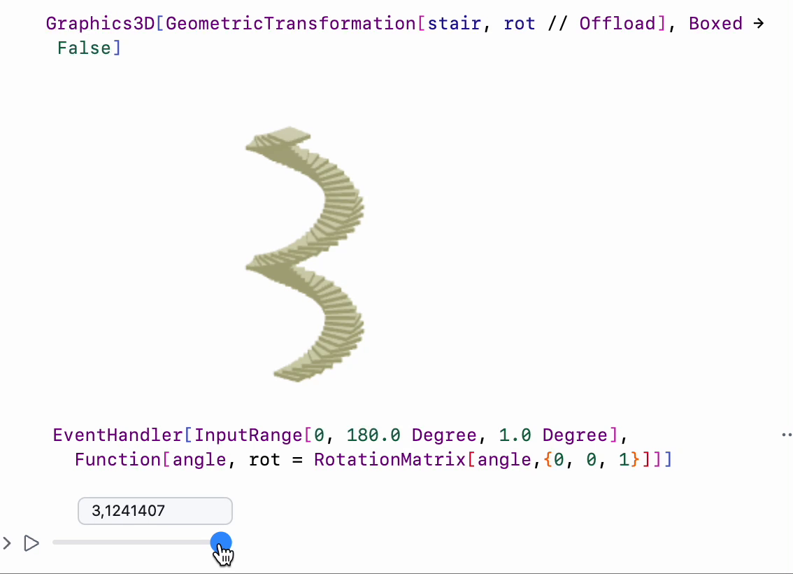

---
env:
  - WLJS
source: https://github.com/JerryI/Mathematica-ThreeJS-graphics-engine/blob/dev/src/kernel.js
package: wljs-graphics3d-threejs
update: true
---
```mathematica
GeometricTransformation[object_, matrix3x3_List]
```

applies __general__ `matrix3x3` to each vertex of an `object`, i.e. replacing each point `p` by `matrix3x3.p`

```mathematica
GeometricTransformation[object_, vector3_List]
```

applies __translation__ `vector3` to each vertex of an `object`

```mathematica
GeometricTransformation[object_, {matrix3_List, vector3_List}]
```

applies __transformation matrix and translation__ operation `matrix3.p + vector3`


:::info
`object` can be nested or group of graphics primitives as well
:::

## Examples

```mathematica
Graphics3D[
 GeometricTransformation[Sphere[], N@ShearingMatrix[2, {1,1,1}, {1,1,0}]]
 ]
```

<Wl >{`Graphics3D[GeometricTransformation[Sphere[], N@ShearingMatrix[2, {1,1,1},{1,1,0}]]]`}</Wl>

:::tip
Numerical matrixes are usually faster. Use `N` to get pure numbers
:::

Or more complicated one

```mathematica
Graphics3D[
 GeometricTransformation[Cuboid[{0, 0, 0}, {1.5, 1.5, .2}], 
  Table[{RotationMatrix[a, {0, 0, 1}], {Cos[a], Sin[a], a}}, {a, 0, 
    4 Pi, .2}]], Boxed -> False]
```

<Wl >{`Graphics3D[GeometricTransformation[Cuboid[{0, 0, 0}, {1.5, 1.5, .2}], Table[{RotationMatrix[a, {0, 0, 1}], {Cos[a], Sin[a], a}}, {a, 0, 4 Pi, .2}]], Boxed -> False]`}</Wl>


## Dynamics
It fully supports dynamic updates. See example

```mathematica title="cell 1"
rot = RotationMatrix[45 Degree, {0, 0, 1}];
stair = GeometricTransformation[Cuboid[{0, 0, 0}, {1.5, 1.5, .2}], 
  Table[{RotationMatrix[a, {0, 0, 1}], {Cos[a], Sin[a], a}}, {a, 0, 
    4 Pi, .2}]];

    
Graphics3D[GeometricTransformation[stair, rot // Offload], Boxed -> False]
```

```mathematica title="cell 2"
EventHandler[InputRange[0, 180.0 Degree, 1.0 Degree], 
  Function[angle, rot = RotationMatrix[angle,{0, 0, 1}]]]
```

The result is following

