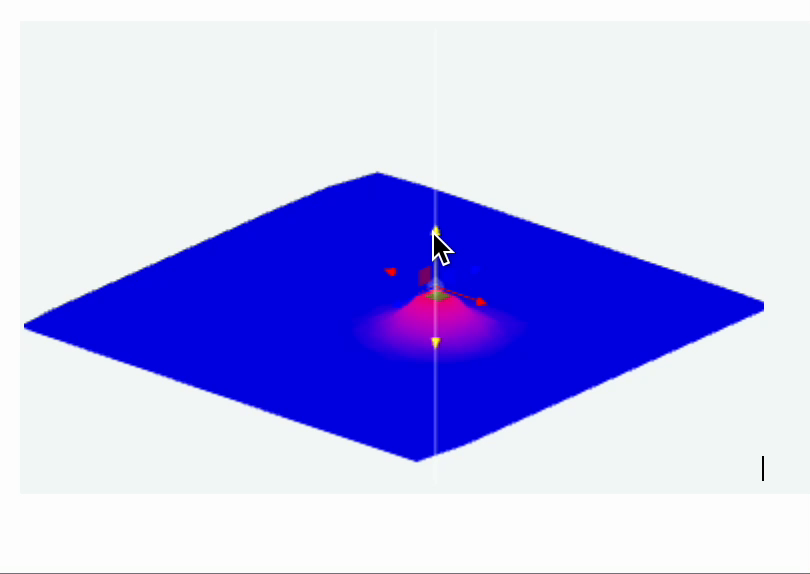
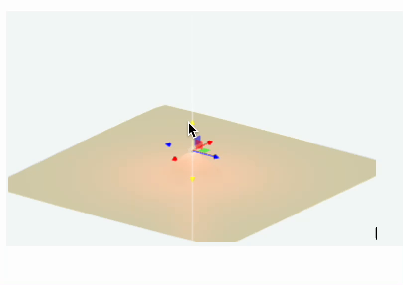
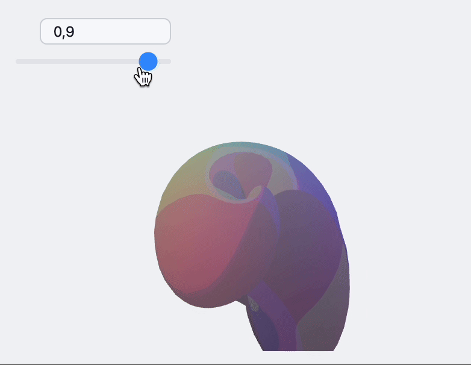
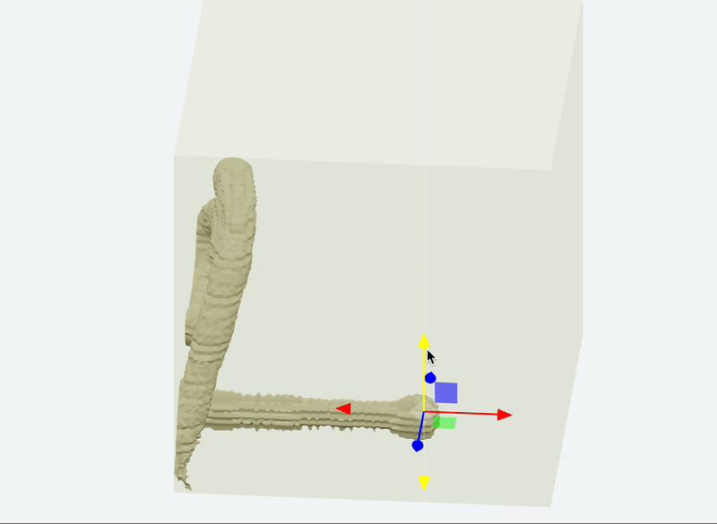

---
env:
  - WLJS
package: wljs-graphics3d-threejs
source: https://github.com/JerryI/Mathematica-ThreeJS-graphics-engine/blob/dev/src/kernel.js
update: true
numericArray: true
---
```mathematica
GraphicsComplex[data_List, primitives_, opts___]
```

represents an efficient graphics structure for drawing complex 3D objects (or 2D - see [GraphicsComplex](frontend/Reference/Graphics/GraphicsComplex.md)) storing vertices data in `data` variable. It replaces indexes found in `primitives` (can be nested) with a corresponding vertices and colors (if specified)

Most plotting functions such as [ListPlot3D](frontend/Reference/Plotting%20Functions/ListPlot3D.md) and others use this way showing 3D graphics.

The implementation of [GraphicsComplex](frontend/Reference/Graphics3D/GraphicsComplex.md) is based on a low-level THREE.js buffer position [attribute](https://threejs.org/docs/#api/en/core/BufferAttribute) directly written to a GPU memory.

## Supported primitives
### `Line`
No restrictions

```mathematica
v = PolyhedronData["Dodecahedron", "Vertices"] // N;
i = PolyhedronData["Dodecahedron", "FaceIndices"];
```

```mathematica
GraphicsComplex[v, {Black, Line[i]}] // Graphics3D 
```

<Wl >{`v = PolyhedronData["Dodecahedron", "Vertices"] // N; i = PolyhedronData["Dodecahedron", "FaceIndices"]; GraphicsComplex[v, {Black, Line[i]}] // Graphics3D `}</Wl>


### `Polygon`
Triangles works faster than quads or pentagons

```mathematica
GraphicsComplex[v, Polygon[i]] // Graphics3D 
```

<Wl >{`v = PolyhedronData["Dodecahedron", "Vertices"] // N; i = PolyhedronData["Dodecahedron", "FaceIndices"]; GraphicsComplex[v, {Polygon[i]}] // Graphics3D `}</Wl>

#### Non-indexed geometry
One can provide only the ranges for the triangles to be rendered

```mathematica
GraphicsComplex[v, Polygon[1, Length[v]]] // Graphics3D 
```

:::warning
it assumes you are using triangles
:::

### `Point`

### `Sphere`

### `Tube`

## Options
### `"VertexColors"`
Defines sets of colors used for shading vertices

:::info
`"VertexColors"` is a plain list which must have the following form
```mathematica
"VertexColors" ->{{r1,g1,b1}, {r2,g2,b2}, ...}
```
:::

*Supports updates*

### `"VertexNormals"`
Defines sets of normals used for shading

*Supports updates*

## Dynamic updates

### Basic fixed indexes
It does support updates for vertices data and colors. Use [Offload](frontend/Reference/Interpreter/Offload.md) wrapper.


```mathematica title="cell 1"
(* generate mesh *)
proc = HardcorePointProcess[50, 0.5, 2];
reg = Rectangle[{-10, -10}, {10, 10}];
samples = RandomPointConfiguration[proc, reg]["Points"];

(* triangulate *)
Needs["ComputationalGeometry`"];
triangles2[points_] := Module[{tr, triples},
  tr = DelaunayTriangulation[points];
  triples = Flatten[Function[{v, list},
      Switch[Length[list],
        (* account for nodes with connectivity 2 or less *)
        1, {},
        2, {Flatten[{v, list}]}, 
        _, {v, ##} & @@@ Partition[list, 2, 1, {1, 1}]
      ]
    ] @@@ tr, 1];
  Cases[GatherBy[triples, Sort], a_ /; Length[a] == 3 :> a[[1]]]]

triangles = triangles2[samples];

(* sample function *)
f[p_, {x_,y_,z_}] := z Exp[-(*FB[*)(((*SpB[*)Power[Norm[p - {x,y}](*|*),(*|*)2](*]SpB*))(*,*)/(*,*)(2.))(*]FB*)]

(* initial data *)
probe = {#[[1]], #[[2]], f[#, {10, 0, 0}]} &/@ samples // Chop;
colors = With[{mm = MinMax[probe[[All,3]]]},
      (Blend[{{mm[[1]], Blue}, {mm[[2]], Red}}, #[[3]]] )&/@ probe /. {RGBColor -> List} // Chop];
```

```mathematica title="cell 2"
Graphics3D[{
  GraphicsComplex[probe // Offload, {Polygon[triangles]}, "VertexColors"->Offload[colors]],

  EventHandler[Sphere[{0,0,0}, 0.1], {"transform"->Function[data, With[{pos = data["position"]},
    probe = {#[[1]], #[[2]], f[#, pos]} &/@ samples // Chop;
    colors = With[{mm = MinMax[probe[[All,3]]]},
      (Blend[{{mm[[1]], Blue}, {mm[[2]], Red}}, #[[3]]] )&/@ probe /. {RGBColor -> List} // Chop];
  ]]}]
}]
```

The result is interactive 3D plot



Or the variation of it, if we add a point light source

```mathematica
light = {0,0,0};
Graphics3D[{
  GraphicsComplex[probe // Offload, {Polygon[triangles]}],
  PointLight[Red, light // Offload],

  EventHandler[Sphere[{0,0,0}, 0.1], {"transform"->Function[data, With[{pos = data["position"]},
    probe = {#[[1]], #[[2]], f[#, pos]} &/@ samples // Chop;
    light = pos;
  ]]}]
}]
```



### Update indexes and vertices
For more complicated example you can update both. Here is an example with dynamic adapter for `ParametericPlot3D`

*define shapes*
```mathematica title="cell 1"
sample[t_] := With[{
   complex = ParametricPlot3D[
     (1 - t) * {
       (2 + Cos[v]) * Cos[u],
       (2 + Cos[v]) * Sin[u],
       Sin[v]
     } + t * {
       1.16^v * Cos[v] * (1 + Cos[u]),
       -1.16^v * Sin[v] * (1 + Cos[u]),
       -2 * 1.16^v * (1 + Sin[u]) + 1.0
     },
     {u, 0, 2\[Pi]},
     {v, -\[Pi], \[Pi]},
     MaxRecursion -> 2,
     Mesh -> None
   ][[1, 1]]
   },
  {
   complex[[1]],
   Cases[complex[[2]], _Polygon, 6] // First // First,
   complex[[3, 2]]
  }
]
```

now construct the scene

```mathematica
LeakyModule[{
    vertices, normals, indices
  },
    {
      EventHandler[InputRange[0,1,0.1,0], Function[value,
        With[{res  = sample[value]},
          normals = res[[3]];
          indices = res[[2]];
          vertices = res[[1]];
        ];
      ]],

      {vertices, indices, normals} = sample[0];
      
      Graphics3D[{
        MeshMaterial[MeshToonMaterial[]], Gray, 
        SpotLight[Red, 5 {1,1,1}], SpotLight[Blue, 5 {-1,-1,1}], 
        SpotLight[Green, 5 {1,-1,1}], 
        PointLight[Magenta, {10,10,10}],
        
        GraphicsComplex[vertices // Offload, {
          Polygon[indices // Offload]
        }, VertexNormals->Offload[normals]]
        
      }, Lighting->None]
    } // Column // Panel 
]
```



### Non-indexed
This is a another mode of working with [Non-indexed geometry](#Non-indexed%20geometry) in `Polygon`. The benefit of this approach, you can use fixed length buffer for vertices and limit your drawing range using two arguments of Polygon.

:::tip
Use non-indexed geometry if your polygon count reaches __1 million__.
:::

__Paint 3D__



__Marching Cubes examples__


