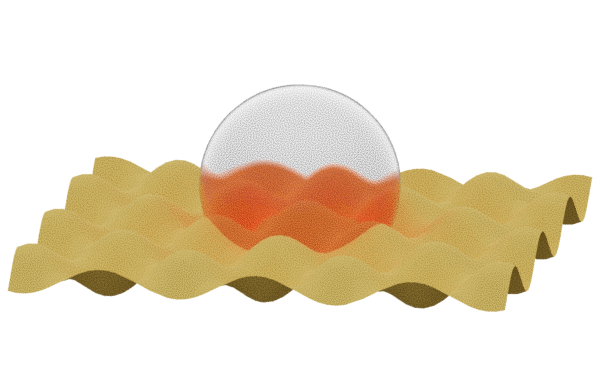
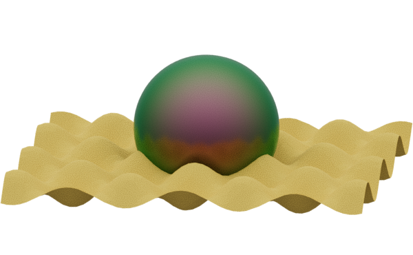

---
env:
  - Wolfram Kernel
package: wljs-graphics3d-threejs
---
```mathematica
Graphics3D`Materials[name_String]
```

A set of prebuilt materials using [MeshPhysicalMaterial](frontend/Reference/Graphics3D/MeshPhysicalMaterial.md) and [Directive](frontend/Reference/Graphics3D/Directive.md) to be used in [Graphics3D](frontend/Reference/Graphics3D/Graphics3D.md)

## Set
### `"Glass"`

Example
```mathematica
Plot3D[Sin[x] Cos[y], {x,-10,10}, {y,-10,10}][[1]];
Graphics3D[{%, Graphics3D`Materials["Glass"], Sphere[{0,0,2}, 4]}, "Renderer"->"PathTracing", ImageSize->600]
```



### `"Iridescent"`

Example
```mathematica
Plot3D[Sin[x] Cos[y], {x,-10,10}, {y,-10,10}][[1]];
Graphics3D[{%, Graphics3D`Materials["Iridescent"], Sphere[{0,0,2}, 4]}, "Renderer"->"PathTracing", ImageSize->600]
```

