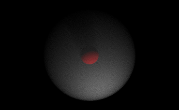

---
env:
  - WLJS
  - Wolfram Kernel
package: wljs-graphics3d-threejs
---
:::warning
Works only with `"Renderer"->"PathTracing"` in [Graphics3D](frontend/Reference/Graphics3D/Graphics3D.md)
:::

defines a material for volumetric fog effect in [MeshMaterial](frontend/Reference/Graphics3D/MeshMaterial.md)

```mathematica
MeshFogMaterial[density_:0.01]
```

:::tip
Enable `"MultipleImportanceSampling"` to get the best results
:::

## Example
Define a sphere-fog and place a [SpotLight](frontend/Reference/Graphics3D/SpotLight.md) to light it up from below

```mathematica
Graphics3D[{
  {MeshMaterial[MeshFogMaterial[0.1]], Sphere[{0,0,0},5]}, {Red, Sphere[{0,0,0}, 1]}, {SpotLight[White, -{5,5,5}]}
}, "Renderer"->"PathTracing", Background->Black, "Lighting"->None]
```

