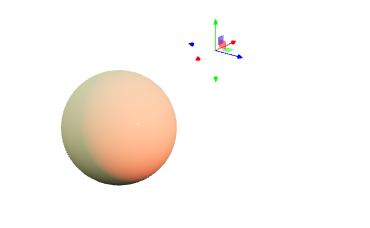

---
env:
  - WLJS
source: https://github.com/JerryI/Mathematica-ThreeJS-graphics-engine/blob/dev/src/kernel.js
update: true
package: wljs-graphics3d-threejs
numericArray: true
---
```mathematica
PointLight[col_RGBColor, position_:{0,0,10}, intensity_:100, distance_:0, decay_:2]
```

represents an artificial point-light source at the given position and parameters.

```mathematica
Graphics3D[{Black,Polygon[ {{-5,5,-1}, {5,5,-1}, {5,-5,-1}, {-5,-5,-1}}], White, Cuboid[{-1,-1,-1}, {1,1,1}], PointLight[Red, {1.5075, 4.1557, 2.6129}, 100], PointLight[Cyan, {-2.4489, -1.9012, 2.8386}, 100]}, "Lighting"->None]
```

<Wl >{`
Graphics3D[{Black,Polygon[ {{-5,5,-1}, {5,5,-1}, {5,-5,-1}, {-5,-5,-1}}], White, Cuboid[{-1,-1,-1}, {1,1,1}], PointLight[Red, {1.5075, 4.1557, 2.6129}, 100], PointLight[Cyan, {-2.4489, -1.9012, 2.8386}, 100]}, "Lighting"->None]`}</Wl>


:::warning
In the case of `"PathTracing"` renderer, point light can only work if `"MultipleImportanceSampling"` is enabled in the options of [Graphics3D](frontend/Reference/Graphics3D/Graphics3D.md)
:::
## Dynamics
Only `position` field supports updates. Use gizmo snippet to manipulate the light source position or [Offload](frontend/Reference/Interpreter/Offload.md) keyword.
