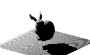
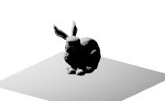

---
env:
  - WLJS
package: wljs-graphics3d-threejs

source: https://github.com/JerryI/Mathematica-ThreeJS-graphics-engine/blob/dev/src/Kernel.wl
---
:::warning
It is considered to be removed. Please use [Directive](frontend/Reference/Graphics3D/Directive.md) instead
:::


```mathematica
Shadows[True | False]
```

a scoped parameter like [RGBColor](frontend/Reference/Graphics3D/RGBColor.md) or [Opacity](frontend/Reference/Graphics3D/Opacity.md), that determines if a light source can cast shadows or a primitive can receive shadows as well.

See 

```mathematica
Graphics3D[{Shadows[shadow],  ExampleData[{"Geometry3D","StanfordBunny"}][[1]], SpotLight[White, {{0., -0.4473, 0.4291}, {0,0,0}}, Pi/4, 1], Polygon[ 0.01{{-20,20,-1}, {20,20,-1}, {20,-20,-1}, {-20,-20,-1}}]}, "Lighting"->None] /. {{shadow -> True}, {shadow -> False}}
```



