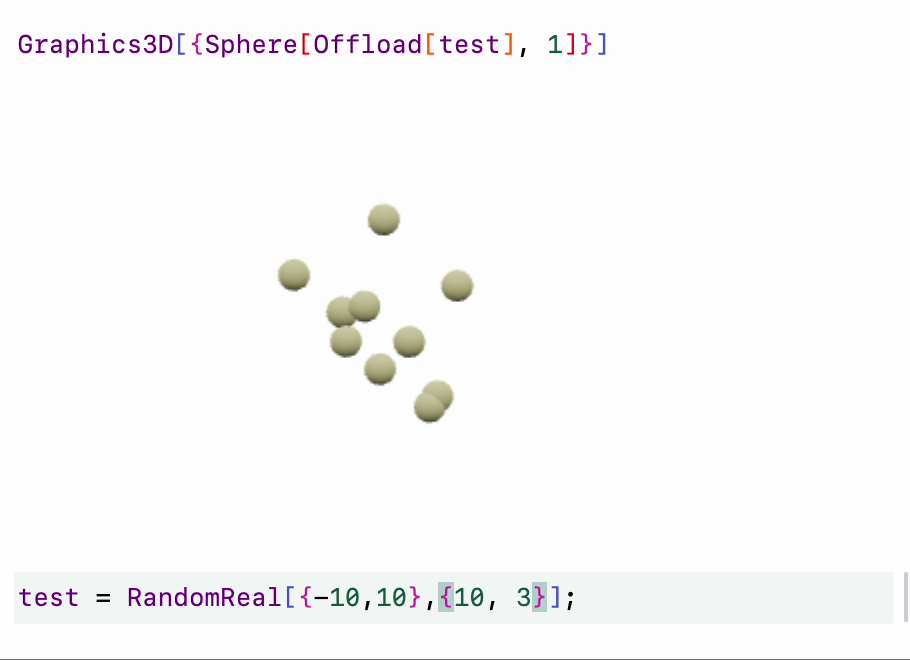

---
env:
  - WLJS
virtual: true
needsContainer: false
update: true
draft: false
numericArray: true
---
```mathematica
Sphere[c_List, radius_:1]
```

draws a sphere at coordinates `c` or list of spheres if the depth of `c` is 2.

## Parameters
### `RGBColor`
### `Opacity`
### `Roughness`
### `Metalness`
### `Emissive`


## Methods
### `EventHandler`
One can listen to a several events produced by this primitive using [`EventHandler`](frontend/Reference/Misc/Events.md#`EventHandler`)

```mathematica
EventHandler[t_Sphere, {event_ -> handler_, ...}]
```

where `event` can be
- `"transform"` makes primitive draggable and sends coordinates as association

## Dynamics
It supports dynamics even for multiple spheres

```mathematica title="cell 1"
test = RandomReal[{-10,10}, {10, 3}];
Graphics3D[{Black, Sphere[Offload[test], 1]}]
```

and then try to update them

```mathematica
test = RandomReal[{-10,10}, {10, 3}];
```

the result will be following

