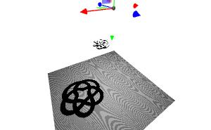

---
env:
  - WLJS
virtual: true
update: true
origin: https://github.com/JerryI/wljs-graphics-d3/
---
```mathematica
SpotLight[color_RGBColor, position_:{10,100,10} | {position_, target_}, angle_:Pi/3, intensity_:100, distance_:0, penumbra_:0, decay_:2]
```

places a fake source of spot light in a 3D scene (see [Graphics3D](frontend/Reference/Graphics3D/Graphics3D.md)). The default `target` is $\{0,0,0\}$. 

```mathematica
Graphics3D[{Shadows[True], Polygon[ {{-5,5,-1}, {5,5,-1}, {5,-5,-1}, {-5,-5,-1}}], White, Cuboid[{-1,-1,-1}, {1,1,1}], Shadows[False], PointLight[Red, {1.5075, 4.1557, 2.6129}, 100], Shadows[True], SpotLight[Cyan, {-2.268, -2.144, 3.1635}]}, "Lighting"->None]
```

<Wl >{`
Graphics3D[{Shadows[True], Polygon[ {{-5,5,-1}, {5,5,-1}, {5,-5,-1}, {-5,-5,-1}}], White, Cuboid[{-1,-1,-1}, {1,1,1}], Shadows[False], PointLight[Red, {1.5075, 4.1557, 2.6129}, 100], Shadows[True], SpotLight[Cyan, {-2.268, -2.144, 3.1635}]}, "Lighting"->None]`}</Wl>

For the best effect, use [Shadows](frontend/Reference/Graphics3D/Shadows.md) set to `True` 

:::warning
In the case of `"PathTracing"` renderer, spot light can only work properly if `"MultipleImportanceSampling"` is enabled in the options of [Graphics3D](frontend/Reference/Graphics3D/Graphics3D.md)
:::

## Dynamics
`position` and `target` do support updates

```mathematica
pos = {0,0,2};
handler = Function[data, pos = data["position"]];

KnotData[{"TorusKnot", {3, 5}}][[1]];
Graphics3D[{ Shadows[True],
  %, 
  EventHandler[Sphere[pos, 0.1], {"transform" -> handler}], 
  SpotLight[White, {Offload[pos], {0,0,0}}],
  Polygon[5{{-1,1,-1}, {1,1,-1}, {1,-1,-1}, {-1,-1,-1}}]
}, "Lighting"->None, ImageSize->600]
```



