---
env:
  - Wolfram Kernel
package: wljs-plotly
update: false
source: https://github.com/JerryI/wljs-plotly/blob/dev/src/Kernel.wl
context: Notebook`Kernel`PlotlyExtension`
---
```mathematica
Plotly[f, {x, xmin, xmax}]
```

mimics the behavior of a native [Plot](frontend/Reference/Plotting%20Functions/Plot.md) using a well-known [PlotlyJS](https://plotly.com/javascript/) library. It is quite limited and __does not support options__.

```mathematica
Plotly[data_Association, layout_Association:Null] _PlotlyInstance
```

creates `Plotly` instance object, which __gives a direct API access to a native Plotly Javascript engine__ ✨ and returns `PlotlyInstance`

`data` expression contains the parameters of a default Plotly Javascript constructor

:::tip
This is 1:1 correspondence to a normal Plotly API. Please see [Reference](https://plotly.com/javascript/)
:::

:::info
[RGBColor](frontend/Reference/Graphics/RGBColor.md) will also work normally as well as `ColorData` for coloring the plots. There is no need in JS/CSS-like color specifications
:::

## Constructor
Once called it returns `PlotlyInstance`

## Dynamics
It fully supports dynamics, but in a different way compared to other functions. Please see for that [PlotlyAddTraces](frontend/Reference/Plotly/PlotlyAddTraces.md), [PlotlyAnimate](frontend/Reference/Plotly/PlotlyAnimate.md) and etc.

## Examples

### Scatter plot
Adapted from [Ref](https://plotly.com/javascript/line-and-scatter/).

```mathematica
trace1 = <|
	"x" -> {1, 2, 3, 4}, 
	"y" -> {10, 15, 13, 17},
	"mode" -> "markers", 
	"type" -> "scatter" 
|>;

Plotly[trace1]
```

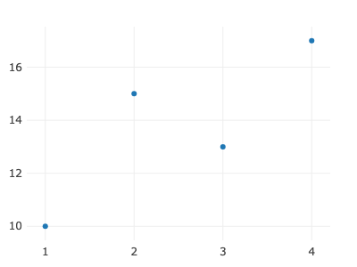

or with colors

```mathematica
trace1 = <| 
	"y" -> Table[5, {i, 1, 40}], 
	"mode" -> "markers", 
	"marker" -> <| 
		"size" -> 40, 
		"color" -> Range[40] 
	|> 
|>;

Plotly[trace1]
```

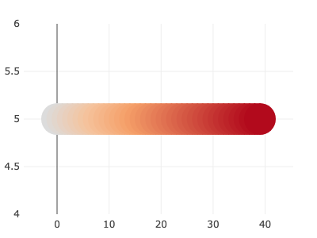

### Line charts
Adapted from [Ref](https://plotly.com/javascript/line-charts/)

```mathematica
trace1 = <|
	"x" -> {1, 2, 3, 4}, 
	"y" -> {10, 15, 13, 17}, 
	"type" -> "line" 
|>;

Plotly[trace1]
```

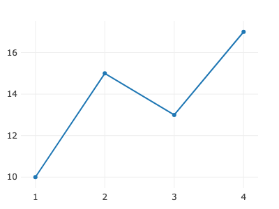

or an array of traces

```mathematica
trace := <|
	"y" -> RandomReal[{-1,1}, 10], 
	"type" -> "line" 
|>;

Plotly[{trace, trace, trace}]
```

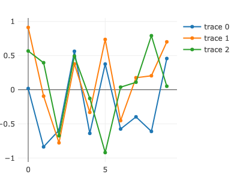

### Bar plot
Adapted from PlotlyJS

```mathematica
trace = <| 
	"x" -> {"giraffes", "orangutans", "monkeys"}, 
	"y" -> {20, 14, 23}, "type" -> "bar" 
|>;

Plotly[trace]
```

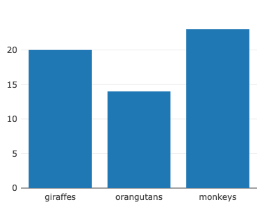


### Pie chart
Adapted from PlotlyJS

```mathematica
trace = <| 
	"values" -> {19, 26, 55}, 
	"labels" -> {"Residential", "Non-Residential", "Utility"}, 
	"type" -> "pie" 
|>;

Plotly[trace]
```

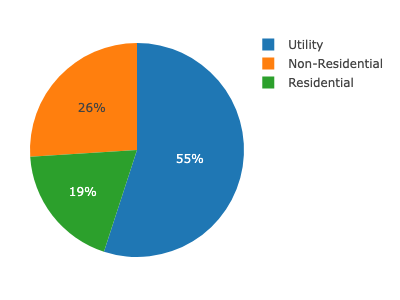


### Bubble chart
Adapted from PlotlyJS

```mathematica
data = <|
	"x" -> {1, 2, 3, 4}, 
	"y" -> {10, 11, 12, 13}, 
	"mode" -> "markers", 
	"marker" -> <| "size" -> {40, 60, 80, 100} |> 
|>;

Plotly[data]
```

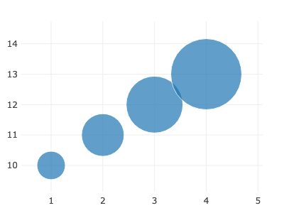

### Heatmaps
Adapted from PlotlyJS

```mathematica
data = <|
	"z" -> Table[x y, {x,-10,10}, {y,-10,10}],
	"type" -> "heatmap"
|>;

Plotly[data]
```

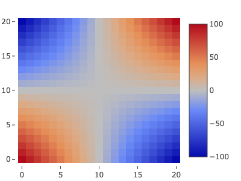

### Contour Plots
Adapted from PlotlyJS

```mathematica
data = Flatten[Table[{x,y,x y}, {x,-10,10}, {y,-10,10}],1] // Transpose;

data = <|
    "x" -> data[[1]],
    "y" -> data[[2]],
	"z" -> data[[3]],
	"type" -> "contour"
|>;

Plotly[data]
```

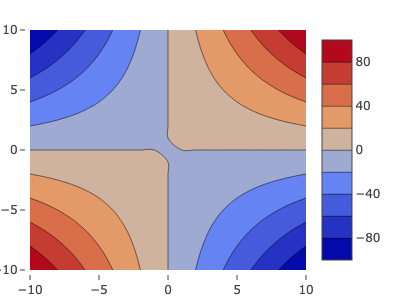


### Surface plot
Adapted from PlotlyJS

```mathematica
data = <|
	"z" -> Table[x y, {x,-10,10}, {y,-10,10}],
	"type" -> "surface"
|>;

Plotly[data]
```

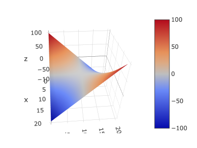

### WebGL Scatter
A GPU accelerated scatter plot used for displaying many points

```mathematica
data = RandomReal[{-1,1}, {2,100000}];

Plotly[<|
  "y" -> data[[2]],
  "x" -> data[[1]],
  "mode"-> "markers",
  "type"-> "scattergl"
|>]
```

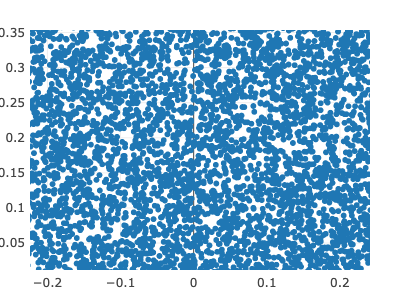

*50x zoom*

### Many more!
Please visit [PlotlyJS website](https://plotly.com/javascript/)


## TODO
Developers notes
- [ ] Integrate events system with click events and others...


## Supported output forms
- [StandardForm](frontend/Reference/Formatting/StandardForm.md)
- [WLXForm](frontend/Reference/Formatting/WLXForm.md)