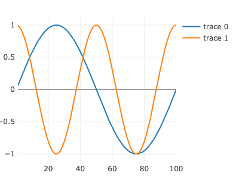

---
env:
  - Wolfram Kernel
source: https://github.com/JerryI/wljs-plotly/blob/dev/src/Kernel.wl

package: wljs-plotly
---
```mathematica
PlotlyAddTraces[p_PlotInstance, {data_Association} | _Association]
```

appends to a plot `p` new data specified in `data`.

:::tip
See the [official reference](https://plotly.com/javascript/plotlyjs-function-reference/)
:::

## Example
Plot an example data

```mathematica
p = Plotly[<|
  "x" -> Range[100],
  "y" -> Table[Sin[2Pi x / 100.0], {x,100}],
  "mode" -> "line"
|>]
```

To dynamically add new traces, we can call directly

```mathematica
PlotlyAddTraces[p, <|
  "x" -> Range[100],
  "y" -> Table[Cos[4Pi x / 100.0], {x,100}]
|>]
```



