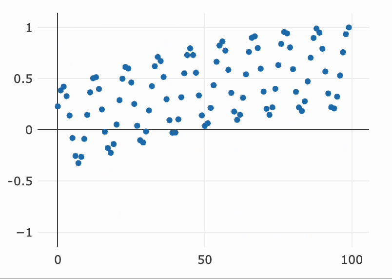

---
env:
  - Wolfram Kernel
context: Notebook`Kernel`PlotlyExtension`
package: wljs-plotly
source: https://github.com/JerryI/wljs-plotly/blob/dev/src/Kernel.wl
---
```mathematica
PlotlyAnimate[p_PlotlyInstance, data_Association, transition_Association]
```

animates efficiently any [Plotly](frontend/Reference/Plotly/Plotly.md) graph with a new `data` with a specified `transition`. 

:::tip
See the [official reference](https://plotly.com/javascript/plotlyjs-function-reference/)
:::

## Example
An example

```mathematica
p = Plotly[<|
  "y" -> Table[Sin[2Pi x / 100.0], {x,100}],
  "mode"-> "markers",
  "type"-> "scatter"
|>]
```

```mathematica
freq = 0.5;
task = SetInterval[
 PlotlyAnimate[p, 
  <|
    "data" -> {
      <|"y" -> Table[Sin[freq Pi x / 100.0], {x,100}]|>
    },
    "trace" -> {0},
    "layout" -> <||>
  |>,
  <|
    "transition" -> <|
      "duration"->30,
      "easing"->"linear"
    |>,
    
    "frame" -> <|
      "duration"->30
    |>
  |>
 ];

 freq += 0.3;
, 30];

SetTimeout[TaskRemove[task], 2000];
```


