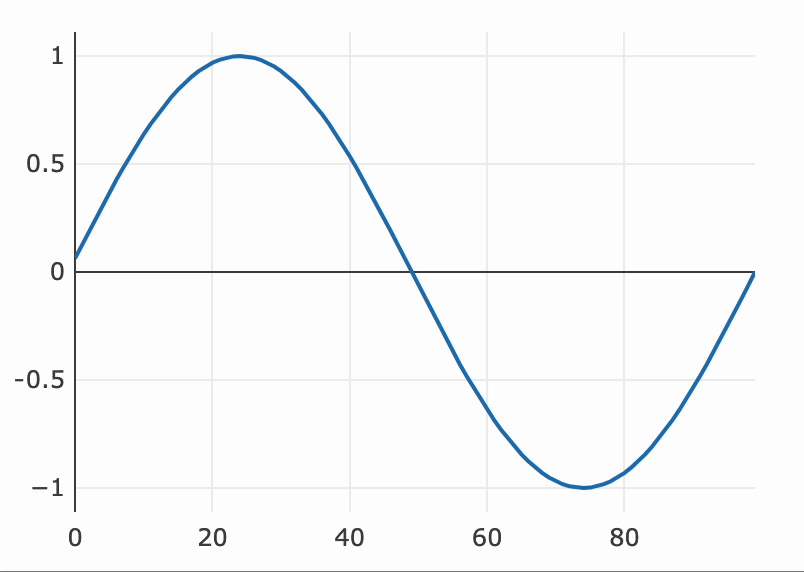

---
env:
  - Wolfram Kernel

source: https://github.com/JerryI/wljs-plotly/blob/dev/src/Kernel.wl
package: wljs-plotly
---
```mathematica
PlotlyExtendTraces[p_PlotlyInstance, data_Association, {target_Integer}, opts___]
```

appends new points `data` to a given trace indexed by `trace` number (starting from 0)

:::tip
See the [official reference](https://plotly.com/javascript/plotlyjs-function-reference/)
:::

## Options
### `"Window"`
By default, the `"Window"` option is set to `"Inherited"`. This setting *dynamically* uses the currently active window associated with the [`PlotlyInstance`](frontend/Reference/Plotly/PlotlyInstance.md).

When set to `"Inherited"`, even if a new window is opened using the same instance, it will be detected automatically. This is possible because all [`PlotlyInstance`](frontend/Reference/Plotly/PlotlyInstance.md) objects perform a handshake after mounting on the page.

To override this behavior, you can provide a specific [`WindowObj`](frontend/Reference/Frontend%20IO/WindowObj.md) as an option.

## Example
Create a dummy plot

```mathematica
p = Plotly[<|
  "y" -> Table[Sin[2Pi x / 100.0], {x,100}],
  "mode" -> "line"
|>]
```

now lets add data dynamically
```mathematica
task = SetInterval[
  PlotlyExtendTraces[p, <|
    "y" -> {{RandomReal[]}}
  |>, {0}]
, 100];

SetTimeout[TaskRemove[task], 2000];
```


