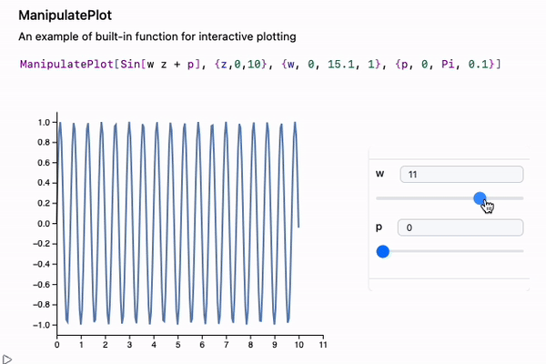

---
env:
  - Wolfram Kernel

package: wljs-manipulate
source: https://github.com/JerryI/wljs-manipulate/blob/main/Kernel.wl
---
```mathematica
ManipulatePlot[f_, {t, min, max}, {p1, min, max}, ..., opts___]
```

a dynamic alternative to [Plot](frontend/Reference/Plotting%20Functions/Plot.md) and Mathematica's `Manipulate`, that uses input elements and [Offload](frontend/Reference/Interpreter/Offload.md) technic to make a fast interactive plots of a given function `f[t, p1, p2...]` 

the set of parameters are not limited and accepts the following forms

```mathematica
ManipulatePlot[f_, {t, min, max}, {p1}, {p2}, ...]
```

```mathematica
ManipulatePlot[f_, {t, min, max}, {p1, min, max}, {p2}, ...]
```

```mathematica
ManipulatePlot[f_, {t, min, max}, {p1, min, max, step}, {p2}, ...]
```

```mathematica
ManipulatePlot[f_, {t, min, max}, {{p1, initial}, min, max}, {p2}, ...]
```

```mathematica
ManipulatePlot[f_, {t, min, max}, {{p1, initial, label}, min, max}, {p2}, ...]
```

```mathematica
ManipulatePlot[f_, {t, min, max}, {p1, values_List}, {p2}, ...]
```

```mathematica
ManipulatePlot[f_, {t, min, max}, {{p1, initial}, values_List}, {p2}, ...]
```

```mathematica
ManipulatePlot[f_, {t, min, max}, {{p1, initial, label}, values_List}, {p2}, ...]
```

where `f` can return `_Real` or `{__Real}`

## Options
### `"SamplingPoints"`
A number of points used in sampling. The default value is `200`

It inherits some of [Graphics](frontend/Reference/Graphics/Graphics.md) options as well

### `TransitionType`
See [TransitionType](frontend/Reference/Graphics/TransitionType.md)

### `TransitionDuration`
See [TransitionDuration](frontend/Reference/Graphics/TransitionDuration.md)

### `ImageSize`
Accepts `{width, height}`

### `PlotStyle`
Specifies colors for each curve

### `Epilog`
### `Prolog`
Appends graphics primitives to the plot. See [Graphics](frontend/Reference/Graphics/Graphics.md)

## Example
Plot the simplest sine function

```mathematica
ManipulatePlot[Sin[w z + p], {z,0,10}, {w, 0, 15.1, 1}, {p, 0, Pi, 0.1}]
```



Or give a choice to a user

```mathematica
ManipulatePlot[f[w z + p], {z,0,10}, {w, 0, 15.1, 1}, {p, 0, Pi, 0.1}, {f, {Sin, Cos}}]
```


## Issues

:::danger
Help needed!

There is no adaptive sampling implemented.
:::