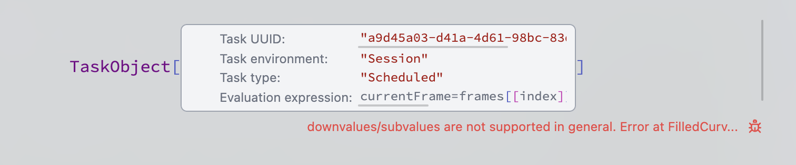

If something is not working as intended, please, post an [__issue on a Github__](https://github.com/JerryI/wolfram-js-frontend/issues) with the data evaluated on your Wolfram Engine, such as

```mathematica
$Version
$SystemID
```

and specify how you run an app (via Desktop App or as a script)

## Cache issues
Sometimes after an update browser's cache is still outdated. Please run (depending on your browser)

- `Ctrl` + `F5`
- `Shirt` + `F5`
- `Force Reload` (from the top menu of Desktop Application)
- `Reload window` (from the top menu of Desktop Application)
- `Clear cache and reload` (from the top menu of Desktop Application)

## Cells did not load correctly
It happens quite rare, when the asynchronous loading failed and scripts were executed in a wrong order.

Do __Force Reload__ of a window/page (from the main top menu or in your browser)

## Browsers console
Any errors caused by a cell evaluation will be shown below



By clicking on a bug sign you open JS dev tools

## Logs dump
If it does not violate your privacy, there is a `DEBUG` mode, which can be enabled at the startup. Follow the steps

1. Restart an app and click `DEBUG` in the launcher window
2. Do particular actions, which leads to your error
3. Close an App normally
4. A window a collected log file will open
5. Send it to us (direct message on Telegram, email or Github Issues)

## Hot line & general discussion chat
Please feel free to join [Telegram Group](https://t.me/+PBotB9UJw-hiZDEy).


:::tip
Send an issue to [Github](https://github.com/JerryI/wolfram-js-frontend/issues)
:::


