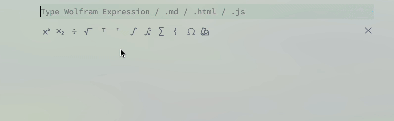

## Using shortcuts
You can enter and edit quite complex equations using just a few shortcuts 

<WLJSHTML>{`%3Cbr%20%2F%3E`}</WLJSHTML>

- `Alt+2`, `Cmd+2` hide/show input cell
- `Ctrl+/` make fraction on selected
- `Ctrl+6` make superscript on selected
- `Ctrl+2` make square root on selected
- `Ctrl+-` make subscript on selected

import { WLJSHTML, WLJSEditor, WLJSStore } from "@site/src/components/wljs-notebook-react";

<WLJSStore json={require('./attachments/4a2fd33c-dc2d-49ed-bae9-ef2d833cd2c9.txt').default} notebook={require('./attachments/notebook-4a2.wln').default}/>

- Ctrl+= make input form for semantic interpretation

This is a syntax sugar borrowed from Mathematica, but implemented in a much simpler way

<WLJSEditor display={"codemirror"} nid={"4a2fd33c-dc2d-49ed-bae9-ef2d833cd2c9"} id={"424533a4-283f-41e4-ad62-c6afef0bcdc3"} type={"Input"} opts={{}} >{`%28%2AFB%5B%2A%29%28%281%29%28%2A%2C%2A%29%2F%28%2A%2C%2A%29%282%29%29%28%2A%5DFB%2A%29`}</WLJSEditor>

If you copy and paste into a normal text editor, what you see is a normal Woflram Language code

<WLJSEditor display={"codemirror"} nid={"4a2fd33c-dc2d-49ed-bae9-ef2d833cd2c9"} id={"868ad28e-ed7e-40ab-884b-1e7dfe60e7be"} type={"Input"} opts={{}} >{`%28%2AFractionBox%5B%2A%29%28%281%29%28%2A%2C%2A%29%2F%28%2A%2C%2A%29%282%29%29%28%2A%5DFractionBox%2A%29`}</WLJSEditor>

Wolfram Kernel can generate them as well like you can expect in Mathematica

<WLJSEditor display={"codemirror"} nid={"4a2fd33c-dc2d-49ed-bae9-ef2d833cd2c9"} id={"a22ec10f-02d0-4fa5-a82e-bd060fc052db"} type={"Input"} opts={{}} >{`Series%5BSinc%5B%28%2ASqB%5B%2A%29Sqrt%5Bx%5D%28%2A%5DSqB%2A%29%5D%2C%20%7Bx%2C0%2C4%7D%5D%20%2F%2F%20Normal%20`}</WLJSEditor>

<WLJSEditor display={"codemirror"} nid={"4a2fd33c-dc2d-49ed-bae9-ef2d833cd2c9"} id={"63bf9ab2-4744-45af-a71a-b2288c1218ba"} type={"Output"} opts={{}} >{`1-%28%2AFB%5B%2A%29%28%28x%29%28%2A%2C%2A%29%2F%28%2A%2C%2A%29%286%29%29%28%2A%5DFB%2A%29%2B%28%28%2AFB%5B%2A%29%28%281%29%28%2A%2C%2A%29%2F%28%2A%2C%2A%29%28120%29%29%28%2A%5DFB%2A%29%29%20%28%28%2ASpB%5B%2A%29Power%5Bx%28%2A%7C%2A%29%2C%28%2A%7C%2A%292%5D%28%2A%5DSpB%2A%29%29-%28%2AFB%5B%2A%29%28%28%28%2ASpB%5B%2A%29Power%5Bx%28%2A%7C%2A%29%2C%28%2A%7C%2A%293%5D%28%2A%5DSpB%2A%29%29%28%2A%2C%2A%29%2F%28%2A%2C%2A%29%285040%29%29%28%2A%5DFB%2A%29%2B%28%2AFB%5B%2A%29%28%28%28%2ASpB%5B%2A%29Power%5Bx%28%2A%7C%2A%29%2C%28%2A%7C%2A%294%5D%28%2A%5DSpB%2A%29%29%28%2A%2C%2A%29%2F%28%2A%2C%2A%29%28362880%29%29%28%2A%5DFB%2A%29`}</WLJSEditor>

Here is another example

<WLJSEditor display={"codemirror"} nid={"4a2fd33c-dc2d-49ed-bae9-ef2d833cd2c9"} id={"ec4f08b1-7721-4163-8fc4-639ff75cc95b"} type={"Input"} opts={{}} >{`n%20%3D%20%28%2ASqB%5B%2A%29Sqrt%5B1%20-%20%28%2AFB%5B%2A%29%28%28%28%2ASpB%5B%2A%29Power%5B%28%2ASbB%5B%2A%29Subscript%5B%5C%5BOmega%5D%28%2A%7C%2A%29%2C%28%2A%7C%2A%29p%5D%28%2A%5DSbB%2A%29%28%2A%7C%2A%29%2C%28%2A%7C%2A%292%5D%28%2A%5DSpB%2A%29%29%28%2A%2C%2A%29%2F%28%2A%2C%2A%29%28%28%28%2ASpB%5B%2A%29Power%5B%28%2ASbB%5B%2A%29Subscript%5B%5C%5BOmega%5D%28%2A%7C%2A%29%2C%28%2A%7C%2A%290%5D%28%2A%5DSbB%2A%29%28%2A%7C%2A%29%2C%28%2A%7C%2A%292%5D%28%2A%5DSpB%2A%29%20-%204Pi%20%28%2ASpB%5B%2A%29Power%5B%5C%5BEta%5D%28%2A%7C%2A%29%2C%28%2A%7C%2A%292%5D%28%2A%5DSpB%2A%29%20%29%20-%202%20Pi%20I%20%5C%5BGamma%5D%20%5C%5BEta%5D%29%29%28%2A%5DFB%2A%29%20%20%5D%28%2A%5DSqB%2A%29%20%20%3B`}</WLJSEditor>

Then lets expand it into a series

<WLJSEditor display={"codemirror"} nid={"4a2fd33c-dc2d-49ed-bae9-ef2d833cd2c9"} id={"436975be-72d6-49a0-a2bf-097aab88ce48"} type={"Input"} opts={{}} >{`Series%5Bn%2C%20%7B%5C%5BEta%5D%2C%200%2C%201%7D%5D`}</WLJSEditor>

<WLJSEditor display={"codemirror"} nid={"4a2fd33c-dc2d-49ed-bae9-ef2d833cd2c9"} id={"6fa85d5d-2c3f-4d8d-896a-66881af762e2"} type={"Output"} opts={{}} >{`%28%2AVB%5B%2A%29%28SeriesData%5B%5C%5BEta%5D%2C%200%2C%20%7BSqrt%5B%28Subscript%5B%5C%5BOmega%5D%2C%200%5D%5E2%20-%20Subscript%5B%5C%5BOmega%5D%2C%20p%5D%5E2%29%2FSubscript%5B%5C%5BOmega%5D%2C%200%5D%5E2%5D%2C%20%28%28-I%29%2APi%2A%5C%5BGamma%5D%2ASubscript%5B%5C%5BOmega%5D%2C%20p%5D%5E2%2ASqrt%5B%28Subscript%5B%5C%5BOmega%5D%2C%200%5D%5E2%20-%20Subscript%5B%5C%5BOmega%5D%2C%20p%5D%5E2%29%2FSubscript%5B%5C%5BOmega%5D%2C%200%5D%5E2%5D%29%2F%28Subscript%5B%5C%5BOmega%5D%2C%200%5D%5E2%2A%28Subscript%5B%5C%5BOmega%5D%2C%200%5D%5E2%20-%20Subscript%5B%5C%5BOmega%5D%2C%20p%5D%5E2%29%29%7D%2C%200%2C%202%2C%201%5D%29%28%2A%2C%2A%29%28%2A%221%3AeJztVEtPwkAQRuPB%2BCsqp3atseUhwo0WyrtAtyBQegBboPLo9oFQ1N%2Fl33O7NUZPKAnxYrKZnfl2Mq9vM5djW5mcxGIx7wyLsr0wJqehdYFF0bB82%2B1a5ga%2B4VcaQEfQAAMd19doIIU6TWMUhVrL3piuFppj4rQeew%2BuhXxtmOOSYpYGL4BhieR0GujYCzDMFzRBUITR69%2BHRHtCYpQFzA2RR6g4hHUJKwRxoh4%2B5jPMSZlUkSIxOXIJSeqAGva2SIL%2BE%2FRDgpiIisz3xEfIfAjXf0HA54iuaNAlPwearmV6hZE%2F0qJZsRTHUs%2BvLJUgh9ej4dEgzufM6lZVG3YLLuV5v5S3B9MiLD%2FN07X7RaMipHrzsiAHcFetb9y6KnItfioF8hiKYjqwfLVduPN81bqtZ%2B1E0ytUAmNXavB%2ByeHkci%2BPhFK7uPE7qNapNtrKfCAJSF3aWyFlKUv0aK3ShioqfbkGkSy0C73MjJvFw7r0Lu4n2mfhdlPWC9M7DxVzZDRXi4Cgqrs23wF1eFes%22%2A%29%28%2A%5DVB%2A%29`}</WLJSEditor>

---

## Semantic input
This input box is a wrapper over `SemanticInterpretation` expresison, which uses __natural language__ to interprete the expression

<WLJSEditor display={"codemirror"} nid={"4a2fd33c-dc2d-49ed-bae9-ef2d833cd2c9"} id={"1e285f90-ca11-4f5c-ba4e-b7d3cbca6cc8"} type={"Input"} opts={{}} >{`%28%2ABB%5B%2A%29%28SemanticInterpretation%5B%22red%20horse%22%5D%29%28%2A%2C%2A%29%28%2A%221%3AeJxTTMoPSmNhYGAo5gcSAUX5ZZkpqSn%2BBSWZ%2BXnFaYwgCV4gEZaZWu6SmpxflFiSXxTMARQJTs1NzCvJTE5jAqkBmRBUmpMazAaSKinKzEsHi4UUlaaiqeACCSdm5kBUBYMklWKxqPFITUyBqpFAss8zryS1qKAotSQR5MRoJQAneDHG%22%2A%29%28%2A%5DBB%2A%29`}</WLJSEditor>

<WLJSEditor display={"codemirror"} nid={"4a2fd33c-dc2d-49ed-bae9-ef2d833cd2c9"} id={"e7a7e973-6d3e-4471-a3ff-31ce544a6278"} type={"Output"} opts={{}} >{`%28%2AVB%5B%2A%29%28Entity%5B%22Artwork%22%2C%20%22ChevalRougeRedHorse%3A%3AAlexanderCalder%22%5D%29%28%2A%2C%2A%29%28%2A%221%3AeJxTTMoPSmNkYGAoZgESHvk5KWnMIB4vkAjLTC13SU3OL0osyS8KZgOKuOaVZJZUBrMDmY5FJeX5RdnBPEC2c0ZqWWKOQlB%2BaXoqAPzKFL8%3D%22%2A%29%28%2A%5DVB%2A%29`}</WLJSEditor>

<WLJSEditor display={"codemirror"} nid={"4a2fd33c-dc2d-49ed-bae9-ef2d833cd2c9"} id={"6b54bea1-50e2-4474-8113-96318b92ca25"} type={"Input"} opts={{}} >{`%28%2AVB%5B%2A%29%28Entity%5B%22Artwork%22%2C%20%22ChevalRougeRedHorse%3A%3AAlexanderCalder%22%5D%29%28%2A%2C%2A%29%28%2A%221%3AeJxTTMoPSmNkYGAoZgESHvk5KWnMIB4vkAjLTC13SU3OL0osyS8KZgOKuOaVZJZUBrMDmY5FJeX5RdnBPEC2c0ZqWWKOQlB%2BaXoqAPzKFL8%3D%22%2A%29%28%2A%5DVB%2A%29%5B%22Image%22%5D`}</WLJSEditor>

<WLJSEditor display={"codemirror"} nid={"4a2fd33c-dc2d-49ed-bae9-ef2d833cd2c9"} id={"1ab741fc-b7af-4dfb-8b68-22227e3408cd"} type={"Output"} opts={{}} >{`%28%2AVB%5B%2A%29%28FrontEndRef%5B%22ad83ceee-b127-4a40-89a6-699d4991bec3%22%5D%29%28%2A%2C%2A%29%28%2A%221%3AeJxTTMoPSmNkYGAoZgESHvk5KRCeEJBwK8rPK3HNS3GtSE0uLUlMykkNVgEKJ6ZYGCenpqbqJhkameuaJJoY6FpYJprpmllapphYWhompSYbAwCPFhXi%22%2A%29%28%2A%5DVB%2A%29`}</WLJSEditor>

It comes handy when working with units

<WLJSEditor display={"codemirror"} nid={"4a2fd33c-dc2d-49ed-bae9-ef2d833cd2c9"} id={"d3dc6881-7b4e-421a-804f-c19fbf030225"} type={"Input"} opts={{}} >{`%28%2ABB%5B%2A%29%28SemanticInterpretation%5B%221%20inches%22%5D%29%28%2A%2C%2A%29%28%2A%221%3AeJxTTMoPSmNhYGAo5gcSAUX5ZZkpqSn%2BBSWZ%2BXnFaYwgCV4gEZaZWu6SmpxflFiSXxTMARQJTs1NzCvJTE5jAqkBmRBUmpMazAaSKinKzEsHi4UUlaaiqeACCSdm5kBUBYMklWKxqPFITUyBqpFAss8zryS1qKAotSQR5MRoJQAneDHG%22%2A%29%28%2A%5DBB%2A%29%20%2F%20%28%2ABB%5B%2A%29%28SemanticInterpretation%5B%22%202%20meters%22%5D%29%28%2A%2C%2A%29%28%2A%221%3AeJxTTMoPSmNhYGAo5gcSAUX5ZZkpqSn%2BBSWZ%2BXnFaYwgCV4gEZaZWu6SmpxflFiSXxTMARQJTs1NzCvJTE5jAqkBmRBUmpMazAaSKinKzEsHi4UUlaaiqeACCSdm5kBUBYMklWKxqPFITUyBqpFAss8zryS1qKAotSQR5MRoJQAneDHG%22%2A%29%28%2A%5DBB%2A%29`}</WLJSEditor>

<WLJSEditor display={"codemirror"} nid={"4a2fd33c-dc2d-49ed-bae9-ef2d833cd2c9"} id={"fbeb049c-4fbc-4e59-9bd6-559d50de0758"} type={"Output"} opts={{}} >{`%28%2AFB%5B%2A%29%28%28127%29%28%2A%2C%2A%29%2F%28%2A%2C%2A%29%2810000%29%29%28%2A%5DFB%2A%29`}</WLJSEditor>

## Using command palette
One can use a helper palette - `Special characters` panel for typing various mathematical operations

and then

For example

<WLJSEditor display={"codemirror"} nid={"4a2fd33c-dc2d-49ed-bae9-ef2d833cd2c9"} id={"bc5e85db-6257-4ffb-ba3e-71bbd7afbfd6"} type={"Input"} opts={{}} >{`%28%2ATB%5B%2A%29Integrate%5B%28%2A%7C%2A%29Sin%5Bx%5D%28%2A%7C%2A%29%2C%20%28%2A%7C%2A%29x%28%2A%7C%2A%29%5D%28%2A%7C%2A%29%28%2A1%3AeJxTTMoPSmNiYGAo5gESnnklqelFiSWpTvkVmYwgUVYg4ZaYU5wKAMfBCcU%3D%2A%29%28%2A%5DTB%2A%29`}</WLJSEditor>

<WLJSEditor display={"codemirror"} nid={"4a2fd33c-dc2d-49ed-bae9-ef2d833cd2c9"} id={"7f149281-cdd3-4c7d-9b1b-1beb1ad5909e"} type={"Output"} opts={{}} >{`-Cos%5Bx%5D`}</WLJSEditor>

Or with defined boundaries

<WLJSEditor display={"codemirror"} nid={"4a2fd33c-dc2d-49ed-bae9-ef2d833cd2c9"} id={"ef408c55-3ccb-47bc-b936-6b1a9cc73ba8"} type={"Input"} opts={{}} >{`%28%2ATB%5B%2A%29Integrate%5B%28%2A%7C%2A%29Sin%5Bx%5D%28%2A%7C%2A%29%2C%20%7B%28%2A%7C%2A%29x%28%2A%7C%2A%29%2C%28%2A%7C%2A%29B%28%2A%7C%2A%29%2C%28%2A%7C%2A%29A%28%2A%7C%2A%29%7D%5D%28%2A%7C%2A%29%28%2A1%3AeJxTTMoPSmNiYGAo5gESnnklqelFiSWpTvkVmYwgURYgEVJUmgoAvmMJeQ%3D%3D%2A%29%28%2A%5DTB%2A%29`}</WLJSEditor>

<WLJSEditor display={"codemirror"} nid={"4a2fd33c-dc2d-49ed-bae9-ef2d833cd2c9"} id={"6c6178b9-96c9-46a2-b7e2-99cff347f2c6"} type={"Output"} opts={{}} >{`-Cos%5BA%5D%2BCos%5BB%5D`}</WLJSEditor>

One can also use `InputForm` for taking integrals

<WLJSEditor display={"codemirror"} nid={"4a2fd33c-dc2d-49ed-bae9-ef2d833cd2c9"} id={"0a92283b-1af6-4495-9f72-650028444673"} type={"Input"} opts={{}} >{`Integrate%5BSin%5Bx%5D%2C%20x%5D`}</WLJSEditor>

<WLJSEditor display={"codemirror"} nid={"4a2fd33c-dc2d-49ed-bae9-ef2d833cd2c9"} id={"65fb2c30-a38a-42c5-818f-220f01c793df"} type={"Output"} opts={{}} >{`-Cos%5Bx%5D`}</WLJSEditor>

### Derivatives
It works in the same way

<WLJSEditor display={"codemirror"} nid={"4a2fd33c-dc2d-49ed-bae9-ef2d833cd2c9"} id={"3264fd2a-aa39-44ad-aa37-d73a5f58acef"} type={"Output"} opts={{}} >{`Cos%5Bx%5D`}</WLJSEditor>

Derivative of an undefined function holds it form

<WLJSEditor display={"codemirror"} nid={"4a2fd33c-dc2d-49ed-bae9-ef2d833cd2c9"} id={"a9ceae26-efa0-4390-b6d3-06c45dab89e8"} type={"Input"} opts={{}} >{`D%5Bf%5Bx%5D%2C%20x%5D`}</WLJSEditor>

<WLJSEditor display={"codemirror"} nid={"4a2fd33c-dc2d-49ed-bae9-ef2d833cd2c9"} id={"b76f8105-d2f9-4625-b542-29dc0804aeaf"} type={"Input"} opts={{}} >{`%28f%27%29%5Bx%5D%20%2F.%20%7Bf%20-%3E%20Sin%7D`}</WLJSEditor>

<WLJSEditor display={"codemirror"} nid={"4a2fd33c-dc2d-49ed-bae9-ef2d833cd2c9"} id={"db53c598-723e-4ee3-b86f-51919db0e727"} type={"Output"} opts={{}} >{`Cos%5Bx%5D`}</WLJSEditor>

### Series
Symbolic series is also supported

<WLJSEditor display={"codemirror"} nid={"4a2fd33c-dc2d-49ed-bae9-ef2d833cd2c9"} id={"8b884284-ad8f-42ca-98d6-4e1fe5a7944d"} type={"Input"} opts={{}} >{`%28%2ATB%5B%2A%29Sum%5B%28%2A%7C%2A%29%28%2ASpB%5B%2A%29Power%5Bx%28%2A%7C%2A%29%2C%28%2A%7C%2A%292%5D%28%2A%5DSpB%2A%29%28%2A%7C%2A%29%2C%20%7B%28%2A%7C%2A%29x%28%2A%7C%2A%29%2C%28%2A%7C%2A%29xmin%28%2A%7C%2A%29%2C%28%2A%7C%2A%29xmax%28%2A%7C%2A%29%7D%5D%28%2A%7C%2A%29%28%2A1%3AeJxTTMoPSmNiYGAoZgMSwaW5TvkVmYwgPguQCCkqTQUAeAcHBQ%3D%3D%2A%29%28%2A%5DTB%2A%29`}</WLJSEditor>

<WLJSEditor display={"codemirror"} nid={"4a2fd33c-dc2d-49ed-bae9-ef2d833cd2c9"} id={"5e9d8813-bd5f-40ee-afa6-d60759a37026"} type={"Output"} opts={{}} >{`%28%28%2AFB%5B%2A%29%28%281%29%28%2A%2C%2A%29%2F%28%2A%2C%2A%29%286%29%29%28%2A%5DFB%2A%29%29%20%281%2Bxmax-xmin%29%20%28xmax%2B2%20%28%28%2ASpB%5B%2A%29Power%5Bxmax%28%2A%7C%2A%29%2C%28%2A%7C%2A%292%5D%28%2A%5DSpB%2A%29%29-xmin%2B2%20xmax%20xmin%2B2%20%28%28%2ASpB%5B%2A%29Power%5Bxmin%28%2A%7C%2A%29%2C%28%2A%7C%2A%292%5D%28%2A%5DSpB%2A%29%29%29`}</WLJSEditor>

Input form is following

<WLJSEditor display={"codemirror"} nid={"4a2fd33c-dc2d-49ed-bae9-ef2d833cd2c9"} id={"771f1cfd-50eb-4121-9f8c-1addedba884d"} type={"Input"} opts={{}} >{`Sum%5B%28%2ASpB%5B%2A%29Power%5Bx%28%2A%7C%2A%29%2C%28%2A%7C%2A%292%5D%28%2A%5DSpB%2A%29%2C%20%7Bx%2C%20xmin%2C%20xmax%7D%5D`}</WLJSEditor>

<WLJSEditor display={"codemirror"} nid={"4a2fd33c-dc2d-49ed-bae9-ef2d833cd2c9"} id={"dc04a205-e894-4473-8959-ac5c7016ab43"} type={"Output"} opts={{}} >{`%28%28%2AFB%5B%2A%29%28%281%29%28%2A%2C%2A%29%2F%28%2A%2C%2A%29%286%29%29%28%2A%5DFB%2A%29%29%20%281%2Bxmax-xmin%29%20%28xmax%2B2%20%28%28%2ASpB%5B%2A%29Power%5Bxmax%28%2A%7C%2A%29%2C%28%2A%7C%2A%292%5D%28%2A%5DSpB%2A%29%29-xmin%2B2%20xmax%20xmin%2B2%20%28%28%2ASpB%5B%2A%29Power%5Bxmin%28%2A%7C%2A%29%2C%28%2A%7C%2A%292%5D%28%2A%5DSpB%2A%29%29%29`}</WLJSEditor>

### Piecewise
Piecewise given functions can also be constructed and differentiated

<WLJSEditor display={"codemirror"} nid={"4a2fd33c-dc2d-49ed-bae9-ef2d833cd2c9"} id={"70ddf667-29e2-4253-9cde-b1e4236813e8"} type={"Input"} opts={{}} >{`Plot%5B%20%28%2ATB%5B%2A%29Piecewise%5B%7B%7B%28%2A%7C%2A%29Sin%5Bx%5D%28%2A%7C%2A%29%2C%28%2A%7C%2A%29x%20%3E%200%28%2A%7C%2A%29%7D%2C%7B%28%2A%7C%2A%290%28%2A%7C%2A%29%2C%28%2A%7C%2A%29True%28%2A%7C%2A%29%7D%7D%5D%28%2A%7C%2A%29%28%2A1%3AeJxTTMoPSmNkYGAo5gESAZmpyanlmcWpTvkVmUxAAQBzVQdd%2A%29%28%2A%5DTB%2A%29%20%2C%20%7Bx%2C-10%2C10%7D%5D`}</WLJSEditor>

<WLJSEditor display={"codemirror"} nid={"4a2fd33c-dc2d-49ed-bae9-ef2d833cd2c9"} id={"e15118f1-c092-4632-be8d-879aba80e01c"} type={"Output"} opts={{}} >{`%28%2AVB%5B%2A%29%28FrontEndRef%5B%2241a0ff8e-cf3a-4b6c-b31f-822a69cfc2ac%22%5D%29%28%2A%2C%2A%29%28%2A%221%3AeJxTTMoPSmNkYGAoZgESHvk5KRCeEJBwK8rPK3HNS3GtSE0uLUlMykkNVgEKmxgmGqSlWaTqJqcZJ%2BqaJJkl6yYZG6bpWhgZJZpZJqclGyUmAwCS7RaI%22%2A%29%28%2A%5DVB%2A%29`}</WLJSEditor>

### Matrixes
There is a special snippet, which can help you to work with them. Type `Insert Matrix` in a command palette

<WLJSEditor display={"codemirror"} nid={"4a2fd33c-dc2d-49ed-bae9-ef2d833cd2c9"} id={"3f6cb392-ed4d-4435-a4df-a02102668499"} type={"Input"} opts={{}} >{`%28%28%2AGB%5B%2A%29%7B%7B1%28%2A%7C%2A%29%2C%28%2A%7C%2A%290%28%2A%7C%2A%29%2C%28%2A%7C%2A%290%7D%28%2A%7C%7C%2A%29%2C%28%2A%7C%7C%2A%29%7B0%28%2A%7C%2A%29%2C%28%2A%7C%2A%29a%28%2A%7C%2A%29%2C%28%2A%7C%2A%290%7D%28%2A%7C%7C%2A%29%2C%28%2A%7C%7C%2A%29%7B0%28%2A%7C%2A%29%2C%28%2A%7C%2A%290%28%2A%7C%2A%29%2C%28%2A%7C%2A%291%7D%7D%28%2A%5DGB%2A%29%29.%28%28%2AGB%5B%2A%29%7B%7B0%28%2A%7C%2A%29%2C%28%2A%7C%2A%290%28%2A%7C%2A%29%2C%28%2A%7C%2A%291%7D%28%2A%7C%7C%2A%29%2C%28%2A%7C%7C%2A%29%7B1%28%2A%7C%2A%29%2C%28%2A%7C%2A%290%28%2A%7C%2A%29%2C%28%2A%7C%2A%291%7D%28%2A%7C%7C%2A%29%2C%28%2A%7C%7C%2A%29%7B1%28%2A%7C%2A%29%2C%28%2A%7C%2A%290%28%2A%7C%2A%29%2C%28%2A%7C%2A%290%7D%7D%28%2A%5DGB%2A%29%29%20%2F%2F%20MatrixForm`}</WLJSEditor>

<WLJSEditor display={"codemirror"} nid={"4a2fd33c-dc2d-49ed-bae9-ef2d833cd2c9"} id={"b63398a6-eab8-4019-be22-92d7d7e0c43c"} type={"Output"} opts={{}} >{`%28%28%2AGB%5B%2A%29%7B%7B0%28%2A%7C%2A%29%2C%28%2A%7C%2A%290%28%2A%7C%2A%29%2C%28%2A%7C%2A%291%7D%28%2A%7C%7C%2A%29%2C%28%2A%7C%7C%2A%29%7Ba%28%2A%7C%2A%29%2C%28%2A%7C%2A%290%28%2A%7C%2A%29%2C%28%2A%7C%2A%29a%7D%28%2A%7C%7C%2A%29%2C%28%2A%7C%7C%2A%29%7B1%28%2A%7C%2A%29%2C%28%2A%7C%2A%290%28%2A%7C%2A%29%2C%28%2A%7C%2A%290%7D%7D%28%2A%5DGB%2A%29%29`}</WLJSEditor>

### Greek letters
To enter Greek's symbols use ESC key and type the first letter. The autocomplete will suggest the corresponding letter. Or use `Special Characters` tool from the command palette

<WLJSEditor display={"codemirror"} nid={"4a2fd33c-dc2d-49ed-bae9-ef2d833cd2c9"} id={"ea03df7c-a73c-4e5c-aeab-c994973a74b4"} type={"Input"} opts={{}} >{`%28%2ASpB%5B%2A%29Power%5B%7B%5C%5BAlpha%5D%2C%20%5C%5BBeta%5D%2C%20%5C%5BGamma%5D%7D%28%2A%7C%2A%29%2C%28%2A%7C%2A%292%5D%28%2A%5DSpB%2A%29`}</WLJSEditor>

<WLJSEditor display={"codemirror"} nid={"4a2fd33c-dc2d-49ed-bae9-ef2d833cd2c9"} id={"b4f1c33a-7228-40ef-8f67-de82d02d9752"} type={"Output"} opts={{}} >{`%7B%28%2ASpB%5B%2A%29Power%5B%5C%5BAlpha%5D%28%2A%7C%2A%29%2C%28%2A%7C%2A%292%5D%28%2A%5DSpB%2A%29%2C%28%2ASpB%5B%2A%29Power%5B%5C%5BBeta%5D%28%2A%7C%2A%29%2C%28%2A%7C%2A%292%5D%28%2A%5DSpB%2A%29%2C%28%2ASpB%5B%2A%29Power%5B%5C%5BGamma%5D%28%2A%7C%2A%29%2C%28%2A%7C%2A%292%5D%28%2A%5DSpB%2A%29%7D`}</WLJSEditor>

### Crazy and useless things
For colors and dates the decorations are also supported. For example

<WLJSEditor display={"codemirror"} nid={"4a2fd33c-dc2d-49ed-bae9-ef2d833cd2c9"} id={"c1e7c07a-47c2-4ae4-a8eb-cfb493f97693"} type={"Input"} opts={{}} >{`Table%5BRGBColor%5Bi%2Cj%2C1%5D%2C%20%7Bi%2C0%2C1%2C0.3%7D%2C%20%7Bj%2C0%2C1%2C0.3%7D%5D%20%2F%2F%20TableForm%20%20`}</WLJSEditor>

<WLJSEditor display={"codemirror"} nid={"4a2fd33c-dc2d-49ed-bae9-ef2d833cd2c9"} id={"ff0a70c1-79e9-451a-b679-fc89905eb1a5"} type={"Output"} opts={{}} >{`%28%2AGB%5B%2A%29%7B%7B%28%2AVB%5B%2A%29%28RGBColor%5B0.%2C%200.%2C%201%5D%29%28%2A%2C%2A%29%28%2A%221%3AeJxTTMoPSmNkYGAoZgESHvk5KRCeGJAIcndyzs%2FJLwouTyxJzghJzS3ISSxJTWMGyXMgyRcxQAE644M9APZHE10%3D%22%2A%29%28%2A%5DVB%2A%29%28%2A%7C%2A%29%2C%28%2A%7C%2A%29%28%2AVB%5B%2A%29%28RGBColor%5B0.%2C%200.3%2C%201%5D%29%28%2A%2C%2A%29%28%2A%221%3AeJxTTMoPSmNkYGAoZgESHvk5KRCeGJAIcndyzs%2FJLwouTyxJzghJzS3ISSxJTWMGyXMgyRcxQEGRMRhctoeKfLAHABMyFaE%3D%22%2A%29%28%2A%5DVB%2A%29%28%2A%7C%2A%29%2C%28%2A%7C%2A%29%28%2AVB%5B%2A%29%28RGBColor%5B0.%2C%200.6%2C%201%5D%29%28%2A%2C%2A%29%28%2A%221%3AeJxTTMoPSmNkYGAoZgESHvk5KRCeGJAIcndyzs%2FJLwouTyxJzghJzS3ISSxJTWMGyXMgyRcxQEGRMRg8toeKfLAHABPiFbE%3D%22%2A%29%28%2A%5DVB%2A%29%28%2A%7C%2A%29%2C%28%2A%7C%2A%29%28%2AVB%5B%2A%29%28RGBColor%5B0.%2C%200.8999999999999999%2C%201%5D%29%28%2A%2C%2A%29%28%2A%221%3AeJxTTMoPSmNkYGAoZgESHvk5KRCeGJAIcndyzs%2FJLwouTyxJzghJzS3ISSxJTWMGyXMgyRcxQEHRGTB4Yw8V%2BWAPAEhEGVA%3D%22%2A%29%28%2A%5DVB%2A%29%7D%28%2A%7C%7C%2A%29%2C%28%2A%7C%7C%2A%29%7B%28%2AVB%5B%2A%29%28RGBColor%5B0.3%2C%200.%2C%201%5D%29%28%2A%2C%2A%29%28%2A%221%3AeJxTTMoPSmNkYGAoZgESHvk5KRCeGJAIcndyzs%2FJLwouTyxJzghJzS3ISSxJTWMGyXMgyRcZg8Fl%2ByIGKIAyPtgDACeWFaE%3D%22%2A%29%28%2A%5DVB%2A%29%28%2A%7C%2A%29%2C%28%2A%7C%2A%29%28%2AVB%5B%2A%29%28RGBColor%5B0.3%2C%200.3%2C%201%5D%29%28%2A%2C%2A%29%28%2A%221%3AeJxTTMoPSmNkYGAoZgESHvk5KRCeGJAIcndyzs%2FJLwouTyxJzghJzS3ISSxJTWMGyXMgyRcZg8FlewSDAQw%2B2AMARHIX5Q%3D%3D%22%2A%29%28%2A%5DVB%2A%29%28%2A%7C%2A%29%2C%28%2A%7C%2A%29%28%2AVB%5B%2A%29%28RGBColor%5B0.3%2C%200.6%2C%201%5D%29%28%2A%2C%2A%29%28%2A%221%3AeJxTTMoPSmNkYGAoZgESHvk5KRCeGJAIcndyzs%2FJLwouTyxJzghJzS3ISSxJTWMGyXMgyRcZg8FleyjjsX0RAxh8sAcARSIX9Q%3D%3D%22%2A%29%28%2A%5DVB%2A%29%28%2A%7C%2A%29%2C%28%2A%7C%2A%29%28%2AVB%5B%2A%29%28RGBColor%5B0.3%2C%200.8999999999999999%2C%201%5D%29%28%2A%2C%2A%29%28%2A%221%3AeJxTTMoPSmNkYGAoZgESHvk5KRCeGJAIcndyzs%2FJLwouTyxJzghJzS3ISSxJTWMGyXMgyRcZg8Fl%2B6IzYPDGvogBDD7YAwB5hBuU%22%2A%29%28%2A%5DVB%2A%29%7D%28%2A%7C%7C%2A%29%2C%28%2A%7C%7C%2A%29%7B%28%2AVB%5B%2A%29%28RGBColor%5B0.6%2C%200.%2C%201%5D%29%28%2A%2C%2A%29%28%2A%221%3AeJxTTMoPSmNkYGAoZgESHvk5KRCeGJAIcndyzs%2FJLwouTyxJzghJzS3ISSxJTWMGyXMgyRcZg8Fj%2ByIGKIAyPtgDACjWFbE%3D%22%2A%29%28%2A%5DVB%2A%29%28%2A%7C%2A%29%2C%28%2A%7C%2A%29%28%2AVB%5B%2A%29%28RGBColor%5B0.6%2C%200.3%2C%201%5D%29%28%2A%2C%2A%29%28%2A%221%3AeJxTTMoPSmNkYGAoZgESHvk5KRCeGJAIcndyzs%2FJLwouTyxJzghJzS3ISSxJTWMGyXMgyRcZg8Fjeyjjsn0RAxh8sAcARbIX9Q%3D%3D%22%2A%29%28%2A%5DVB%2A%29%28%2A%7C%2A%29%2C%28%2A%7C%2A%29%28%2AVB%5B%2A%29%28RGBColor%5B0.6%2C%200.6%2C%201%5D%29%28%2A%2C%2A%29%28%2A%221%3AeJxTTMoPSmNkYGAoZgESHvk5KRCeGJAIcndyzs%2FJLwouTyxJzghJzS3ISSxJTWMGyXMgyRcZg8FjewSDAQw%2B2AMARmIYBQ%3D%3D%22%2A%29%28%2A%5DVB%2A%29%28%2A%7C%2A%29%2C%28%2A%7C%2A%29%28%2AVB%5B%2A%29%28RGBColor%5B0.6%2C%200.8999999999999999%2C%201%5D%29%28%2A%2C%2A%29%28%2A%221%3AeJxTTMoPSmNkYGAoZgESHvk5KRCeGJAIcndyzs%2FJLwouTyxJzghJzS3ISSxJTWMGyXMgyRcZg8Fj%2B6IzYPDGvogBDD7YAwB6xBuk%22%2A%29%28%2A%5DVB%2A%29%7D%28%2A%7C%7C%2A%29%2C%28%2A%7C%7C%2A%29%7B%28%2AVB%5B%2A%29%28RGBColor%5B0.8999999999999999%2C%200.%2C%201%5D%29%28%2A%2C%2A%29%28%2A%221%3AeJxTTMoPSmNkYGAoZgESHvk5KRCeGJAIcndyzs%2FJLwouTyxJzghJzS3ISSxJTWMGyXMgyRedAYM39kUMUABlfLAHAH3PGVA%3D%22%2A%29%28%2A%5DVB%2A%29%28%2A%7C%2A%29%2C%28%2A%7C%2A%29%28%2AVB%5B%2A%29%28RGBColor%5B0.8999999999999999%2C%200.3%2C%201%5D%29%28%2A%2C%2A%29%28%2A%221%3AeJxTTMoPSmNkYGAoZgESHvk5KRCeGJAIcndyzs%2FJLwouTyxJzghJzS3ISSxJTWMGyXMgyRedAYM39kXGYHDZvogBDD7YAwCaqxuU%22%2A%29%28%2A%5DVB%2A%29%28%2A%7C%2A%29%2C%28%2A%7C%2A%29%28%2AVB%5B%2A%29%28RGBColor%5B0.8999999999999999%2C%200.6%2C%201%5D%29%28%2A%2C%2A%29%28%2A%221%3AeJxTTMoPSmNkYGAoZgESHvk5KRCeGJAIcndyzs%2FJLwouTyxJzghJzS3ISSxJTWMGyXMgyRedAYM39kXGYPDYvogBDD7YAwCbWxuk%22%2A%29%28%2A%5DVB%2A%29%28%2A%7C%2A%29%2C%28%2A%7C%2A%29%28%2AVB%5B%2A%29%28RGBColor%5B0.8999999999999999%2C%200.8999999999999999%2C%201%5D%29%28%2A%2C%2A%29%28%2A%221%3AeJxTTMoPSmNkYGAoZgESHvk5KRCeGJAIcndyzs%2FJLwouTyxJzghJzS3ISSxJTWMGyXMgyRedAYM39ggGAxh8sAcAz70fQw%3D%3D%22%2A%29%28%2A%5DVB%2A%29%7D%7D%28%2A%5DGB%2A%29`}</WLJSEditor>

## Misc
Other syntax sugar

<WLJSEditor display={"codemirror"} nid={"4a2fd33c-dc2d-49ed-bae9-ef2d833cd2c9"} id={"04e0a1cb-49d8-4a54-97aa-52913ccb03dd"} type={"Input"} opts={{}} >{`ColorData%5B24%5D`}</WLJSEditor>

<WLJSEditor display={"codemirror"} nid={"4a2fd33c-dc2d-49ed-bae9-ef2d833cd2c9"} id={"e341930a-dc1c-40e2-9137-6e903e9834b9"} type={"Output"} opts={{}} >{`ColorDataFunction%5B%28%2AVB%5B%2A%29%2024%2C%20%22Indexed%22%2C%20%7B1%2C%2010%2C%201%7D%2C%20%7BRGBColor%5B0.9215686274509803%2C%200.49411764705882355%2C%200.43137254901960786%5D%2C%20RGBColor%5B1.%2C%200.7215686274509804%2C%200.2196078431372549%5D%2C%20RGBColor%5B0.9490196078431372%2C%200.8627450980392157%2C%200.43529411764705883%5D%2C%20RGBColor%5B0.6705882352941176%2C%200.8784313725490196%2C%200.9372549019607843%5D%2C%20RGBColor%5B0.3176470588235294%2C%200.6549019607843137%2C%200.7529411764705882%5D%2C%20RGBColor%5B0.12941176470588237%2C%200.5176470588235295%2C%200.6313725490196078%5D%2C%20RGBColor%5B0.09019607843137255%2C%200.33725490196078434%2C%200.49411764705882355%5D%2C%20RGBColor%5B0.7058823529411765%2C%200.49411764705882355%2C%200.5450980392156862%5D%2C%20RGBColor%5B0.5333333333333333%2C%200.23529411764705882%2C%200.3058823529411765%5D%2C%20RGBColor%5B0.8941176470588236%2C%200.7098039215686275%2C%200.7490196078431373%5D%7D%5B%5BMod%5BFloor%5B%231%5D%2C%2010%2C%201%5D%5D%5D%20%26%20%20%28%2A%2C%2A%29%28%2A%221%3AeJylU0uzmjAYta%2FpYzrTZWe6ahcsnQGUW%2B2OKOIFFS8RLK4aJCAlEAxw1Z%2FWf9dEr62ddqbO3M3Jl%2FM9zgkkn0Lqxs9arVb1gQOg%2BxFl%2BTedMVQkOIJNniN24HT8RNS84zBitKiNIvJTVjeInBLPOYwpiY7BjBY4fnqmJ2lV%2F2v3%2FkLvQee2xrmf4h18yXO3RYT3Xz6eit9wMKK0pkzkT5qiyIljQlF0Il5z8NzJEK9phKHoU7u%2Fld2GYPhKBBhFTkEOR3bBGvx%2FP6JtQAll1SMNKfL1hq7%2FXEJnjgiua%2FwIfz84J6k9SdUBkDTAV0ntHwnB%2BX9w50vg4vhIq8pajpR%2Bp9%2FuRypud5XPvXbYD%2BU2QoosY%2BVGkdUuL5O04XkonzS40NDFEKmjY2u%2FWEzpHOazLDB1ukoMOL7PNNsdYMMCO7vH5nZnPIMds4aG3Ew8Mj1k2cxPDNs8BGEJNsgk99vlNghKvEWmVYY3g9XK2hTUSgNkbtLMLOmKrytdB73QXfSEsUsn2tD%2FddRrzabCrJZM4Q4ufQdlzXZdaG6QEUkFnne3doPE8CHKFDYFvn2Xlw76atkBcOBBZ6RJF8Vou%2Fxu4%2BkwH5neknc5kaZtlh5JdU9PBrQANfnbKHgwes21qt7yAJao4H8vn%2BC4rl6I94xIhX8CVVwLAA%3D%3D%22%2A%29%28%2A%5DVB%2A%29%5D`}</WLJSEditor>

Bytes, dates and etc

<WLJSEditor display={"codemirror"} nid={"4a2fd33c-dc2d-49ed-bae9-ef2d833cd2c9"} id={"b9a3c0c8-4e26-4b10-b127-0424633efe64"} type={"Input"} opts={{}} >{`Now`}</WLJSEditor>

<WLJSEditor display={"codemirror"} nid={"4a2fd33c-dc2d-49ed-bae9-ef2d833cd2c9"} id={"5e61c0e1-9f53-4f3b-a61b-0f0cfcb6a1b5"} type={"Output"} opts={{}} >{`%28%2AVB%5B%2A%29%28DateObject%5B%7B2024%2C12%2C15%2C15%2C52%2C36.657673%608.316739872172858%7D%2C%22Instant%22%2C%22Gregorian%22%2C1.%60%5D%29%28%2A%2C%2A%29%28%2A%221%3AeJxTTMoPSmNkYGAoZgESHvk5KRCeEJBwSSxJ9U%2FKSk0uCUnNLcgB8oKlgMJKwaV5CoamCi6pyQpGBkYmQLaVqZGVsZkSAKz0EfI%3D%22%2A%29%28%2A%5DVB%2A%29`}</WLJSEditor>

<WLJSEditor display={"codemirror"} nid={"4a2fd33c-dc2d-49ed-bae9-ef2d833cd2c9"} id={"de34c9c3-aeba-4558-8f6b-ea15b02ac4ce"} type={"Input"} opts={{}} >{`ByteArray%5B%7B1%2C2%2C4%7D%5D`}</WLJSEditor>

<WLJSEditor display={"codemirror"} nid={"4a2fd33c-dc2d-49ed-bae9-ef2d833cd2c9"} id={"f894fb02-a70a-4139-b927-b8c9e9b4a159"} type={"Output"} opts={{}} >{`ByteArray%5B%28%2AVB%5B%2A%29%20%22AQIE%22%20%28%2A%2C%2A%29%28%2A%221%3AeJxdUUtTgzAQru%2FHxaMznvSQexvLjHoLVGoBW23oi5ORBIwFUgMMtL%2FRH2WAOna8fLvfY7I7m5t3MQ4OWq1WeqVAF6UpZPyGpCRJyCjO45jItZKDvSpzocCUIskeEzrlMstJ1BiHCp5EROtmKBL2Jzs8zf6x%2FYpd7szbzhlkLJ5yVuBj5WG%2BYQ%2FXTfZcwSPlmZCV3bx2omAUBJEgtBHOFEzGTo%2F5gjL8rRiAdwAiXQeariqA97UAOx0IYFtJ8FdSnrGTQFUI3CJmla77LF5wPOSLPhJa6GM0mWuet1x94QRAXcczT5V5YpJFERrjRdj1%2BsGycD78V9vqWjbfOGV7BaBZ2KlVuHjQtVafthgafidGMDeMYjaJMDFCRFnJZ%2FVOO3toPX27enOI6oTjPGL4tGoYoaMkWteqK3OWHlX%2FQ6KU%2FQA5C3k3%22%2A%29%28%2A%5DVB%2A%29%5D`}</WLJSEditor>

Time series with a preview

<WLJSEditor display={"codemirror"} nid={"4a2fd33c-dc2d-49ed-bae9-ef2d833cd2c9"} id={"7203d43e-6269-46e8-9f40-dfb27952dc3c"} type={"Input"} opts={{}} >{`TimeSeries%5BRandomVariate%5BNormalDistribution%5B%5D%2C100%5D%5D`}</WLJSEditor>

<WLJSEditor display={"codemirror"} nid={"4a2fd33c-dc2d-49ed-bae9-ef2d833cd2c9"} id={"8924123b-c55f-41df-ad84-ce33a78a50cb"} type={"Output"} opts={{}} >{`TimeSeries%5B%28%2AVB%5B%2A%29%20TemporalData%5BTimeSeries%2C%20%7B%7B%7B-0.09156003455617837%2C%200.680941656068737%2C%200.6278038681296004%2C%202.4671789762095706%2C%200.7878619370518211%2C%200.05826957639155879%2C%20-0.7446280931655739%2C%20-1.125326265640196%2C%200.846512558663347%2C%200.07859606691252612%2C%20-0.02709970213628704%2C%20-0.5388376259962762%2C%20-1.8681904680886245%2C%201.4517736982713143%2C%200.9449521911315317%2C%20-0.2977906473771691%2C%201.4853689269332013%2C%20-1.0358443243924507%2C%20-0.026584821704066813%2C%20-0.556167044974412%2C%20-1.0375383643695142%2C%200.2365576445269245%2C%200.23112127233731372%2C%20-0.2927645057756914%2C%20-0.06668792076746909%2C%200.5897285498065374%2C%20-1.0333766180126387%2C%200.2579322247303672%2C%20-0.662897350109155%2C%20-0.01788380184672495%2C%20-0.7010009908381389%2C%200.2109259967645456%2C%20-0.306971170077819%2C%20-0.9482582015065661%2C%200.09543851994055916%2C%200.43246652068021635%2C%202.1552928877704156%2C%200.03750651598361552%2C%20-0.07561882407336115%2C%201.3762379119640684%2C%20-0.6815155615552376%2C%200.6463000060198303%2C%20-0.9431727114032243%2C%200.1667408588155472%2C%200.6098784765278249%2C%200.6758318151265233%2C%20-0.6829628883260923%2C%200.14420843982929005%2C%201.134701913383204%2C%201.9461815762145303%2C%201.6239139580499198%2C%20-0.5523277744700019%2C%200.09482405704629407%2C%200.5161191124844595%2C%20-0.7082952358308221%2C%201.9680646442871028%2C%20-1.775171009416514%2C%200.7079748742280337%2C%20-1.2690839312414803%2C%20-0.5701407500187309%2C%20-0.29914667884108387%2C%201.3983204229107757%2C%20-0.5347442973471542%2C%200.3413024476766305%2C%201.270112050366005%2C%200.3798390772288763%2C%20-1.878532537640844%2C%20-0.09627231656362448%2C%20-0.32135982766016663%2C%20-1.6199271145223166%2C%201.8187893785069167%2C%200.603003612312601%2C%201.0780882756479446%2C%20-0.13400387221609458%2C%201.439864316021579%2C%20-0.3630522298972634%2C%20-0.42700303710346593%2C%201.6899698788279722%2C%20-0.38422009724943684%2C%200.13061263053243255%2C%20-1.718363381329267%2C%20-0.2600778262695301%2C%20-0.47879737008183065%2C%201.0939755730493477%2C%200.5923378050228082%2C%20-0.519792820870725%2C%200.32493864883062046%2C%20-1.6317269267105845%2C%20-0.06967448757490832%2C%200.881353369290387%2C%201.1971287408964728%2C%201.301665742085124%2C%200.09035502086305969%2C%201.3245018452329265%2C%20-0.21392884092267864%2C%200.09140954609034524%2C%200.41279055889804306%2C%201.047770397289787%2C%201.4416241234659442%2C%201.3916373632761976%7D%7D%2C%20%7B%7B0%2C%2099%2C%201%7D%7D%2C%201%2C%20%7B%22Continuous%22%2C%201%7D%2C%20%7B%22Discrete%22%2C%201%7D%2C%201%2C%20%7BResamplingMethod%20-%3E%20%7B%22Interpolation%22%2C%20InterpolationOrder%20-%3E%201%7D%2C%20ValueDimensions%20-%3E%201%7D%7D%2C%20False%2C%2014.1%5D%20%28%2A%2C%2A%29%28%2A%221%3AeJylUk1Lw0AQjd8f6MWL4CmC18CWpDXxpjQFoVBIqmcn3VkJZHfL7oa2%2F97ZRlCq0KKXx%2BybtzNvZ%2Fa20oU4CILA3hA86eVIG%2Fn2aAyod%2BRlKyWYFdFiz2uuCEZGK5crni9x1jqoGizviK6AxSmL%2B1EC91WU9HkcwYDxKE7SQY9nyLKUi31f5JBgXFu3cVo38E4KvfhNeP3N36evZ4fytcZFeUy5aS3xIey05wQ5r502Pt2VPiGYCNFo4B1xRvBSjIc40xxLT7GvvkVL7zr1AQKfqGa1Zqemxe1uvDJ0%2Bu9e%2FL0s28WMvaCgnIOircgxis2hbvV6SbkhOAjnulbO%2FmOAfnU9ttMIf7i2R%2F5jQWPxA%2BERniw%3D%22%2A%29%28%2A%5DVB%2A%29%5D`}</WLJSEditor>