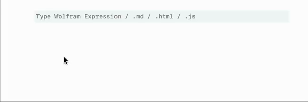

# Math typing
Use shortcuts to make fractions and superscript
- `Ctrl+/` makes fraction
- `Ctrl+7` makes superscript (power)
- `Ctrl+2` makes squareroot

import { WLJSHTML, WLJSEditor, WLJSStore } from "@site/src/components/wljs-notebook-react";

<WLJSStore json={require('./attachments/85dd4fd5-4be5-4d0a-8197-888fa3b2ab0b.txt').default} notebook={require('./attachments/notebook-85d.wln').default}/>

For typing integrals and etc, use `Special Symbols` from the command bar at the top.

an example from above

<WLJSEditor display={"codemirror"} nid={"85dd4fd5-4be5-4d0a-8197-888fa3b2ab0b"} id={"5c9aa9a3-2b31-4328-b914-6ebf2b86a3cc"} type={"Input"} opts={{}} >{`%CF%B5%20%2B%20%28%2AFB%5B%2A%29%28%28%28%2ASpB%5B%2A%29Power%5BA%28%2A%7C%2A%29%2C%28%2A%7C%2A%292%5D%28%2A%5DSpB%2A%29%20%CE%B3%29%28%2A%2C%2A%29%2F%28%2A%2C%2A%29%28%28%2ASpB%5B%2A%29Power%5B%CF%890%28%2A%7C%2A%29%2C%28%2A%7C%2A%292%5D%28%2A%5DSpB%2A%29%20-%20%28%2ASpB%5B%2A%29Power%5B%CF%89%28%2A%7C%2A%29%2C%28%2A%7C%2A%292%5D%28%2A%5DSpB%2A%29%20%2B%20I%20%CE%B3%20%CF%89%29%29%28%2A%5DFB%2A%29%20%2F.%20%7B%CF%B5%20-%3E%201%2C%20A%20-%3E%201%2C%20%CE%B3%20-%3E%202%2C%20%CF%890%20-%3E%200%7D%3B%0A%0APlot%5B%25%20%2F%2F%20ReIm%20%2F%2F%20Evaluate%2C%20%7B%CF%89%2C%20-10%2C10%7D%2C%20ImageSize-%3E500%5D`}</WLJSEditor>

<WLJSEditor display={"codemirror"} nid={"85dd4fd5-4be5-4d0a-8197-888fa3b2ab0b"} id={"ebc732d0-d308-4b98-af31-59a5f6db67e1"} type={"Output"} opts={{}} >{`%28%2AVB%5B%2A%29%28FrontEndRef%5B%22add373d2-6545-4da9-bc17-d02155645966%22%5D%29%28%2A%2C%2A%29%28%2A%221%3AeJxTTMoPSmNkYGAoZgESHvk5KRCeEJBwK8rPK3HNS3GtSE0uLUlMykkNVgEKJ6akGJsbpxjpmpmamOqapCRa6iYlG5rrphgYGZqampmYWpqZAQCEZRUX%22%2A%29%28%2A%5DVB%2A%29`}</WLJSEditor>

# Fitting using Lorentz oscillator model
Let us use the simples possible approach to fit it

__define out material parameters__

<WLJSEditor display={"codemirror"} nid={"85dd4fd5-4be5-4d0a-8197-888fa3b2ab0b"} id={"002c3b10-1b4d-4b5f-a294-9df614976f52"} type={"Input"} opts={{}} >{`dielectric%5B%CF%89_%2C%20%CF%B5_%2C%20%CF%890_%2C%20%CE%B3_%2C%20A_%5D%20%3A%3D%20%CF%B5%20%2B%20%28%2AFB%5B%2A%29%28%28%28%2ASpB%5B%2A%29Power%5BA%28%2A%7C%2A%29%2C%28%2A%7C%2A%292%5D%28%2A%5DSpB%2A%29%20%CE%B3%29%28%2A%2C%2A%29%2F%28%2A%2C%2A%29%28%28%2ASpB%5B%2A%29Power%5B%CF%890%28%2A%7C%2A%29%2C%28%2A%7C%2A%292%5D%28%2A%5DSpB%2A%29%20-%20%28%2ASpB%5B%2A%29Power%5B%CF%89%28%2A%7C%2A%29%2C%28%2A%7C%2A%292%5D%28%2A%5DSpB%2A%29%20%2B%20I%20%CE%B3%20%CF%89%29%29%28%2A%5DFB%2A%29%3B%0A%0An%5B%CF%89_%2C%20params__%5D%20%3A%3D%20%28%2ASqB%5B%2A%29Sqrt%5Bdielectric%5B%CF%89%2C%20params%5D%5D%28%2A%5DSqB%2A%29%0AR%5B%CF%89_%2C%20params__%5D%20%3A%3D%20%28%2ASpB%5B%2A%29Power%5BAbs%5B%28%2AFB%5B%2A%29%28%28n%5B%CF%89%2C%20params%5D%20-%201.%29%28%2A%2C%2A%29%2F%28%2A%2C%2A%29%28n%5B%CF%89%2C%20params%5D%20%2B%201.%29%29%28%2A%5DFB%2A%29%5D%28%2A%7C%2A%29%2C%28%2A%7C%2A%292%5D%28%2A%5DSpB%2A%29`}</WLJSEditor>

Now let's see how it fits our data

<WLJSEditor display={"codemirror"} nid={"85dd4fd5-4be5-4d0a-8197-888fa3b2ab0b"} id={"473542f4-acad-4dc7-a80a-4d8624ffb2e3"} type={"Input"} opts={{}} >{`experiment%20%3D%20Select%5B%28%2AVB%5B%2A%29%28Get%5BFileNameJoin%5B%7B%22.iconized%22%2C%20%22iconized-dd15.wl%22%7D%5D%5D%29%28%2A%2C%2A%29%28%2A%221%3AeJxTTMoPSmNkYGAoZgESHvk5KRAeH5DwTM7Py6xKdcvMSXXKr8gU0OBhAADq%2BQq5%22%2A%29%28%2A%5DVB%2A%29%2C%20%28%23%5B%5B1%5D%5D%20%3E%203000%20%26%26%20%23%5B%5B1%5D%5D%20%3C%204000%29%26%5D%3B%0A%0Amodel%20%3D%20NonlinearModelFit%5Bexperiment%2C%20R%5B%CF%89%2C%20%CF%B5%2C%20%CF%890%2C%2010%2C%20A%5D%2C%20%7B%7B%CF%B5%2C%204%7D%2C%20%7B%CF%890%2C%203500%7D%2C%20%7B%CE%B3%2C100%7D%2C%20%7BA%2C100%7D%7D%2C%20%CF%89%5D%3B%0A%0APlot%5B%0A%20%20model%5Bx%5D%2C%20%7Bx%2C%203000%2C4000%7D%2C%20%0A%20%20%0A%20%20Epilog-%3E%7BRed%2C%20Point%5Bexperiment%5D%7D%2C%20%0A%20%20PlotRange-%3EFull%2C%0A%20%20ImageSize-%3E500%0A%5D`}</WLJSEditor>

<WLJSEditor display={"codemirror"} nid={"85dd4fd5-4be5-4d0a-8197-888fa3b2ab0b"} id={"f8b1b4a6-5577-45cf-a15b-b67c05fdc301"} type={"Output"} opts={{}} >{`%28%2AVB%5B%2A%29%28FrontEndRef%5B%22d13694ae-47ca-49a1-b477-867ff2b03580%22%5D%29%28%2A%2C%2A%29%28%2A%221%3AeJxTTMoPSmNkYGAoZgESHvk5KRCeEJBwK8rPK3HNS3GtSE0uLUlMykkNVgEKpxgam1maJKbqmpgnJ%2BqaWCYa6iaZmJvrWpiZp6UZJRkYm1oYAACCFxVL%22%2A%29%28%2A%5DVB%2A%29`}</WLJSEditor>

Now we can save our plot to be used for later

<WLJSEditor display={"codemirror"} nid={"85dd4fd5-4be5-4d0a-8197-888fa3b2ab0b"} id={"f82b73f3-1738-4e18-a949-1fa737437cb5"} type={"Input"} opts={{"Hidden":false}} >{`%25%20%2F%2F%20Iconize%20`}</WLJSEditor>

<WLJSEditor display={"codemirror"} nid={"85dd4fd5-4be5-4d0a-8197-888fa3b2ab0b"} id={"b5425562-c874-43d9-a48e-179096098ffe"} type={"Output"} opts={{}} >{`%28%2AVB%5B%2A%29%28Get%5BFileNameJoin%5B%7B%22.iconized%22%2C%20%22iconized-5fec.wl%22%7D%5D%5D%29%28%2A%2C%2A%29%28%2A%221%3AeJxTTMoPSmNkYGAoZgESHvk5KRAeH5DwTM7Py6xKdcvMSXXKr8g8cJyRAQDvgAv9%22%2A%29%28%2A%5DVB%2A%29`}</WLJSEditor>

<WLJSEditor display={"codemirror"} nid={"85dd4fd5-4be5-4d0a-8197-888fa3b2ab0b"} id={"a0766532-c222-49f3-8a46-25bab04337d2"} type={"Input"} opts={{}} >{`model%20%2F%2F%20Iconize%20`}</WLJSEditor>

<WLJSEditor display={"codemirror"} nid={"85dd4fd5-4be5-4d0a-8197-888fa3b2ab0b"} id={"d89c31d0-6e8b-42c8-9dea-95160bbaa007"} type={"Output"} opts={{}} >{`%28%2AVB%5B%2A%29%28Get%5BFileNameJoin%5B%7B%22.iconized%22%2C%20%22iconized-c831.wl%22%7D%5D%5D%29%28%2A%2C%2A%29%28%2A%221%3AeJxTTMoPSmNkYGAoZgESHvk5KRAeH5DwTM7Py6xKdcvMSXXKr8iUmMTIAADsQQsg%22%2A%29%28%2A%5DVB%2A%29`}</WLJSEditor>

## Entering Matrixes

One can also operate with matrixes and multiply them like normal. __Try `MatrixForm`__ or use a snippet tool `Ctrl/CMD+P` __and locate `Insert Matrix` helper widget__

<WLJSEditor display={"codemirror"} nid={"85dd4fd5-4be5-4d0a-8197-888fa3b2ab0b"} id={"7dd78260-a17e-4bf5-99cb-67187f097d1e"} type={"Input"} opts={{}} >{`%28%28%2AGB%5B%2A%29%7B%7B1%28%2A%7C%2A%29%2C%28%2A%7C%2A%290%28%2A%7C%2A%29%2C%28%2A%7C%2A%290%7D%28%2A%7C%7C%2A%29%2C%28%2A%7C%7C%2A%29%7B0%28%2A%7C%2A%29%2C%28%2A%7C%2A%29a%28%2A%7C%2A%29%2C%28%2A%7C%2A%290%7D%28%2A%7C%7C%2A%29%2C%28%2A%7C%7C%2A%29%7B0%28%2A%7C%2A%29%2C%28%2A%7C%2A%290%28%2A%7C%2A%29%2C%28%2A%7C%2A%291%7D%7D%28%2A%5DGB%2A%29%29.%28%28%2AGB%5B%2A%29%7B%7B0%28%2A%7C%2A%29%2C%28%2A%7C%2A%290%28%2A%7C%2A%29%2C%28%2A%7C%2A%291%7D%28%2A%7C%7C%2A%29%2C%28%2A%7C%7C%2A%29%7B1%28%2A%7C%2A%29%2C%28%2A%7C%2A%290%28%2A%7C%2A%29%2C%28%2A%7C%2A%291%7D%28%2A%7C%7C%2A%29%2C%28%2A%7C%7C%2A%29%7B1%28%2A%7C%2A%29%2C%28%2A%7C%2A%290%28%2A%7C%2A%29%2C%28%2A%7C%2A%290%7D%7D%28%2A%5DGB%2A%29%29%20%2F%2F%20MatrixForm`}</WLJSEditor>

## Greek letters

To enter Greek's symbols __use `ESC` key__ and type the first letter. The autocomplete will suggest the corresponding letter

<WLJSEditor display={"codemirror"} nid={"85dd4fd5-4be5-4d0a-8197-888fa3b2ab0b"} id={"36a8fbe7-2b15-43b9-beb2-5e349558709d"} type={"Input"} opts={{}} >{`%CE%B1%2C%20%CE%B2%2C%20%CE%B3`}</WLJSEditor>

## Special symbols
To enter integral, sums one can use `Special Characters` toolbox

