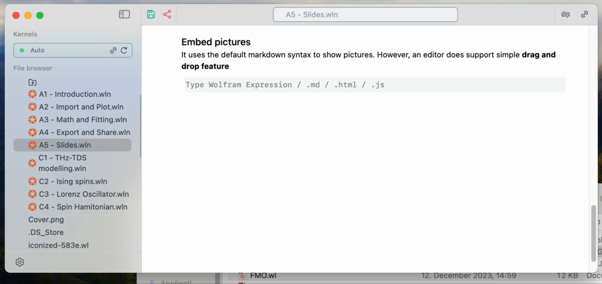

# Preparing a report
How about making a presentation right here?

import { WLJSHTML, WLJSEditor, WLJSStore } from "@site/src/components/wljs-notebook-react";

<WLJSStore json={require('./attachments/cd069c55-e677-452a-9bce-cad55bc06d3e.txt').default} notebook={require('./attachments/notebook-cd0.wln').default}/>

Markdown language together with [WLX](https://jerryi.github.io/wlx-docs/docs/Reference/WLX/) (optional) to make slides. The core technology is [RevealJS](https://revealjs.com/markdown/), but you don't have to know it to use it

## Text, heading, sections
Type in a new cell `.slide` (first line) and then

<WLJSEditor display={"codemirror"} nid={"cd069c55-e677-452a-9bce-cad55bc06d3e"} id={"f3a2ecf2-0669-43c4-966d-a3de87fb3c49"} type={"Input"} opts={{}} >{`.slide%0A%0A%23%20Slide%201%0A%0ASome%20text%2C%20other%20text...%0A%0A---%0A%0A%23%20Slide%202%0A%0AMay%20be%20even%20%3Cspan%20style%3D%22color%3Ared%22%3Eequations%3C%2Fspan%3E%0A%0A%24%24%0A%5C%5Chat%7BH%7D%20%5C%5CPsi%20%3D%20E%20%5C%5CPsi%0A%24%24`}</WLJSEditor>

<WLJSEditor display={"slide"} nid={"cd069c55-e677-452a-9bce-cad55bc06d3e"} id={"dfa78e7c-8a35-4407-a579-ce40233f1d4b"} type={"Output"} opts={{}} >{`%3Cdummy%20%3E%0A%23%20Slide%201%0A%0ASome%20text%2C%20other%20text...%0A%0A---%0A%0A%23%20Slide%202%0A%0AMay%20be%20even%20%3Cspan%20style%3D%22color%3Ared%22%3Eequations%3C%2Fspan%3E%0A%0A%24%24%0A%5C%5Chat%7BH%7D%20%5C%5CPsi%20%3D%20E%20%5C%5CPsi%0A%24%24%3C%2Fdummy%3E`}</WLJSEditor>

*Note: use arrows to navigate, `Q` to place a pointer*

*Note: keep it simple. One cell - one slide*

<WLJSHTML>{`%3Cbr%2F%3E`}</WLJSHTML>

Cells with slides can be merged to a complete presentation using `.slides` cell type

__To go fullscrenn press `f` on a slide__

### Projector feature

To project slides to a new window (like a normal presentation tool) navigate to a cell's menu

<WLJSHTML>{`%3Cbr%2F%3E`}</WLJSHTML>

and click **Project to a window**. It will evaluate an input cell and show the result in a new window.

### Embed pictures
It uses the default markdown syntax to show pictures. However, an editor does support simple __drag and drop feature__

---

<WLJSEditor display={"codemirror"} nid={"cd069c55-e677-452a-9bce-cad55bc06d3e"} id={"b7928215-ace5-4df6-91c5-b66f068e9f34"} type={"Input"} opts={{"Hidden":false}} >{`.slide%0A%0AThis%20is%20an%20example%0A%0A%21%5B%5D%28%2Fattachments%2FCover.png%29%0A`}</WLJSEditor>

<WLJSEditor display={"slide"} nid={"cd069c55-e677-452a-9bce-cad55bc06d3e"} id={"539351dc-a8dd-4686-b77b-49ea1528f65b"} type={"Output"} opts={{}} >{`%3Cdummy%20%3E%0AThis%20is%20an%20example%0A%0A%21%5B%5D%28%2Fattachments%2FCover.png%29%3C%2Fdummy%3E`}</WLJSEditor>

<WLJSEditor display={"codemirror"} nid={"cd069c55-e677-452a-9bce-cad55bc06d3e"} id={"80b18a45-9d0c-4c5c-8f15-ae429a12d352"} type={"Input"} opts={{}} >{`.md%0A%23%23%20Animation%0AA%20fragments%20of%20a%20text%20can%20be%20maked%20using%20special%20tag%20in%20order%20to%20reveal%20it%20or%20highlight%20%28see%20more%20%5Bhere%5D%28https%3A%2F%2Frevealjs.com%2Ffragments%2F%29%29`}</WLJSEditor>

## Animation
A fragments of a text can be maked using special tag in order to reveal it or highlight (see more [here](https://revealjs.com/fragments/))

<WLJSEditor display={"codemirror"} nid={"cd069c55-e677-452a-9bce-cad55bc06d3e"} id={"9c06c949-85f2-4b6b-b1f3-1e71e026c644"} type={"Input"} opts={{}} >{`.slide%0A%0A%23%20Slide%20Title%0A%0AThis%20will%20be%20revealed%20%3C%21--%20.element%3A%20class%3D%22fragment%22%20data-fragment-index%3D%221%22%20--%3E%0A%0AThis%20will%20be%20gone%20%3C%21--%20.element%3A%20class%3D%22fragment%20fade-out%22%20data-fragment-index%3D%222%22%20--%3E%0A%0AThis%20will%20be%20highlighted%20%3C%21--%20.element%3A%20class%3D%22fragment%20highlight-red%22%20data-fragment-index%3D%223%22%20--%3E`}</WLJSEditor>

<WLJSEditor display={"slide"} nid={"cd069c55-e677-452a-9bce-cad55bc06d3e"} id={"e6882a6f-d75e-4065-94e1-80720fa8a3bc"} type={"Output"} opts={{}} >{`%3Cdummy%20%3E%0A%23%20Slide%20Title%0A%0AThis%20will%20be%20revealed%20%3C%21--%20.element%3A%20class%3D%22fragment%22%20data-fragment-index%3D%221%22%20--%3E%0A%0AThis%20will%20be%20gone%20%3C%21--%20.element%3A%20class%3D%22fragment%20fade-out%22%20data-fragment-index%3D%222%22%20--%3E%0A%0AThis%20will%20be%20highlighted%20%3C%21--%20.element%3A%20class%3D%22fragment%20highlight-red%22%20data-fragment-index%3D%223%22%20--%3E%3C%2Fdummy%3E`}</WLJSEditor>

## Embedding Wolfram Language
The most use case is our figures

<WLJSEditor display={"codemirror"} nid={"cd069c55-e677-452a-9bce-cad55bc06d3e"} id={"21f7831a-12de-4752-aa83-5abbf279fd3d"} type={"Input"} opts={{}} >{`Figure%20%3D%20Plot%5BSin%5Bx%5D%2C%20%7Bx%2C0%2C2Pi%7D%2C%20ImageSize-%3E500%5D%3B`}</WLJSEditor>

Now lets embed it to our slide

<WLJSEditor display={"codemirror"} nid={"cd069c55-e677-452a-9bce-cad55bc06d3e"} id={"6436030f-9694-4393-8a84-5591aa877ab0"} type={"Input"} opts={{}} >{`.slide%0A%0A%23%20Figure%0A%0A%3CFigure%2F%3E`}</WLJSEditor>

<WLJSEditor display={"slide"} nid={"cd069c55-e677-452a-9bce-cad55bc06d3e"} id={"8f091d6d-ec1f-481f-b633-ec1d1afe058e"} type={"Output"} opts={{}} >{`%3Cdummy%20%3E%0A%23%20Figure%0A%0AFrontEndExecutable%5Bd69b3dbb-33aa-4074-9049-476acf09727f%5D%3C%2Fdummy%3E`}</WLJSEditor>

It works it a way, if it was a special XML/HTML tag. Any other wolfram expressions are also valid

<WLJSEditor display={"codemirror"} nid={"cd069c55-e677-452a-9bce-cad55bc06d3e"} id={"e3d37099-1d98-4e6a-85ae-cd6960ed0ae2"} type={"Input"} opts={{}} >{`GetDate%20%3A%3D%20TextString%5BNow%5D`}</WLJSEditor>

<WLJSEditor display={"codemirror"} nid={"cd069c55-e677-452a-9bce-cad55bc06d3e"} id={"99d2614a-a1a4-4092-9428-251c5e9e9ff9"} type={"Input"} opts={{}} >{`.slide%0A%0AToday%20is%20%3CGetDate%2F%3E`}</WLJSEditor>

*This is more advanced topic and will be covered in other tutorials*

## Merging slides
into a complete presentation

<WLJSHTML>{`%3Cbr%2F%3E`}</WLJSHTML>

Create a new cell with `.slides` extension. 

<WLJSEditor display={"codemirror"} nid={"cd069c55-e677-452a-9bce-cad55bc06d3e"} id={"df6262ca-eeb8-4b53-8f45-c66bcb23fc98"} type={"Input"} opts={{}} >{`.slides%0A%0AThank%20you%20for%20your%20attention`}</WLJSEditor>

*Once evaluated, it merges all slides from all cells found in the notebook into a single presentation.*

# Scientific report
Assumming you have gone thorugh the previous tutorials, now we can take our fitted data and presented it here

Before we iconized the plot into the following symbol

<WLJSEditor display={"codemirror"} nid={"cd069c55-e677-452a-9bce-cad55bc06d3e"} id={"6cfc2442-584a-4ad0-9c64-ced7f75ed213"} type={"Input"} opts={{}} >{`Figure%20%3D%20%28%2AVB%5B%2A%29%28Get%5BFileNameJoin%5B%7B%22.iconized%22%2C%20%22iconized-5fec.wl%22%7D%5D%5D%29%28%2A%2C%2A%29%28%2A%221%3AeJxTTMoPSmNkYGAoZgESHvk5KRAeH5DwTM7Py6xKdcvMSXXKr8g8cJyRAQDvgAv9%22%2A%29%28%2A%5DVB%2A%29%3B%0AFigure%20`}</WLJSEditor>

<WLJSEditor display={"codemirror"} nid={"cd069c55-e677-452a-9bce-cad55bc06d3e"} id={"93c9ab61-c7dc-49cf-a2e9-817f027be2b0"} type={"Output"} opts={{}} >{`%28%2AVB%5B%2A%29%28FrontEndRef%5B%22a06f8a7f-7541-402f-bf0f-a5142d30845f%22%5D%29%28%2A%2C%2A%29%28%2A%221%3AeJxTTMoPSmNkYGAoZgESHvk5KRCeEJBwK8rPK3HNS3GtSE0uLUlMykkNVgEKJxqYpVkkmqfpmpuaGOqaGBil6SalGaTpJpoamhilGBtYmJimAQCDPxVs%22%2A%29%28%2A%5DVB%2A%29`}</WLJSEditor>

*Note: please use variables starting from a Captial letter to store data to be embedded to your slide layout*

Now create a simple slide

<WLJSEditor display={"codemirror"} nid={"cd069c55-e677-452a-9bce-cad55bc06d3e"} id={"32f3121a-9a31-47a5-8d5a-f6a6396b5983"} type={"Input"} opts={{}} >{`.slide%0A%0A%23%20Reflectivity%20in%20%24Fe_2%20Mo_3%20O_8%24%0APrepared%20by%20Friedrich%20Vormelker%0A%0A---%0A%0A%23%20Fitted%20with%20a%20single%20Lorentz%20oscillator%0A%0A%3CFigure%2F%3E`}</WLJSEditor>

<WLJSEditor display={"slide"} nid={"cd069c55-e677-452a-9bce-cad55bc06d3e"} id={"ad94a1d8-1f52-4d90-90dd-bc2b03372190"} type={"Output"} opts={{}} >{`%3Cdummy%20%3E%0A%23%20Reflectivity%20in%20%24Fe_2%20Mo_3%20O_8%24%0APrepared%20by%20Friedrich%20Vormelker%0A%0A---%0A%0A%23%20Fitted%20with%20a%20single%20Lorentz%20oscillator%0A%0AFrontEndExecutable%5B2c27eca2-5882-48e3-81c6-56a21a596d91%5D%3C%2Fdummy%3E`}</WLJSEditor>

*Note: try to zoom in and pan the plot*