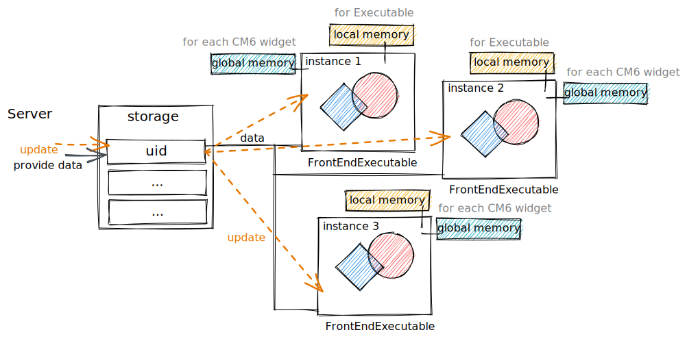

# Executables
The __general definition__ will be
> *an isolated container, where the [defined functions](../../frontend/front-end-functions.md) can be executed*

In this regard all graphics and dynamic expressions __has to be executed inside the container__. Since it provides an identifier, local memory, stack trace to the expression, that was called. 

Containers help to work with the data more efficiently. For example, if we plot a graph using the data that changes with the time, it order to update the graph __without reevaluation__ one can find an instance of this executed plotting function and provide a new data to it.

## As a pointer
Wolfram JS Frontend mostly utilizes containers to store and execute data like `Graphics`, `List` which is binded to the data on the server (Wolfram Kernel) in the first place. But nothing can limit us from using for more general cases. 

Each executable has its own unique identifier and can act as a reference

```mathematica
FrontEndExecutable["uid"]
```

In the code editor of Wolfram JS Frontend it will immediately cause an execution, when this symbol appears in the line of code. This is a magic of Decorations. However, inside other expressions one can use it purely as a pointer.

You can create them from Wolfram Kernel __as well as directly from the interpreter__ using following expression 

*__notebook cell__ or directly using __wljs interpreter__*
```mathematica
CreateFrontEndObject[
	Table[i^2, {i,1,10}],
	"uid"
]
```

You can check the data inside by just calling 

*__notebook cell__*
```mathematica
> FrontEndExecutable["uid"]
> {1,4,9,...}
```

*using __wljs interpreter*
```mathematica
> FrontEndExecutable["uid"] // Print;
```

Then, you can use it as a reference in some other executable object like

*__notebook cell__*
```mathematica
CreateFrontEndObject[FrontEndOnly[
	ListLinePlotly@FrontEndExecutable["uid"]
]]
```

*using __wljs interpreter*
```mathematica
FrontEndVirtual[{
	AttachDOM["canvas"],
	ListLinePlotly@FrontEndExecutable["uid"]
}]
```

or

```mathematica
CreateFrontEndObject[
	ListLinePlotly@FrontEndRef["uid"]
]
```

or even like this

```mathematica
CreateFrontEndObject[
	ListLinePlotly@FrontEndRef[FrontEndExecutable["uid"]]
]
```

and since `ListLinePlotly` is a registered object

```mathematica
ListLinePlotly@FrontEndRef[FrontEndExecutable["uid"]]
```

Here we wrapped the given data into `FrontEndOnly`, that holds the expressions for WL and prevents evaluation of server, leaving the code to be executed on frontend. The latest example instead of `FrontEndOnly` we used `FrontEndRef`, that basically holds `FrontEndExecutable` and prevents it from the evaluation.

If you do not want CodeMirror to replace it with a decorations use non-executable synonym 
```mathematica
FrontEndExecutable["uid"] -> FrontEndRef["uid"]
```

More about computations like this - see [[Heterogenesis computation]]
Also check out the tutorial [[Working with frontend objects]]

### Mutabillity
Each time you reevaluate the cell content, where the object was created - an Evaluator (`Kernel/Evaluator.wl`) fires `ExtendDefinitions` on a master kernel. It compares the new objects to the old data in the Notebook object property and shares the changed objects across all connected clients (associated with the given notebook).

>See `NotebookExtendDefinitions` function in `Kernel/Notebook.wl`.

#### Direct update (the fastest)
Sends the data directly to the frontened leaving out the master kernel (see [[Evaluation]])

```mathematica
SetFrontEndObject["uid",
	Table[i^3, {i,1,10}]
]//SendToFrontEnd;
```

or in the same fashion, but prettier 

```mathematica
SetFrontEndObject[FrontEndExecutable["uid"],
	Table[i^3, {i,1,10}]
]//SendToFrontEnd;
```

or even better (WOW)

```mathematica
FrontEndExecutable["uid"] = Table[i^3, {i,1,10}]
```

or if you do not want CM6 to draw it

```mathematica
FrontEndRef["uid"] = Table[i^3, {i,1,10}]
```

In principle one can send any command and call any function of the frontened by using `SendToFrontEnd`. More info - see [[Advanced data transfering and visualisation]]

### Nesting
One can create a frontend object, that has a reference to another one and etc. The benifits of this approach you will see in [Dynamic binding](#Dynamic%20binding) section


in the example above it shows how typical `Manipulate` function can be imlemented. In the simples case it has three parts
- a slider to control the variables
- a graphical object (Plot) that shows the results
- the data, that is provided to the plotting function

and actaully there is a forth one - `Panel`, which holds the first two. All of them are frontend objects. Of course this contruction can be generated automatically

```mathematica
slider = Slider[];
...
With[{plot = CreateFrontEndObject[ListLinePlotly[FrontEndRef["data"]], "plot"]},
	With[{slider = CreateFrontEndObject[slider, "slider"]},
		CreateFrontEndObject[FrontEndOnly@Panel[{slider, plot}], "panel"]
	]
]
```

or it can be rewritten in a more compact way (if you want to use IDs)

```mathematica
slider = Slider[];
...
CreateFrontEndObject[slider, "slider"];
CreateFrontEndObject[ListLinePlotly[FrontEndRef["data"]], "plot"];

CreateFrontEndObject[Panel[{FrontEndRef["slider"], FrontEndRef["plot"]}]]
```

the last one goes to the output cell. But sure, you will also need to define a handler for a slider on Wolfram Kernel's side to update `data` object.

### Dynamic binding
The ideas for WLJS Frontened were inspired by an amazing project [Observable](https://observablehq.com/@jerryi) - JS notebook interface working in the browser, where the dynamics was polished perfectly.

In Observable all expressions are `Dynamic` in terms of Mathematica by the default. Me, as a maintener (@JerryI) tried to bring it as close as possible to such behaviour, leaving out laggs as possible of Mathematica's frontened.

Therefore, ==all frontened objects aka `FrontEndExecutable` are dynamic by the default==. The change in one will cause the updates to ones, which depends on it. This behaviuor is achived by collecting all calls of frontened functions and storing them to special handlers assigned to each frontend object. In principle we do not even need WL Kernel to update the content.

Let us try to explain it in following example

*create such an object*
```mathematica
CreateFrontEndObject[ Table[Sin[i]//N, {i,0,2Pi,0.1}] , "myObject"]
```

*create a visualiser for it*
```mathematica
CreateFrontEndObject[FrontEndOnly[
  ListLinePlotly[FrontEndExecutable["myObject"]]
], "visualiser"]
```

The last cell creates another frontend object `"visualiser"`, which depends on the `"myObject"`. [WLJS Interpreter](https://github.com/JerryI/wljs-interpreter) creates a straightforward "link" between them
$$myObject \rightarrow visualiser$$
where any changes to `"myObject"` will lead to internal reavaluation (on frontend's side!) of `FrontEndOnly` function and its content, i.e. call somewhere the following

*make changes directly*
```mathematica
Do[SetFrontEndObject[FrontEndExecutable["myObject"],

  Table[Sin[i*j]//N, {i,0, 2Pi, 0.1}]
  
] // SendToFrontEnd; Pause[0.3];, {j, 1,10}];
```

or with a bit of a syntax sugar available

```mathematica
Do[
	FrontEndExecutable["myObject"] = Table[Sin[i*j]//N, {i,0, 2Pi, 0.1}];
	Pause[0.3];
, {j, 10}];
```

After than you will see a nice animation of the output of second cell without actual reevaluation

![[../imgs/plotly-dynamic.gif]]

One could argue that this is an actual reevaluation, which might be quite slow. However, during this process ==an additional information to the whole stack of called functions is provided regaring of a type of an update, i.e. restyling, data update, data append and etc==. Therefore, each WLJS function can optimise its behaviour to gain perfomance - see section `Methods` in [WLJS Interpreter](https://github.com/JerryI/wljs-interpreter) and [Frontend functions](Frontend%20functions.md)

This is a just a top of the surface, the things you can do with it are quite bigger...

### Instancing
Each call of `FrontEndExecutable["uid"]` creates an instance of the corresponding object with its local memory (see more [Frontend functions](Frontend%20functions.md)). So copying and pasting

```mathematica
FrontEndExecutable["myId"] FrontEndExecutable["myId"] FrontEndExecutable["myId"]
```

you will create separate objects connected to the same storage item with `uid` as an identifier.



### 🚧 Applying | Injection arguments
*This feature is still in development*, however the idea is that sometimes we do not need to create separate `FrontEndExecutable` s to modify one slightly. Therefore one could pass an extra information for the instance

```mathematica
FrontEndExecutable["uid", extra arguments...]
```

If it would be possible, one could also add support `Function` symbol to the frontend. And then, we can for sure perform recalculations directly on the frontend! See more in [Frontend functions](Frontend%20functions.md)


## Cheat-sheet
for the brief explanation


## Summary | TLDR
For the best experience - check the tutorial [[How to work with ]], which is a real notebook exported from the frontend to a standalone `.html` file.

### How to create
For the registered types (see [Writting WebObject](Writting%20WebObject.md))

```mathematica
ListLinePlotly[{1,2,3,4,5}]
```

or explicitly assigning a custom id

```mathematica
CreateFrontEndObject[
	ListLinePlotly[{1,2,3,4,5}],
	"myId"
]
```

for you data

```mathematica
CreateFrontEndObject[
	{1,2,3,4,5},
	"myDataId"
]
```

In the all cases it returns

```mathematica
> FrontEndExecutable["myId"]
> FrontEndExecutable["myDataId"]
```

### How to get the data
On WL's side it works if there was no wrapper around

```mathematica
FrontEndExecutable["myDataId"][[1]]
> 1
```

### How to update
Explicitly it can be done by reevaluating the corresponding cell

```mathematica
CreateFrontEndObject[
	ListLinePlotly[{1,2,3,4,5}//Reverse],
	"myId"
]
```

after the evaluating, all instances of `FrontEndExecutable["myId"]` shown on the screen in any cell will be updated. Check the tutorial [W] to see it in a better way.

But this is slow, direct update is faster

```mathematica
SetFrontEndObject["myId", ListLinePlotly[{1,2,3,4,5}//Reverse]] // SendToFrontEnd;
```

this is also valid

```mathematica
SetFrontEndObject[FrontEndExecutable["myId"], ListLinePlotly[{1,2,3,4,5}//Reverse]] // SendToFrontEnd;
```

and this is too

```mathematica
FrontEndExecutable["myId"] = ListLinePlotly[{1,2,3,4,5}//Reverse];
```

and this is too

```mathematica
FrontEndRef["myId"] = ListLinePlotly[{1,2,3,4,5}//Reverse];
```

### Data and view separation | Nesting

To update the data separately from the plotting function

```mathematica
ListLinePlotly[FrontEndRef[FrontEndExecutable["myDataId"]]]
```

or

```mathematica
ListLinePlotly[FrontEndRef["myDataId"]]
```

Then you can update the data only

```mathematica
FrontEndExecutable["myDataId"] = RandomReal[{-1,1}, 4];
```

or attach a slider to it

```mathematica
slider = Slider[0,1,0.1];
Function[x, FrontEndExecutable["myDataId"] = x RandomReal[{-1,1}, 4]] // slider;

slider
```

## Inline frontend objects
🚧 Not implemented!
One can compress small objects in way like
```mathematica
FrontEndExecutableInline["Compressed JSON expression"]
```

