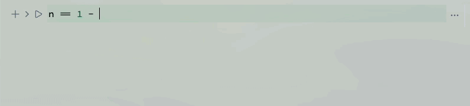

# Release notes *2.5.0*
*Breaking changes: please, update your client using binaries from this release*

We reworked our main application on Windows, cleaned up UI and introduced a few new modes.

<!--truncate-->

<WLJSHTML>{`%0A%3Cstyle%3E%0A%20%20.balloon%20%7B%0A%20%20height%3A%20125px%3B%0A%20%20width%3A%20105px%3B%0A%20%20border-radius%3A%2075%25%2075%25%2070%25%2070%25%3B%0A%20%20position%3A%20relative%3B%0A%7D%0A%0A.balloon%3Abefore%20%7B%0A%20%20content%3A%20%22%22%3B%0A%20%20height%3A%2075px%3B%0A%20%20width%3A%201px%3B%0A%20%20padding%3A%201px%3B%0A%20%20background-color%3A%20%23FDFD96%3B%0A%20%20display%3A%20block%3B%0A%20%20position%3A%20absolute%3B%0A%20%20top%3A%20125px%3B%0A%20%20left%3A%200%3B%0A%20%20right%3A%200%3B%0A%20%20margin%3A%20auto%3B%0A%7D%0A%0A.balloon%3Aafter%20%7B%0A%20%20%20%20content%3A%20%22%E2%96%B2%22%3B%0A%20%20%20%20text-align%3A%20center%3B%0A%20%20%20%20display%3A%20block%3B%0A%20%20%20%20position%3A%20absolute%3B%0A%20%20%20%20color%3A%20inherit%3B%0A%20%20%20%20top%3A%20120px%3B%0A%20%20%20%20left%3A%200%3B%0A%20%20%20%20right%3A%200%3B%0A%20%20%20%20margin%3A%20auto%3B%0A%7D%0A%0A%40keyframes%20float%20%7B%0A%20%20from%20%7Btransform%3A%20translateY%28100vh%29%3B%0A%20%20opacity%3A%201%3B%7D%0A%20%20to%20%7Btransform%3A%20translateY%28-300vh%29%3B%0A%20%20opacity%3A%200%3B%7D%0A%7D%0A%23balloon-container%20%7B%0A%20%20height%3A%20100vh%3B%0A%20%20top%3A%200%3B%0A%20%20position%3Afixed%3B%0A%20%20bottom%3A%200%3B%0A%20%20z-index%3A%20-99%3B%20%20%0A%20%20padding%3A%201em%3B%0A%20%20box-sizing%3A%20border-box%3B%0A%20%20display%3A%20flex%3B%0A%20%20flex-wrap%3A%20wrap%3B%0A%20%20overflow%3A%20hidden%3B%0A%20%20transition%3A%20opacity%20500ms%3B%0A%7D%0A%3C%2Fstyle%3E%0A%0A%3Cdiv%20id%3D%22balloon-container%22%3E%0A%3C%2Fdiv%3E`}</WLJSHTML>

import { WLJSHTML, WLJSEditor, WLJSStore } from "@site/src/components/wljs-reactcells";

<WLJSStore json={require('./attachments/ab6a5267-59db-4e36-82d7-3b748125e255.txt').default} notebook={require('./attachments/notebook-ab6.wln').default}/>

<WLJSEditor display={"js"} nid={"ab6a5267-59db-4e36-82d7-3b748125e255"} id={"cfcfaeb4-4655-457c-aa5f-7acfb14f2617"} type={"Output"} opts={{}} >{`%0Aconst%20balloonContainer%20%3D%20document.getElementById%28%22balloon-container%22%29%3B%0A%0Afunction%20random%28num%29%20%7B%0A%20%20return%20Math.floor%28Math.random%28%29%20%2A%20num%29%3B%0A%7D%0A%0Afunction%20getRandomStyles%28%29%20%7B%0A%20%20var%20r%20%3D%20random%28255%29%3B%0A%20%20var%20g%20%3D%20random%28255%29%3B%0A%20%20var%20b%20%3D%20random%28255%29%3B%0A%20%20var%20mt%20%3D%20random%28200%29%3B%0A%20%20var%20ml%20%3D%20random%2850%29%3B%0A%20%20var%20dur%20%3D%20random%285%29%20%2B%205%3B%0A%20%20return%20%60%0A%20%20background-color%3A%20rgba%28%24%7Br%7D%2C%24%7Bg%7D%2C%24%7Bb%7D%2C0.7%29%3B%0A%20%20color%3A%20rgba%28%24%7Br%7D%2C%24%7Bg%7D%2C%24%7Bb%7D%2C0.7%29%3B%20%0A%20%20box-shadow%3A%20inset%20-7px%20-3px%2010px%20rgba%28%24%7Br%20-%2010%7D%2C%24%7Bg%20-%2010%7D%2C%24%7Bb%20-%2010%7D%2C0.7%29%3B%0A%20%20margin%3A%20%24%7Bmt%7Dpx%200%200%20%24%7Bml%7Dpx%3B%0A%20%20animation%3A%20float%20%24%7Bdur%7Ds%20ease-in%20infinite%0A%20%20%60%3B%0A%7D%0A%0Afunction%20createBalloons%28num%29%20%7B%0A%20%20for%20%28var%20i%20%3D%20num%3B%20i%20%3E%200%3B%20i--%29%20%7B%0A%20%20%20%20var%20balloon%20%3D%20document.createElement%28%22div%22%29%3B%0A%20%20%20%20balloon.className%20%3D%20%22balloon%22%3B%0A%20%20%20%20balloon.style.cssText%20%3D%20getRandomStyles%28%29%3B%0A%20%20%20%20balloonContainer.append%28balloon%29%3B%0A%20%20%7D%0A%7D%0A%0Afunction%20removeBalloons%28%29%20%7B%0A%20%20balloonContainer.style.opacity%20%3D%200%3B%0A%20%20setTimeout%28%28%29%20%3D%3E%20%7B%0A%20%20%20%20balloonContainer.remove%28%29%0A%20%20%7D%2C%20500%29%0A%7D%0A%0AcreateBalloons%2810%29%3B%0AsetTimeout%28removeBalloons%2C%2015000%29%3B%0A%0Areturn%20%27%27%3B%0A`}</WLJSEditor>

## Quick notes
This allows to create a note without making millions of files in your home directory <WLJSHTML>{`%3Cspan%20style%3D%22font-family%3A%20monospace%22%20class%3D%22text-sm%20p-1%20bg-gray-200%20rounded%22%3ECtrl%2FCmd%2BShift%2BN%3C%2Fspan%3E`}</WLJSHTML><WLJSHTML>{`%3Cbr%20%2F%3E`}</WLJSHTML><WLJSHTML>{`%3Cbr%20%2F%3E`}</WLJSHTML>

It stores it in the temporal directory and will ask you where to save if you need this note. All notebook files opened from the native file explorer will be shown in the similar regime (no sidebar, no distractions)<WLJSHTML>{`%3Cbr%20%2F%3E`}</WLJSHTML><WLJSHTML>{`%3Cbr%20%2F%3E`}</WLJSHTML>

## Prompt window
This feature registers a global shortcut <WLJSHTML>{`%3Cspan%20style%3D%22font-family%3A%20monospace%22%20class%3D%22text-sm%20p-1%20bg-gray-200%20rounded%22%3ECmd%2FCtrl%2BAlt%2BSpace%3C%2Fspan%3E`}</WLJSHTML> to call a small prompt window - a floating input cell to do some quick calculations.

<WLJSHTML>{`%3Cbr%20%2F%3E`}</WLJSHTML>

<WLJSHTML>{`%3Cbr%20%2F%3E`}</WLJSHTML>
The transparency feature might not work on Linux distros. We need an external help to resolve this issue.

## Templates
Templates are just the same notebooks, stylized using hidden Javascript or HTML cells. The default directory for them is `AppData/UserTemplates/`. Call them from the command line or top-bar menu

<WLJSHTML>{`%3Cbr%20%2F%3E`}</WLJSHTML>

<WLJSHTML>{`%3Cbr%20%2F%3E`}</WLJSHTML>

There are several built-in templates for you to try. *Note that `attachments` folder (if found) will also be copied, so that your template can include uploaded images or other files*

## Code editor improvements
We contacted the developer of CodeMirror 6 and he helped us to improve UX of typing equations. Now it feels more natural, there is no need in lifting your fingers from the keyboard

<WLJSHTML>{`%3Cbr%20%2F%3E`}</WLJSHTML>

<WLJSHTML>{`%3Cbr%20%2F%3E`}</WLJSHTML>

You can jump inside a fraction or other math decorations

*Ballon animation by Jemima (codepen)*