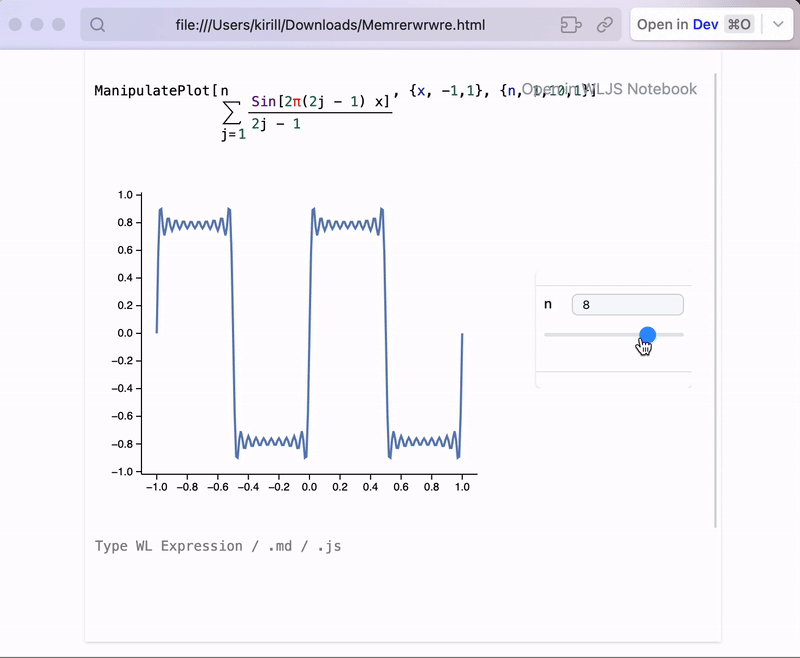

# Release notes *2.5.3*

Minor changes in UI and `Graphics3D` and massive changes in possibilities of exporting notebooks.

<!--truncate-->

<WLJSHTML>{`%0A%3Cstyle%3E%0A%20%20.balloon%20%7B%0A%20%20height%3A%20125px%3B%0A%20%20width%3A%20105px%3B%0A%20%20border-radius%3A%2075%25%2075%25%2070%25%2070%25%3B%0A%20%20position%3A%20relative%3B%0A%7D%0A%0A.balloon%3Abefore%20%7B%0A%20%20content%3A%20%22%22%3B%0A%20%20height%3A%2075px%3B%0A%20%20width%3A%201px%3B%0A%20%20padding%3A%201px%3B%0A%20%20background-color%3A%20%23FDFD96%3B%0A%20%20display%3A%20block%3B%0A%20%20position%3A%20absolute%3B%0A%20%20top%3A%20125px%3B%0A%20%20left%3A%200%3B%0A%20%20right%3A%200%3B%0A%20%20margin%3A%20auto%3B%0A%7D%0A%0A.balloon%3Aafter%20%7B%0A%20%20%20%20content%3A%20%22%E2%96%B2%22%3B%0A%20%20%20%20text-align%3A%20center%3B%0A%20%20%20%20display%3A%20block%3B%0A%20%20%20%20position%3A%20absolute%3B%0A%20%20%20%20color%3A%20inherit%3B%0A%20%20%20%20top%3A%20120px%3B%0A%20%20%20%20left%3A%200%3B%0A%20%20%20%20right%3A%200%3B%0A%20%20%20%20margin%3A%20auto%3B%0A%7D%0A%0A%40keyframes%20float%20%7B%0A%20%20from%20%7Btransform%3A%20translateY%28100vh%29%3B%0A%20%20opacity%3A%201%3B%7D%0A%20%20to%20%7Btransform%3A%20translateY%28-300vh%29%3B%0A%20%20opacity%3A%200%3B%7D%0A%7D%0A%23balloon-container%20%7B%0A%20%20height%3A%20100vh%3B%0A%20%20top%3A%200%3B%0A%20%20position%3Afixed%3B%0A%20%20bottom%3A%200%3B%0A%20%20z-index%3A%20-99%3B%20%20%0A%20%20padding%3A%201em%3B%0A%20%20box-sizing%3A%20border-box%3B%0A%20%20display%3A%20flex%3B%0A%20%20flex-wrap%3A%20wrap%3B%0A%20%20overflow%3A%20hidden%3B%0A%20%20transition%3A%20opacity%20500ms%3B%0A%7D%0A%3C%2Fstyle%3E%0A%0A%3Cdiv%20id%3D%22balloon-container%22%3E%0A%3C%2Fdiv%3E`}</WLJSHTML>

import { WLJSHTML, WLJSEditor, WLJSStore } from "@site/src/components/wljs-reactcells";

<WLJSStore json={require('./attachments/fbcb7c73-2c76-4c72-a990-cdb665cec271.txt').default} notebook={require('./attachments/notebook-fbc.wln').default}/>

<WLJSEditor display={"js"} nid={"fbcb7c73-2c76-4c72-a990-cdb665cec271"} id={"10f6029f-d1dc-4cb1-9ff8-8fb642dbd5da"} type={"Output"} opts={{}} >{`%0Aconst%20balloonContainer%20%3D%20document.getElementById%28%22balloon-container%22%29%3B%0A%0Afunction%20random%28num%29%20%7B%0A%20%20return%20Math.floor%28Math.random%28%29%20%2A%20num%29%3B%0A%7D%0A%0Afunction%20getRandomStyles%28%29%20%7B%0A%20%20var%20r%20%3D%20random%28255%29%3B%0A%20%20var%20g%20%3D%20random%28255%29%3B%0A%20%20var%20b%20%3D%20random%28255%29%3B%0A%20%20var%20mt%20%3D%20random%28200%29%3B%0A%20%20var%20ml%20%3D%20random%2850%29%3B%0A%20%20var%20dur%20%3D%20random%285%29%20%2B%205%3B%0A%20%20return%20%60%0A%20%20background-color%3A%20rgba%28%24%7Br%7D%2C%24%7Bg%7D%2C%24%7Bb%7D%2C0.7%29%3B%0A%20%20color%3A%20rgba%28%24%7Br%7D%2C%24%7Bg%7D%2C%24%7Bb%7D%2C0.7%29%3B%20%0A%20%20box-shadow%3A%20inset%20-7px%20-3px%2010px%20rgba%28%24%7Br%20-%2010%7D%2C%24%7Bg%20-%2010%7D%2C%24%7Bb%20-%2010%7D%2C0.7%29%3B%0A%20%20margin%3A%20%24%7Bmt%7Dpx%200%200%20%24%7Bml%7Dpx%3B%0A%20%20animation%3A%20float%20%24%7Bdur%7Ds%20ease-in%20infinite%0A%20%20%60%3B%0A%7D%0A%0Afunction%20createBalloons%28num%29%20%7B%0A%20%20for%20%28var%20i%20%3D%20num%3B%20i%20%3E%200%3B%20i--%29%20%7B%0A%20%20%20%20var%20balloon%20%3D%20document.createElement%28%22div%22%29%3B%0A%20%20%20%20balloon.className%20%3D%20%22balloon%22%3B%0A%20%20%20%20balloon.style.cssText%20%3D%20getRandomStyles%28%29%3B%0A%20%20%20%20balloonContainer.append%28balloon%29%3B%0A%20%20%7D%0A%7D%0A%0Afunction%20removeBalloons%28%29%20%7B%0A%20%20balloonContainer.style.opacity%20%3D%200%3B%0A%20%20setTimeout%28%28%29%20%3D%3E%20%7B%0A%20%20%20%20balloonContainer.remove%28%29%0A%20%20%7D%2C%20500%29%0A%7D%0A%0AcreateBalloons%2810%29%3B%0AsetTimeout%28removeBalloons%2C%2015000%29%3B%0A%0Areturn%20%27%27%3B%0A`}</WLJSEditor>

## Graphics3D now has ticks
Ticks cannot be customized, but this is a big step compared to what we had before

<WLJSEditor display={"codemirror"} nid={"fbcb7c73-2c76-4c72-a990-cdb665cec271"} id={"250b51e5-56e6-44a7-9f9f-80bb2afb914a"} type={"Output"} opts={{}} >{`%28%2AVB%5B%2A%29%28FrontEndRef%5B%2274d6e22e-f100-48d6-8919-18e749ee3477%22%5D%29%28%2A%2C%2A%29%28%2A%221%3AeJxTTMoPSmNkYGAoZgESHvk5KRCeEJBwK8rPK3HNS3GtSE0uLUlMykkNVgEKm5ukmKUaGaXqphkaGOiaWKSY6VpYGlrqGlqkmptYpqYam5ibAwB6%2BBT%2F%22%2A%29%28%2A%5DVB%2A%29`}</WLJSEditor>

## AnimatePlot
We have more function for making animations easier. It is important to note, that `AnimatePlot` keeps the data inside notebook and __is safe to be exported to HTML file or using Figure export or embedded to a page__

<WLJSEditor display={"codemirror"} nid={"fbcb7c73-2c76-4c72-a990-cdb665cec271"} id={"f6965835-b414-41fc-b4dc-7cf8a2b1ba4c"} type={"Input"} opts={{}} >{`AnimatePlot%5B%28%2ATB%5B%2A%29Sum%5B%28%2A%7C%2A%29%28%2AFB%5B%2A%29%28%28Sin%5B2%CF%80%282j%20-%201%29%20x%5D%29%28%2A%2C%2A%29%2F%28%2A%2C%2A%29%282j%20-%201%29%29%28%2A%5DFB%2A%29%28%2A%7C%2A%29%2C%20%7B%28%2A%7C%2A%29j%28%2A%7C%2A%29%2C%28%2A%7C%2A%291.0%28%2A%7C%2A%29%2C%28%2A%7C%2A%29n%28%2A%7C%2A%29%7D%5D%28%2A%7C%2A%29%28%2A1%3AeJxTTMoPSmNiYGAoZgMSwaW5TvkVmYwgPguQCCkqTQUAeAcHBQ%3D%3D%2A%29%28%2A%5DTB%2A%29%2C%20%7Bx%2C%20-1%2C1%7D%2C%20%7Bn%2C%201%2C30%2C%201%7D%5D`}</WLJSEditor>

<WLJSEditor display={"codemirror"} nid={"fbcb7c73-2c76-4c72-a990-cdb665cec271"} id={"068c8340-1296-46b1-9188-b376aca71346"} type={"Output"} opts={{}} >{`%28%2AVB%5B%2A%29%28FrontEndRef%5B%22a813f88d-91cb-4111-9ffe-faa53209ac3f%22%5D%29%28%2A%2C%2A%29%28%2A%221%3AeJxTTMoPSmNkYGAoZgESHvk5KRCeEJBwK8rPK3HNS3GtSE0uLUlMykkNVgEKJ1oYGqdZWKToWhomJ%2BmaGBoa6lqmpaXqpiUmmhobGVgmJhunAQCHNBYC%22%2A%29%28%2A%5DVB%2A%29`}</WLJSEditor>

## Dynamic HTML export
A new experimental feature now is available! It order to make the system more general and be able to capture the effects of `ManipulatePlot`, any combinations of `InputRange`, `InputButton`, `Offload` and many more it is abstracted by the design from the controlling elements and purely analyses the events and mutations of symbols.

<WLJSHTML>{`%3Cbr%20%2F%3E`}</WLJSHTML>

Please see the documentation for more details

*Ballon animation by Jemima (codepen)*