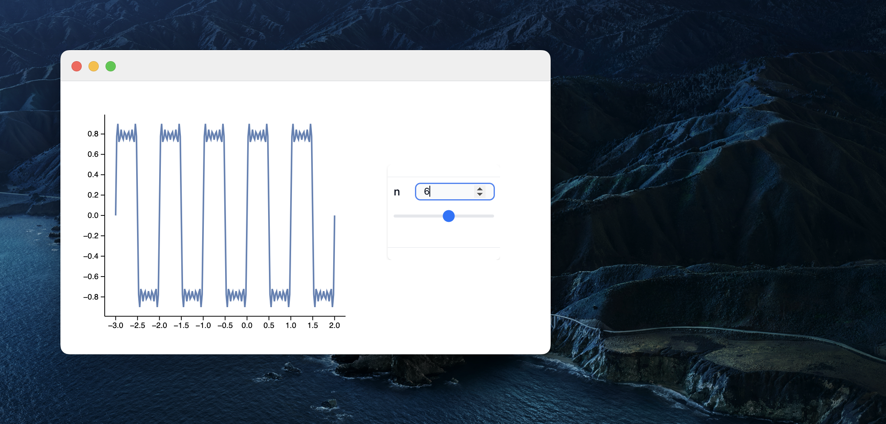

# Release notes *2.6.5*
This release introduces a __debugger__ integrated into the command palette for monitoring symbol changes during kernel evaluation and creating standalone widgets with isolated resources using WLJS Notebook. Other updates include enhanced `SystemDialogInput` for file operations, background sound emitting, `InputAutocomplete` for async suggestions, WebGL performance improvements, and better handling of large formatted outputs.

<!--truncate-->

<WLJSHTML>{`%0A%3Cstyle%3E%0A%20%20.balloon%20%7B%0A%20%20height%3A%20125px%3B%0A%20%20width%3A%20105px%3B%0A%20%20border-radius%3A%2075%25%2075%25%2070%25%2070%25%3B%0A%20%20position%3A%20relative%3B%0A%7D%0A%0A.balloon%3Abefore%20%7B%0A%20%20content%3A%20%22%22%3B%0A%20%20height%3A%2075px%3B%0A%20%20width%3A%201px%3B%0A%20%20padding%3A%201px%3B%0A%20%20background-color%3A%20%23FDFD96%3B%0A%20%20display%3A%20block%3B%0A%20%20position%3A%20absolute%3B%0A%20%20top%3A%20125px%3B%0A%20%20left%3A%200%3B%0A%20%20right%3A%200%3B%0A%20%20margin%3A%20auto%3B%0A%7D%0A%0A.balloon%3Aafter%20%7B%0A%20%20%20%20content%3A%20%22%E2%96%B2%22%3B%0A%20%20%20%20text-align%3A%20center%3B%0A%20%20%20%20display%3A%20block%3B%0A%20%20%20%20position%3A%20absolute%3B%0A%20%20%20%20color%3A%20inherit%3B%0A%20%20%20%20top%3A%20120px%3B%0A%20%20%20%20left%3A%200%3B%0A%20%20%20%20right%3A%200%3B%0A%20%20%20%20margin%3A%20auto%3B%0A%7D%0A%0A%40keyframes%20float%20%7B%0A%20%20from%20%7Btransform%3A%20translateY%28100vh%29%3B%0A%20%20opacity%3A%201%3B%7D%0A%20%20to%20%7Btransform%3A%20translateY%28-300vh%29%3B%0A%20%20opacity%3A%200%3B%7D%0A%7D%0A%23balloon-container%20%7B%0A%20%20height%3A%20100vh%3B%0A%20%20top%3A%200%3B%0A%20%20position%3Afixed%3B%0A%20%20bottom%3A%200%3B%0A%20%20z-index%3A%20-99%3B%20%20%0A%20%20padding%3A%201em%3B%0A%20%20box-sizing%3A%20border-box%3B%0A%20%20display%3A%20flex%3B%0A%20%20flex-wrap%3A%20wrap%3B%0A%20%20overflow%3A%20hidden%3B%0A%20%20transition%3A%20opacity%20500ms%3B%0A%7D%0A%3C%2Fstyle%3E%0A%0A%3Cdiv%20id%3D%22balloon-container%22%3E%0A%3C%2Fdiv%3E`}</WLJSHTML>

import { WLJSHTML, WLJSEditor, WLJSStore } from "@site/src/components/wljs-reactcells";

<WLJSStore json={require('./attachments/6cb5fe19-ff26-4648-b26b-bc3d1d10d1a7.txt').default} notebook={require('./attachments/notebook-6cb.wln').default}/>

<WLJSEditor display={"js"} nid={"6cb5fe19-ff26-4648-b26b-bc3d1d10d1a7"} id={"66556e8a-d0e9-4f59-8725-a9e0f40ffcc1"} type={"Output"} opts={{}} >{`%0Aconst%20balloonContainer%20%3D%20document.getElementById%28%22balloon-container%22%29%3B%0A%0Afunction%20random%28num%29%20%7B%0A%20%20return%20Math.floor%28Math.random%28%29%20%2A%20num%29%3B%0A%7D%0A%0Afunction%20getRandomStyles%28%29%20%7B%0A%20%20var%20r%20%3D%20random%28255%29%3B%0A%20%20var%20g%20%3D%20random%28255%29%3B%0A%20%20var%20b%20%3D%20random%28255%29%3B%0A%20%20var%20mt%20%3D%20random%28200%29%3B%0A%20%20var%20ml%20%3D%20random%2850%29%3B%0A%20%20var%20dur%20%3D%20random%285%29%20%2B%205%3B%0A%20%20return%20%60%0A%20%20background-color%3A%20rgba%28%24%7Br%7D%2C%24%7Bg%7D%2C%24%7Bb%7D%2C0.7%29%3B%0A%20%20color%3A%20rgba%28%24%7Br%7D%2C%24%7Bg%7D%2C%24%7Bb%7D%2C0.7%29%3B%20%0A%20%20box-shadow%3A%20inset%20-7px%20-3px%2010px%20rgba%28%24%7Br%20-%2010%7D%2C%24%7Bg%20-%2010%7D%2C%24%7Bb%20-%2010%7D%2C0.7%29%3B%0A%20%20margin%3A%20%24%7Bmt%7Dpx%200%200%20%24%7Bml%7Dpx%3B%0A%20%20animation%3A%20float%20%24%7Bdur%7Ds%20ease-in%20infinite%0A%20%20%60%3B%0A%7D%0A%0Afunction%20createBalloons%28num%29%20%7B%0A%20%20for%20%28var%20i%20%3D%20num%3B%20i%20%3E%200%3B%20i--%29%20%7B%0A%20%20%20%20var%20balloon%20%3D%20document.createElement%28%22div%22%29%3B%0A%20%20%20%20balloon.className%20%3D%20%22balloon%22%3B%0A%20%20%20%20balloon.style.cssText%20%3D%20getRandomStyles%28%29%3B%0A%20%20%20%20balloonContainer.append%28balloon%29%3B%0A%20%20%7D%0A%7D%0A%0Afunction%20removeBalloons%28%29%20%7B%0A%20%20balloonContainer.style.opacity%20%3D%200%3B%0A%20%20setTimeout%28%28%29%20%3D%3E%20%7B%0A%20%20%20%20balloonContainer.remove%28%29%0A%20%20%7D%2C%20500%29%0A%7D%0A%0AcreateBalloons%2810%29%3B%0AsetTimeout%28removeBalloons%2C%2015000%29%3B%0A%0Areturn%20%27%27%3B%0A`}</WLJSEditor>

# Release notes *2.6.5*

## Debugger
Now it is part of command palette toolbox, which attaches to a notebook and a working kernel in order to intercept the evaluation process and watch symbol changes

It is still in it's early stage of development. Due to Wolfram Language nature, it is hard to implement traditional `Step in`, `Step out` features. However, one can always watch symbols or `Assert` calls and break on them automatically. In theory it should cover most needs.

See the documentation for the details.

## Standalone widgets
__Write small useful apps using WL, JS, whatever with GUI and isolated resources__. WLJS Notebook can be used as a runtime for standalone widgets.

It is 1 window app, which uses the full capabilities of a normal notebook (similar to Wolfram CDF or LabView programs) and runs in the isolated generated context.

More information [here](https://jerryi.github.io/wljs-docs/frontend/Exporting/Standalone%20Widgets).

And check out __the dedicated page__ - **Widgets** for the published ones.

## SystemDialogInput
We added the support for more dialog-tools. For example

<WLJSEditor display={"codemirror"} nid={"6cb5fe19-ff26-4648-b26b-bc3d1d10d1a7"} id={"0557a962-2f9f-41d8-a369-3f50d18d929a"} type={"Input"} opts={{}} >{`SystemDialogInput%5B%22FileOpen%22%2C%20%7BNull%2C%20%7B%22Tabular%20Formats%22%20-%3E%20%7B%22%2A.csv%22%2C%20%22%2A.tsv%22%7D%2C%20%22Plain%20Text%20Document%22%20-%3E%20%7B%22%2A.txt%22%7D%7D%7D%5D`}</WLJSEditor>

or to save a file

<WLJSEditor display={"codemirror"} nid={"6cb5fe19-ff26-4648-b26b-bc3d1d10d1a7"} id={"c2f111f1-f4b2-4376-8817-07b155a93657"} type={"Input"} opts={{}} >{`SystemDialogInput%5B%22FileSave%22%2C%20%7BNull%2C%20%7B%22Tabular%20Formats%22%20-%3E%20%7B%22%2A.csv%22%2C%20%22%2A.tsv%22%7D%2C%20%22Plain%20Text%20Document%22%20-%3E%20%7B%22%2A.txt%22%7D%7D%7D%5D`}</WLJSEditor>

## EmitSound
Now it is easier to emit sounds without any widgets, but directly in the background

<WLJSEditor display={"codemirror"} nid={"6cb5fe19-ff26-4648-b26b-bc3d1d10d1a7"} id={"017d2ecf-0897-47fb-ad0e-3f1138a37b8b"} type={"Input"} opts={{}} >{`EventHandler%5BInputButton%5B%5D%2C%20EmitSound%5B%28%2AVB%5B%2A%29%28Audio%5BFrontEndRef%5B%2284ed0aa9-f583-464a-b78d-4b00a03e3145%22%5D%2C%20%22SignedInteger16%22%5D%29%28%2A%2C%2A%29%28%2A%221%3AeJxTTMoPSmNkYGAoZgESHvk5KRCeEJBwK8rPK3HNS3GtSE0uLUlMykkNVgEKG1oYm6Qap6TqmqWap%2BqaJJuk6lqamhnrGqQkGVsYWBqZGZmnAACCcRVR%22%2A%29%28%2A%5DVB%2A%29%5D%26%5D`}</WLJSEditor>

<WLJSEditor display={"codemirror"} nid={"6cb5fe19-ff26-4648-b26b-bc3d1d10d1a7"} id={"f3a608bd-7a4e-4df4-97bd-4ed3eba1bdcb"} type={"Output"} opts={{}} >{`%28%2AVB%5B%2A%29%28EventObject%5B%3C%7C%22Id%22%20-%3E%20%22aa9bdf10-ce89-46ff-9781-4c01ad1a382a%22%2C%20%22Initial%22%20-%3E%20False%2C%20%22View%22%20-%3E%20%22e9d35ee8-1a98-444a-922c-30d3a6e2e7ae%22%7C%3E%5D%29%28%2A%2C%2A%29%28%2A%221%3AeJxTTMoPSmNkYGAoZgESHvk5KRCeEJBwK8rPK3HNS3GtSE0uLUlMykkNVgEKp1qmGJumplroGiZaWuiamJgk6loaGSXrGhukGCeapRqlmiemAgCGBhXZ%22%2A%29%28%2A%5DVB%2A%29`}</WLJSEditor>

Or together with `Sound`

<WLJSEditor display={"codemirror"} nid={"6cb5fe19-ff26-4648-b26b-bc3d1d10d1a7"} id={"429378e8-df37-4602-bd80-3fdfffab258a"} type={"Input"} opts={{}} >{`Sound%5BSoundNote%5B%7B%22E%22%2C%20%22A%22%2C%20%22D%22%7D%5D%5D%20%2F%2F%20EmitSound%3B`}</WLJSEditor>

## InputAutocomplete
We introduce a new input element. It basically aka `InputText`, but constantly running a given async autocomplete function. For example

<WLJSEditor display={"codemirror"} nid={"6cb5fe19-ff26-4648-b26b-bc3d1d10d1a7"} id={"aa1a5ba6-5ce0-4d92-9044-337061c07ecc"} type={"Input"} opts={{}} >{`EventHandler%5BInputAutocomplete%5BFunction%5B%7Bdata%2C%20cbk%7D%2C%0A%20%20cbk%5BDictionaryLookup%5Bdata%3C%3E%22%2A%22%2C%206%5D%5D%3B%0A%5D%2C%20%22ClearOnSubmit%22-%3EFalse%5D%2C%20Function%5Btext%2C%0A%20%20Print%5Btext%5D%3B%0A%20%20SpeechSynthesize%5Btext%2C%20GeneratedAssetLocation%20-%3E%20None%5D%20%2F%2F%20EmitSound%0A%5D%5D`}</WLJSEditor>

<WLJSEditor display={"codemirror"} nid={"6cb5fe19-ff26-4648-b26b-bc3d1d10d1a7"} id={"ef069119-a005-4576-8d7d-c9a197e72054"} type={"Output"} opts={{}} >{`%28%2AVB%5B%2A%29%28EventObject%5B%3C%7C%22Id%22%20-%3E%20%221964c77d-8c71-42c8-a1a9-f5bb17f81a90%22%2C%20%22View%22%20-%3E%20%223d5fd139-b26d-4c59-bb8a-1580886fb949%22%7C%3E%5D%29%28%2A%2C%2A%29%28%2A%221%3AeJxTTMoPSmNkYGAoZgESHvk5KRCeEJBwK8rPK3HNS3GtSE0uLUlMykkNVgEKG6eYpqUYGlvqJhmZpeiaJJsCWUkWibqGphYGFhZmaUmWJpYAhqEViA%3D%3D%22%2A%29%28%2A%5DVB%2A%29`}</WLJSEditor>

## WebGL Performance improvements
We implemented an automatic adjustments of WebGL buffers, when the data in Graphics3D primitives changes rapidly. By the default, when you plot something in 3D it assumes that the data is static (as it was before). Then after the first update it converts all GPU buffers from `StaticDrawUsage ` to [`StreamDrawUsage`](https://threejs.org/docs/#api/en/constants/BufferAttributeUsage). It means that any dynamic 3D scenes will have less impact on GPU and CPU. 

## Large formatted output
There were several compains regarding the truncation filter, which limits the number of characters in the output WL cell. We decided based on [this issue](https://github.com/JerryI/wolfram-js-frontend/issues/313) to let a user decide in for each case individually

<WLJSEditor display={"codemirror"} nid={"6cb5fe19-ff26-4648-b26b-bc3d1d10d1a7"} id={"f844b481-b0c7-48fc-bcda-6f214bc9f15b"} type={"Input"} opts={{}} >{`Pane%5B%0A%20%20TableForm%5B%0A%20%20%20%20%7B%23%5B%5B1%5D%5D%2C%20If%5B%23%5B%5B2%5D%5D%20%3C%205000.0%2C%20Item%5B%23%5B%5B2%5D%5D%2C%20Background-%3EHue%5BSin%5B%23%5B%5B2%5D%5D%5D%20%2F%2F%20Abs%5D%5D%2C%20%23%5B%5B2%5D%5D%5D%7D%20%26%0A%20%20%2F%40%20RandomReal%5B%7B0%2C10000%7D%2C%20%7B300%2C%202%7D%5D%2C%20%0A%20%20%20TableHeadings%20-%3E%20%7B%0A%20%20%20%20%20Table%5BStringTemplate%5B%22Group%20%60%60%22%5D%5Bi%5D%2C%20%7Bi%2C%20300%7D%5D%2C%20%0A%20%20%20%20%20%7B%22y1%22%2C%20%22y2%22%7D%7D%0A%20%20%5D%0A%2C%20%7B500%2C300%7D%5D`}</WLJSEditor>

<WLJSEditor display={"codemirror"} nid={"6cb5fe19-ff26-4648-b26b-bc3d1d10d1a7"} id={"821deb94-9c37-495b-9af0-3be573520e71"} type={"Output"} opts={{}} >{`%28%2ABB%5B%2A%29%28%28%2AGB%5B%2A%29%7B%7B%28%2ABB%5B%2A%29%28%29%28%2A%2C%2A%29%28%2A%221%3AeJxTTMoPSmNkYGAoZgESHvk5KRAeB5AILqnMSXXKr0hjgskHleakFouApDLyy4NLijLz0p0zEosSk0tSi4qLWYESbok5xakAImsVPw%3D%3D%22%2A%29%28%2A%5DBB%2A%29%28%2A%7C%2A%29%2C%28%2A%7C%2A%29%22y1%22%28%2A%7C%2A%29%2C%28%2A%7C%2A%29%22y2%22%7D%28%2A%7C%7C%2A%29%2C%28%2A%7C%7C%2A%29%7B%22Group%201%22%28%2A%7C%2A%29%2C%28%2A%7C%2A%298354.805303220171%60%28%2A%7C%2A%29%2C%28%2A%7C%2A%293468.3916685250933%60%28%2AVB%5B%2A%29%28%2A%2A%29%28%2A%2C%2A%29%28%2A%221%3AeJxTTMoPSmNkYGAoZgESHvk5KWlMIB47kPAsSc11yq%2BACICkg0pzUou5gAynxOTs9KL80rwUiF5mkN7S1CJLr2TDZUc22aNp4QEygkuKMgv88zzzCkpLilmBAm6JOcWpAPDYHlM%3D%22%2A%29%28%2A%5DVB%2A%29%7D%28%2A%7C%7C%2A%29%2C%28%2A%7C%7C%2A%29%7B%22Group%202%22%28%2A%7C%2A%29%2C%28%2A%7C%2A%293388.4758861409355%60%28%2A%7C%2A%29%2C%28%2A%7C%2A%29771.2441413315973%60%28%2AVB%5B%2A%29%28%2A%2A%29%28%2A%2C%2A%29%28%2A%221%3AeJxTTMoPSmNkYGAoZgESHvk5KWlMIB47kPAsSc11yq%2BACICkg0pzUou5gAynxOTs9KL80rwUiF5mkN7S1CLDfZNkrv17b4%2BmhQfICC4pyizwz%2FPMKygtKWYFCrgl5hSnAgAmoR%2BA%22%2A%29%28%2A%5DVB%2A%29%7D%28%2A%7C%7C%2A%29%2C%28%2A%7C%7C%2A%29%7B%22Group%203%22%28%2A%7C%2A%29%2C%28%2A%7C%2A%295137.331353137917%60%28%2A%7C%2A%29%2C%28%2A%7C%2A%297911.818877689486%60%7D%28%2A%7C%7C%2A%29%2C%28%2A%7C%7C%2A%29%7B%22Group%204%22%28%2A%7C%2A%29%2C%28%2A%7C%2A%299273.89470901306%60%28%2A%7C%2A%29%2C%28%2A%7C%2A%294484.922032764167%60%28%2AVB%5B%2A%29%28%2A%2A%29%28%2A%2C%2A%29%28%2A%221%3AeJxTTMoPSmNkYGAoZgESHvk5KWlMIB47kPAsSc11yq%2BACICkg0pzUou5gAynxOTs9KL80rwUiF5mkN7S1CKG7VuYNk59Z4%2BmhQfICC4pyizwz%2FPMKygtKWYFCrgl5hSnAgAEyh7B%22%2A%29%28%2A%5DVB%2A%29%7D%28%2A%7C%7C%2A%29%2C%28%2A%7C%7C%2A%29%7B%22Group%205%22%28%2A%7C%2A%29%2C%28%2A%7C%2A%29902.5550682747944%60%28%2A%7C%2A%29%2C%28%2A%7C%2A%298867.05745038377%60%7D%28%2A%7C%7C%2A%29%2C%28%2A%7C%7C%2A%29%7B%22Group%206%22%28%2A%7C%2A%29%2C%28%2A%7C%2A%291708.7730182221803%60%28%2A%7C%2A%29%2C%28%2A%7C%2A%291746.6057044799127%60%28%2AVB%5B%2A%29%28%2A%2A%29%28%2A%2C%2A%29%28%2A%221%3AeJxTTMoPSmNkYGAoZgESHvk5KWlMIB47kPAsSc11yq%2BACICkg0pzUou5gAynxOTs9KL80rwUiF5mkN7S1CJzzvUcGjP32aNp4QEygkuKMgv88zzzCkpLilmBAm6JOcWpAM9WHZY%3D%22%2A%29%28%2A%5DVB%2A%29%7D%28%2A%7C%7C%2A%29%2C%28%2A%7C%7C%2A%29%7B%22Group%207%22%28%2A%7C%2A%29%2C%28%2A%7C%2A%29673.3536582693887%60%28%2A%7C%2A%29%2C%28%2A%7C%2A%296474.362048575047%60%7D%28%2A%7C%7C%2A%29%2C%28%2A%7C%7C%2A%29%7B%22Group%208%22%28%2A%7C%2A%29%2C%28%2A%7C%2A%291443.0420275617325%60%28%2A%7C%2A%29%2C%28%2A%7C%2A%298435.275437112796%60%7D%28%2A%7C%7C%2A%29%2C%28%2A%7C%7C%2A%29%7B%22Group%209%22%28%2A%7C%2A%29%2C%28%2A%7C%2A%296269.558845872594%60%28%2A%7C%2A%29%2C%28%2A%7C%2A%29454.69976534237685%60%28%2AVB%5B%2A%29%28%2A%2A%29%28%2A%2C%2A%29%28%2A%221%3AeJxTTMoPSmNkYGAoZgESHvk5KWlMIB47kPAsSc11yq%2BACICkg0pzUou5gAynxOTs9KL80rwUiF5mkN7S1CKR5mO%2BMxY%2Ft0fTwgNkBJcUZRb453nmFZSWFLMCBdwSc4pTAQx8Huw%3D%22%2A%29%28%2A%5DVB%2A%29%7D%28%2A%7C%7C%2A%29%2C%28%2A%7C%7C%2A%29%7B%22Group%2010%22%28%2A%7C%2A%29%2C%28%2A%7C%2A%299158.239857420853%60%28%2A%7C%2A%29%2C%28%2A%7C%2A%292406.598152270779%60%28%2AVB%5B%2A%29%28%2A%2A%29%28%2A%2C%2A%29%28%2A%221%3AeJxTTMoPSmNkYGAoZgESHvk5KWlMIB47kPAsSc11yq%2BACICkg0pzUou5gAynxOTs9KL80rwUiF5mkN7S1KJc79CWyoUH7dG08AAZwSVFmQX%2BeZ55BaUlxaxAAbfEnOJUAPvsHow%3D%22%2A%29%28%2A%5DVB%2A%29%7D%28%2A%7C%7C%2A%29%2C%28%2A%7C%7C%2A%29%7B%22Group%2011%22%28%2A%7C%2A%29%2C%28%2A%7C%2A%297340.4594814193115%60%28%2A%7C%2A%29%2C%28%2A%7C%2A%29264.386662199704%60%28%2AVB%5B%2A%29%28%2A%2A%29%28%2A%2C%2A%29%28%2A%221%3AeJxTTMoPSmNkYGAoZgESHvk5KWlMIB47kPAsSc11yq%2BACICkg0pzUou5gAynxOTs9KL80rwUiF5mkN7S1KLnhRMrgz3u2aNp4QEygkuKMgv88zzzCkpLilmBAm6JOcWpABJkHvs%3D%22%2A%29%28%2A%5DVB%2A%29%7D%28%2A%7C%7C%2A%29%2C%28%2A%7C%7C%2A%29%7B%22Group%2012%22%28%2A%7C%2A%29%2C%28%2A%7C%2A%297182.227965552687%60%28%2A%7C%2A%29%2C%28%2A%7C%2A%297743.283688899282%60%7D%28%2A%7C%7C%2A%29%2C%28%2A%7C%7C%2A%29%7B%22Group%2013%22%28%2A%7C%2A%29%2C%28%2A%7C%2A%295231.1458004158485%60%28%2A%7C%2A%29%2C%28%2A%7C%2A%296615.449982360347%60%7D%28%2A%7C%7C%2A%29%2C%28%2A%7C%7C%2A%29%7B%22Group%2014%22%28%2A%7C%2A%29%2C%28%2A%7C%2A%296793.744992708056%60%28%2A%7C%2A%29%2C%28%2A%7C%2A%299363.5668166754%60%7D%28%2A%7C%7C%2A%29%2C%28%2A%7C%7C%2A%29%7B%22Group%2015%22%28%2A%7C%2A%29%2C%28%2A%7C%2A%299448.073525008273%60%28%2A%7C%2A%29%2C%28%2A%7C%2A%299593.452118591918%60%7D%28%2A%7C%7C%2A%29%2C%28%2A%7C%7C%2A%29%7B%22Group%2016%22%28%2A%7C%2A%29%2C%28%2A%7C%2A%295439.41066621802%60%28%2A%7C%2A%29%2C%28%2A%7C%2A%297873.4366446557615%60%7D%28%2A%7C%7C%2A%29%2C%28%2A%7C%7C%2A%29%7B%22Group%2017%22%28%2A%7C%2A%29%2C%28%2A%7C%2A%296318.164907155609%60%28%2A%7C%2A%29%2C%28%2A%7C%2A%297969.981378854314%60%7D%28%2A%7C%7C%2A%29%2C%28%2A%7C%7C%2A%29%7B%22Group%2018%22%28%2A%7C%2A%29%2C%28%2A%7C%2A%298863.40153497972%60%28%2A%7C%2A%29%2C%28%2A%7C%2A%291022.1446362534971%60%28%2AVB%5B%2A%29%28%2A%2A%29%28%2A%2C%2A%29%28%2A%221%3AeJxTTMoPSmNkYGAoZgESHvk5KWlMIB47kPAsSc11yq%2BACICkg0pzUou5gAynxOTs9KL80rwUiF5mkN7S1CJV7ZfFTc%2Fe2KNp4QEygkuKMgv88zzzCkpLilmBAm6JOcWpABT7HyA%3D%22%2A%29%28%2A%5DVB%2A%29%7D%28%2A%7C%7C%2A%29%2C%28%2A%7C%7C%2A%29%7B%22Group%2019%22%28%2A%7C%2A%29%2C%28%2A%7C%2A%292958.374191218705%60%28%2A%7C%2A%29%2C%28%2A%7C%2A%298800.499625733053%60%7D%28%2A%7C%7C%2A%29%2C%28%2A%7C%7C%2A%29%7B%22Group%2020%22%28%2A%7C%2A%29%2C%28%2A%7C%2A%296355.096852675768%60%28%2A%7C%2A%29%2C%28%2A%7C%2A%294630.819230542778%60%28%2AVB%5B%2A%29%28%2A%2A%29%28%2A%2C%2A%29%28%2A%221%3AeJxTTMoPSmNkYGAoZgESHvk5KWlMIB47kPAsSc11yq%2BACICkg0pzUou5gAynxOTs9KL80rwUiF5mkN7S1KIDZz5m17ftsUfTwgNkBJcUZRb453nmFZSWFLMCBdwSc4pTATfHH8k%3D%22%2A%29%28%2A%5DVB%2A%29%7D%28%2A%7C%7C%2A%29%2C%28%2A%7C%7C%2A%29%7B%22Group%2021%22%28%2A%7C%2A%29%2C%28%2A%7C%2A%298036.1729822261%60%28%2A%7C%2A%29%2C%28%2A%7C%2A%296444.803215486641%60%7D%28%2A%7C%7C%2A%29%2C%28%2A%7C%7C%2A%29%7B%22Group%2022%22%28%2A%7C%2A%29%2C%28%2A%7C%2A%296676.846138501434%60%28%2A%7C%2A%29%2C%28%2A%7C%2A%292355.9266431300603%60%28%2AVB%5B%2A%29%28%2A%2A%29%28%2A%2C%2A%29%28%2A%221%3AeJxTTMoPSmNkYGAoZgESHvk5KWlMIB47kPAsSc11yq%2BACICkg0pzUou5gAynxOTs9KL80rwUiF5mkN7S1CKPk9cs5D9csEfTwgNkBJcUZRb453nmFZSWFLMCBdwSc4pTARbUHx4%3D%22%2A%29%28%2A%5DVB%2A%29%7D%28%2A%7C%7C%2A%29%2C%28%2A%7C%7C%2A%29%7B%22Group%2023%22%28%2A%7C%2A%29%2C%28%2A%7C%2A%29914.1355412190042%60%28%2A%7C%2A%29%2C%28%2A%7C%2A%293868.610880505694%60%28%2AVB%5B%2A%29%28%2A%2A%29%28%2A%2C%2A%29%28%2A%221%3AeJxTTMoPSmNkYGAoZgESHvk5KWlMIB47kPAsSc11yq%2BACICkg0pzUou5gAynxOTs9KL80rwUiF5mkN7S1KK0kzpHVr9%2BZ4%2BmhQfICC4pyizwz%2FPMKygtKWYFCrgl5hSnAgAzTh%2FD%22%2A%29%28%2A%5DVB%2A%29%7D%28%2A%7C%7C%2A%29%2C%28%2A%7C%7C%2A%29%7B%22Group%2024%22%28%2A%7C%2A%29%2C%28%2A%7C%2A%293037.7368170254213%60%28%2A%7C%2A%29%2C%28%2A%7C%2A%291830.7381986602031%60%28%2AVB%5B%2A%29%28%2A%2A%29%28%2A%2C%2A%29%28%2A%221%3AeJxTTMoPSmNkYGAoZgESHvk5KWlMIB47kPAsSc11yq%2BACICkg0pzUou5gAynxOTs9KL80rwUiF5mkN7S1CLxA%2FEzNPSf26Np4QEygkuKMgv88zzzCkpLilmBAm6JOcWpAOthHiw%3D%22%2A%29%28%2A%5DVB%2A%29%7D%28%2A%7C%7C%2A%29%2C%28%2A%7C%7C%2A%29%7B%22Group%2025%22%28%2A%7C%2A%29%2C%28%2A%7C%2A%29171.21264938241075%60%28%2A%7C%2A%29%2C%28%2A%7C%2A%296729.804407623917%60%7D%28%2A%7C%7C%2A%29%2C%28%2A%7C%7C%2A%29%7B%22Group%2026%22%28%2A%7C%2A%29%2C%28%2A%7C%2A%299857.883378836872%60%28%2A%7C%2A%29%2C%28%2A%7C%2A%293986.0630011343637%60%28%2AVB%5B%2A%29%28%2A%2A%29%28%2A%2C%2A%29%28%2A%221%3AeJxTTMoPSmNkYGAoZgESHvk5KWlMIB47kPAsSc11yq%2BACICkg0pzUou5gAynxOTs9KL80rwUiF5mkN7S1KJu679BjN2P7NG08AAZwSVFmQX%2BeZ55BaUlxaxAAbfEnOJUAAFAHqM%3D%22%2A%29%28%2A%5DVB%2A%29%7D%28%2A%7C%7C%2A%29%2C%28%2A%7C%7C%2A%29%7B%22Group%2027%22%28%2A%7C%2A%29%2C%28%2A%7C%2A%291244.4746505864823%60%28%2A%7C%2A%29%2C%28%2A%7C%2A%298349.825386662851%60%7D%28%2A%7C%7C%2A%29%2C%28%2A%7C%7C%2A%29%7B%22Group%2028%22%28%2A%7C%2A%29%2C%28%2A%7C%2A%298674.918565772608%60%28%2A%7C%2A%29%2C%28%2A%7C%2A%296269.2075021320725%60%7D%28%2A%7C%7C%2A%29%2C%28%2A%7C%7C%2A%29%7B%22Group%2029%22%28%2A%7C%2A%29%2C%28%2A%7C%2A%297622.962489507889%60%28%2A%7C%2A%29%2C%28%2A%7C%2A%295738.748330924433%60%7D%28%2A%7C%7C%2A%29%2C%28%2A%7C%7C%2A%29%7B%22Group%2030%22%28%2A%7C%2A%29%2C%28%2A%7C%2A%291180.7059193309688%60%28%2A%7C%2A%29%2C%28%2A%7C%2A%29300.2250188886828%60%28%2AVB%5B%2A%29%28%2A%2A%29%28%2A%2C%2A%29%28%2A%221%3AeJxTTMoPSmNkYGAoZgESHvk5KWlMIB47kPAsSc11yq%2BACICkg0pzUou5gAynxOTs9KL80rwUiF5mkN7S1CL%2FbVacr8Pf26Np4QEygkuKMgv88zzzCkpLilmBAm6JOcWpAP47Hpk%3D%22%2A%29%28%2A%5DVB%2A%29%7D%7D%28%2A%7C%7C%2A%29%28%2A1%3AeJxTTMoPSmNkYGAoZgESHvk5KRAeO5BwL8pMccqvSGOCSQeV5qQW8yNkXDLLMlNSi4oRKnwyi0tQ1QeDTHLOzynNzStOY0FWV8wKZLgl5hSngoVCikpTES5BUwBnoRkOZuSXU8NkAKaJOTA%3D%2A%29%28%2A%5DGB%2A%29%29%28%2A%2C%2A%29%28%2A%221%3AeJxTTMoPSmNkYGAoZgESHvk5KRAeO5DwT0vLyU9EEghIzEt1yq9IY4KpDyrNSS3mBDI8cxPTU4Mzq1IRcj6ZxSWZX4B6M3WABABVuBW0%22%2A%29%28%2A%5DBB%2A%29`}</WLJSEditor>

Internally our editor tries to optimize the rendering, but Mathematica's output form is too general to be optimized properly with our efforts. 

We still recommend to use `Dataset` or `TableView` for the large tables, which support lazy-loading. Or even better - work only with a subset of your data.

## Polar diagrams
We have implemented some missing symbols, now there is better support for polar diagrams

<WLJSEditor display={"codemirror"} nid={"6cb5fe19-ff26-4648-b26b-bc3d1d10d1a7"} id={"ec19defc-b140-4dff-b180-002931beaefc"} type={"Input"} opts={{"Fade":true,"Hidden":false}} >{`data%20%3D%20WeatherData%5B%22KCMI%22%2C%20%0A%20%20%20%22WindDirection%22%2C%20%7B%7B2007%2C%2011%2C%201%7D%2C%20%7B2008%2C%2011%2C%201%7D%7D%5D%3B%0A%0AsowingBar%5B%7B%7Bx0_%2C%20x1_%7D%2C%20%7By0_%2C%20y1_%7D%7D%2C%20__%5D%20%3A%3D%20%28Sow%5B%7Bx1%20-%20x0%2C%20%0A%20%20%20%20100%2A%28y1%20-%20y0%29%7D%5D%3B%20Rectangle%5B%7Bx0%2C%20y0%7D%2C%20%7Bx1%2C%20y1%7D%5D%29%3B%0A%0A%7Bhistogram%2C%20newdata%7D%20%3D%20%0A%20%20Reap%5BHistogram%5Bdata%2C%20Automatic%2C%20%22Probability%22%2C%20%0A%20%20%20%20ChartElementFunction%20-%3E%20sowingBar%5D%5D%3B%0A%0ASectorChart%5Bnewdata%2C%20SectorOrigin%20-%3E%20%7BPi%2F2%2C%20%22Clockwise%22%7D%2C%20%0A%20PolarAxes%20-%3E%20True%2C%20PolarGridLines%20-%3E%20Automatic%2C%20%0A%20PlotRange-%3E%7B2%20Pi%20%7B-1%2C1%7D%2C%202%20Pi%20%7B-1%2C1%7D%7D%2C%0A%20ChartBaseStyle%20-%3E%20Directive%5BOpacity%5B1%5D%2C%20EdgeForm%5BThin%5D%5D%5D`}</WLJSEditor>

<WLJSEditor display={"codemirror"} nid={"6cb5fe19-ff26-4648-b26b-bc3d1d10d1a7"} id={"2ad98c9e-32bf-4a90-a6e0-a631220a859b"} type={"Output"} opts={{}} >{`%28%2AVB%5B%2A%29%28FrontEndRef%5B%227e01320c-11ca-48cc-8313-9173e1d49991%22%5D%29%28%2A%2C%2A%29%28%2A%221%3AeJxTTMoPSmNkYGAoZgESHvk5KRCeEJBwK8rPK3HNS3GtSE0uLUlMykkNVgEKm6caGBobGSTrGhomJ%2BqaWCQn61oYGxrrWhqaG6capphYWloaAgB4kBTd%22%2A%29%28%2A%5DVB%2A%29`}</WLJSEditor>

## Looking for your support
We are currently having no active funding sources. However you can help us to maintain this project by the donations, or any suggestions of open-source software funding programs (which is within the limits of Wolfram Engine license).

Thank you 🩵
and have a great start of 2025

---
*Kirill Vasin & Kirill Belov*

*Ballon animation by Jemima (codepen)*

<WLJSHTML>{`%0A%3Cstyle%3E%0A%20%20%5Btransparency%3D%22false%22%5D%20.bg-g-trans%20%7B%0A%20%20%20%20background%3A%20transparent%20%21important%3B%0A%20%20%7D%0A%0A%20%20%5Btransparency%3D%22true%22%5D%20.bg-g-trans%20%7B%0A%20%20%20%20background%3A%20transparent%20%21important%3B%0A%20%20%7D%0A%3C%2Fstyle%3E`}</WLJSHTML>