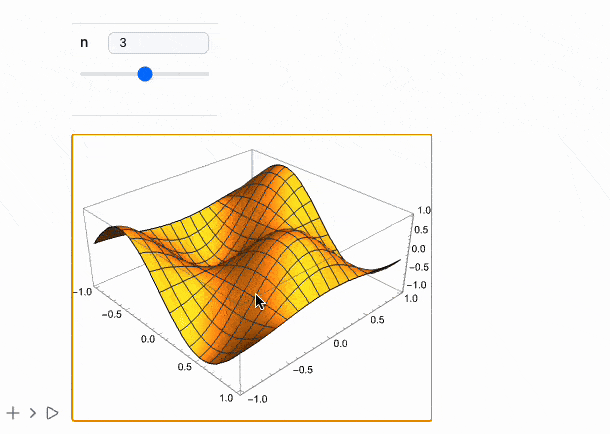

# Release notes *2.7.4*

👐 Open Source Support
- Now on Open Collective! Support and engage with the project: Join us [here](https://opencollective.com/wljs-notebook).

📊 Plotting Improvements
- Log plots fixed: LogPlot and LogLogPlot now scale correctly.
- New ImageSizeRaw support: Precisely overlay raster and vector graphics with pixel-perfect control.

🧱 Dataset Overhaul
- Major upgrade to Dataset support—now handles nested structures, symbolic keys, Entity, Quantity, and more.

🖼️ UI & Usability
- Added “Insert Cell Before” button (based on GitHub feedback).
- Extended MMAView: Native-style interactive 3D plots, Manipulate, Animate, and even ListAnimate now supported seamlessly.

🌐 Web & API Enhancements
- Simplified REST API with a JavaScript helper class—build custom notebook interfaces in minutes.
- MDX/React integration: Embed cells or full notebooks into blogs and React apps. See it in action here.

<!--truncate-->

import { WLJSHTML, WLJSEditor, WLJSStore } from "@site/src/components/wljs-notebook-react";

<WLJSHTML>{`%0A%3Cstyle%3E%0A%20%20.balloon%20%7B%0A%20%20height%3A%20125px%3B%0A%20%20width%3A%20105px%3B%0A%20%20border-radius%3A%2075%25%2075%25%2070%25%2070%25%3B%0A%20%20position%3A%20relative%3B%0A%7D%0A%0A.balloon%3Abefore%20%7B%0A%20%20content%3A%20%22%22%3B%0A%20%20height%3A%2075px%3B%0A%20%20width%3A%201px%3B%0A%20%20padding%3A%201px%3B%0A%20%20background-color%3A%20%23FDFD96%3B%0A%20%20display%3A%20block%3B%0A%20%20position%3A%20absolute%3B%0A%20%20top%3A%20125px%3B%0A%20%20left%3A%200%3B%0A%20%20right%3A%200%3B%0A%20%20margin%3A%20auto%3B%0A%7D%0A%0A.balloon%3Aafter%20%7B%0A%20%20%20%20content%3A%20%22%E2%96%B2%22%3B%0A%20%20%20%20text-align%3A%20center%3B%0A%20%20%20%20display%3A%20block%3B%0A%20%20%20%20position%3A%20absolute%3B%0A%20%20%20%20color%3A%20inherit%3B%0A%20%20%20%20top%3A%20120px%3B%0A%20%20%20%20left%3A%200%3B%0A%20%20%20%20right%3A%200%3B%0A%20%20%20%20margin%3A%20auto%3B%0A%7D%0A%0A%40keyframes%20float%20%7B%0A%20%20from%20%7Btransform%3A%20translateY%28100vh%29%3B%0A%20%20opacity%3A%201%3B%7D%0A%20%20to%20%7Btransform%3A%20translateY%28-300vh%29%3B%0A%20%20opacity%3A%200%3B%7D%0A%7D%0A%23balloon-container%20%7B%0A%20%20height%3A%20100vh%3B%0A%20%20top%3A%200%3B%0A%20%20position%3Afixed%3B%0A%20%20bottom%3A%200%3B%0A%20%20z-index%3A%20-99%3B%20%20%0A%20%20padding%3A%201em%3B%0A%20%20box-sizing%3A%20border-box%3B%0A%20%20display%3A%20flex%3B%0A%20%20flex-wrap%3A%20wrap%3B%0A%20%20overflow%3A%20hidden%3B%0A%20%20transition%3A%20opacity%20500ms%3B%0A%7D%0A%3C%2Fstyle%3E%0A%0A%3Cdiv%20id%3D%22balloon-container%22%3E%0A%3C%2Fdiv%3E`}</WLJSHTML>

<WLJSStore json={require('./attachments/0419001d-9789-4194-bedb-24640cb05610.txt').default} notebook={require('./attachments/notebook-041.wln').default}/>

<WLJSEditor display={"js"} nid={"0419001d-9789-4194-bedb-24640cb05610"} id={"f989c4b9-855d-43f0-ac49-3849faf04412"} type={"Output"} opts={{}} >{`%0Aconst%20balloonContainer%20%3D%20document.getElementById%28%22balloon-container%22%29%3B%0A%0Afunction%20random%28num%29%20%7B%0A%20%20return%20Math.floor%28Math.random%28%29%20%2A%20num%29%3B%0A%7D%0A%0Afunction%20getRandomStyles%28%29%20%7B%0A%20%20var%20r%20%3D%20random%28255%29%3B%0A%20%20var%20g%20%3D%20random%28255%29%3B%0A%20%20var%20b%20%3D%20random%28255%29%3B%0A%20%20var%20mt%20%3D%20random%28200%29%3B%0A%20%20var%20ml%20%3D%20random%2850%29%3B%0A%20%20var%20dur%20%3D%20random%285%29%20%2B%205%3B%0A%20%20return%20%60%0A%20%20background-color%3A%20rgba%28%24%7Br%7D%2C%24%7Bg%7D%2C%24%7Bb%7D%2C0.7%29%3B%0A%20%20color%3A%20rgba%28%24%7Br%7D%2C%24%7Bg%7D%2C%24%7Bb%7D%2C0.7%29%3B%20%0A%20%20box-shadow%3A%20inset%20-7px%20-3px%2010px%20rgba%28%24%7Br%20-%2010%7D%2C%24%7Bg%20-%2010%7D%2C%24%7Bb%20-%2010%7D%2C0.7%29%3B%0A%20%20margin%3A%20%24%7Bmt%7Dpx%200%200%20%24%7Bml%7Dpx%3B%0A%20%20animation%3A%20float%20%24%7Bdur%7Ds%20ease-in%20infinite%0A%20%20%60%3B%0A%7D%0A%0Afunction%20createBalloons%28num%29%20%7B%0A%20%20for%20%28var%20i%20%3D%20num%3B%20i%20%3E%200%3B%20i--%29%20%7B%0A%20%20%20%20var%20balloon%20%3D%20document.createElement%28%22div%22%29%3B%0A%20%20%20%20balloon.className%20%3D%20%22balloon%22%3B%0A%20%20%20%20balloon.style.cssText%20%3D%20getRandomStyles%28%29%3B%0A%20%20%20%20balloonContainer.append%28balloon%29%3B%0A%20%20%7D%0A%7D%0A%0Afunction%20removeBalloons%28%29%20%7B%0A%20%20balloonContainer.style.opacity%20%3D%200%3B%0A%20%20setTimeout%28%28%29%20%3D%3E%20%7B%0A%20%20%20%20balloonContainer.remove%28%29%0A%20%20%7D%2C%20500%29%0A%7D%0A%0AcreateBalloons%2810%29%3B%0AsetTimeout%28removeBalloons%2C%2015000%29%3B%0A%0Areturn%20%27%27%3B%0A`}</WLJSEditor>

## Open-Source Community
__We joined Open Collective__ 🎈

[WLJS Notebook - Open Collective](https://opencollective.com/wljs-notebook)

Let's dive into release notes 

## Log plots
We fixed scaling issues with `LogPlot` and `LogLogPlot`

<WLJSEditor display={"codemirror"} nid={"0419001d-9789-4194-bedb-24640cb05610"} id={"3ff2c35a-594a-43e0-8867-2e6b5778cb40"} type={"Input"} opts={{}} >{`LogPlot%5B%28%2ASpB%5B%2A%29Power%5Bx%28%2A%7C%2A%29%2C%28%2A%7C%2A%292%5D%28%2A%5DSpB%2A%29%2C%20%7Bx%2C0%2C1%7D%5D`}</WLJSEditor>

<WLJSEditor display={"codemirror"} nid={"0419001d-9789-4194-bedb-24640cb05610"} id={"92a9b1ca-e684-4708-af05-69dbbadc840f"} type={"Output"} opts={{}} >{`%28%2AVB%5B%2A%29%28FrontEndRef%5B%222ada88d8-e525-4c55-bfbd-d08aab31a0cc%22%5D%29%28%2A%2C%2A%29%28%2A%221%3AeJxTTMoPSmNkYGAoZgESHvk5KRCeEJBwK8rPK3HNS3GtSE0uLUlMykkNVgEKGyWmJFpYpFjoppoameqaJJua6ialJaXophhYJCYmGRsmGiQnAwCQsBaC%22%2A%29%28%2A%5DVB%2A%29`}</WLJSEditor>

## ImageSizeRaw
A new option of `Graphics` is supported to make it easier to overlay raster graphics with lines and user primitives. The major differences compared to `ImageSize` are:

- It considers the pixel density ratio of the screen.
- It guarantees that the canvas size will match exactly with `ImageSizeRaw`.

For example, it allows for creating complex plots that combine `Image` and `Graphics` using `Inset`:

<WLJSHTML>{`%3Cbr%20%2F%3E`}</WLJSHTML>

*some interpolated data*

<WLJSEditor display={"codemirror"} nid={"0419001d-9789-4194-bedb-24640cb05610"} id={"be8f20cd-98b1-45da-aab9-5e696b0e8d3e"} type={"Input"} opts={{}} >{`fmo%20%3D%20%7B%20%28%2AVB%5B%2A%29%28Get%5BFileNameJoin%5B%7B%22.iconized%22%2C%20%22None-b5c.wl%22%7D%5D%5D%29%28%2A%2C%2A%29%28%2A%221%3AeJxTTMoPSmNhYGAo5gUSYZmp5S6pyflFiSX5RcEcQBHP5Py8zKrUlMyMI0wMaUwghSDVQaU5qcGsQIZPYlJqTjBIyC8%2FLxVNAYjhlpmTChYJKSpNBQDEQxmP%22%2A%29%28%2A%5DVB%2A%29%2C%20%20%28%2AVB%5B%2A%29%28Get%5BFileNameJoin%5B%7B%22.iconized%22%2C%20%22None-96e.wl%22%7D%5D%5D%29%28%2A%2C%2A%29%28%2A%221%3AeJxTTMoPSmNhYGAo5gUSYZmp5S6pyflFiSX5RcEcQBHP5Py8zKrUlMyMI0wMaUwghSDVQaU5qcGsQIZPYlJqTjBIyC8%2FLxVNAYjhlpmTChYJKSpNBQDEQxmP%22%2A%29%28%2A%5DVB%2A%29%7D%3B`}</WLJSEditor>

<WLJSEditor display={"codemirror"} nid={"0419001d-9789-4194-bedb-24640cb05610"} id={"4dcdb39a-e4da-4c64-b808-645b7355ce4d"} type={"Input"} opts={{}} >{`With%5B%7Bf1%20%3D%20%28%2AVB%5B%2A%29%28Get%5BFileNameJoin%5B%7B%22.iconized%22%2C%20%22None-b5c.wl%22%7D%5D%5D%29%28%2A%2C%2A%29%28%2A%221%3AeJxTTMoPSmNhYGAo5gUSYZmp5S6pyflFiSX5RcEcQBHP5Py8zKrUlMyMI0wMaUwghSDVQaU5qcGsQIZPYlJqTjBIyC8%2FLxVNAYjhlpmTChYJKSpNBQDEQxmP%22%2A%29%28%2A%5DVB%2A%29%2C%20f2%20%3D%20%28%2AVB%5B%2A%29%28Get%5BFileNameJoin%5B%7B%22.iconized%22%2C%20%22None-96e.wl%22%7D%5D%5D%29%28%2A%2C%2A%29%28%2A%221%3AeJxTTMoPSmNhYGAo5gUSYZmp5S6pyflFiSX5RcEcQBHP5Py8zKrUlMyMI0wMaUwghSDVQaU5qcGsQIZPYlJqTjBIyC8%2FLxVNAYjhlpmTChYJKSpNBQDEQxmP%22%2A%29%28%2A%5DVB%2A%29%7D%2C%20NumericArray%5B255.0%20Table%5B%0A%20%20Clip%5B%7Bf1%5B%7Bx%2Cy%7D%5D%2C%200%2C%20f2%5B%7Bx%2Cy%7D%5D%7D%2F100.0%2C%20%7B0%2C1%7D%5D%0A%2C%20%7By%2C%200%2C%205.0%2C%200.02%7D%2C%20%7Bx%2C%2010%2C%20120%2C%200.3%7D%5D%20%2F%2F%20Reverse%0A%2C%20%22UnsignedInteger8%22%2C%20%22ClipAndRound%22%5D%5D%3B%0AimgWide%20%3D%20Image%5B%25%2C%20%22Byte%22%5D%3B`}</WLJSEditor>

overlay it with vector graphics

<WLJSEditor display={"codemirror"} nid={"0419001d-9789-4194-bedb-24640cb05610"} id={"46217e24-2048-4fb2-af9f-12f22c897fe4"} type={"Input"} opts={{"Fade":true}} >{`Graphics%5B%7B%0A%20%20Inset%5BimgWide%2C%20%7BMean%5B%7B10%2C120%7D%5D%2C%20Mean%5B%7B1%2C5%7D%5D%7D%5D%0A%7D%2C%20%0A%20%20PlotRange-%3E%7B%7B10%2C120%7D%2C%20%7B1%2C5%7D%7D%2C%20%0A%20%20Frame-%3ETrue%2C%20Axes-%3ETrue%2C%20%0A%20%20ImageSizeRaw-%3EImageDimensions%5BimgWide%5D%2C%0A%20%20FrameTicksStyle-%3EDirective%5BFontSize-%3E14%5D%2C%0A%20%20FrameStyle-%3EDirective%5BFontSize-%3E14%5D%2C%0A%20%20FrameLabel-%3E%7B%22wavenumber%20%28cm%5E%7B-1%7D%29%22%2C%20%22H%20%28T%29%22%7D%2C%0A%20%20Epilog-%3E%7BWhite%2C%20AbsoluteDashing%5B%7B4%7D%5D%2C%20%0A%20%20%20%20Line%5BTable%5B%7B41.6%20%2B%200.035%20x%2C%20x%7D%2C%20%7Bx%2C0%2C5%7D%5D%5D%2C%0A%20%20%20%20Line%5BTable%5B%7B41.6%20-%200.092%20x%2C%20x%7D%2C%20%7Bx%2C0%2C5%7D%5D%5D%2C%0A%20%20%20%20Line%5BTable%5B%7B89.0%20%2B%200.466%201.97%20x%2C%20x%7D%2C%20%7Bx%2C0%2C5%7D%5D%5D%2C%0A%20%20%20%20Line%5BTable%5B%7B89.0%20-%200.466%201.90%20x%2C%20x%7D%2C%20%7Bx%2C0%2C5%7D%5D%5D%2C%0A%20%20%20%20Line%5BTable%5B%7B112.6%20%2B%200.466%202.26%20x%2C%20x%7D%2C%20%7Bx%2C0%2C5%7D%5D%5D%2C%0A%20%20%20%20Line%5BTable%5B%7B112.6%20-%200.466%202.39%20x%2C%20x%7D%2C%20%7Bx%2C0%2C5%7D%5D%5D%0A%20%20%7D%0A%5D`}</WLJSEditor>

<WLJSEditor display={"codemirror"} nid={"0419001d-9789-4194-bedb-24640cb05610"} id={"6555b393-4d6e-4186-bdca-7b2b8efcdb76"} type={"Output"} opts={{}} >{`%28%2AVB%5B%2A%29%28FrontEndRef%5B%22ff318b33-3e0e-4e16-936e-d9a86e45db7b%22%5D%29%28%2A%2C%2A%29%28%2A%221%3AeJxTTMoPSmNkYGAoZgESHvk5KRCeEJBwK8rPK3HNS3GtSE0uLUlMykkNVgEKp6UZG1okGRvrGqcapOqapBqa6Voam6XqplgmWpilmpimJJknAQCF1hXg%22%2A%29%28%2A%5DVB%2A%29`}</WLJSEditor>

## UI Update
__Insert cell before__ button (was requested via Github issues)

## Dataset full support
We have finnaly fixed the most buggy thing we have in WLJS - `Dataset`. Now it does support nested structures, symbolic keys, `Entity`, `Quantity` and etc

<WLJSEditor display={"codemirror"} nid={"0419001d-9789-4194-bedb-24640cb05610"} id={"02a90ef6-45e9-4728-aecd-82f75ca38e72"} type={"Input"} opts={{}} >{`ExampleData%5B%7B%22Dataset%22%2C%22Planets%22%7D%5D`}</WLJSEditor>

<WLJSEditor display={"codemirror"} nid={"0419001d-9789-4194-bedb-24640cb05610"} id={"63422ed9-c4be-401e-9a63-e91a67f03d46"} type={"Output"} opts={{}} >{`%28%2AVB%5B%2A%29%28FrontEndRef%5B%22c824ccdc-c573-4b47-b58b-87b196ec5df0%22%5D%29%28%2A%2C%2A%29%28%2A%221%3AeJxTTMoPSmNkYGAoZgESHvk5KRCeEJBwK8rPK3HNS3GtSE0uLUlMykkNVgEKJ1sYmSQnpyTrJpuaG%2BuaJJmY6yaZWiTpWpgnGVqapSabpqQZAACNEBYN%22%2A%29%28%2A%5DVB%2A%29`}</WLJSEditor>

## Extended MMAView
There was a request for interactive native Mathematica's 3D plot. Well, here you go

<WLJSEditor display={"codemirror"} nid={"0419001d-9789-4194-bedb-24640cb05610"} id={"3bada09b-ba5f-4e33-ab47-4a7318bf3a0c"} type={"Input"} opts={{}} >{`With%5B%7Bp%20%3D%20Plot3D%5Bf%5Bx%5D%20y%2C%20%7Bx%2C0%2C10%7D%2C%20%7By%2C0%2C10%7D%5D%7D%2C%0A%20%20MMAView%5Bp%5D%0A%5D`}</WLJSEditor>

*Note, that it is important to pass it using `With`, since MMAView has HoldFirst attribute*

### Manipulate
Works for 2D, 3D, in general any expression!

<WLJSEditor display={"codemirror"} nid={"0419001d-9789-4194-bedb-24640cb05610"} id={"e70af540-64a0-4f99-a26b-a9fdb20d1b7c"} type={"Input"} opts={{}} >{`Manipulate%5BPlot3D%5BSin%5Bn%20x%5D%20Cos%5Bn%20y%5D%2C%20%7Bx%2C-1%2C1%7D%2C%20%7By%2C-1%2C1%7D%5D%2C%20%7Bn%2C%201%2C%205%2C%201%7D%5D%20%2F%2F%20MMAView`}</WLJSEditor>

<WLJSHTML>{`%3Cbr%20%2F%3E`}</WLJSHTML>

### Animate
The same works for it

<WLJSEditor display={"codemirror"} nid={"0419001d-9789-4194-bedb-24640cb05610"} id={"6c21118d-f09d-4b4a-93ee-29cc6466935e"} type={"Input"} opts={{}} >{`Animate%5BPlot%5BSin%5Bx%20y%5D%2C%20%7Bx%2C0%2C1%7D%5D%2C%20%7By%2C0%2C5%7D%5D%20%2F%2F%20MMAView`}</WLJSEditor>

## ListAnimate
We added the support for raster `ListAnimate` (not related to MMAView)

<WLJSEditor display={"codemirror"} nid={"0419001d-9789-4194-bedb-24640cb05610"} id={"f5154527-5024-4373-b091-907f0c93d8e0"} type={"Input"} opts={{}} >{`ListAnimate%5BTable%5BRasterize%5BPlot%5BTable%5Bx%5Ek%2C%20%7Bk%2C%201%2C%20n%7D%5D%20%2F%2F%20Evaluate%2C%20%7Bx%2C0%2C10%7D%5D%5D%2C%20%7Bn%2C1%2C6%7D%5D%5D`}</WLJSEditor>

## Easier REST-API
We refined our [REST API](https://wljs.io/frontend/Development/API/REST) and added a helper Javascript class of function to make the process easier. Imagine, you can build up a minimal Notebook interface by youself just in a few lines!

<WLJSEditor display={"codemirror"} nid={"0419001d-9789-4194-bedb-24640cb05610"} id={"7cba5aab-28cf-4052-9b01-8d22ff9bbfb5"} type={"Input"} opts={{}} >{`.html%0A%0A%3Cscript%20type%3D%22module%22%3E%0A%20%20const%20stateField%20%3D%20document.getElementById%28%22stateField%22%29%2C%20%0A%20%20%20%20%20%20%20%20submitButton%20%3D%20document.getElementById%28%22submit_button%22%29%2C%0A%20%20%20%20%20%20%20%20codeArea%20%3D%20document.getElementById%28%22code_area%22%29%2C%0A%20%20%20%20%20%20%20%20resultsDiv%20%3D%20document.getElementById%28%22resultsDiv%22%29%3B%0A%0A%20%20async%20function%20start%28%29%20%7B%0A%20%20%20%20stateField.innerText%20%3D%20%27Connecting%20to%20Kernel%27%3B%0A%0A%20%20%20%20const%20kernel%20%3D%20await%20server.findKernel%28%29%3B%0A%20%20%20%20console.warn%28%27Obtained%20Kernel%27%2C%20kernel%29%3B%0A%20%20%20%20stateField.innerText%20%3D%20%27Ready%21%27%3B%0A%0A%20%20%20%20submitButton.addEventListener%28%27click%27%2C%20async%20%28%29%20%3D%3E%20%7B%0A%20%20%20%20%20%20const%20transaction%20%3D%20await%20server.createTransaction%28kernel%2C%20codeArea.value.trim%28%29%29%3B%0A%20%20%20%20%20%20stateField.innerText%20%3D%20%27Evaluation...%27%3B%0A%0A%20%20%20%20%20%20const%20results%20%3D%20await%20server.getResult%28kernel%2C%20transaction%29%3B%0A%20%20%20%20%20%20console.warn%28%27Ready%27%29%3B%0A%20%20%20%20%20%20stateField.innerText%20%3D%20%27Ready%21%27%3B%0A%0A%20%20%20%20%20%20results.forEach%28%28%7B%20Display%20%3D%20%27codemirror%27%2C%20Data%20%7D%29%20%3D%3E%20%7B%0A%20%20%20%20%20%20%20%20const%20parentelement%20%3D%20document.createElement%28%27div%27%29%3B%0A%20%20%20%20%20%20%20%20resultsDiv.appendChild%28parentelement%29%3B%0A%20%20%20%20%20%20%20%20new%20window.SupportedCells%5BDisplay%5D.view%28%7B%20element%3A%20parentelement%20%7D%2C%20Data%29%3B%0A%20%20%20%20%20%20%7D%29%3B%0A%20%20%20%20%7D%29%3B%0A%20%20%7D%0A%0A%20%20%28async%20%28%29%20%3D%3E%20%7B%0A%20%20%20%20await%20server.waitForConnection%28%29%3B%0A%20%20%20%20start%28%29%3B%0A%20%20%7D%29%28%29%3B%0A%3C%2Fscript%3E`}</WLJSEditor>

Yes, apart from header and body parts, that's all you need 

---

## MDX/React Integration
This share option lets you embed cells or an entire notebook to MDX-based websites (personal blog or a React App in general).

Here is an online demo of a static website made using Next.js

<WLJSHTML>{`%3Cdiv%20class%3D%22my-3%20mx-2%20mt-4%22%3E%3Ciframe%20style%3D%22border-radius%3A0.5rem%22%20width%3D%22100%25%22%20height%3D%22400%22%20src%3D%22https%3A%2F%2Fjerryi.github.io%2Fwljs-nextjs-example%2F%22%2F%3E%3C%2Fdiv%3E`}</WLJSHTML>

See our [__docs for more information__](https://wljs.io/frontend/Exporting/MDX)

__See more [here](https://github.com/JerryI/wljs-nextjs-example)__

*Ballon animation by Jemima (codepen)*

<WLJSHTML>{`%0A%3Cstyle%3E%0A%20%20img%20%7B%0A%20%20%20%20border-radius%3A%200.5rem%3B%0A%20%20%7D%0A%3C%2Fstyle%3E`}</WLJSHTML>

<WLJSHTML>{`%0A%3Cstyle%3E%0A%20%20%5Btransparency%3D%22false%22%5D%20.bg-g-trans%20%7B%0A%20%20%20%20background%3A%20transparent%20%21important%3B%0A%20%20%7D%0A%0A%20%20%5Btransparency%3D%22true%22%5D%20.bg-g-trans%20%7B%0A%20%20%20%20background%3A%20transparent%20%21important%3B%0A%20%20%7D%0A%3C%2Fstyle%3E`}</WLJSHTML>